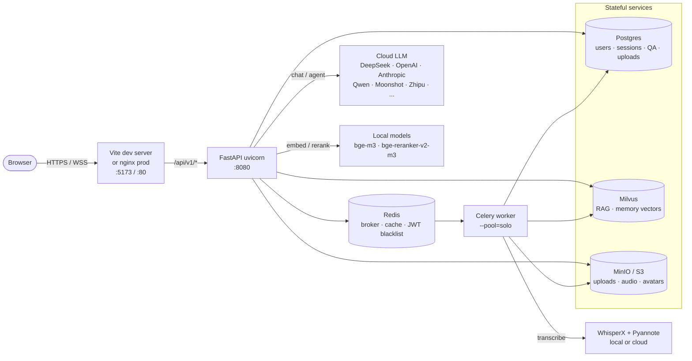

# Interview Copilot

<p align="center">
  <a href="./README.md"></a>
  <a href="./docs/zh/README.md"></a>
</p>

> AI interview practice and analysis. Real-time voice mock interviews, recording
> analysis with WhisperX + Pyannote diarization, RAG over your resume and JD, and
> a tool-calling Agent — wired through a per-user model registry that works
> against any OpenAI-compatible provider (DeepSeek, OpenAI, Anthropic, Qwen,
> Moonshot, Zhipu, Xiaomi MiMo, NVIDIA Catalog, …).

📖 [Getting started](docs/getting-started.md) · 🛠 [Provider catalog](docs/providers.md) · 🩹 [Troubleshooting](docs/troubleshooting.md)

## Screenshots

<table>
  <tr>
    <td colspan="2" align="center"><sub><b>① Enter the app — sign in or register</b></sub></td>
  </tr>
  <tr>
    <td width="50%"></td>
    <td width="50%"></td>
  </tr>
  <tr>
    <td align="center"><sub>Sign-in — JWT access + refresh, jti revocation list in Redis</sub></td>
    <td align="center"><sub>Sign-up — email-verification flow (codes printed to backend stdout when SMTP isn't configured)</sub></td>
  </tr>
  <tr>
    <td colspan="2" align="center"><sub><b>② Set up — pick models, upload knowledge</b></sub></td>
  </tr>
  <tr>
    <td width="50%"></td>
    <td width="50%"></td>
  </tr>
  <tr>
    <td align="center"><sub>Models — per-user routing across 9 providers (primary / agent / mock)</sub></td>
    <td align="center"><sub>Knowledge library — resume / interview question banks / official docs</sub></td>
  </tr>
  <tr>
    <td colspan="2" align="center"><sub><b>③ Run — mock interview or review a real recording</b></sub></td>
  </tr>
  <tr>
    <td width="50%"></td>
    <td width="50%"></td>
  </tr>
  <tr>
    <td align="center"><sub>Mock interview — resume + JD upload, four interviewer personas</sub></td>
    <td align="center"><sub>Review chat — per-record session list, model swap mid-conversation</sub></td>
  </tr>
</table>

---

## What's inside

| Module | Purpose |
|---|---|
| **Mock Interview** | Live voice interview against an LLM interviewer with TTS replies; configurable persona (friendly / professional / strict / pressure). |
| **Recording Analysis** | Upload a real recorded interview → WhisperX transcription → Pyannote diarization → 3-stage MapReduce LLM analysis (per-question scoring, phase summary, skill radar). |
| **Chat & Review** | Per-user dialogues backed by hybrid dense + BM25 retrieval over your resume / JD / docs, with cross-encoder rerank. |
| **Agent** | Tool-calling runtime with web search (Tavily), file IO, memory, structured event streaming. |
| **Per-user model routing** | Every user picks their own LLM per role (primary / fast / agent) from the Models page. 30+ profiles across 9 vendors out of the box; new ones added with a single config line. |

---

## Architecture



LLM / embedding / reranker / ASR are dispatched through small **provider
registries**. Pick `*_PROVIDER` + free-form `*_MODEL` in `.env`. Adding a new
vendor is one new `MODEL_PROFILES` entry; adding a new model is zero code.

---

## Pick one path

### 🌐 Path A — API-light *(cloud everything; nothing downloads locally)*

Best for: trying the project end-to-end, no GPU, no big disk footprint.

You need **two** keys:

1. **An LLM provider** (DeepSeek recommended — cheapest starter).
2. **A combined embedding + reranker + ASR provider** (SiliconFlow
   recommended — one key for all three roles).

```bash
git clone https://github.com/<your-org>/Interview_Copilot.git
cd Interview_Copilot
conda create -n interview-copilot python=3.11 -y    # or 3.10 / 3.12 — NOT 3.13
conda activate interview-copilot

.\scripts\setup.ps1                                  # Windows  (Linux / macOS: ./scripts/setup.sh)
# answer "1" when asked: [1] API-light  [2] Local-models

# Open .env, paste both keys:
#   DEEPSEEK_API_KEY=sk-...
#   SILICONFLOW_API_KEY=sk-...

.\scripts\start.ps1 -SkipFrontend                    # tab 1
.\scripts\start.ps1 -SkipBackend                     # tab 2

# Open http://localhost:5173 → Register → verification code is printed
# to the backend terminal (no SMTP needed) → Login → Chat.
```

### 💻 Path B — Local-models *(embedding / reranker / ASR run on this machine)*

Best for: privacy, offline-capable deploys, you already have a GPU.

You only need **one** key (LLM still cloud):

```bash
# Steps 1-2 same as Path A, but answer "2" at the setup prompt.

# Open .env, paste just the LLM key:
#   DEEPSEEK_API_KEY=sk-...

python scripts/init_models.py --dry-run              # shows real-time sizes from HuggingFace
python scripts/init_models.py                        # ~5 GB total, supports byte-level resume

.\scripts\start.ps1 -SkipFrontend                    # tab 1
.\scripts\start.ps1 -SkipBackend                     # tab 2

# Register / login same as Path A. Try the recording-analysis flow —
# WhisperX + Pyannote run locally now.
```

→ **Full step-by-step walkthroughs (with expected outputs and gotchas):
[docs/getting-started.md](docs/getting-started.md)**

A third **Hybrid** mode (cloud ASR + local diarization) is a 2-line edit
on either path — see `docs/providers.md`.

---

## Repository layout

```
backend/
  app/
    api/              FastAPI routers (auth, chat, interview, rag, model_runtime)
    core/             config, security, rate_limit, model_registry, llm_tracing
    rag/              embedding/reranker registries, retriever, ingestion
    services/         business logic (chat, voice, knowledge, memory, agent, …)
    worker/           Celery app + tasks
    scripts/          one-shot maintenance scripts importable as `python -m app.scripts.X`
  tests/              266 tests across api / services / rag / models / core / db
frontend/
  src/                React SPA (Vite + TS + Tailwind + zustand)
  public/             nginx config / _headers / _redirects
alembic/versions/     Database migrations (0001 → 0019)
nginx/conf.d/         Reverse proxy configs (dev + production)
scripts/              setup / start / stop · init_models / refresh_models · wipe_non_admin / migrate_avatars
docs/                 ← you are here
  zh/                 Chinese mirror of every doc
.github/workflows/    CI (backend tests, ruff, frontend build)
```

---

## Documentation

| Topic | English | 中文 |
|---|---|---|
| Quick start, end-to-end | [getting-started.md](docs/getting-started.md) | [zh/getting-started.md](docs/zh/getting-started.md) |
| Provider catalog (LLM / embed / rerank / ASR) | [providers.md](docs/providers.md) | [zh/providers.md](docs/zh/providers.md) |
| Postgres tuning at scale | [postgres-tuning.md](docs/postgres-tuning.md) | [zh/postgres-tuning.md](docs/zh/postgres-tuning.md) |
| Troubleshooting | [troubleshooting.md](docs/troubleshooting.md) | [zh/troubleshooting.md](docs/zh/troubleshooting.md) |
| Deploy the frontend on Cloudflare Pages *(advanced / optional)* | [deploy-cloudflare-pages.md](docs/deploy-cloudflare-pages.md) | [zh/deploy-cloudflare-pages.md](docs/zh/deploy-cloudflare-pages.md) |

The Cloudflare doc is **optional**. Local dev needs nothing of the sort —
`docker compose up` + `npm run dev` is enough. You only reach for it if
you want a public hostname with free SSL/CDN for the SPA.

---

## Tech stack

- **API**: FastAPI 0.135, SQLAlchemy 2, Pydantic v2, slowapi (rate limit), Sentry SDK
- **Background**: Celery 5 + Redis (queue / cache / blacklist)
- **Storage**: PostgreSQL 15, Milvus 2.5 (vector), MinIO (S3-compat)
- **AI**: LlamaIndex, BGE-M3 + BGE-Reranker-v2-m3, WhisperX, Pyannote
- **LLM**: Any OpenAI-compatible API (DeepSeek default)
- **Frontend**: React 18, Vite 5, Tailwind, zustand, react-virtual
- **Infra**: Docker Compose, nginx
- **Observability**: Sentry (errors), LangSmith (LLM traces — opt-in)

---

## License

MIT.
