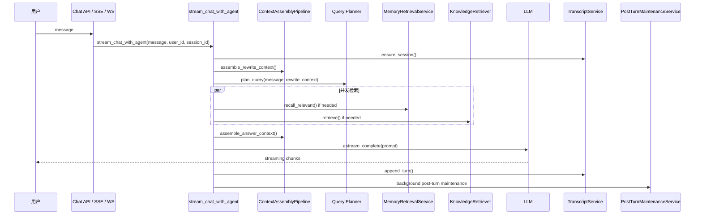
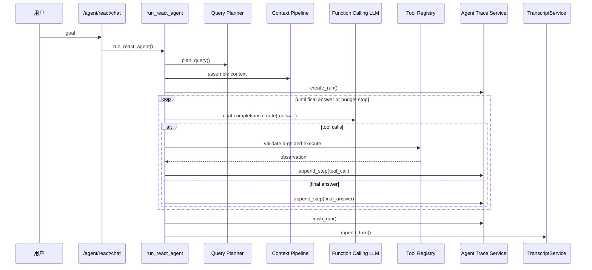

# Interview Copilot 项目完整技术文档

> 项目类型：AI 面试准备与面试复盘后端系统
> 核心能力：多轮 RAG 问答、长期记忆、文档知识库、ReAct 工具代理、录音转写与面试分析
> 技术栈：FastAPI、SQLAlchemy、PostgreSQL、Redis、Celery、Milvus、MinIO/S3、LlamaIndex、DeepSeek/OpenAI-compatible LLM、WhisperX、Vue 3
> 当前测试基线：`pytest backend/tests -q` 通过 `60 passed`

---

## 1. 项目定位

Interview Copilot 是一个面向技术面试准备的 AI 后端系统。它不是简单的聊天机器人，而是把“面试练习、录音复盘、知识库问答、长期记忆、岗位准备和工具型 Agent”组合成一套可运行、可追踪、可扩展的工程系统。

系统主要解决四类问题：

1. **多轮面试辅导**
   用户可以连续追问，系统会结合当前会话状态、近期对话、长期记忆和知识库生成回答。

2. **RAG 知识问答**
   RAG（Retrieval-Augmented Generation，检索增强生成）通过向量检索、BM25 词法检索、融合排序、Reranker 重排和阈值拦截，尽量让回答基于可靠资料。

3. **长期个性化记忆**
   系统会从多轮对话中抽取跨会话有效的信息，例如用户偏好、项目经历、反馈规则，并在后续对话中按需召回。

4. **面试录音分析**
   用户上传面试录音后，后台任务执行语音转写、说话人分离、问答对抽取、逐题评分、反馈和改进答案生成。

此外，项目提供独立的 ReAct Agent（Reasoning + Acting，推理加行动智能体）链路，用于处理需要工具调用的复合任务，例如搜索岗位、读取岗位详情、结合用户画像生成准备建议。

---

## 2. 总体架构

```mermaid
graph TB
    Client["Frontend / API Client"]

    subgraph API["FastAPI API 层"]
        Auth["auth.py<br/>注册、登录、JWT"]
        Chat["chat.py<br/>多轮对话 / SSE / WebSocket / Memory API"]
        AgentAPI["agent.py<br/>普通 Chat / ReAct Agent"]
        Interview["interview.py<br/>音频上传 / 面试分析"]
        RagAPI["rag_api.py<br/>RAG 上传 / 摄取 / 查询"]
        Models["model_runtime.py<br/>运行时模型选择"]
    end

    subgraph ChatPipeline["普通多轮 RAG Chat Pipeline"]
        Planner["planner.py<br/>Query Planner 查询规划器"]
        Context["context_service.py<br/>ContextBundle 上下文包"]
        Prompt["PromptRenderer<br/>提示词渲染器"]
        Knowledge["knowledge_retriever.py<br/>知识检索封装"]
        Executor["agent_executor.py<br/>流式回答执行器"]
    end

    subgraph Memory["长期记忆系统"]
        Extract["MemoryExtractionService<br/>记忆抽取与合并"]
        Recall["MemoryRetrievalService<br/>记忆召回"]
        HybridMemory["HybridRetriever<br/>向量 + 词法混合排序"]
        MemoryVector["MemoryVectorService<br/>记忆向量索引"]
    end

    subgraph RAG["RAG 知识库"]
        Ingestion["ingestion.py<br/>文档解析与切块"]
        Retriever["retriever.py<br/>向量 + BM25 + Reranker"]
        Embeddings["embeddings.py<br/>Embedding / LlamaIndex 设置"]
    end

    subgraph React["ReAct 工具代理链路"]
        ReactRuntime["react_agent.py<br/>Function Calling Runtime"]
        Tools["tools.py<br/>工具注册与执行"]
        Trace["agent_trace_service.py<br/>轨迹记录与指标"]
    end

    subgraph Audio["音频分析链路"]
        Worker["Celery Worker"]
        Transcription["transcription_service.py<br/>WhisperX + Diarization"]
        Analysis["analysis_service.py<br/>QA 抽取 / 评分 / 改进答案"]
    end

    subgraph Storage["存储层"]
        PG["PostgreSQL<br/>业务数据 / Docstore"]
        Redis["Redis<br/>Celery Broker / Result Backend"]
        Milvus["Milvus<br/>知识向量 / 记忆向量"]
        S3["MinIO / S3<br/>音频与文档对象"]
        Logs["data/logs<br/>Telemetry JSONL"]
    end

    Client --> API
    Chat --> Executor
    AgentAPI --> Executor
    AgentAPI --> ReactRuntime
    Interview --> Worker
    RagAPI --> Ingestion
    RagAPI --> Retriever
    Models --> Embeddings
    Executor --> Planner
    Executor --> Context
    Executor --> Knowledge
    Context --> Prompt
    Executor --> Recall
    Recall --> HybridMemory
    Recall --> MemoryVector
    Knowledge --> Retriever
    Ingestion --> Embeddings
    Retriever --> Embeddings
    ReactRuntime --> Tools
    ReactRuntime --> Trace
    ReactRuntime --> Context
    ReactRuntime --> Recall
    Worker --> Transcription
    Worker --> Analysis
    API --> PG
    Worker --> PG
    Ingestion --> PG
    Retriever --> PG
    MemoryVector --> PG
    API --> S3
    Worker --> S3
    RAG --> Milvus
    Memory --> Milvus
    Worker --> Redis
    API --> Logs
```



---

## 3. 目录结构

```text
Interview_Copilot/
├─ backend/
│  ├─ app/
│  │  ├─ api/                 # FastAPI 路由层
│  │  ├─ agent/               # 普通多轮 RAG Chat pipeline
│  │  ├─ agent_runtime/       # ReAct / function calling 工具代理
│  │  ├─ core/                # 配置、安全、模型注册、HF runtime
│  │  ├─ db/                  # SQLAlchemy / Redis / schema compatibility
│  │  ├─ models/              # ORM 数据模型
│  │  ├─ rag/                 # 文档摄取、Embedding、检索、混合排序
│  │  ├─ services/            # 业务服务层
│  │  ├─ worker/              # Celery app 与后台任务
│  │  └─ main.py              # FastAPI 应用入口
│  └─ tests/                  # pytest 单元与 API 测试
├─ frontend/                  # Vue 3 前端工作区
├─ data/                      # 本地运行数据、模型缓存、日志、存储
├─ docs/                      # 项目文档
├─ evaluation/                # RAG / Agent 评估脚本
├─ scripts/                   # 初始化、验证和开发脚本
├─ docker-compose.yml         # 本地基础设施
├─ requirements.txt           # Python 依赖
└─ README.md
```

---

## 4. API 层

API 在 `backend/app/main.py` 中统一挂载，主要前缀为 `/api/v1`。

### 4.1 认证接口

文件：`backend/app/api/auth.py`

- `POST /api/v1/auth/register`：创建用户，使用 bcrypt 生成密码哈希。
- `POST /api/v1/auth/login`：使用 OAuth2 password form 登录，返回 JWT Bearer token。

认证逻辑位于 `backend/app/core/security.py`：

- `create_access_token()`：生成 JWT（JSON Web Token，令牌）。
- `get_current_user()`：校验 Bearer token 并加载当前用户。
- `verify_password()` / `get_password_hash()`：密码校验与哈希。

### 4.2 多轮聊天接口

文件：`backend/app/api/chat.py`

- `POST /chat/sessions`：创建聊天会话。
- `GET /chat/sessions`：分页列出当前用户会话。
- `GET /chat/history`：查询某个 session 的消息历史。
- `PATCH /chat/sessions/{session_id}/title`：更新会话标题。
- `GET /chat/transcript`：返回完整转录式聊天记录、working state 和 interview state。
- `WebSocket /chat/ws/{session_id}`：WebSocket 流式聊天。
- `POST /chat/sse/{session_id}`：SSE（Server-Sent Events，服务器发送事件）流式聊天。
- `GET /memory/items`：列出当前用户长期记忆索引。
- `GET /memory/items/{memory_id}`：查询单条长期记忆详情。
- `DELETE /memory/items/{memory_id}`：删除当前用户的一条长期记忆。

聊天接口最终调用 `stream_chat_with_agent()`，这是普通多轮 RAG chat pipeline 的主入口。

### 4.3 Agent 接口

文件：`backend/app/api/agent.py`

- `POST /agent/chat`：普通聊天接口，内部仍走 `stream_chat_with_agent()`。
- `POST /agent/react/chat`：独立 ReAct 工具代理接口，调用 `run_react_agent()`，可通过 `include_trace` 返回工具调用轨迹。
- `GET /agent/runs`：查询当前用户的 agent run 列表。
- `GET /agent/runs/{run_id}`：查询某次 agent run 的完整步骤。
- `GET /agent/metrics`：聚合 ReAct 执行指标，例如完成率、平均步数、工具调用错误率。

### 4.4 RAG 与知识库接口

文件：`backend/app/api/rag_api.py`

- `POST /knowledge/upload/url`：为当前用户的私有知识库文档生成 S3/MinIO presigned URL（预签名 URL）。
- `POST /knowledge/documents`：使用当前用户自己的 `upload_id` 创建知识库文档，并将摄取任务派发给 Celery worker。
- `GET /knowledge/documents`：列出当前用户自己的知识库文档，可按分类、状态、来源过滤。
- `GET /knowledge/documents/{id}`：读取当前用户自己的知识库文档详情。
- `PATCH /knowledge/documents/{id}`：更新当前用户自己的知识库文档标题或分类。
- `DELETE /knowledge/documents/{id}`：删除当前用户自己的知识库文档、对象存储文件、向量节点和 docstore 记录。
- `GET /knowledge/categories`：统计当前用户自己的知识库分类。
- `POST /rag/query`：对知识库执行用户隔离的 RAG 查询。

`source_type` 目前包括：

- `interview_qa`：面试题库。
- `official_docs`：官方文档和技术资料。
- `personal_memory`：个人复盘文本知识源。

### 4.5 面试分析接口

文件：`backend/app/api/interview.py`

- `POST /upload/audio/direct`：后端直传音频到 S3/MinIO。
- `POST /upload/audio`：生成音频上传 presigned URL。
- `POST /analyze`：创建 `Interview` 记录并派发后台分析任务。
- `GET /analyze/{interview_id}/status`：查询面试分析状态和结果。
- `POST /memory/save`：将复盘题目与改进答案保存到 `personal_memory` 类型 RAG 文档。
- `GET /analytics/report`：基于个人记忆生成综合诊断报告。

### 4.6 模型运行时接口

文件：`backend/app/api/model_runtime.py`

- `GET /models/catalog`：返回可用模型 profile（模型档案）。
- `GET /models/runtime`：返回 `primary`、`fast`、`agent` 三个角色当前解析到的模型。
- `PUT /models/runtime`：更新运行时模型选择；`agent` 角色必须绑定支持 function calling（函数调用）的模型。

---

## 5. 普通多轮 RAG Chat Pipeline

主入口：`backend/app/agent/agent_executor.py`

普通聊天链路强调稳定、可控、低延迟，和 ReAct 工具代理分离。



执行阶段：

1. 确保会话和面试状态存在。
2. 读取轻量 rewrite context（改写上下文）。
3. 调用 `plan_query()` 生成结构化 `QueryPlan`。
4. 按计划并发召回长期记忆和知识库。
5. 组装 `ContextBundle`。
6. 用 `PromptRenderer` 渲染最终 prompt。
7. 按是否需要知识库选择 direct chat 或 RAG chat。
8. 流式生成答案。
9. 写入 transcript。
10. 异步执行 post-turn maintenance（轮次后维护）。

流式状态提示包括：

- `正在准备对话上下文`
- `正在分析问题并规划上下文`
- `正在并发召回记忆和知识库`
- `正在生成回答`

---

## 6. Query Planner

文件：`backend/app/agent/planner.py`

`Query Planner（查询规划器）` 把用户当前输入转成结构化 `QueryPlan`。

```python
class QueryPlan(BaseModel):
    standalone_query: str
    dense_query: str
    sparse_query: str
    needs_memory_retrieval: bool
    memory_types: list[MemoryType]
    needs_knowledge_retrieval: bool
    knowledge_sources: list[KnowledgeSource]
    answer_mode: AnswerMode
    reasoning: str
```

字段含义：

- `standalone_query`：结合上下文消解指代后的独立问题。
- `dense_query`：用于向量检索的自然语言查询。
- `sparse_query`：用于 BM25 / lexical retrieval（词法检索）的关键词查询。
- `needs_memory_retrieval`：是否需要召回长期记忆。
- `memory_types`：允许召回的记忆类型。
- `needs_knowledge_retrieval`：是否需要知识库检索。
- `knowledge_sources`：检索哪些知识源，例如 `interview_qa`、`official_docs`。
- `answer_mode`：回答模式，包括 `direct_chat`、`knowledge_qa`、`interview_learning`、`review`、`preference_update`。
- `reasoning`：简短审计说明，便于排查规划结果。

如果 LLM 规划失败，会生成 fallback plan：

- 默认召回长期记忆。
- 默认检索 `interview_qa`。
- 默认回答模式为 `knowledge_qa`。
- `sparse_query` 由正则从用户问题中提取关键词。

这样 planner 失败不会中断普通聊天链路。

---

## 7. 上下文 Pipeline

文件：`backend/app/services/context_service.py`

系统不是简单拼接历史消息，而是把上下文分层管理。

### 7.1 ContextBundle

`ContextBundle（上下文包）` 是回答前组装上下文的标准结构：

```python
@dataclass
class ContextBundle:
    working_state: dict
    interview_state: dict
    recent_turns: list[dict]
    relevant_memories: list[dict]
    knowledge_chunks: list[dict]
    current_query: str
```

它包含：

- `working_state`：当前会话压缩后的工作状态。
- `interview_state`：当前面试训练状态。
- `recent_turns`：最近若干轮原始对话。
- `relevant_memories`：召回到的长期记忆。
- `knowledge_chunks`：RAG 检索得到的知识片段。
- `current_query`：本轮问题。

### 7.2 TokenBudgeter

`TokenBudgeter（Token 预算器）` 控制上下文长度：

- 最近对话预算：4000 tokens。
- 长期记忆预算：1600 tokens。
- 知识片段预算：5000 tokens。

它会从最近消息尾部开始保留内容，并对记忆和知识片段按顺序截断。

### 7.3 PromptRenderer

`PromptRenderer（提示词渲染器）` 把 `ContextBundle` 渲染为 LLM prompt，区块顺序固定为：

1. System rules（系统规则）。
2. `[Working State]`
3. `[Interview State]`
4. `[Long-term Memories]`
5. `[Retrieved Knowledge]`
6. `[Recent Turns]`
7. `[Current Query]`

普通回答和 ReAct Agent 都复用这一套上下文渲染机制。

### 7.4 清洗、截断和修复

`ContextAssemblyPipeline` 会：

- 只保留 `User` 和 `Agent` 消息。
- 跳过 `[SYSTEM_]`、`[DEBUG_]` 等内部消息。
- 按 token budget 保留最新对话。
- 去掉开头多余的 Agent 消息。
- 去掉结尾尚未回答的 User 消息。

这样可以避免把不完整对话对送入模型。

---

## 8. 长期记忆系统

长期记忆由三个核心服务组成：

- `MemoryExtractionService`：记忆抽取与合并。
- `MemoryRetrievalService`：记忆召回。
- `MemoryVectorService`：记忆向量索引。

### 8.1 MemoryItem 数据模型

文件：`backend/app/models/memory.py`

主要字段：

- `type`：记忆类型。
- `scope`：作用域。
- `description`：短描述。
- `normalized_key`：归一化合并键。
- `content`：记忆正文。
- `confidence`：抽取置信度。
- `importance`：重要性。
- `source_session_id`：来源会话。
- `last_evidence_seq`：最后证据所在消息序号。
- `recall_count`：召回次数。
- `last_accessed_at`：最后访问时间。
- `embedding_status`：向量状态。
- `embedding_model`：向量模型。
- `embedded_at`：向量写入时间。

允许的长期记忆类型：

- `user_profile`：用户画像。
- `interaction_preference`：交互偏好。
- `feedback_rule`：反馈规则。
- `project_reference`：项目背景。

系统不把临时面试进度、短期弱点分数、通用技术知识写成长记忆。

### 8.2 记忆抽取

`MemoryExtractionService.extract_and_merge()` 会：

1. 读取新产生的对话消息。
2. 调用 fast LLM 抽取 JSON 数组。
3. 校验记忆类型和置信度。
4. 丢弃低于 `MIN_CONFIDENCE = 0.65` 的候选。
5. 用 `user_id + type + normalized_key` 合并同类记忆。
6. 写入 `memory_items` 表。
7. 调用 `memory_vector_service.upsert_memory()` 写入记忆向量索引。

### 8.3 记忆向量索引

文件：`backend/app/services/memory_vector_service.py`

长期记忆使用独立 Milvus collection：

- 默认 collection：`interview_copilot_memory`
- embedding 维度：512
- embedding 模型：`BAAI/bge-small-zh-v1.5`
- Milvus index：HNSW
- similarity metric：IP

写入时 metadata 至少包含：

- `memory_id`
- `user_id`
- `type`
- `scope`
- `normalized_key`
- `importance`
- `updated_at`

### 8.4 混合召回

`MemoryRetrievalService.recall_relevant()` 同时准备两类候选：

1. Vector retrieval（向量检索）
   从 memory Milvus collection 根据 query embedding 找相似记忆，并强制按 `user_id` 过滤。

2. Lexical retrieval（词法检索）
   从 PostgreSQL 中按重要性、召回次数、更新时间取候选，再用 `lexical_overlap()` 计算关键词覆盖率。

二者交给 `HybridRetriever` 融合排序。

### 8.5 HybridRetriever 打分

文件：`backend/app/rag/hybrid.py`

最终分数由以下因素组成：

- `0.6 × vector_score`
- `0.35 × lexical_score`
- `0.15 × importance`
- `0.05 × recency_score`

这让系统同时利用语义相似度、关键词命中、记忆重要性和新近程度。

被选中的记忆会：

- `recall_count + 1`
- 更新 `last_accessed_at`
- 截断到最多 500 字注入 prompt
- 如果记忆较旧，附加 `staleness_note`

---

## 9. RAG 摄取与检索

### 9.1 文档摄取

文件：`backend/app/rag/ingestion.py`

入口：

- `ingest_document(file_path, source_type, user_id)`
- `ingest_text(text, source_type, user_id, metadata)`

流程：

1. 校验文件存在。
2. 根据配置选择解析器：
   - 配置 LlamaCloud 时使用 LlamaParse，输出 Markdown。
   - 未配置时 PDF 使用 PyMuPDF。
3. 绑定 metadata：`source_type`、`user_id`。
4. 自适应切块：
   - Markdown / 面试题 / 官方文档：`MarkdownNodeParser`
   - JSON：`JSONNodeParser`
   - Python / Java / C / C++：`CodeSplitter`
   - 其他文本：`SentenceSplitter`
5. 写入 Milvus 向量库。
6. 写入 PostgreSQL Docstore。

### 9.2 知识库检索

文件：`backend/app/rag/retriever.py`

`query_knowledge_base()` 执行：

1. 连接 Milvus collection。
2. 构建 `user_id` 和 `source_type` metadata filters。
3. 创建向量检索器。
4. 尝试加载 PostgreSQL Docstore。
5. 在 Python 层过滤 BM25 节点池。
6. 使用 `QueryFusionRetriever` 融合向量检索和 BM25。
7. 使用 BGE Reranker 交叉注意力重排。
8. 用分数阈值做防幻觉拦截。
9. 如分数未过但词面覆盖足够，允许 lexical fallback。
10. 返回 `context_text`、`chunks` 和 `sources`，同时保留旧的 `answer` 字段作为兼容别名。

### 9.3 多租户隔离

摄取时强制写入 `user_id` metadata。

检索时通过 metadata filter 控制访问范围：

- 所有来源都只查当前用户。
- `interview_qa`、`official_docs`、`personal_memory` 都必须由当前用户上传或保存后才能被当前用户检索。

Dense retrieval（稠密向量检索）和 BM25 retrieval（词法检索）都会做隔离。

### 9.4 Reranker 与防幻觉

默认 Reranker：

- `BAAI/bge-reranker-base`

默认阈值：

- `RAG_MIN_SCORE = 0.5`
- `RAG_FALLBACK_MIN_SCORE = 0.02`
- `RAG_LEXICAL_FALLBACK_MIN_OVERLAP = 0.35`

没有有效节点时，系统返回：

```text
[SYSTEM_EMPTY_WARNING] 知识库中未检索到与该问题高度相关的参考信息。
```

这避免模型在没有可靠上下文时硬编答案。

---

## 10. ReAct 工具代理链路

文件：`backend/app/agent_runtime/react_agent.py`

ReAct 链路与普通聊天链路隔离，适合处理需要工具调用的复合任务。

### 10.1 执行流程



### 10.2 工具注册

文件：`backend/app/agent_runtime/tools.py`

默认工具：

- `search_jobs`：从配置的 Lever sites 搜索岗位。
- `fetch_job_detail`：根据 job_id 和 site 获取岗位详情。
- `get_user_profile`：读取当前用户画像、最近聊天摘要、面试次数、平均分、最近反馈。
- `search_interview_qa`：查询 `interview_qa` 知识库。

工具参数使用 Pydantic model 校验，并导出 OpenAI function calling tool schema。

### 10.3 执行预算

`AgentBudget` 控制代理运行边界：

- `AGENT_MAX_STEPS`
- `AGENT_MAX_TOOL_CALLS`
- `AGENT_MAX_TOTAL_TOKENS`
- `AGENT_MAX_RUNTIME_SECONDS`
- `AGENT_MAX_CALLS_PER_TOOL`
- `AGENT_TOOL_TIMEOUT_SECONDS`

触发预算后，系统写入 `budget_stop` step，并返回提示用户缩小目标。

### 10.4 轨迹记录

文件：`backend/app/services/agent_trace_service.py`

每次 ReAct run 会写入：

- `AgentRun`：run id、用户、session、goal、状态、token、耗时、最终答案。
- `AgentStep`：step index、action type、tool name、tool args、observation、是否错误、耗时。

这些数据用于 debug、回放、指标聚合和 Agent trajectory evaluation（轨迹评测）。

---

## 11. 面试音频分析链路

音频链路由 API 派发任务，Celery worker 后台执行。

### 11.1 上传与任务派发

文件：`backend/app/api/interview.py`

用户可以：

1. 直接上传音频到后端，再由后端写入 S3/MinIO。
2. 获取 presigned URL，前端直传对象存储。

调用 `/analyze` 后：

- 创建 `Interview` 记录。
- 状态初始为 `PENDING`。
- 调用 Celery task：`process_interview_analysis.delay()`。

### 11.2 Celery 任务

文件：`backend/app/worker/tasks.py`

`process_interview_analysis()` 执行：

1. 将状态改为 `TRANSCRIBING`。
2. 如果输入是 `s3://`，下载到临时文件。
3. 调用 `transcribe_media()` 转录。
4. 将状态改为 `ANALYZING`。
5. 调用 `analyze_interview()` 分析。
6. 写入 `Transcript` 和 `AnalysisResult`。
7. 将状态改为 `COMPLETED`。
8. 异常时将状态改为 `FAILED`。

### 11.3 WhisperX 与说话人分离

文件：`backend/app/services/transcription_service.py`

音频转录使用：

- WhisperX：语音转写与时间对齐。
- pyannote diarization：说话人分离。

输出格式是适合后续解析的 Markdown：

```markdown
**[SPEAKER_00]**: 问题文本

**[SPEAKER_01]**: 回答文本
```

### 11.4 面试分析

文件：`backend/app/services/analysis_service.py`

分析步骤：

1. 解析 speaker turn。
2. 默认第一个 speaker 为 interviewer（面试官）。
3. 按“面试官连续提问 + 候选人连续回答”构造 QA pairs。
4. 如果 speaker 格式不可用，则按段落 fallback。
5. 根据 `ANALYSIS_CHUNK_TOKEN_LIMIT` 分块，保持完整 QA pair。
6. 对每个 chunk 调用 LLM 输出 JSON：
   - `question`
   - `user_answer`
   - `score`
   - `critique`
   - `improved_answer`
7. 多 chunk 时再调用 LLM 汇总：
   - `overall_score`
   - `overall_feedback`
8. 写入 `analysis_results`。

---

## 12. 数据模型

### 12.1 User

文件：`backend/app/models/user.py`

保存用户账号、邮箱、密码哈希和启用状态。

### 12.2 ChatSession / ChatMessage

文件：`backend/app/models/chat.py`

`ChatSession` 保存：

- `working_state`
- `compaction_cursor`
- `memory_cursor`
- `turn_count`
- 标题和时间戳

`ChatMessage` 保存：

- `seq`
- `role`
- `content`
- `rewritten_query`

`seq` 用于 cursor 管理、历史查询和增量维护。

### 12.3 Interview / Transcript / AnalysisResult

文件：`backend/app/models/interview.py`

- `Interview`：面试任务和状态。
- `Transcript`：转写文本。
- `AnalysisResult`：评分、反馈、改进答案。

### 12.4 InterviewState

文件：`backend/app/models/interview_state.py`

保存某个用户某个 session 的结构化面试状态，包括 topic coverage、observed gaps、candidate claims 和 next question。

### 12.5 MemoryItem

文件：`backend/app/models/memory.py`

长期记忆主表。Milvus 中的记忆向量通过 metadata 的 `memory_id` 关联回该表。

### 12.6 AgentRun / AgentStep

文件：`backend/app/models/agent_trace.py`

用于记录 ReAct 执行轨迹，包括工具调用、最终答案、预算停止和错误。

---

## 13. 存储设计

### 13.1 PostgreSQL

用途：

- 用户表。
- 聊天 session 和 message。
- 面试记录、转录、分析结果。
- 长期记忆主表。
- ReAct 轨迹表。
- LlamaIndex PostgreSQL Docstore。

本地开发通过 `Base.metadata.create_all()` 创建表，并使用 `ensure_compatible_schema()` 为已有表补充新增列。

### 13.2 Redis

用途：

- Celery broker。
- Celery result backend。

### 13.3 Milvus

用途：

- RAG 知识库向量 collection：默认 `interview_copilot_rag`。
- 长期记忆向量 collection：默认 `interview_copilot_memory`。

索引默认：

- HNSW
- metric：IP
- `M = 16`
- `efConstruction = 200`
- `efSearch = 64`

### 13.4 MinIO / S3

用途：

- 音频上传。
- 文档上传。
- worker 从 `s3://bucket/key` 下载后处理。

`storage_service.py` 支持 presigned URL、后端直传、worker 下载和本地 fallback 保存。

---

## 14. 配置

配置集中在 `backend/app/core/config.py`，从 `.env` 加载。

### 14.1 基础配置

- `DATABASE_URL`
- `SECRET_KEY`
- `REDIS_URL`
- `APP_DATA_DIR`
- `HF_ENDPOINT`

### 14.2 模型配置

- `DEEPSEEK_API_KEY`
- `NVIDIA_API_KEY`
- `LLAMA_CLOUD_API_KEY`
- `MODEL_SELECTION_FILE`

运行时角色：

- `primary`：普通 RAG 回答主模型。
- `fast`：查询规划、记忆抽取、轻量任务。
- `agent`：ReAct function calling 模型。

### 14.3 RAG 参数

- `VECTOR_TOP_K`
- `BM25_TOP_K`
- `FUSION_TOP_K`
- `RERANK_TOP_N`
- `RAG_MIN_SCORE`
- `RAG_FALLBACK_MIN_SCORE`
- `RAG_LEXICAL_FALLBACK_MIN_OVERLAP`

### 14.4 长期记忆参数

- `MEMORY_MILVUS_COLLECTION`
- `MEMORY_VECTOR_TOP_K`
- `MEMORY_LEXICAL_TOP_K`
- `MEMORY_FINAL_TOP_K`
- `MEMORY_BACKFILL_ON_STARTUP`

### 14.5 Agent 参数

- `AGENT_MAX_STEPS`
- `AGENT_TOOL_TIMEOUT_SECONDS`
- `AGENT_OBSERVATION_CHAR_LIMIT`
- `AGENT_TEMPERATURE`
- `AGENT_MAX_RUNTIME_SECONDS`
- `AGENT_MAX_TOTAL_TOKENS`
- `AGENT_MAX_RESPONSE_TOKENS`
- `AGENT_MAX_TOOL_CALLS`
- `AGENT_MAX_CALLS_PER_TOOL`
- `AGENT_TOOL_SCHEMA_STRICT`
- `AGENT_MAX_TOOL_ARG_CHARS`

---

## 15. 测试与评测

测试位于 `backend/tests/`，使用 pytest。

当前覆盖：

- Auth API
- Chat API
- Interview API
- Agent API
- Model runtime API
- Config / security / model registry
- ORM model
- RAG retriever scope
- Context pipeline
- Memory pipeline
- Agent runtime
- Agent tools
- Agent trace service
- Storage service
- Telemetry service

常用命令：

```powershell
python -m compileall -q backend/app backend/tests
pytest backend/tests -q
```

评测脚本：

- `evaluation/run_rag_eval.py`：评估 Hit Rate@3、MRR@3、Precision@3、Recall@3、nDCG@3、RAGAS faithfulness、context precision、context recall、延迟和 token。
- `evaluation/run_agent_trajectory_eval.py`：评估 completion rate、平均步数、工具调用数、无效工具调用率、延迟和工具选择准确率。

---

## 16. 本地开发与部署

### 16.1 启动基础设施

```powershell
docker compose up -d db redis minio minio-create-bucket milvus-etcd milvus-minio milvus-standalone nginx
```

### 16.2 初始化 Python 环境

```powershell
python -m venv .venv
.\.venv\Scripts\Activate.ps1
python -m pip install --upgrade pip
pip install -r requirements.txt
```

### 16.3 配置环境变量

```powershell
Copy-Item .env.example .env
Copy-Item .env.docker.example .env.docker
```

至少配置：

- `DEEPSEEK_API_KEY`
- 生产环境必须替换 `SECRET_KEY`

可选配置：

- `LLAMA_CLOUD_API_KEY`
- `NVIDIA_API_KEY`

### 16.4 预下载模型

```powershell
python scripts/init_models.py
```

用于准备 embedding、reranker、Whisper 和 diarization 模型缓存。

### 16.5 启动后端 API

```powershell
cd backend
uvicorn app.main:app --reload --port 8080
```

Swagger：

- `http://127.0.0.1:8080/docs`
- 或通过 Nginx：`http://127.0.0.1/docs`

### 16.6 启动 Celery worker

```powershell
cd backend
celery -A app.worker.celery_app.celery_app worker --loglevel=info --pool=solo
```

### 16.7 启动前端

```powershell
cd frontend
npm install
npm run dev
```

---

## 17. 关键设计取舍

### 17.1 普通 Chat 与 ReAct 分离

普通 Chat 走确定性 pipeline：

- planner
- context assembly
- optional memory retrieval
- optional knowledge retrieval
- prompt rendering
- streaming answer

ReAct 走 function calling loop：

- LLM 决定是否调用工具
- 工具执行有预算和校验
- 全量轨迹入库

这种分离避免普通问答被复杂工具循环拖慢，也让工具代理可以独立审计。

### 17.2 长期记忆不等于知识库

长期记忆只保存用户相关、跨会话有效的信息。

知识库保存技术资料、面试题、官方文档、个人复盘文本等。

二者检索链路不同：

- 长期记忆：`MemoryItem` + memory Milvus collection + hybrid fusion。
- RAG 知识库：文档 node + RAG Milvus collection + BM25 + reranker。

### 17.3 强制用户隔离

RAG 摄取、知识检索和记忆检索都把 `user_id` 作为核心 metadata。

当前版本不设计公共库或共享题库；每个用户只检索自己上传、保存或生成的知识内容。

### 17.4 后台任务处理重任务

音频转录、文档摄取等重任务通过 Celery 执行，避免阻塞 API 请求。

### 17.5 Prompt 上下文结构化

系统不是简单拼接历史消息，而是把上下文分成：

- working state
- interview state
- recent turns
- long-term memories
- retrieved knowledge
- current query

这让 prompt 更可控，也方便后续调优和测试。

---

## 18. 推荐阅读顺序

新开发者建议按以下顺序阅读：

1. `backend/app/main.py`
2. `backend/app/api/chat.py`
3. `backend/app/agent/agent_executor.py`
4. `backend/app/agent/planner.py`
5. `backend/app/services/context_service.py`
6. `backend/app/services/memory_extraction_service.py`
7. `backend/app/services/memory_vector_service.py`
8. `backend/app/rag/retriever.py`
9. `backend/app/rag/ingestion.py`
10. `backend/app/agent_runtime/react_agent.py`
11. `backend/app/agent_runtime/tools.py`
12. `backend/app/services/transcription_service.py`
13. `backend/app/services/analysis_service.py`
14. `backend/app/models/`

读完这些文件后，基本可以理解项目的 API 面、RAG 面、长期记忆面、ReAct 工具代理面和音频分析面。
