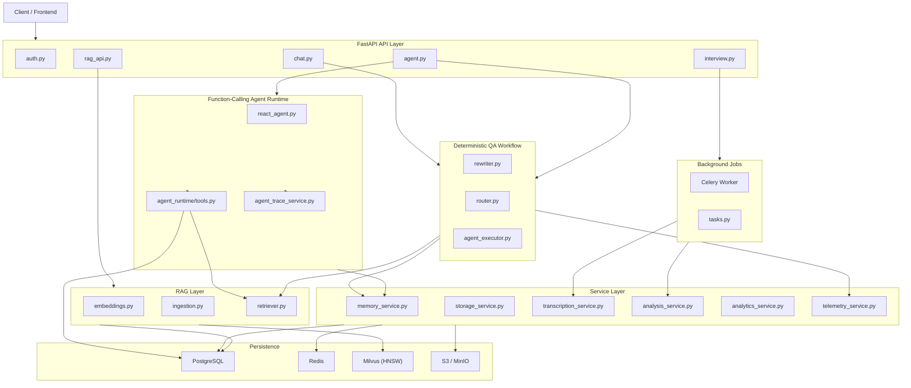
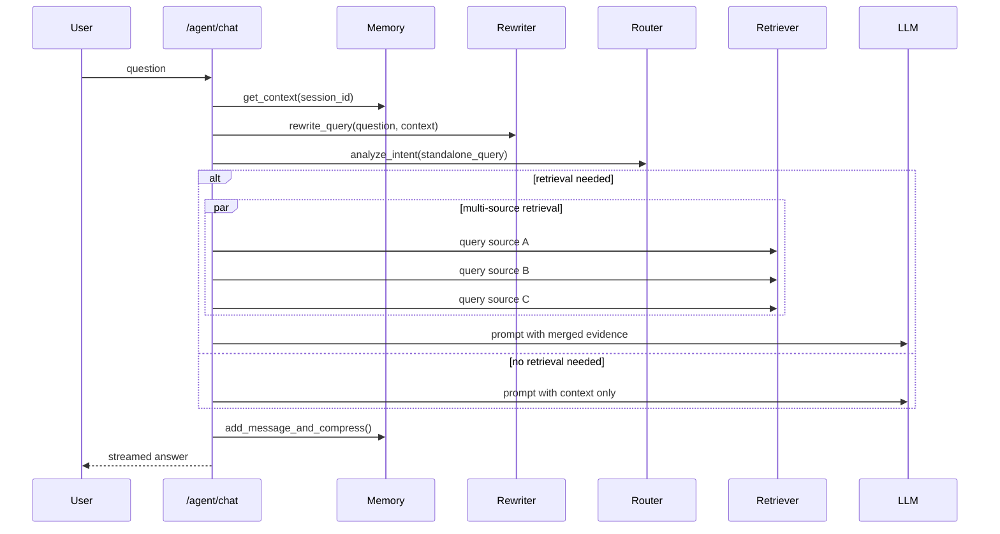
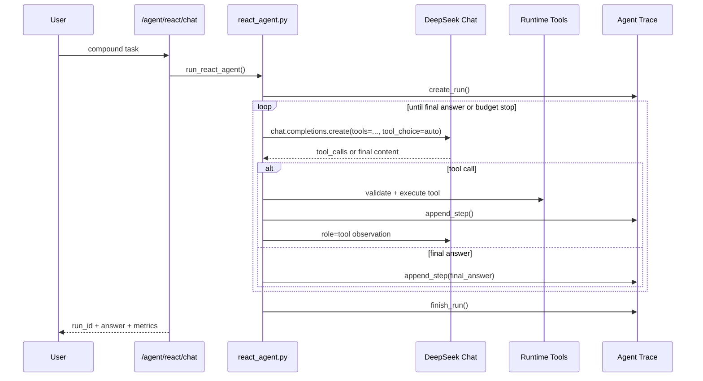
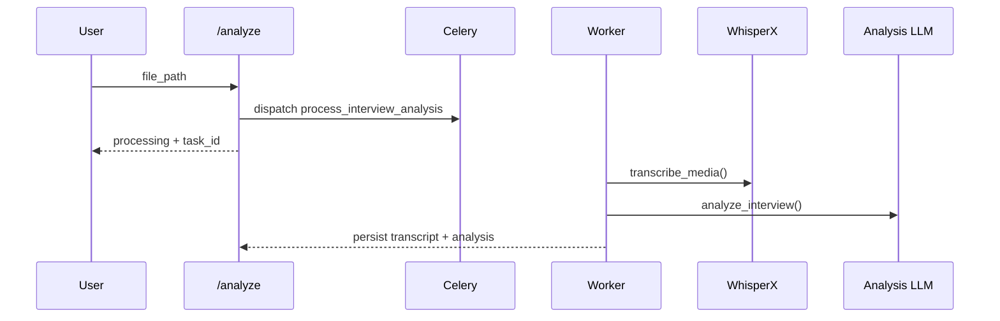

# Interview Copilot - Complete Technical Documentation

> **Version**: v3.0
> **Last Updated**: 2026-04-12
> **Project Type**: AI interview preparation backend with RAG + dual-path agent architecture

---

## 1. Project Overview

Interview Copilot is a backend system built for technical interview preparation. It supports:

- interview audio upload and asynchronous transcription
- LLM-based interview analysis and QA extraction
- document ingestion and retrieval-augmented QA
- session memory and review workflows
- function-calling agent tasks for job-search-related compound goals

The system is intentionally split into **two execution paths**:

1. **Deterministic workflow path**
   Used for standard interview QA, review, and retrieval-augmented chat.

2. **Independent ReAct agent path**
   Used for tool-using compound tasks such as job lookup, JD fetching, profile reading, and interview knowledge search.

This separation keeps normal QA fast and stable while still allowing an autonomous tool-calling agent for more complex tasks.

---

## 2. High-Level Architecture



---

## 3. Directory Guide

```text
Interview_Copilot/
├─ backend/
│  ├─ app/
│  │  ├─ agent/                  # deterministic workflow components
│  │  ├─ agent_runtime/          # function-calling ReAct runtime
│  │  ├─ api/                    # FastAPI routes
│  │  ├─ core/                   # config, security, runtime helpers
│  │  ├─ db/                     # database and redis clients
│  │  ├─ models/                 # ORM models
│  │  ├─ rag/                    # ingestion / embeddings / retriever
│  │  ├─ services/               # business services
│  │  ├─ worker/                 # Celery app and tasks
│  │  └─ main.py                 # FastAPI entrypoint
│  └─ tests/
├─ data/
│  ├─ databases/
│  ├─ cache/
│  ├─ logs/
│  ├─ evaluation/
│  └─ storage/
├─ evaluation/
├─ scripts/
├─ README.md
├─ PROJECT_DOCUMENTATION.md
├─ PROJECT_ARCHITECTURE_AND_INTERVIEW_GUIDE.md
└─ INTERVIEW_QA.md
```

---

## 4. Core Modules

### 4.1 `backend/app/core/`

#### `config.py`

Central settings registry for:

- database and storage paths
- Milvus collection and HNSW index parameters
- HuggingFace model identifiers
- RAG retrieval parameters
- agent runtime budgets
- S3 / MinIO credentials
- JWT security configuration

Notable settings:

- `MILVUS_DENSE_INDEX_TYPE=HNSW`
- `MILVUS_HNSW_M=16`
- `MILVUS_HNSW_EF_CONSTRUCTION=200`
- `MILVUS_HNSW_EF_SEARCH=64`
- `RAG_MIN_SCORE=0.5`
- `AGENT_MAX_STEPS=8`
- `AGENT_MAX_TOOL_CALLS=16`
- `AGENT_MAX_RUNTIME_SECONDS=90`
- `AGENT_MAX_TOTAL_TOKENS=32000`

#### `security.py`

Implements:

- password hashing
- JWT creation and verification
- `get_current_user()` dependency for all protected routes

#### `hf_runtime.py`

Prepares local HuggingFace runtime paths and resolves model snapshots from the project-managed cache.

---

### 4.2 `backend/app/db/`

#### `database.py`

Provides:

- SQLAlchemy engine
- session factory
- declarative base
- `get_db()` dependency

#### `redis.py`

Provides the async Redis client used by:

- session hot cache
- Celery broker / backend

---

### 4.3 `backend/app/models/`

#### `user.py`

Stores user account data.

#### `chat.py`

Stores:

- `ChatSession`
- `ChatMessage`

Used by session history APIs and cold memory persistence.

#### `interview.py`

Stores:

- `Interview`
- `Transcript`
- `AnalysisResult`

Tracks async interview analysis state transitions:

- `PENDING`
- `TRANSCRIBING`
- `ANALYZING`
- `COMPLETED`
- `FAILED`

#### `agent_trace.py`

Defines:

- `AgentRun`
- `AgentStep`

These persist the full agent trajectory for observability and evaluation.

---

### 4.4 `backend/app/rag/`

#### `embeddings.py`

Initializes:

- DeepSeek LLM handles used by the system
- BGE embedding model
- fast LLM handle for summary / utility calls

#### `ingestion.py`

Responsible for document ingestion:

- load file
- parse by file type
- choose adaptive chunking strategy
- stamp `user_id` and `source_type`
- write vectors into Milvus
- persist original nodes into PostgreSQL document store

Adaptive chunking routes:

- Markdown -> `MarkdownNodeParser`
- JSON -> `JSONNodeParser`
- Python / Java / C / C++ -> `CodeSplitter`
- fallback -> `SentenceSplitter`

#### `retriever.py`

Responsible for retrieval:

- Milvus dense retrieval
- PostgreSQL-backed BM25 retrieval
- reciprocal-rank fusion
- BGE reranking
- score-threshold filtering

Retrieval is constrained by:

- `user_id`
- optional `source_type`

This is the core multi-tenant retrieval boundary.

---

### 4.5 `backend/app/agent/`

This folder powers the **deterministic workflow path** used by normal QA.

#### `rewriter.py`

Resolves pronouns and incomplete follow-up questions into standalone search queries.

#### `router.py`

Classifies intent and decides whether retrieval is needed and which sources should be queried.

#### `agent_executor.py`

Runs the normal chat workflow:

1. load session context
2. rewrite query
3. route intent
4. retrieve from selected sources in parallel
5. build final prompt
6. stream LLM response
7. update memory
8. emit telemetry

This path is optimized for predictable behavior and low latency.

---

### 4.6 `backend/app/agent_runtime/`

This folder powers the **independent ReAct agent path**.

#### `tools.py`

Defines runtime tools with:

- `FunctionTool` metadata for Function Calling
- Pydantic schemas for strict argument validation
- allowlists and input limits

Current built-in tools:

- `search_jobs`
- `fetch_job_detail`
- `get_user_profile`
- `search_interview_qa`

#### `react_agent.py`

Implements the function-calling loop using an OpenAI-compatible API:

- sends `tools` schema to the model
- allows `tool_choice="auto"`
- reads native `tool_calls`
- executes tools safely
- sends back `role="tool"` observations
- persists each step into trace tables

Guardrails include:

- Pydantic validation
- max tool calls
- per-tool call cap
- max steps
- token budget
- runtime timeout
- tool timeout

This path is optimized for flexibility and safe tool autonomy.

---

### 4.7 `backend/app/services/`

#### `memory_service.py`

Implements the hot/cold memory architecture:

- Redis holds active session state
- PostgreSQL stores persistent history and summaries
- `tiktoken` counts tokens
- summaries are generated when token usage exceeds threshold

The agent runtime uses a separate namespace:

- normal chat: `session_id`
- react agent: `agent::{user_id}::{session_id}`

This prevents agent traces from polluting normal conversation context.

#### `storage_service.py`

Supports:

- presigned upload URLs
- upload to S3 / MinIO
- local fallback when cloud storage is unavailable

#### `transcription_service.py`

Loads WhisperX and Pyannote inside the worker process and provides:

- speech-to-text
- speaker diarization
- markdown-formatted transcript output

#### `analysis_service.py`

Analyzes transcripts and extracts structured interview feedback.

#### `analytics_service.py`

Generates global review reports from stored personal memory and interview history.

#### `telemetry_service.py`

Writes lightweight JSONL metrics without blocking the main request path.

#### `agent_trace_service.py`

Creates and updates:

- agent runs
- agent steps
- aggregate metrics

This service backs:

- run replay APIs
- trajectory evaluation
- observability dashboards

---

### 4.8 `backend/app/api/`

#### `auth.py`

- user registration
- login and token issuance

#### `chat.py`

- create session
- list sessions
- fetch paginated history
- rename session
- websocket chat streaming

#### `interview.py`

- presigned audio upload
- backward-compatible direct upload
- async interview analysis dispatch
- interview status polling
- personal memory save
- analytics report

#### `rag_api.py`

- RAG upload URL
- async document ingestion dispatch
- retrieval query endpoint

#### `agent.py`

Exposes both agent paths:

- `POST /agent/chat` for deterministic workflow QA
- `POST /agent/react/chat` for function-calling ReAct runs
- run list / detail / metrics endpoints for trace inspection

---

### 4.9 `backend/app/worker/`

#### `celery_app.py`

Creates the Celery application with Redis as broker and result backend.

#### `tasks.py`

Implements long-running background tasks:

- `process_interview_analysis`
- `process_document_ingestion`

These tasks download S3 resources when needed, run the heavy compute stage, and clean up temporary files afterward.

---

## 5. Request Flows

### 5.1 Deterministic QA Flow



### 5.2 ReAct Agent Flow



### 5.3 Interview Analysis Flow



---

## 6. Storage and Indexing Design

### 6.1 Milvus

Milvus stores dense vectors using:

- index type: `HNSW`
- metric: `IP`
- `M = 16`
- `efConstruction = 200`
- `efSearch = 64`

This gives a balanced trade-off between retrieval quality, memory use, and latency for the current project scale.

### 6.2 PostgreSQL

PostgreSQL plays multiple roles:

- primary relational database
- document store for BM25 retrieval
- long-term session archive
- interview analysis results
- agent trajectory persistence

### 6.3 Redis

Redis is used for:

- hot session cache
- Celery broker
- Celery result backend

### 6.4 S3 / MinIO

Used for uploaded media and document assets. The system can fall back to local storage when object storage is unavailable.

---

## 7. Evaluation System

### 7.1 Dataset Build

`evaluation/build_eval_dataset.py` extracts QA pairs from PDF files and creates the evaluation dataset.

### 7.2 RAG Evaluation

`evaluation/run_rag_eval.py` reports:

- `Hit Rate@3`
- `MRR@3`
- `Precision@3`
- `Recall@3`
- `nDCG@3`
- RAGAS `faithfulness`
- RAGAS `context_precision`
- RAGAS `context_recall`
- retrieval latency
- generation latency
- end-to-end latency
- token usage
- timeout / failure statistics

### 7.3 Agent Trajectory Evaluation

`evaluation/run_agent_trajectory_eval.py` reports:

- `completion_rate`
- `avg_steps`
- `avg_tool_calls`
- `invalid_tool_call_rate`
- `avg_latency_ms`

Optionally, when a labeled dataset is provided, it also reports:

- `tool_selection_accuracy`

This bridges the gap between answer-quality evaluation and agent-behavior evaluation.

---

## 8. Initialization and Deployment

### 8.1 Environment Preparation

```bash
pip install -r requirements.txt
copy .env.example .env
```

### 8.2 Start Dependencies

```bash
docker-compose up -d
```

### 8.3 Download Models

```bash
python scripts/init_models.py
```

### 8.4 Start Backend

```bash
cd backend
uvicorn app.main:app --host 127.0.0.1 --port 8080 --reload
```

### 8.5 Start Worker

```bash
cd backend
celery -A app.worker.celery_app worker --loglevel=info -P solo
```

### 8.6 Run Tests

```bash
python -m pytest backend/tests -q
```

### 8.7 Open API Docs

- Swagger: [http://127.0.0.1:8080/docs](http://127.0.0.1:8080/docs)
- Ping: [http://127.0.0.1:8080/ping](http://127.0.0.1:8080/ping)

---

## 9. Current Technical Positioning

The current version is best described as:

- a **production-oriented RAG backend**
- extended with a **governed function-calling agent**
- designed for **interview QA first**
- expanded toward **job-preparation compound tasks**

It is not just a chatbot wrapper. The core value lies in:

- multi-source retrieval
- explicit tenant isolation
- asynchronous heavy-task offloading
- memory management
- tool governance
- evaluation and traceability

---

## 10. Recommended Reading Order

If you are new to the project, read in this order:

1. [README.md](/D:/Projects/Python/Interview_Copilot/README.md)
2. [PROJECT_ARCHITECTURE_AND_INTERVIEW_GUIDE.md](/D:/Projects/Python/Interview_Copilot/PROJECT_ARCHITECTURE_AND_INTERVIEW_GUIDE.md)
3. [INTERVIEW_QA.md](/D:/Projects/Python/Interview_Copilot/INTERVIEW_QA.md)

If you are modifying the backend, inspect:

- [backend/app/main.py](/D:/Projects/Python/Interview_Copilot/backend/app/main.py)
- [backend/app/rag/retriever.py](/D:/Projects/Python/Interview_Copilot/backend/app/rag/retriever.py)
- [backend/app/agent/agent_executor.py](/D:/Projects/Python/Interview_Copilot/backend/app/agent/agent_executor.py)
- [backend/app/agent_runtime/react_agent.py](/D:/Projects/Python/Interview_Copilot/backend/app/agent_runtime/react_agent.py)
- [backend/app/services/memory_service.py](/D:/Projects/Python/Interview_Copilot/backend/app/services/memory_service.py)
