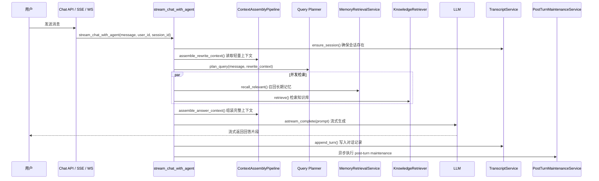
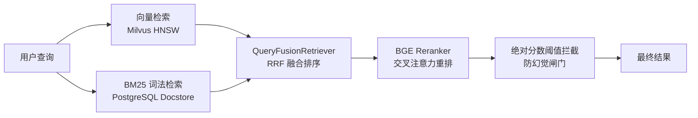
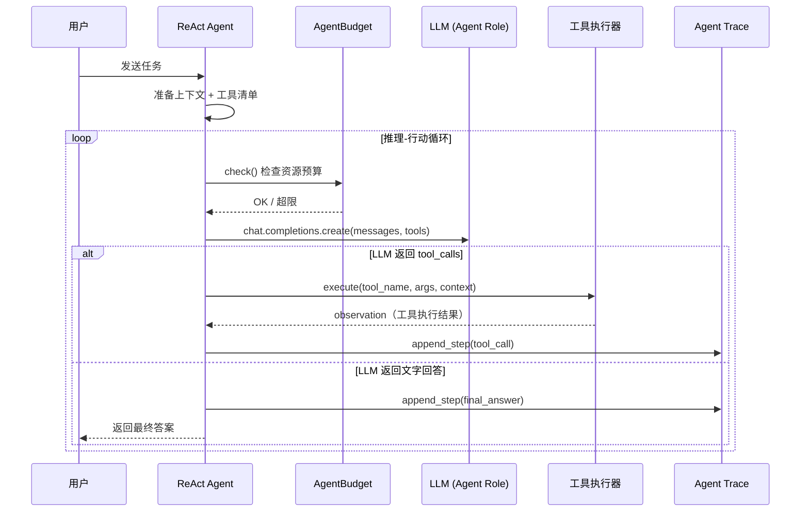
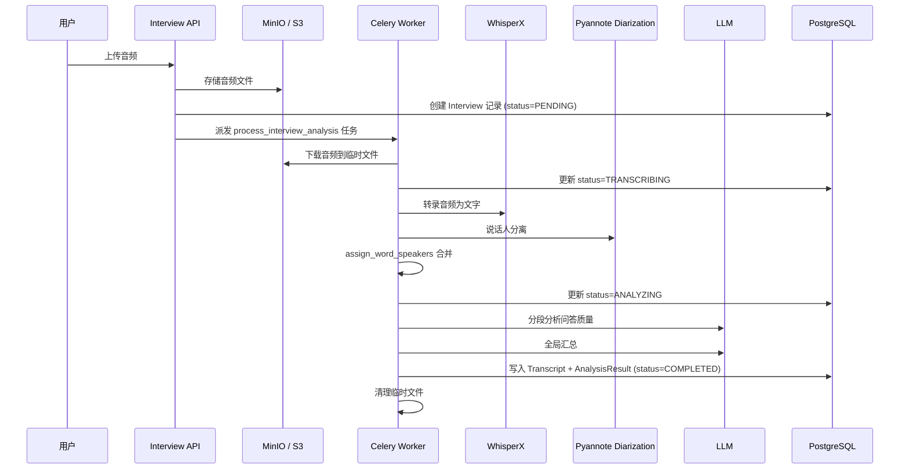
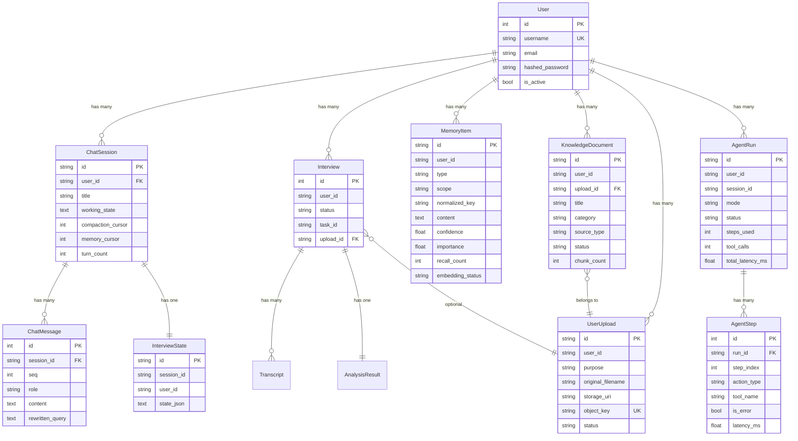

# Interview Copilot 项目完整技术文档

> 项目类型：AI 面试准备与复盘后端系统
> 核心能力：多轮 RAG 问答、长期记忆、文档知识库、ReAct 工具代理、录音转写与面试分析
> 技术栈：FastAPI、SQLAlchemy、PostgreSQL、Redis、Celery、Milvus、MinIO/S3、LlamaIndex、DeepSeek/OpenAI LLM、WhisperX、Vue 3
> 测试基线：`pytest backend/tests -q` 通过 `81 passed`
> 评测基线：835 条样本 Hit Rate@3 = 99.9%、MRR@5 = 0.990、P95 检索延迟 98ms；RAGAS 50 条样本忠实度 94.5%、上下文精确度 95.2%、上下文召回率 100%；TTFT ≈ 0.8s、E2E P95 ≈ 5.0s

---

## 1. 项目定位与价值

### 1.1 项目解决什么问题

Interview Copilot 是一个面向技术面试准备的 AI 后端系统。它不是一个简单的聊天机器人，而是把"面试练习、录音复盘、知识沉淀、长期记忆、岗位准备"串成一套可运行的工程闭环。

具体来说，它解决以下四个核心问题：

1. **面试录音难以复盘**
   面试结束后，候选人很难回忆自己具体回答了什么、哪里答得不好。系统支持上传面试录音，后台自动转写文字、区分面试官和候选人、抽取每一道问答对、逐题打分和给出改进答案。

2. **知识点和错题难以沉淀**
   面试中暴露的薄弱点，如果不记录下来就容易遗忘。系统可以把面试分析结果和改进答案保存到个人知识库，后续问答时自动检索。

3. **多轮练习缺少个性化上下文**
   普通聊天机器人每次对话都从零开始。本系统有长期记忆（Long-term Memory），能记住用户的项目经历、偏好和反馈规则，在后续对话中自动召回相关信息。

4. **岗位准备缺少工具支持**
   只靠手动搜索岗位信息效率低。系统提供 ReAct Agent（推理-行动智能体，Reasoning + Acting Agent），可以自动搜索岗位、获取详情、结合用户画像生成准备建议。

### 1.2 和简单 ChatBot 的本质区别

| 维度 | 普通 ChatBot | Interview Copilot |
|------|-------------|-------------------|
| 检索能力 | 无 | 混合 RAG（向量 + BM25 + Reranker） |
| 记忆 | 仅当前对话 | 长期记忆 + 跨会话召回 |
| 上下文管理 | 简单拼接历史 | 结构化 ContextBundle + Token 预算控制 |
| 工具调用 | 无 | ReAct Agent + Function Calling |
| 异步任务 | 无 | Celery Worker 处理音频转写和文档摄取 |
| 数据隔离 | 无 | 按 user_id 强制隔离所有数据 |
| 可观测性 | 无 | Agent Trace 全量记录 + 遥测日志 |
| 评测体系 | 无 | RAG 评测（Hit Rate@3 99.9%）+ RAGAS 生成评测（忠实度 94.5%）+ Agent 轨迹评测 |

### 1.3 面向的用户场景

- 技术面试候选人，想要系统化地练习、复盘和沉淀面试经验
- 需要把面试录音转化为结构化反馈的求职者
- 想要结合个人项目背景、获得个性化面试辅导的工程师

---

## 2. 总体架构

### 2.1 架构图

```mermaid
graph TB
    Client["前端 / API 客户端"]

    subgraph API["FastAPI API 层"]
        Auth["auth.py<br/>注册、登录、JWT 鉴权"]
        Chat["chat.py<br/>多轮对话 / SSE / WebSocket / Memory API"]
        AgentAPI["agent.py<br/>普通 Chat / ReAct Agent"]
        Interview["interview.py<br/>音频上传 / 面试分析"]
        RagAPI["rag_api.py<br/>RAG 上传 / 摄取 / 查询"]
        Models["model_runtime.py<br/>运行时模型选择"]
    end

    subgraph ChatPipeline["普通多轮 RAG Chat Pipeline"]
        Planner["planner.py<br/>Query Planner 查询规划器"]
        Context["context_service.py<br/>ContextBundle 上下文包"]
        Prompt["PromptRenderer<br/>提示词渲染器"]
        Knowledge["knowledge_retriever.py<br/>知识检索封装"]
        Executor["agent_executor.py<br/>流式回答执行器"]
    end

    subgraph Memory["长期记忆系统"]
        Extract["MemoryExtractionService<br/>记忆抽取与合并"]
        Recall["MemoryRetrievalService<br/>记忆召回"]
        HybridMemory["HybridRetriever<br/>向量 + 词法混合排序"]
        MemoryVector["MemoryVectorService<br/>记忆向量索引"]
    end

    subgraph RAG["RAG 知识库"]
        Ingestion["ingestion.py<br/>文档解析与切块"]
        Retriever["retriever.py<br/>向量 + BM25 + Reranker"]
        Embeddings["embeddings.py<br/>Embedding / LlamaIndex 设置"]
    end

    subgraph React["ReAct 工具代理链路"]
        ReactRuntime["react_agent.py<br/>Function Calling Runtime"]
        Tools["tools.py<br/>工具注册与执行"]
        Trace["agent_trace_service.py<br/>轨迹记录与指标"]
    end

    subgraph Audio["音频分析链路"]
        Worker["Celery Worker"]
        Transcription["transcription_service.py<br/>WhisperX + Diarization"]
        Analysis["analysis_service.py<br/>QA 抽取 / 评分 / 改进答案"]
    end

    subgraph Storage["存储层"]
        PG["PostgreSQL<br/>业务数据 / Docstore"]
        Redis["Redis<br/>Celery Broker / Result Backend"]
        Milvus["Milvus<br/>知识向量 / 记忆向量"]
        S3["MinIO / S3<br/>音频与文档对象"]
        Logs["data/logs<br/>Telemetry JSONL"]
    end

    Client --> API
    Chat --> Executor
    AgentAPI --> Executor
    AgentAPI --> ReactRuntime
    Interview --> Worker
    RagAPI --> Ingestion
    RagAPI --> Retriever
    Models --> Embeddings
    Executor --> Planner
    Executor --> Context
    Executor --> Knowledge
    Context --> Prompt
    Executor --> Recall
    Recall --> HybridMemory
    Recall --> MemoryVector
    Knowledge --> Retriever
    Ingestion --> Embeddings
    Retriever --> Embeddings
    ReactRuntime --> Tools
    ReactRuntime --> Trace
    ReactRuntime --> Context
    ReactRuntime --> Recall
    Worker --> Transcription
    Worker --> Analysis
    API --> PG
    Worker --> PG
    Ingestion --> PG
    Retriever --> PG
    MemoryVector --> PG
    API --> S3
    Worker --> S3
    RAG --> Milvus
    Memory --> Milvus
    Worker --> Redis
    API --> Logs
```



### 2.2 数据流概述

整个系统的数据流可以分为三条主要链路：

**链路一：普通多轮问答**
用户发送消息 → API 层接收 → agent_executor 协调 → Query Planner 规划意图 → 并发召回长期记忆和知识库 → 组装 ContextBundle → PromptRenderer 渲染提示词 → LLM 流式生成回答 → 写入 Transcript → 异步执行 post-turn maintenance（压缩状态、更新面试状态、抽取记忆）

**链路二：ReAct 工具代理**
用户发送复杂任务 → API 层接收 → react_agent 协调 → 准备上下文和工具清单 → LLM 决定是否调用工具 → 执行工具并获取结果 → 把结果反馈给 LLM → 循环直到得出最终答案 → 全量写入 Agent Trace

**链路三：音频分析**
用户上传音频 → MinIO/S3 存储 → API 创建 Interview 记录 → 派发 Celery 任务 → Worker 下载音频 → WhisperX 转写 + 说话人分离 → LLM 分析问答质量 → 写入分析结果

---

## 3. 目录结构

```text
Interview_Copilot/
├─ backend/
│  ├─ app/
│  │  ├─ api/                    # FastAPI 路由层
│  │  │  ├─ auth.py              # 注册、登录、JWT 鉴权
│  │  │  ├─ chat.py              # 会话管理、历史、WebSocket/SSE 聊天、Memory API
│  │  │  ├─ agent.py             # 普通 Chat 和 ReAct Agent API
│  │  │  ├─ interview.py         # 音频上传、面试分析任务、复盘结果保存
│  │  │  ├─ rag_api.py           # 文档上传、文档摄取、RAG 查询
│  │  │  └─ model_runtime.py     # 运行时模型选择
│  │  ├─ agent/                  # 普通多轮 RAG Chat pipeline
│  │  │  ├─ agent_executor.py    # 主执行器：stream_chat_with_agent()
│  │  │  ├─ planner.py           # Query Planner：生成 QueryPlan
│  │  │  ├─ rewriter.py          # 查询改写（已被 Planner 吸收，保留兼容）
│  │  │  └─ tools.py             # 普通 chat 工具定义（轻量）
│  │  ├─ agent_runtime/          # ReAct / Function Calling 工具代理
│  │  │  ├─ react_agent.py       # ReAct 执行循环
│  │  │  └─ tools.py             # 工具注册、参数校验、schema 导出
│  │  ├─ core/                   # 配置、安全、模型注册
│  │  │  ├─ config.py            # 从 .env 加载的所有配置项
│  │  │  ├─ security.py          # JWT 生成/校验、密码哈希
│  │  │  ├─ model_registry.py    # 模型 Profile 定义、角色选择、LLM 实例化
│  │  │  ├─ hf_runtime.py        # Hugging Face 模型缓存管理
│  │  │  └─ background_tasks.py  # 安全的后台任务调度
│  │  ├─ db/                     # SQLAlchemy 引擎和 Session 管理
│  │  ├─ models/                 # ORM 数据模型
│  │  │  ├─ user.py              # 用户账号
│  │  │  ├─ chat.py              # ChatSession + ChatMessage
│  │  │  ├─ interview.py         # Interview + Transcript + AnalysisResult
│  │  │  ├─ interview_state.py   # 面试状态（独立于 Working State）
│  │  │  ├─ memory.py            # 长期记忆 MemoryItem
│  │  │  ├─ knowledge.py         # 知识库文档 KnowledgeDocument
│  │  │  ├─ upload.py            # 用户上传 UserUpload
│  │  │  └─ agent_trace.py       # AgentRun + AgentStep
│  │  ├─ rag/                    # 文档摄取、Embedding、检索、混合排序
│  │  │  ├─ ingestion.py         # 文档解析 + 自适应切块 + 写入 Milvus/Docstore
│  │  │  ├─ retriever.py         # 向量检索 + BM25 + Reranker + 防幻觉
│  │  │  ├─ knowledge_retriever.py # 封装多 source_type 查询
│  │  │  ├─ hybrid.py            # HybridRetriever 混合排序层
│  │  │  └─ embeddings.py        # Embedding 模型初始化 + LLM Proxy
│  │  ├─ services/               # 业务服务层
│  │  │  ├─ context_service.py   # ContextBundle + TokenBudgeter + PromptRenderer
│  │  │  ├─ memory_extraction_service.py  # 记忆抽取、召回、Compaction、PostTurnMaintenance
│  │  │  ├─ memory_vector_service.py      # 记忆向量索引 CRUD
│  │  │  ├─ interview_state_service.py    # 面试状态 CRUD
│  │  │  ├─ transcript_service.py         # 对话记录 CRUD
│  │  │  ├─ analysis_service.py           # 面试分析（QA 抽取 + 评分）
│  │  │  ├─ transcription_service.py      # WhisperX 转写
│  │  │  ├─ agent_trace_service.py        # Agent 轨迹 CRUD + 指标聚合
│  │  │  ├─ storage_service.py            # MinIO/S3 对象存储操作
│  │  │  ├─ knowledge_service.py          # 知识库文档管理
│  │  │  ├─ analytics_service.py          # 诊断报告生成
│  │  │  ├─ upload_service.py             # 上传记录管理
│  │  │  ├─ telemetry_service.py          # 交互指标日志
│  │  │  └─ state_utils.py               # 状态序列化工具
│  │  ├─ worker/                 # Celery 后台任务
│  │  │  ├─ celery_app.py        # Celery 实例配置
│  │  │  └─ tasks.py             # 面试分析任务 + 文档摄取任务
│  │  └─ main.py                 # FastAPI 应用入口 + lifespan 初始化
│  └─ tests/                     # pytest 测试套件
├─ frontend/                     # Vue 3 前端
├─ evaluation/                   # RAG / Agent 评测脚本
├─ scripts/                      # 开发工具脚本
├─ docker-compose.yml            # 本地基础设施编排
├─ alembic/                      # 数据库迁移
├─ alembic.ini                   # Alembic 配置
├─ requirements.txt              # Python 依赖
└─ README.md                     # 项目说明
```

---

## 4. API 层详解

API 路由在 `backend/app/main.py` 中统一挂载，前缀为 `/api/v1`。

### 4.1 认证接口

文件：`backend/app/api/auth.py` + `backend/app/core/security.py`

| 方法 | 路径 | 功能 |
|------|------|------|
| POST | `/api/v1/auth/register` | 创建用户，密码使用 bcrypt 哈希 |
| POST | `/api/v1/auth/login` | OAuth2 password form 登录，返回 Access Token + Refresh Token |
| POST | `/api/v1/auth/refresh` | 使用 Refresh Token 换取新的 Token pair |

**认证流程（Access/Refresh 双令牌生命周期）**：

1. 用户调用 `/login`，提交用户名和密码。
2. 后端用 `bcrypt.checkpw()` 校验密码。
3. 校验通过后，同时生成两个 JWT：
   - **Access Token**（`type: "access"`）：有效期 30 分钟（`ACCESS_TOKEN_EXPIRE_MINUTES`），用于 API 访问鉴权。
   - **Refresh Token**（`type: "refresh"`）：有效期 7 天（`REFRESH_TOKEN_EXPIRE_MINUTES`），用于续期 Access Token。
4. 后续请求在 `Authorization: Bearer <access_token>` 头中携带 Access Token。
5. `get_current_user()` 依赖函数解码 token，**验证 `type == "access"`**（拒绝 Refresh Token），从数据库加载用户对象。
6. Access Token 过期后，前端调用 `/refresh` 端点提交 Refresh Token，获取新的 Token pair（自动续期）。
7. WebSocket 连接通过 query parameter 传递 token，由 `decode_token()` 校验。

### 4.2 多轮聊天接口

文件：`backend/app/api/chat.py`

| 方法 | 路径 | 功能 |
|------|------|------|
| POST | `/chat/sessions` | 创建聊天会话 |
| GET | `/chat/sessions` | 分页列出当前用户的会话 |
| GET | `/chat/history` | 查询某个 session 的消息历史 |
| PATCH | `/chat/sessions/{session_id}/title` | 更新会话标题 |
| GET | `/chat/transcript` | 返回完整转录式聊天记录（含 working state、interview state） |
| WebSocket | `/chat/ws/{session_id}` | WebSocket 流式聊天 |
| POST | `/chat/sse/{session_id}` | SSE（Server-Sent Events，服务端推送事件）流式聊天 |
| GET | `/memory/items` | 列出当前用户的长期记忆 |
| GET | `/memory/items/{memory_id}` | 查询单条长期记忆详情 |
| DELETE | `/memory/items/{memory_id}` | 删除当前用户的一条长期记忆 |

聊天接口最终都调用 `stream_chat_with_agent()`，这是普通多轮 RAG chat pipeline 的主入口。WebSocket 和 SSE 是两种不同的流式传输方式——WebSocket 支持双向通信，SSE 是服务端单向推送，前端实现更简单。

### 4.3 Agent 接口

文件：`backend/app/api/agent.py`

| 方法 | 路径 | 功能 |
|------|------|------|
| POST | `/agent/chat` | 普通聊天（内部走 `stream_chat_with_agent()`） |
| POST | `/agent/react/chat` | ReAct 工具代理（调用 `run_react_agent()`） |
| GET | `/agent/runs` | 查询当前用户的 agent run 列表 |
| GET | `/agent/runs/{run_id}` | 查询某次 run 的完整步骤 |
| GET | `/agent/metrics` | 聚合 ReAct 执行指标（完成率、平均步数、工具错误率等） |

### 4.4 RAG 与知识库接口

文件：`backend/app/api/rag_api.py`

| 方法 | 路径 | 功能 |
|------|------|------|
| POST | `/knowledge/upload/url` | 为当前用户生成 S3/MinIO 预签名上传 URL |
| POST | `/knowledge/documents` | 创建知识库文档记录，派发 Celery 摄取任务 |
| GET | `/knowledge/documents` | 列出当前用户的知识库文档（支持按分类/状态/来源过滤） |
| GET | `/knowledge/documents/{id}` | 读取单个文档详情 |
| PATCH | `/knowledge/documents/{id}` | 更新文档标题或分类 |
| DELETE | `/knowledge/documents/{id}` | 删除文档及其向量节点和 docstore 记录 |
| GET | `/knowledge/categories` | 统计当前用户的知识库分类 |
| POST | `/rag/query` | 对知识库执行 RAG 查询（严格按 user_id 隔离） |

知识源类型（`source_type`）包括：

- `interview_qa`：面试题库
- `official_docs`：官方文档和技术资料
- `personal_memory`：个人复盘文本

### 4.5 面试分析接口

文件：`backend/app/api/interview.py`

| 方法 | 路径 | 功能 |
|------|------|------|
| POST | `/upload/audio/direct` | 后端直传音频到 S3/MinIO |
| POST | `/upload/audio` | 生成音频上传预签名 URL |
| POST | `/analyze` | 创建 Interview 记录并派发后台分析任务 |
| GET | `/analyze/{interview_id}/status` | 查询分析状态和结果 |
| POST | `/memory/save` | 将复盘题目与改进答案保存到 RAG 知识库 |
| GET | `/analytics/report` | 基于个人记忆生成综合诊断报告 |

### 4.6 模型运行时接口

文件：`backend/app/api/model_runtime.py`

| 方法 | 路径 | 功能 |
|------|------|------|
| GET | `/models/catalog` | 返回所有可用模型档案（ModelProfile） |
| GET | `/models/runtime` | 返回 primary/fast/agent 三个角色当前使用的模型 |
| PUT | `/models/runtime` | 更新运行时模型选择（agent 角色必须支持 function calling） |

项目把模型分成三个角色：

- **primary**：负责需要高质量回答的 RAG 主回答
- **fast**：负责查询规划、记忆抽取、状态更新等轻量任务
- **agent**：负责 ReAct 工具代理，必须支持 Function Calling（函数调用）

---

## 5. 核心链路详解

> 这是整份文档最重要的部分。每条链路都会用序列图 + 分步文字说明的方式来解释。

### 5.1 普通多轮 RAG Chat Pipeline

主入口：`backend/app/agent/agent_executor.py` → `stream_chat_with_agent()`

这条链路是系统中最常走的路径——用户发一条消息，系统结合上下文、记忆和知识库回答。它被设计成**确定性的阶段化流水线**，而不是让 AI 自己决定下一步做什么的自由式 Agent。



**执行阶段详解**：

**第 1 步：确保会话和面试状态存在**
调用 `transcript_service.ensure_session()` 和 `interview_state_service.ensure_state()`。如果是新会话，会创建 ChatSession 和 InterviewState 记录。

**第 2 步：读取轻量改写上下文**
调用 `context_pipeline.assemble_rewrite_context()`。这一步只读取 Working State（工作状态）、Interview State（面试状态）和近期对话，不加载记忆和知识库。目的是给 Query Planner 提供足够的上下文来理解用户的问题，比如消解"那这个怎么答"中的"这个"指的是什么。

**第 3 步：调用 Query Planner 生成查询计划**
Planner 调用 fast LLM，输入用户问题和改写上下文，输出一个结构化的 `QueryPlan`：

```python
class QueryPlan(BaseModel):
    standalone_query: str   # 消解指代后的独立问题
    dense_query: str        # 用于向量检索的自然语言查询
    sparse_query: str       # 用于 BM25 词法检索的关键词查询
    needs_memory_retrieval: bool    # 是否需要召回长期记忆
    memory_types: list[MemoryType]  # 需要哪些类型的记忆
    needs_knowledge_retrieval: bool # 是否需要检索知识库
    knowledge_sources: list[KnowledgeSource]  # 检索哪些知识源
    answer_mode: AnswerMode  # 回答模式
    reasoning: str           # 审计说明（便于排查）
```

**为什么要区分 dense_query 和 sparse_query？**

- `dense_query` 面向向量检索，需要保留完整的自然语言语义。比如"Redis 的持久化机制有哪些"。
- `sparse_query` 面向 BM25 词法检索，需要更短更聚焦的关键词。比如"Redis 持久化 RDB AOF"。
- 两者各自擅长不同类型的匹配，混用会降低检索质量。

**Planner 的容错设计**：如果 LLM 规划失败（比如返回格式错误），系统会自动切换到 `fallback_query_plan()`——默认召回所有类型的记忆、检索 `interview_qa` 知识源、回答模式设为 `knowledge_qa`。这确保 Planner 失败不会中断用户的普通聊天。

**第 4 步：并发召回记忆和知识库**
Planner 已经确定了是否需要记忆和知识库。两者互不依赖，所以用 `asyncio.create_task` 并发执行，减少总等待时间。注意这里的并发检索 task 是 awaited 的（不是 fire-and-forget），而 post-turn maintenance 才使用 `safe_background_task()`。

**第 5 步：组装完整上下文**
调用 `context_pipeline.assemble_answer_context()`，把 Working State、Interview State、近期对话、长期记忆和知识片段组装成 `ContextBundle`（上下文包）。

**第 6 步：选择 LLM 和提示词**

- 如果 `needs_knowledge_retrieval = false`：用 fast LLM + 直接回答提示词（DIRECT_SYSTEM_RULES）
- 如果 `needs_knowledge_retrieval = true`：用 primary LLM + RAG 提示词（RAG_SYSTEM_RULES），强调基于检索知识回答

**第 7 步：流式生成回答**
调用 LLM 的 `astream_complete()`，边生成边把文字片段推送给用户。

**第 8 步：写入 Transcript**
把用户消息和 AI 回答写入 `chat_messages` 表，每条消息有递增的 `seq`（序号），后续的状态压缩和记忆抽取都依赖这个序号。

**第 9 步：异步执行 post-turn maintenance**
通过 `safe_background_task()` 异步执行，不阻塞用户。`safe_background_task()` 是对 `asyncio.create_task()` 的安全封装，提供：任务 GC 保护（强引用防回收）、异常自动日志记录、关停时通过 `cancel_and_wait_all()` 统一排空。维护包括三件事：

1. **Compaction**（状态压缩）：如果对话太长，压缩旧消息到 Working State
2. **Interview State 更新**：用 LLM 更新面试进度状态
3. **Memory 抽取**：从新对话中提取持久记忆

### 5.2 上下文 Pipeline

文件：`backend/app/services/context_service.py`

系统不是简单地把所有历史消息拼接成一个字符串扔给模型。而是有一套分层管理的上下文流水线。

#### 5.2.1 ContextBundle 结构

```python
@dataclass
class ContextBundle:
    working_state: dict       # 当前会话压缩后的工作状态
    interview_state: dict     # 当前面试训练状态
    recent_turns: list[dict]  # 最近若干轮原始对话
    relevant_memories: list[dict]   # 召回到的长期记忆
    knowledge_chunks: list[dict]    # RAG 检索得到的知识片段
    current_query: str        # 本轮问题
```

每个字段的含义：

- **working_state**：一个结构化 JSON，记录当前会话的协作状态，字段包括 goal（目标）、current_phase（当前阶段）、covered_topics（已覆盖主题）、pending_topics（待讨论主题）、observed_gaps（发现的薄弱点）等。
- **interview_state**：独立于 Working State 的面试状态，更侧重面试过程管理。
- **recent_turns**：最近的原始对话消息。
- **relevant_memories**：从长期记忆中召回的相关条目。
- **knowledge_chunks**：从知识库检索到的文档片段。
- **current_query**：用户本轮的问题。

#### 5.2.2 TokenBudgeter 预算控制

`TokenBudgeter`（Token 预算器）控制每类上下文占用的 token 数量，避免超出模型的上下文窗口：

| 上下文类型 | Token 预算 | 说明 |
|-----------|-----------|------|
| 近期对话 | 4000 tokens | 从最新消息往前保留，超出则丢弃更早的 |
| 长期记忆 | 1600 tokens | 按顺序截断，只保留预算内的条目 |
| 知识片段 | 5000 tokens | 按顺序截断，只保留预算内的片段 |

#### 5.2.3 PromptRenderer 提示词渲染

`PromptRenderer`（提示词渲染器）把 ContextBundle 按固定顺序渲染成最终的 LLM 提示词：

1. **System Rules**（系统规则）
2. **[Working State]**（工作状态）
3. **[Interview State]**（面试状态）
4. **[Long-term Memories]**（长期记忆）
5. **[Retrieved Knowledge]**（检索知识）
6. **[Recent Turns]**（近期对话）
7. **[Current Query]**（当前问题）

**为什么当前问题放最后？** 因为大模型对输入末尾的内容关注度最高，把本轮问题放在最靠近回答位置的地方，可以减少模型"跑偏"的概率。

**为什么不直接拼字符串？** 过早拼字符串会让 token 预算控制、排序调整、来源标注、去重和单元测试都很困难。先结构化再渲染，每类上下文的位置和预算都可以独立控制。

#### 5.2.4 清洗、截断和修复流程

`ContextAssemblyPipeline` 对原始消息的处理分四步：

1. **Sanitize（清洗）**：只保留 `User` 和 `Agent` 角色的消息，跳过以 `[SYSTEM_]` 或 `[DEBUG_]` 开头的内部消息，清除空内容。
2. **Truncate（截断）**：按 token 预算从最新消息往前保留，超出预算的旧消息被丢弃。
3. **Repair（修复）**：去掉开头多余的 Agent 消息（没有对应的用户问题），去掉结尾未回答的 User 消息（回答还没生成）。
4. **Assemble（组装）**：把清洗后的消息和其他上下文组装成 ContextBundle。

#### 5.2.5 Working State vs Interview State

这两个状态看起来相似，但职责不同：

| 维度 | Working State | Interview State |
|------|--------------|-----------------|
| 存储位置 | `chat_sessions.working_state` 字段 | `interview_states` 独立表 |
| 主要用途 | prompt 组织和对话压缩 | 面试过程管理 |
| 更新时机 | Compaction 时由 LLM 压缩更新 | 每轮 post-turn maintenance 时更新 |
| 核心字段 | goal, current_phase, summary | phase, covered_topics, observed_gaps, candidate_claims, next_question |

**为什么要拆开？** 拆分后各自职责清晰，不会互相干扰。Working State 主要服务于"把旧对话压缩成摘要"；Interview State 主要服务于"追踪面试进度和发现薄弱点"。

**Compaction 什么时候触发？** 当 Working State 加上 compaction_cursor 之后的新消息总 token 数超过 5000 tokens 时触发。系统保留最近 6 条消息不压缩，把更早的消息折叠进新的 Working State，并推进 compaction_cursor。

### 5.3 长期记忆系统

长期记忆系统让 Interview Copilot 能"记住"用户的跨会话信息，比如用户的项目经历、交互偏好和反馈规则。

#### 5.3.1 MemoryItem 数据模型

文件：`backend/app/models/memory.py`

| 字段 | 类型 | 作用 |
|------|------|------|
| `id` | String | 主键，格式为 `mem_` + 12位随机十六进制 |
| `user_id` | String | 所属用户，用于数据隔离 |
| `type` | String | 记忆类型（见下方） |
| `scope` | String | 作用域，默认 `user` |
| `description` | String | 短描述，不超过 200 字 |
| `normalized_key` | String | 归一化合并键，用于去重 |
| `content` | Text | 记忆正文，最大 4096 字节 |
| `confidence` | Float | 抽取置信度 |
| `importance` | Float | 重要性（初始值等于 confidence，后续取最大值） |
| `source_session_id` | String | 来源会话 ID |
| `last_evidence_seq` | Integer | 最后证据所在消息序号 |
| `recall_count` | Integer | 被召回的次数 |
| `last_accessed_at` | DateTime | 最后被访问的时间 |
| `embedding_status` | String | 向量状态：pending / ready / failed |
| `embedding_model` | String | 使用的向量模型 |
| `embedded_at` | DateTime | 向量写入时间 |

允许的记忆类型（`VALID_TYPES`）：

- `user_profile`：用户画像（如"候选人有 3 年 Java 经验"）
- `interaction_preference`：交互偏好（如"用户希望回答更简洁"）
- `feedback_rule`：反馈规则（如"用户要求代码示例用 Python"）
- `project_reference`：项目背景（如"用户正在做一个推荐系统"）

**什么不会被存为长期记忆？** 临时面试进度、短期弱点分数、通用技术知识——这些要么太短暂，要么应该放在知识库里。

#### 5.3.2 记忆抽取流程

文件：`backend/app/services/memory_extraction_service.py` → `MemoryExtractionService`

**触发时机**：每轮对话结束后，由 `PostTurnMaintenanceService.run()` 异步触发。

**具体流程**：

1. 读取 `memory_cursor` 之后的新消息（只处理增量，避免重复抽取）。
2. 调用 fast LLM，输入新对话，要求输出 JSON 数组，每个元素包含 type、description、normalized_key、content、confidence。
3. **类型过滤**：丢弃不在 `VALID_TYPES` 中的候选。
4. **置信度过滤**：丢弃 confidence 低于 `MIN_CONFIDENCE = 0.65` 的候选。这个阈值是经过测试选定的——太低会引入噪声记忆，太高会漏掉有用信息。
5. **合并逻辑**：用 `user_id + type + normalized_key` 三元组作为唯一键。如果已有同键记忆，更新其 content、confidence 和 importance（取旧值和新值的最大值）。如果没有，创建新记忆。
6. 写入 PostgreSQL `memory_items` 表。
7. 调用 `memory_vector_service.upsert_memory()` 同步写入记忆向量索引。

**normalized_key 的作用**：`description` 是自然语言字段，同一个信息可能有不同措辞（如"用户偏好简洁回答"和"候选人喜欢短回答"）。`normalized_key` 经过正则处理后变成标准化的合并键，可以把这些同义描述合并到同一条记忆。

#### 5.3.3 记忆向量索引

文件：`backend/app/services/memory_vector_service.py`

长期记忆使用独立的 Milvus collection（向量集合）：

| 参数 | 值 |
|------|---|
| Collection 名称 | `interview_copilot_memory` |
| Embedding 维度 | 1024 |
| Embedding 模型 | `BAAI/bge-m3` |
| 索引类型 | HNSW |
| 相似度度量 | IP（内积） |

**为什么用独立 collection？** 长期记忆和知识库的语义空间、生命周期、metadata 结构和清理策略都不同。如果放在同一个 collection 里，知识库检索可能会被记忆干扰，记忆的调参也会影响知识库。独立后各自可以独立优化。

写入 Milvus 时，每条记忆向量的 metadata 包含：memory_id、user_id、type、scope、normalized_key、importance、updated_at。

#### 5.3.4 混合召回

文件：`backend/app/services/memory_extraction_service.py` → `MemoryRetrievalService`

召回时同时走两条路径，最后融合排序：

**路径 1：向量召回**
从 memory Milvus collection 中，根据 query 的 embedding 找语义相似的记忆。强制按 `user_id` 过滤，确保只看到自己的记忆。

**路径 2：词法召回**
从 PostgreSQL `memory_items` 表中，按 importance、recall_count、updated_at 排序取候选，再用 `lexical_overlap()` 计算关键词覆盖率作为分数。

两条路径的结果交给 `HybridRetriever` 融合排序。

#### 5.3.5 HybridRetriever 打分公式

文件：`backend/app/rag/hybrid.py`

最终分数由四个因素加权组合：

```
final_score = 0.6 × vector_score
            + 0.35 × lexical_score
            + 0.15 × importance
            + 0.05 × recency_score
```

| 权重 | 因素 | 含义 |
|------|------|------|
| 0.6 | vector_score | 语义相似度，最重要的信号 |
| 0.35 | lexical_score | 关键词覆盖率，补充向量检索的精确匹配能力 |
| 0.15 | importance | 记忆本身的重要性 |
| 0.05 | recency_score | 新近程度，公式为 `1/(1+age_days)`，越新越高 |

#### 5.3.6 召回后的副作用

被选中的记忆会：

- `recall_count` 加 1（记录被使用的频率）
- `last_accessed_at` 更新为当前时间
- 正文超过 500 字时截断
- 如果记忆更新时间超过 2 天，附加 `staleness_note`（如"5 days old"），提醒模型这条信息可能过时

#### 5.3.7 写入失败的降级策略

记忆向量 upsert 失败时：

- 把 `embedding_status` 标为 `failed`，记录 warning 日志
- **不影响回答**：此时回答主链路已经完成
- 后续召回仍可通过词法路径找到这条记忆（降级为纯词法匹配）
- 下次启动时，如果 `MEMORY_BACKFILL_ON_STARTUP = true`，会尝试回填所有状态不是 `ready` 的记忆

### 5.4 RAG 知识库检索链路

#### 5.4.1 文档摄取

文件：`backend/app/rag/ingestion.py`

文档摄取流程：上传文件 → 解析 → 自适应切块 → 写入 Milvus 向量索引 + PostgreSQL Docstore。

**自适应切块引擎 `get_optimal_nodes()`**：

系统不是对所有文档都用同一种切块方式，而是根据文件类型自动选择最优的切分策略：

| 文件类型 | 切块策略 | 说明 |
|---------|---------|------|
| `.md`, `.markdown` | MarkdownNodeParser | 按 Markdown 标题层级切分，保留标题结构 |
| `interview_qa`, `official_docs` | MarkdownNodeParser | 面试题库和文档通常有标题结构 |
| `.json` | JSONNodeParser | 保留 JSON 的层级结构 |
| `.py` | CodeSplitter(language="python") | 按函数/类定义切分 |
| `.java` | CodeSplitter(language="java") | 同理 |
| `.c`, `.cpp` | CodeSplitter(language="cpp") | 同理 |
| 其他 | SentenceSplitter(chunk_size=1024, chunk_overlap=100) | 通用按句切分 |

**LlamaParse 增强**：如果配置了 `LLAMA_CLOUD_API_KEY`，PDF/PPTX/DOCX 文件会先通过 LlamaParse（LlamaIndex 的云端文档解析服务）转成 Markdown，再用 MarkdownNodeParser 切分。这比 PyMuPDF 直接提取文字能更好地保留表格和排版结构。

**P0 级安全红线**：所有节点在切分后会被强制注入 `user_id` 和 `source_type` metadata。这是在节点层面的多租户物理隔离——即使 NodeParser 重新生成了节点对象，也不会丢失所属用户信息。

**BM25 缓存失效**：摄取完成后，调用 `invalidate_bm25_cache(user_id)` 清除该用户的 BM25 索引缓存，确保下次检索能看到新内容。

#### 5.4.2 混合检索 + 防幻觉

文件：`backend/app/rag/retriever.py` → `query_knowledge_base()`

这是知识库检索的核心函数，执行 5 个阶段：



**阶段 1：连接 Milvus 向量引擎**
使用模块级单例 `_get_milvus_index()`（即整个进程只创建一个连接实例，后续所有请求复用），通过线程锁保护，确保多个请求同时到达时不会重复创建。HNSW 索引参数：M=16（每个节点的最大连接数）、efConstruction=200（构建索引时的搜索宽度，越大索引质量越高但构建越慢）、efSearch=64（查询时的搜索宽度，越大召回率越高但查询越慢）。

**阶段 2：构建多租户隔离过滤器**
把当前用户的 `user_id` 作为过滤条件注入到 Milvus 查询中。关键点：这个过滤发生在 Milvus 服务端，搜索引擎在遍历向量时就已经排除了不属于当前用户的数据，而不是先检索所有用户的数据再筛选。从物理层面保证了数据隔离。

**阶段 3：BM25 检索器（per-user 缓存）**

- 从 PostgreSQL Docstore 中加载属于当前用户的全部节点。
- 构建 BM25 索引，**按 `user_id|source_type` 键缓存，TTL 300 秒（5 分钟）**。缓存使用线程安全锁保护，避免并发请求重复构建。
- 文档摄取完成后，`invalidate_bm25_cache(user_id)` 自动清除该用户的所有缓存条目，确保新内容立即可检索。
- 如果 BM25 不可用（节点为空或构建失败），系统自动降级为纯向量检索。

**阶段 4：融合排序 + Reranker 精排**

- 向量检索和 BM25 各自返回一个排名列表，但分数尺度完全不同（向量分数在 0-1 之间，BM25 分数可能在 0-20 之间），没法直接比较。`QueryFusionRetriever` 使用 RRF（Reciprocal Rank Fusion，互逆排序融合）算法来合并——它不看分数只看排名位置，奖励在两个检索器中都排名靠前的文档。
- 合并结果经过 BGE Reranker（`BAAI/bge-reranker-base`）做精排。Reranker 是一个专门判断"问题和文档是否真正相关"的深度学习模型，它把问题和文档拼在一起输入神经网络，输出一个 0-1 之间的相关性分数，比简单的向量距离更精确。
- 精排后取相关性最高的 Top N 个结果（默认 `RERANK_TOP_N = 5`）。

**阶段 5：防幻觉拦截**
这是防止 AI 编造答案的最后一道防线：

```python
if used_reranker:
    return score >= min_score          # Reranker 分数，阈值 0.5
else:
    return score >= min(min_score, 0.02)  # RRF 分数尺度不同，用更低阈值
```

- 如果所有节点分数都低于阈值，返回 `[SYSTEM_EMPTY_WARNING]` 标记。
- 主回答模型看到这个标记后，知道知识库里没有相关信息，会选择坦诚告知用户而不是编造答案。

**词法覆盖 Fallback**：如果 Reranker 分数全部低于阈值，但有节点的关键词覆盖率（`lexical_overlap`）超过 35%，仍然放行。这是为了防止 Reranker 在特定领域（如代码片段）的分数偏低导致误拦截。

#### 5.4.3 多源检索封装

文件：`backend/app/rag/knowledge_retriever.py`

`KnowledgeRetriever` 封装了"按多个 source_type 分别查询，最后合并"的逻辑。比如 Planner 决定同时查 `interview_qa` 和 `official_docs`，它会对每个 source_type 调用 `query_knowledge_base()`，然后把结果标上来源后合并。

### 5.5 ReAct 工具代理

文件：`backend/app/agent_runtime/react_agent.py`

当用户的需求涉及工具调用（如搜索岗位、获取数据库信息），系统切换到 ReAct Agent 模式。

#### 5.5.1 执行循环



**技术选择：为什么用 Function Calling 而不是正则解析？**
早期版本使用 ReAct prompt + 正则解析 JSON 的方式。但存在 JSON 格式错误率高、参数缺失难检测、错误信息不友好等问题。迁移到 OpenAI Function Calling 后：

- LLM 返回结构化的 `tool_calls` 对象，不需要手动解析。
- 参数通过 Pydantic 模型校验，类型错误、超长、缺失都有明确的错误信息返回给 LLM。
- 工具 schema 从 Pydantic 模型自动导出，保持一致性。

#### 5.5.2 AgentBudget 资源控制

```python
@dataclass
class AgentBudget:
    steps: int = 0           # 当前推理步数
    tool_calls: int = 0      # 工具调用总次数
    prompt_tokens: int = 0   # 输入 token 累计
    completion_tokens: int = 0  # 输出 token 累计
```

| 预算项 | 默认限制 | 检查逻辑 |
|-------|---------|---------|
| 最大步数 | 8 步 | 每次循环前检查 |
| 最大工具调用 | 16 次 | 每次工具调用前检查 |
| 最大 token | 32000 | 每次循环前检查 |
| 最大运行时间 | 90 秒 | 每次循环前检查 |
| 单工具最大调用 | 6 次 | 防止对同一工具的死循环调用 |
| 工具执行超时 | 20 秒 | 用 `asyncio.wait_for()` 控制 |
| 观测结果字符限制 | 6000 字 | 超出则截断 + `(truncated)` 标记 |

超出任何预算时，Agent 停止推理，附加 budget_stop_reason 日志，并给用户返回说明。

#### 5.5.3 注册的工具

文件：`backend/app/agent_runtime/tools.py`

| 工具名 | 参数模型 | 功能 |
|-------|---------|------|
| `search_jobs` | SearchJobsArgs | 搜索 Lever 平台的岗位列表 |
| `fetch_job_detail` | FetchJobDetailArgs | 获取单个岗位的完整描述 |
| `get_user_profile` | EmptyArgs | 获取用户画像、面试统计、最新分析反馈 |
| `search_interview_qa` | SearchInterviewQAArgs | RAG 检索面试题库 |

每个工具的参数都有 Pydantic 模型定义，包括类型、长度限制和必填检查。LLM 调用时，先通过 `parse_tool_arguments()` 解析 JSON，再通过 `validate_args()` 做 Pydantic 校验。校验失败会把错误详情反馈给 LLM，让它修正参数。

#### 5.5.4 Agent Trace 全量遥测

文件：`backend/app/services/agent_trace_service.py`

每次 ReAct 执行会生成完整的执行轨迹：

**AgentRun**（一次完整执行）：run_id, user_id, session_id, goal, mode, status, started_at, finished_at, steps_used, tool_calls, prompt_tokens, completion_tokens, total_latency_ms, budget_stop_reason, error_message, final_answer

**AgentStep**（每一步）：step_index, action_type（tool_call / final_answer / budget_stop / error）, tool_name, tool_call_id, tool_args_json, observation_json, assistant_content, is_error, latency_ms

**聚合指标** `aggregate_trajectory_metrics()`：

- `run_count`：总执行次数
- `completion_rate`：成功完成率
- `avg_steps`：平均步数
- `avg_tool_calls`：平均工具调用次数
- `invalid_tool_call_rate`：无效工具调用率（越低越好）
- `avg_latency_ms`：平均延迟

### 5.6 音频分析链路

这条链路负责把面试录音变成结构化的反馈报告。

#### 5.6.1 流程概览



#### 5.6.2 WhisperX + Diarization

文件：`backend/app/services/transcription_service.py`

**转写步骤**：

1. 加载音频到内存（`whisperx.load_audio()`）
2. WhisperX 转录文字（batch_size=16 以提升吞吐）
3. Pyannote 做说话人分离（Speaker Diarization，说话人聚类）
4. `assign_word_speakers()` 把说话人标签对齐到文字片段
5. 相邻同一说话人的片段合并，生成 Markdown 格式：`**[Speaker 1]**: 内容`

**为什么用 WhisperX 而不是原始 Whisper？**
WhisperX 在原始 Whisper 基础上增加了批处理、强制对齐和说话人分离的集成支持，延迟更低，且可以直接和 Pyannote 的分离结果对齐。

**模型初始化**：`init_whisper_model()` 在应用启动时统一加载，避免在处理用户请求时才临时加载大模型导致内存溢出（OOM，Out of Memory——即程序需要的内存超过了系统可用内存）。使用单例模式（即只加载一次，后续所有请求复用同一个模型实例）防止重复加载浪费资源。

#### 5.6.3 分段分析

文件：`backend/app/services/analysis_service.py`

**分析策略**：面试录音可能很长，直接发给 LLM 会超过上下文限制。系统的处理方式：

1. **解析说话人轮次**：用正则 `SPEAKER_LINE_RE` 把 Markdown 转写文本解析成 `speaker + text` 的结构化列表。
2. **构建问答对**：把相邻的面试官问题和候选人回答配对。第一个说话人被假定为面试官。
3. **Token 分块**：按 `ANALYSIS_CHUNK_TOKEN_LIMIT = 12000` tokens 把问答对分成多个 chunk，保证每个完整的 QA pair 不会被切断。
4. **分段分析**：对每个 chunk 调用 LLM，输出 JSON（`overall_score`, `overall_feedback`, `qa_list`）。
5. **全局汇总**：如果有多个 chunk，把所有分段结果再送给 LLM 做一次全局总结。

**单个 QA pair 的输出结构**：

```json
{
  "question": "面试官问的具体问题",
  "user_answer": "候选人的原始回答",
  "score": 7,
  "critique": "技术缺陷、遗漏点、错误点",
  "improved_answer": "更完整、更严谨的改进答案"
}
```

#### 5.6.4 Celery 任务配置

文件：`backend/app/worker/tasks.py`

两个后台任务都配置了重试策略：

| 配置项 | 值 | 说明 |
|-------|---|------|
| `autoretry_for` | ConnectionError, TimeoutError, OSError | 自动重试的异常类型 |
| `retry_backoff` | True | 指数退避（backoff，每次重试间隔翻倍） |
| `retry_backoff_max` | 120 秒 | 最大退避时间 |
| `max_retries` | 3 | 最大重试次数 |

**Worker 线程事件循环**：Celery 的任务函数只能是普通的同步函数，但项目中的核心服务（音频转写、面试分析等）都写成了异步函数（因为它们内部需要并发执行多个 IO 操作，如同时读数据库和调 LLM）。解决方案是为每个 Worker 线程维护一个持久化的事件循环（`_get_worker_loop()`），通过 `run_async()` 让同步的 Celery 任务能调用异步的服务函数。这比每次任务都创建新循环再销毁更高效。

**安全检查**：

- Interview 的 upload owner 必须和 interview owner 一致
- Knowledge document 的 upload purpose 必须是 `knowledge_document`
- 上传对象的 S3 key 必须以 `uploads/{user_id}/{upload_id}/` 开头

---

## 6. 数据模型

### 6.1 ER 图



### 6.2 关键字段说明

**ChatSession 的游标字段**：

- `compaction_cursor`：Compaction 处理到的最后一条消息的 seq。下次 Compaction 只处理 cursor 之后的消息。
- `memory_cursor`：记忆抽取处理到的最后一条消息的 seq。下次记忆抽取只处理 cursor 之后的消息。
- `turn_count`：总消息条数，用于生成新消息的 seq。

**Interview 的状态流转**：`PENDING → TRANSCRIBING → ANALYZING → COMPLETED`。失败则转为 `FAILED`。

**KnowledgeDocument 的状态流转**：`processing → ready`。失败则转为 `failed`，可以重新触发摄取任务。

---

## 7. 存储层

### 7.1 PostgreSQL

主业务数据库（关系型数据库），承担两个角色：

1. **业务数据存储**：用户、会话、消息、面试、记忆等所有业务数据表。
2. **文档原文存储（Docstore）**：知识库文档被切块后，每个文本块的原始内容和标签信息都存在这里。BM25 关键词检索就是直接从这里读取数据来构建索引的。

连接池配置（控制同时能打开多少个数据库连接）通过环境变量控制：`DB_POOL_SIZE`（常驻连接数，默认 5）、`DB_MAX_OVERFLOW`（超出常驻数后最多再创建多少临时连接，默认 10）、`DB_POOL_RECYCLE`（连接最长存活时间，默认 1800 秒即 30 分钟，超时后自动重建，防止数据库主动断开长时间空闲的连接）。

### 7.2 Milvus

向量数据库（专门用于存储和检索文本的向量表示——即把文字转换成一串数字后的高维向量，通过计算向量之间的"距离"来判断文本的语义相似度）。系统维护两个独立的向量集合（collection）：

| Collection | 用途 | Embedding 维度 | 索引 |
|-----------|------|---------------|------|
| `interview_copilot_rag` | 知识库文档向量 | 1024 | HNSW (M=16, efConstruction=200) |
| `interview_copilot_memory` | 长期记忆向量 | 1024 | HNSW (M=16, efConstruction=200) |

相似度度量统一使用 IP（Inner Product，内积——把两个向量对应位置的数字相乘再加起来）。之所以选 IP 而不是余弦相似度，是因为 BGE Embedding 模型输出的向量已经归一化（长度标准化为 1），在这种条件下两者的计算结果完全一致，但 IP 计算更快。

### 7.3 Redis

Redis（内存键值数据库）仅用作 Celery 的 Broker（消息队列——用于传递异步任务）和 Result Backend（结果存储——用于保存任务执行结果和状态）。项目中没有用 Redis 做业务数据缓存。

### 7.4 MinIO / S3

对象存储（专门用于存放大文件的存储服务），用于存放用户上传的音频文件和知识库文档原件。桶名默认 `interview-copilot-bucket`。上传使用预签名 URL（presigned URL——一种由后端生成的临时上传地址，有时效性），前端拿到这个地址后直接将文件上传到 MinIO，不经过后端服务器，减轻后端的带宽和内存压力。

---

## 8. 配置体系

文件：`backend/app/core/config.py`

所有配置通过 **Pydantic `BaseSettings`** 从环境变量（`.env` 文件）自动加载，支持类型校验和默认值回退。配置类使用 `SettingsConfigDict(env_file=".env", extra="ignore")` 确保未知变量不会导致启动失败。启动时会校验 `SECRET_KEY` 是否为不安全的占位值并发出警告。

### 8.1 关键配置分组

**模型配置**：

| 参数 | 默认值 | 说明 |
|------|-------|------|
| `EMBEDDING_MODEL_ID` | `BAAI/bge-m3` | BGE-M3 多语言 Embedding 模型 |
| `EMBEDDING_DIM` | 1024 | 向量维度 |
| `RERANKER_MODEL_ID` | `BAAI/bge-reranker-base` | BGE 交叉注意力 Reranker |
| `WHISPER_MODEL_ID` | `Systran/faster-whisper-large-v2` | 语音转写模型 |
| `DIARIZATION_MODEL_ID` | `pyannote-community/speaker-diarization-community-1` | 说话人分离模型 |

**RAG 检索配置**：

| 参数 | 默认值 | 说明 |
|------|-------|------|
| `VECTOR_TOP_K` | 8 | 向量检索候选数 |
| `BM25_TOP_K` | 8 | BM25 检索候选数 |
| `FUSION_TOP_K` | 6 | RRF 融合后保留数 |
| `RERANK_TOP_N` | 5 | Reranker 最终输出数 |
| `RAG_MIN_SCORE` | 0.5 | Reranker 分数阈值（主防线） |
| `RAG_FALLBACK_MIN_SCORE` | 0.02 | RRF 分数回退阈值 |
| `RAG_LEXICAL_FALLBACK_MIN_OVERLAP` | 0.35 | 词法覆盖率 fallback 阈值 |

**Agent 配置**：

| 参数 | 默认值 | 说明 |
|------|-------|------|
| `AGENT_MAX_STEPS` | 8 | 最大推理步数 |
| `AGENT_MAX_TOOL_CALLS` | 16 | 最大工具调用总次数 |
| `AGENT_MAX_CALLS_PER_TOOL` | 6 | 单工具最大调用次数 |
| `AGENT_MAX_TOTAL_TOKENS` | 32000 | 最大 token 总量 |
| `AGENT_MAX_RUNTIME_SECONDS` | 90 | 最大运行时间 |
| `AGENT_TEMPERATURE` | 0.2 | Agent 模型温度 |
| `AGENT_TOOL_SCHEMA_STRICT` | true | 工具 schema 是否启用 strict 模式 |

**记忆配置**：

| 参数 | 默认值 | 说明 |
|------|-------|------|
| `MEMORY_VECTOR_TOP_K` | 8 | 记忆向量检索候选数 |
| `MEMORY_LEXICAL_TOP_K` | 12 | 记忆词法检索候选数 |
| `MEMORY_FINAL_TOP_K` | 3 | 最终保留的记忆数 |
| `MEMORY_BACKFILL_ON_STARTUP` | true | 启动时是否回填失败的记忆向量 |

### 8.2 数据路径自动补全

`APP_DATA_DIR` 是数据根目录。子目录（DB_DIR, CACHE_DIR, LOG_DIR 等）如果未在 `.env` 中指定，会自动基于 `APP_DATA_DIR` 生成默认值。比如 `LOG_DIR` 默认为 `{APP_DATA_DIR}/logs`。

---

## 9. 部署架构

### 9.1 Docker Compose 拓扑

`docker-compose.yml` 定义了完整的本地基础设施：

| 服务 | 镜像 | 端口 | 用途 |
|------|------|------|------|
| nginx | nginx:alpine | 80 | 反向代理，将前端和 API 统一入口 |
| db | postgres:15-alpine | 5432 | PostgreSQL 数据库 |
| redis | redis:alpine | 6379 | Celery 消息队列 |
| minio | minio/minio:latest | 9000, 9001 | 对象存储（文件上传） |
| minio-create-bucket | minio/mc | - | 初始化 bucket |
| milvus-etcd | etcd:v3.5.18 | - | Milvus 元数据存储 |
| milvus-minio | minio/minio:latest | 9010, 9011 | Milvus 专用对象存储 |
| milvus-standalone | milvusdb/milvus:v2.5.6 | 19530, 9091 | Milvus 向量数据库 |

**Full-stack profile**（`--profile full`）还包含：

- `api` 容器：基于 `backend/Dockerfile` 多阶段构建，gunicorn + uvicorn worker
- `worker` 容器：同一镜像，启动 Celery worker（`--pool=solo`）

### 9.2 一键启动（开发环境）

文件：`scripts/dev.ps1`

开发时只需一条命令即可启动全部服务：

```powershell
pwsh scripts/dev.ps1
```

脚本自动执行：

1. 激活 conda 环境 `Interview_Copilot`
2. `docker compose up -d` 启动基础设施，等待 PostgreSQL 和 Redis 健康检查通过
3. `alembic upgrade head` 执行数据库迁移
4. 以后台 Job 启动 uvicorn（API）和 celery（Worker），统一收集日志到同一终端
5. 按 `Ctrl+C` 统一关停所有服务

支持参数：`-SkipDocker`（跳过 Docker 启动）、`-SkipMigration`（跳过迁移）、`-ApiPort 8080`（自定义端口）。

### 9.3 应用启动流程

文件：`backend/app/main.py` → `lifespan()`

```python
async def lifespan(app: FastAPI):
    # 1. 验证 Alembic 迁移状态（拒绝未迁移的数据库启动）
    # 2. 初始化 RAG Settings（Embedding 模型 + LLM）
    # 3. 回填 pending 状态的记忆向量
    # 4. 初始化 Reranker 模型
    # 5. Whisper/Diarization 由 Celery worker 单独加载
    yield
    # 排空所有 safe_background_task 后关停
    await cancel_and_wait_all(timeout=10.0)
```

启动顺序很重要——Embedding 模型和 Reranker 必须在第一个请求之前加载完成。关停时通过 `cancel_and_wait_all()` 优雅排空所有后台任务。

### 9.4 生产 Dockerfile

文件：`backend/Dockerfile`

多阶段构建（builder → runtime），最终镜像只包含 Python 虚拟环境和源码，不含构建工具。使用 `gunicorn` + `uvicorn.workers.UvicornWorker` 启动，带 `/ping` 健康检查。

### 9.5 CI/CD

文件：`.github/workflows/ci.yml`

GitHub Actions 自动化管线包含两个 Job：

- **test**：在 PostgreSQL + Redis service containers 中运行 pytest
- **lint**：使用 ruff 进行代码风格检查

---

## 10. 评测体系

评测分为三个维度：检索质量评测、生成质量评测和 Agent 轨迹评测。

### 10.1 检索质量评测

文件：`evaluation/test_retrieval_quality.py` + `evaluation/eval_runner.py`

使用 835 条黄金数据集（`evaluation/golden_dataset.jsonl`）评测混合检索链路的检索准确率。每条记录包含 query、reference_answer、user_id、source_type 等字段，覆盖面试知识、技术文档、个人复盘等多种知识源。

| 指标 | 结果 | 含义 |
|------|------|------|
| **Hit Rate@3** | 99.9% | 835 个测试问题中，99.9% 的情况下正确文档出现在检索结果前 3 名 |
| **MRR@5** | 0.990 | 正确文档几乎总是排在第 1 位（满分 1.0） |
| **P95 检索延迟** | 98ms | 95% 的检索请求在 98ms 内完成（含向量检索 + BM25 + RRF + Reranker） |

### 10.2 生成质量评测（RAGAS）

文件：`evaluation/test_generation_quality.py`

基于 RAGAS v0.4.3（Retrieval Augmented Generation Assessment）框架，在 50 条端到端样本上验证 RAG 系统的生成质量。RAGAS 使用 LLM-as-Judge 方式自动评测。

| 指标 | 结果 | 含义 |
|------|------|------|
| **忠实度（Faithfulness）** | 94.5% | AI 回答中的声明几乎都能在检索上下文中找到依据，不编造 |
| **上下文精确度（Context Precision）** | 95.2% | 检索到的文档中 95.2% 是与问题真正相关的，噪声极少 |
| **上下文召回率（Context Recall）** | 100% | 正确答案需要的信息全部被检索到 |

### 10.3 响应延迟

| 指标 | 结果 | 含义 |
|------|------|------|
| **首字响应延迟（TTFT）** | ≈ 0.8s | 用户发出问题后约 0.8 秒看到第一个回答字符（含 Planner + 检索 + 上下文组装） |
| **端到端 P95 响应** | ≈ 5.0s | 95% 的请求在 5 秒内完成全部回答生成 |

### 10.4 Agent 轨迹评测

文件：`evaluation/test_agent_trajectory.py`

评测指标：

- **completion_rate**：Agent 是否成功产出最终答案
- **avg_steps**：平均推理步数（越少越好）
- **invalid_tool_call_rate**：无效工具调用率（越低越好）
- **avg_latency_ms**：平均端到端延迟

### 10.3 测试套件（81 项测试）

```text
backend/tests/
├─ test_agent/      # 普通 chat pipeline 测试（Query Planner 等）
├─ test_api/        # API 路由集成测试（Auth 含 Refresh Token 测试）
├─ test_core/       # 配置、安全（Access/Refresh Token 双令牌）、模型注册、后台任务管理器
├─ test_db/         # 数据库迁移校验
├─ test_models/     # ORM 模型测试
├─ test_rag/        # RAG 检索测试 + BM25 缓存隔离/过期/失效
└─ test_services/   # 服务层测试（Agent Runtime、Telemetry、Memory 等）
```

pytest 配置（`pytest.ini`）声明了 `slow` 和 `integration` markers，并通过 `filterwarnings` 抑制第三方库的已知弃用警告。

---

## 11. 亮点设计总结

| # | 亮点 | 类型 |
|---|------|------|
| 1 | **确定性 Agentic Workflow** | 架构 |
|   | 普通聊天走固定阶段的流水线，而不是让 AI 自由决策。可预测、可调试。 | |
| 2 | **双路径设计** | 架构 |
|   | 简单问题走 stream_chat_with_agent（快、便宜），复杂任务走 ReAct Agent（灵活、可扩展）。 | |
| 3 | **Query Planner 预路由** | 效率 |
|   | 在检索之前先用轻量 LLM 判断是否需要检索，避免不必要的 Milvus/BM25 调用。 | |
| 4 | **双 Milvus Collection 隔离** | 安全 |
|   | 知识库和记忆各自独立集合，避免语义干扰和管理复杂度。 | |
| 5 | **防幻觉三重防线** | 质量 |
|   | Reranker 绝对分数阈值 + 词法覆盖 Fallback + SYSTEM_EMPTY_WARNING 标记。 | |
| 6 | **长期记忆 + 混合召回** | 个性化 |
|   | 向量 + 词法 + importance + recency 四因素融合排序。 | |
| 7 | **自适应切块引擎** | RAG 质量 |
|   | 根据文件类型自动选择最优切分策略。 | |
| 8 | **AgentBudget 六维资源控制** | 安全 |
|   | 步数、工具调用、token、时间、单工具频次、观测长度全方位控制。 | |
| 9 | **Post-Turn Maintenance 异步三件套** | 效率 |
|   | Compaction + Interview State 更新 + Memory 抽取不阻塞用户回答。 | |
| 10 | **Agent Trace 全量遥测** | 可观测性 |
|   | 每次 ReAct 执行的每一步都完整记录，支持聚合指标分析。 | |

---

## 12. 推荐阅读顺序

如果你是第一次阅读这个项目，建议按以下顺序：

1. **先看 `config.py`** — 了解所有可配置项的全局视图
2. **再看 `main.py`** — 理解启动顺序和生命周期管理
3. **然后看 `agent_executor.py`** — 这是最核心的业务入口
4. **接着看 `planner.py`** — 理解 Query Plan 如何驱动检索决策
5. **然后看 `context_service.py`** — 理解上下文如何组装和渲染
6. **再看 `retriever.py`** — 理解 RAG 混合检索的完整流程
7. **然后看 `memory_extraction_service.py`** — 理解记忆的抽取、合并和召回
8. **最后看 `react_agent.py` + `tools.py`** — 理解 ReAct 工具代理的执行循环

---

*文档最后更新：2026-05-03，基于 BGE-M3 迁移及评测体系完善后的代码库状态校准。*

│  │  ├─ api/                    # FastAPI 路由层
│  │  │  ├─ auth.py              # 注册、登录、JWT 鉴权
│  │  │  ├─ chat.py              # 会话管理、历史、WebSocket/SSE 聊天、Memory API
│  │  │  ├─ agent.py             # 普通 Chat 和 ReAct Agent API
│  │  │  ├─ interview.py         # 音频上传、面试分析任务、复盘结果保存
│  │  │  ├─ rag_api.py           # 文档上传、文档摄取、RAG 查询
│  │  │  └─ model_runtime.py     # 运行时模型选择
│  │  ├─ agent/                  # 普通多轮 RAG Chat pipeline
│  │  │  ├─ agent_executor.py    # 主执行器：stream_chat_with_agent()
│  │  │  ├─ planner.py           # Query Planner：生成 QueryPlan
│  │  │  ├─ rewriter.py          # 查询改写（已被 Planner 吸收，保留兼容）
│  │  │  └─ tools.py             # 普通 chat 工具定义（轻量）
│  │  ├─ agent_runtime/          # ReAct / Function Calling 工具代理
│  │  │  ├─ react_agent.py       # ReAct 执行循环
│  │  │  └─ tools.py             # 工具注册、参数校验、schema 导出
│  │  ├─ core/                   # 配置、安全、模型注册
│  │  │  ├─ config.py            # 从 .env 加载的所有配置项
│  │  │  ├─ security.py          # JWT 生成/校验、密码哈希
│  │  │  ├─ model_registry.py    # 模型 Profile 定义、角色选择、LLM 实例化
│  │  │  ├─ hf_runtime.py        # Hugging Face 模型缓存管理
│  │  │  └─ background_tasks.py  # 安全的后台任务调度
│  │  ├─ db/                     # SQLAlchemy 引擎和 Session 管理
│  │  ├─ models/                 # ORM 数据模型
│  │  │  ├─ user.py              # 用户账号
│  │  │  ├─ chat.py              # ChatSession + ChatMessage
│  │  │  ├─ interview.py         # Interview + Transcript + AnalysisResult
│  │  │  ├─ interview_state.py   # 面试状态（独立于 Working State）
│  │  │  ├─ memory.py            # 长期记忆 MemoryItem
│  │  │  ├─ knowledge.py         # 知识库文档 KnowledgeDocument
│  │  │  ├─ upload.py            # 用户上传 UserUpload
│  │  │  └─ agent_trace.py       # AgentRun + AgentStep
│  │  ├─ rag/                    # 文档摄取、Embedding、检索、混合排序
│  │  │  ├─ ingestion.py         # 文档解析 + 自适应切块 + 写入 Milvus/Docstore
│  │  │  ├─ retriever.py         # 向量检索 + BM25 + Reranker + 防幻觉
│  │  │  ├─ knowledge_retriever.py # 封装多 source_type 查询
│  │  │  ├─ hybrid.py            # HybridRetriever 混合排序层
│  │  │  └─ embeddings.py        # Embedding 模型初始化 + LLM Proxy
│  │  ├─ services/               # 业务服务层
│  │  │  ├─ context_service.py   # ContextBundle + TokenBudgeter + PromptRenderer
│  │  │  ├─ memory_extraction_service.py  # 记忆抽取、召回、Compaction、PostTurnMaintenance
│  │  │  ├─ memory_vector_service.py      # 记忆向量索引 CRUD
│  │  │  ├─ interview_state_service.py    # 面试状态 CRUD
│  │  │  ├─ transcript_service.py         # 对话记录 CRUD
│  │  │  ├─ analysis_service.py           # 面试分析（QA 抽取 + 评分）
│  │  │  ├─ transcription_service.py      # WhisperX 转写
│  │  │  ├─ agent_trace_service.py        # Agent 轨迹 CRUD + 指标聚合
│  │  │  ├─ storage_service.py            # MinIO/S3 对象存储操作
│  │  │  ├─ knowledge_service.py          # 知识库文档管理
│  │  │  ├─ analytics_service.py          # 诊断报告生成
│  │  │  ├─ upload_service.py             # 上传记录管理
│  │  │  ├─ telemetry_service.py          # 交互指标日志
│  │  │  └─ state_utils.py               # 状态序列化工具
│  │  ├─ worker/                 # Celery 后台任务
│  │  │  ├─ celery_app.py        # Celery 实例配置
│  │  │  └─ tasks.py             # 面试分析任务 + 文档摄取任务
│  │  └─ main.py                 # FastAPI 应用入口 + lifespan 初始化
│  └─ tests/                     # pytest 测试套件
├─ frontend/                     # Vue 3 前端
├─ evaluation/                   # RAG / Agent 评测脚本
├─ scripts/                      # 开发工具脚本
├─ docker-compose.yml            # 本地基础设施编排
├─ alembic/                      # 数据库迁移
├─ alembic.ini                   # Alembic 配置
├─ requirements.txt              # Python 依赖
└─ README.md                     # 项目说明

```

---

## 4. API 层详解

API 路由在 `backend/app/main.py` 中统一挂载，前缀为 `/api/v1`。

### 4.1 认证接口

文件：`backend/app/api/auth.py` + `backend/app/core/security.py`

| 方法 | 路径 | 功能 |
|------|------|------|
| POST | `/api/v1/auth/register` | 创建用户，密码使用 bcrypt 哈希 |
| POST | `/api/v1/auth/login` | OAuth2 password form 登录，返回 Access Token + Refresh Token |
| POST | `/api/v1/auth/refresh` | 使用 Refresh Token 换取新的 Token pair |

**认证流程（Access/Refresh 双令牌生命周期）**：
1. 用户调用 `/login`，提交用户名和密码。
2. 后端用 `bcrypt.checkpw()` 校验密码。
3. 校验通过后，同时生成两个 JWT：
   - **Access Token**（`type: "access"`）：有效期 30 分钟（`ACCESS_TOKEN_EXPIRE_MINUTES`），用于 API 访问鉴权。
   - **Refresh Token**（`type: "refresh"`）：有效期 7 天（`REFRESH_TOKEN_EXPIRE_MINUTES`），用于续期 Access Token。
4. 后续请求在 `Authorization: Bearer <access_token>` 头中携带 Access Token。
5. `get_current_user()` 依赖函数解码 token，**验证 `type == "access"`**（拒绝 Refresh Token），从数据库加载用户对象。
6. Access Token 过期后，前端调用 `/refresh` 端点提交 Refresh Token，获取新的 Token pair（自动续期）。
7. WebSocket 连接通过 query parameter 传递 token，由 `decode_token()` 校验。

### 4.2 多轮聊天接口

文件：`backend/app/api/chat.py`

| 方法 | 路径 | 功能 |
|------|------|------|
| POST | `/chat/sessions` | 创建聊天会话 |
| GET | `/chat/sessions` | 分页列出当前用户的会话 |
| GET | `/chat/history` | 查询某个 session 的消息历史 |
| PATCH | `/chat/sessions/{session_id}/title` | 更新会话标题 |
| GET | `/chat/transcript` | 返回完整转录式聊天记录（含 working state、interview state） |
| WebSocket | `/chat/ws/{session_id}` | WebSocket 流式聊天 |
| POST | `/chat/sse/{session_id}` | SSE（Server-Sent Events，服务端推送事件）流式聊天 |
| GET | `/memory/items` | 列出当前用户的长期记忆 |
| GET | `/memory/items/{memory_id}` | 查询单条长期记忆详情 |
| DELETE | `/memory/items/{memory_id}` | 删除当前用户的一条长期记忆 |

聊天接口最终都调用 `stream_chat_with_agent()`，这是普通多轮 RAG chat pipeline 的主入口。WebSocket 和 SSE 是两种不同的流式传输方式——WebSocket 支持双向通信，SSE 是服务端单向推送，前端实现更简单。

### 4.3 Agent 接口

文件：`backend/app/api/agent.py`

| 方法 | 路径 | 功能 |
|------|------|------|
| POST | `/agent/chat` | 普通聊天（内部走 `stream_chat_with_agent()`） |
| POST | `/agent/react/chat` | ReAct 工具代理（调用 `run_react_agent()`） |
| GET | `/agent/runs` | 查询当前用户的 agent run 列表 |
| GET | `/agent/runs/{run_id}` | 查询某次 run 的完整步骤 |
| GET | `/agent/metrics` | 聚合 ReAct 执行指标（完成率、平均步数、工具错误率等） |

### 4.4 RAG 与知识库接口

文件：`backend/app/api/rag_api.py`

| 方法 | 路径 | 功能 |
|------|------|------|
| POST | `/knowledge/upload/url` | 为当前用户生成 S3/MinIO 预签名上传 URL |
| POST | `/knowledge/documents` | 创建知识库文档记录，派发 Celery 摄取任务 |
| GET | `/knowledge/documents` | 列出当前用户的知识库文档（支持按分类/状态/来源过滤） |
| GET | `/knowledge/documents/{id}` | 读取单个文档详情 |
| PATCH | `/knowledge/documents/{id}` | 更新文档标题或分类 |
| DELETE | `/knowledge/documents/{id}` | 删除文档及其向量节点和 docstore 记录 |
| GET | `/knowledge/categories` | 统计当前用户的知识库分类 |
| POST | `/rag/query` | 对知识库执行 RAG 查询（严格按 user_id 隔离） |

知识源类型（`source_type`）包括：
- `interview_qa`：面试题库
- `official_docs`：官方文档和技术资料
- `personal_memory`：个人复盘文本

### 4.5 面试分析接口

文件：`backend/app/api/interview.py`

| 方法 | 路径 | 功能 |
|------|------|------|
| POST | `/upload/audio/direct` | 后端直传音频到 S3/MinIO |
| POST | `/upload/audio` | 生成音频上传预签名 URL |
| POST | `/analyze` | 创建 Interview 记录并派发后台分析任务 |
| GET | `/analyze/{interview_id}/status` | 查询分析状态和结果 |
| POST | `/memory/save` | 将复盘题目与改进答案保存到 RAG 知识库 |
| GET | `/analytics/report` | 基于个人记忆生成综合诊断报告 |

### 4.6 模型运行时接口

文件：`backend/app/api/model_runtime.py`

| 方法 | 路径 | 功能 |
|------|------|------|
| GET | `/models/catalog` | 返回所有可用模型档案（ModelProfile） |
| GET | `/models/runtime` | 返回 primary/fast/agent 三个角色当前使用的模型 |
| PUT | `/models/runtime` | 更新运行时模型选择（agent 角色必须支持 function calling） |

项目把模型分成三个角色：
- **primary**：负责需要高质量回答的 RAG 主回答
- **fast**：负责查询规划、记忆抽取、状态更新等轻量任务
- **agent**：负责 ReAct 工具代理，必须支持 Function Calling（函数调用）

---

## 5. 核心链路详解

> 这是整份文档最重要的部分。每条链路都会用序列图 + 分步文字说明的方式来解释。

### 5.1 普通多轮 RAG Chat Pipeline

主入口：`backend/app/agent/agent_executor.py` → `stream_chat_with_agent()`

这条链路是系统中最常走的路径——用户发一条消息，系统结合上下文、记忆和知识库回答。它被设计成**确定性的阶段化流水线**，而不是让 AI 自己决定下一步做什么的自由式 Agent。


**执行阶段详解**：

**第 1 步：确保会话和面试状态存在**
调用 `transcript_service.ensure_session()` 和 `interview_state_service.ensure_state()`。如果是新会话，会创建 ChatSession 和 InterviewState 记录。

**第 2 步：读取轻量改写上下文**
调用 `context_pipeline.assemble_rewrite_context()`。这一步只读取 Working State（工作状态）、Interview State（面试状态）和近期对话，不加载记忆和知识库。目的是给 Query Planner 提供足够的上下文来理解用户的问题，比如消解"那这个怎么答"中的"这个"指的是什么。

**第 3 步：调用 Query Planner 生成查询计划**
Planner 调用 fast LLM，输入用户问题和改写上下文，输出一个结构化的 `QueryPlan`：

```python
class QueryPlan(BaseModel):
    standalone_query: str   # 消解指代后的独立问题
    dense_query: str        # 用于向量检索的自然语言查询
    sparse_query: str       # 用于 BM25 词法检索的关键词查询
    needs_memory_retrieval: bool    # 是否需要召回长期记忆
    memory_types: list[MemoryType]  # 需要哪些类型的记忆
    needs_knowledge_retrieval: bool # 是否需要检索知识库
    knowledge_sources: list[KnowledgeSource]  # 检索哪些知识源
    answer_mode: AnswerMode  # 回答模式
    reasoning: str           # 审计说明（便于排查）
```

**为什么要区分 dense_query 和 sparse_query？**

- `dense_query` 面向向量检索，需要保留完整的自然语言语义。比如"Redis 的持久化机制有哪些"。
- `sparse_query` 面向 BM25 词法检索，需要更短更聚焦的关键词。比如"Redis 持久化 RDB AOF"。
- 两者各自擅长不同类型的匹配，混用会降低检索质量。

**Planner 的容错设计**：如果 LLM 规划失败（比如返回格式错误），系统会自动切换到 `fallback_query_plan()`——默认召回所有类型的记忆、检索 `interview_qa` 知识源、回答模式设为 `knowledge_qa`。这确保 Planner 失败不会中断用户的普通聊天。

**第 4 步：并发召回记忆和知识库**
Planner 已经确定了是否需要记忆和知识库。两者互不依赖，所以用 `asyncio.create_task` 并发执行，减少总等待时间。注意这里的并发检索 task 是 awaited 的（不是 fire-and-forget），而 post-turn maintenance 才使用 `safe_background_task()`。

**第 5 步：组装完整上下文**
调用 `context_pipeline.assemble_answer_context()`，把 Working State、Interview State、近期对话、长期记忆和知识片段组装成 `ContextBundle`（上下文包）。

**第 6 步：选择 LLM 和提示词**

- 如果 `needs_knowledge_retrieval = false`：用 fast LLM + 直接回答提示词（DIRECT_SYSTEM_RULES）
- 如果 `needs_knowledge_retrieval = true`：用 primary LLM + RAG 提示词（RAG_SYSTEM_RULES），强调基于检索知识回答

**第 7 步：流式生成回答**
调用 LLM 的 `astream_complete()`，边生成边把文字片段推送给用户。

**第 8 步：写入 Transcript**
把用户消息和 AI 回答写入 `chat_messages` 表，每条消息有递增的 `seq`（序号），后续的状态压缩和记忆抽取都依赖这个序号。

**第 9 步：异步执行 post-turn maintenance**
通过 `safe_background_task()` 异步执行，不阻塞用户。`safe_background_task()` 是对 `asyncio.create_task()` 的安全封装，提供：任务 GC 保护（强引用防回收）、异常自动日志记录、关停时通过 `cancel_and_wait_all()` 统一排空。维护包括三件事：

1. **Compaction**（状态压缩）：如果对话太长，压缩旧消息到 Working State
2. **Interview State 更新**：用 LLM 更新面试进度状态
3. **Memory 抽取**：从新对话中提取持久记忆

### 5.2 上下文 Pipeline

文件：`backend/app/services/context_service.py`

系统不是简单地把所有历史消息拼接成一个字符串扔给模型。而是有一套分层管理的上下文流水线。

#### 5.2.1 ContextBundle 结构

```python
@dataclass
class ContextBundle:
    working_state: dict       # 当前会话压缩后的工作状态
    interview_state: dict     # 当前面试训练状态
    recent_turns: list[dict]  # 最近若干轮原始对话
    relevant_memories: list[dict]   # 召回到的长期记忆
    knowledge_chunks: list[dict]    # RAG 检索得到的知识片段
    current_query: str        # 本轮问题
```

每个字段的含义：

- **working_state**：一个结构化 JSON，记录当前会话的协作状态，字段包括 goal（目标）、current_phase（当前阶段）、covered_topics（已覆盖主题）、pending_topics（待讨论主题）、observed_gaps（发现的薄弱点）等。
- **interview_state**：独立于 Working State 的面试状态，更侧重面试过程管理。
- **recent_turns**：最近的原始对话消息。
- **relevant_memories**：从长期记忆中召回的相关条目。
- **knowledge_chunks**：从知识库检索到的文档片段。
- **current_query**：用户本轮的问题。

#### 5.2.2 TokenBudgeter 预算控制

`TokenBudgeter`（Token 预算器）控制每类上下文占用的 token 数量，避免超出模型的上下文窗口：

| 上下文类型 | Token 预算 | 说明 |
|-----------|-----------|------|
| 近期对话 | 4000 tokens | 从最新消息往前保留，超出则丢弃更早的 |
| 长期记忆 | 1600 tokens | 按顺序截断，只保留预算内的条目 |
| 知识片段 | 5000 tokens | 按顺序截断，只保留预算内的片段 |

#### 5.2.3 PromptRenderer 提示词渲染

`PromptRenderer`（提示词渲染器）把 ContextBundle 按固定顺序渲染成最终的 LLM 提示词：

1. **System Rules**（系统规则）
2. **[Working State]**（工作状态）
3. **[Interview State]**（面试状态）
4. **[Long-term Memories]**（长期记忆）
5. **[Retrieved Knowledge]**（检索知识）
6. **[Recent Turns]**（近期对话）
7. **[Current Query]**（当前问题）

**为什么当前问题放最后？** 因为大模型对输入末尾的内容关注度最高，把本轮问题放在最靠近回答位置的地方，可以减少模型"跑偏"的概率。

**为什么不直接拼字符串？** 过早拼字符串会让 token 预算控制、排序调整、来源标注、去重和单元测试都很困难。先结构化再渲染，每类上下文的位置和预算都可以独立控制。

#### 5.2.4 清洗、截断和修复流程

`ContextAssemblyPipeline` 对原始消息的处理分四步：

1. **Sanitize（清洗）**：只保留 `User` 和 `Agent` 角色的消息，跳过以 `[SYSTEM_]` 或 `[DEBUG_]` 开头的内部消息，清除空内容。
2. **Truncate（截断）**：按 token 预算从最新消息往前保留，超出预算的旧消息被丢弃。
3. **Repair（修复）**：去掉开头多余的 Agent 消息（没有对应的用户问题），去掉结尾未回答的 User 消息（回答还没生成）。
4. **Assemble（组装）**：把清洗后的消息和其他上下文组装成 ContextBundle。

#### 5.2.5 Working State vs Interview State

这两个状态看起来相似，但职责不同：

| 维度 | Working State | Interview State |
|------|--------------|-----------------|
| 存储位置 | `chat_sessions.working_state` 字段 | `interview_states` 独立表 |
| 主要用途 | prompt 组织和对话压缩 | 面试过程管理 |
| 更新时机 | Compaction 时由 LLM 压缩更新 | 每轮 post-turn maintenance 时更新 |
| 核心字段 | goal, current_phase, summary | phase, covered_topics, observed_gaps, candidate_claims, next_question |

**为什么要拆开？** 拆分后各自职责清晰，不会互相干扰。Working State 主要服务于"把旧对话压缩成摘要"；Interview State 主要服务于"追踪面试进度和发现薄弱点"。

**Compaction 什么时候触发？** 当 Working State 加上 compaction_cursor 之后的新消息总 token 数超过 5000 tokens 时触发。系统保留最近 6 条消息不压缩，把更早的消息折叠进新的 Working State，并推进 compaction_cursor。

### 5.3 长期记忆系统

长期记忆系统让 Interview Copilot 能"记住"用户的跨会话信息，比如用户的项目经历、交互偏好和反馈规则。

#### 5.3.1 MemoryItem 数据模型

文件：`backend/app/models/memory.py`

| 字段 | 类型 | 作用 |
|------|------|------|
| `id` | String | 主键，格式为 `mem_` + 12位随机十六进制 |
| `user_id` | String | 所属用户，用于数据隔离 |
| `type` | String | 记忆类型（见下方） |
| `scope` | String | 作用域，默认 `user` |
| `description` | String | 短描述，不超过 200 字 |
| `normalized_key` | String | 归一化合并键，用于去重 |
| `content` | Text | 记忆正文，最大 4096 字节 |
| `confidence` | Float | 抽取置信度 |
| `importance` | Float | 重要性（初始值等于 confidence，后续取最大值） |
| `source_session_id` | String | 来源会话 ID |
| `last_evidence_seq` | Integer | 最后证据所在消息序号 |
| `recall_count` | Integer | 被召回的次数 |
| `last_accessed_at` | DateTime | 最后被访问的时间 |
| `embedding_status` | String | 向量状态：pending / ready / failed |
| `embedding_model` | String | 使用的向量模型 |
| `embedded_at` | DateTime | 向量写入时间 |

允许的记忆类型（`VALID_TYPES`）：

- `user_profile`：用户画像（如"候选人有 3 年 Java 经验"）
- `interaction_preference`：交互偏好（如"用户希望回答更简洁"）
- `feedback_rule`：反馈规则（如"用户要求代码示例用 Python"）
- `project_reference`：项目背景（如"用户正在做一个推荐系统"）

**什么不会被存为长期记忆？** 临时面试进度、短期弱点分数、通用技术知识——这些要么太短暂，要么应该放在知识库里。

#### 5.3.2 记忆抽取流程

文件：`backend/app/services/memory_extraction_service.py` → `MemoryExtractionService`

**触发时机**：每轮对话结束后，由 `PostTurnMaintenanceService.run()` 异步触发。

**具体流程**：

1. 读取 `memory_cursor` 之后的新消息（只处理增量，避免重复抽取）。
2. 调用 fast LLM，输入新对话，要求输出 JSON 数组，每个元素包含 type、description、normalized_key、content、confidence。
3. **类型过滤**：丢弃不在 `VALID_TYPES` 中的候选。
4. **置信度过滤**：丢弃 confidence 低于 `MIN_CONFIDENCE = 0.65` 的候选。这个阈值是经过测试选定的——太低会引入噪声记忆，太高会漏掉有用信息。
5. **合并逻辑**：用 `user_id + type + normalized_key` 三元组作为唯一键。如果已有同键记忆，更新其 content、confidence 和 importance（取旧值和新值的最大值）。如果没有，创建新记忆。
6. 写入 PostgreSQL `memory_items` 表。
7. 调用 `memory_vector_service.upsert_memory()` 同步写入记忆向量索引。

**normalized_key 的作用**：`description` 是自然语言字段，同一个信息可能有不同措辞（如"用户偏好简洁回答"和"候选人喜欢短回答"）。`normalized_key` 经过正则处理后变成标准化的合并键，可以把这些同义描述合并到同一条记忆。

#### 5.3.3 记忆向量索引

文件：`backend/app/services/memory_vector_service.py`

长期记忆使用独立的 Milvus collection（向量集合）：

| 参数 | 值 |
|------|---|
| Collection 名称 | `interview_copilot_memory` |
| Embedding 维度 | 1024 |
| Embedding 模型 | `BAAI/bge-m3` |
| 索引类型 | HNSW |
| 相似度度量 | IP（内积） |

**为什么用独立 collection？** 长期记忆和知识库的语义空间、生命周期、metadata 结构和清理策略都不同。如果放在同一个 collection 里，知识库检索可能会被记忆干扰，记忆的调参也会影响知识库。独立后各自可以独立优化。

写入 Milvus 时，每条记忆向量的 metadata 包含：memory_id、user_id、type、scope、normalized_key、importance、updated_at。

#### 5.3.4 混合召回

文件：`backend/app/services/memory_extraction_service.py` → `MemoryRetrievalService`

召回时同时走两条路径，最后融合排序：

**路径 1：向量召回**
从 memory Milvus collection 中，根据 query 的 embedding 找语义相似的记忆。强制按 `user_id` 过滤，确保只看到自己的记忆。

**路径 2：词法召回**
从 PostgreSQL `memory_items` 表中，按 importance、recall_count、updated_at 排序取候选，再用 `lexical_overlap()` 计算关键词覆盖率作为分数。

两条路径的结果交给 `HybridRetriever` 融合排序。

#### 5.3.5 HybridRetriever 打分公式

文件：`backend/app/rag/hybrid.py`

最终分数由四个因素加权组合：

```
final_score = 0.6 × vector_score
            + 0.35 × lexical_score
            + 0.15 × importance
            + 0.05 × recency_score
```

| 权重 | 因素 | 含义 |
|------|------|------|
| 0.6 | vector_score | 语义相似度，最重要的信号 |
| 0.35 | lexical_score | 关键词覆盖率，补充向量检索的精确匹配能力 |
| 0.15 | importance | 记忆本身的重要性 |
| 0.05 | recency_score | 新近程度，公式为 `1/(1+age_days)`，越新越高 |

#### 5.3.6 召回后的副作用

被选中的记忆会：

- `recall_count` 加 1（记录被使用的频率）
- `last_accessed_at` 更新为当前时间
- 正文超过 500 字时截断
- 如果记忆更新时间超过 2 天，附加 `staleness_note`（如"5 days old"），提醒模型这条信息可能过时

#### 5.3.7 写入失败的降级策略

记忆向量 upsert 失败时：

- 把 `embedding_status` 标为 `failed`，记录 warning 日志
- **不影响回答**：此时回答主链路已经完成
- 后续召回仍可通过词法路径找到这条记忆（降级为纯词法匹配）
- 下次启动时，如果 `MEMORY_BACKFILL_ON_STARTUP = true`，会尝试回填所有状态不是 `ready` 的记忆

### 5.4 RAG 知识库检索链路

#### 5.4.1 文档摄取

文件：`backend/app/rag/ingestion.py`

文档摄取流程：上传文件 → 解析 → 自适应切块 → 写入 Milvus 向量索引 + PostgreSQL Docstore。

**自适应切块引擎 `get_optimal_nodes()`**：

系统不是对所有文档都用同一种切块方式，而是根据文件类型自动选择最优的切分策略：

| 文件类型 | 切块策略 | 说明 |
|---------|---------|------|
| `.md`, `.markdown` | MarkdownNodeParser | 按 Markdown 标题层级切分，保留标题结构 |
| `interview_qa`, `official_docs` | MarkdownNodeParser | 面试题库和文档通常有标题结构 |
| `.json` | JSONNodeParser | 保留 JSON 的层级结构 |
| `.py` | CodeSplitter(language="python") | 按函数/类定义切分 |
| `.java` | CodeSplitter(language="java") | 同理 |
| `.c`, `.cpp` | CodeSplitter(language="cpp") | 同理 |
| 其他 | SentenceSplitter(chunk_size=1024, chunk_overlap=100) | 通用按句切分 |

**LlamaParse 增强**：如果配置了 `LLAMA_CLOUD_API_KEY`，PDF/PPTX/DOCX 文件会先通过 LlamaParse（LlamaIndex 的云端文档解析服务）转成 Markdown，再用 MarkdownNodeParser 切分。这比 PyMuPDF 直接提取文字能更好地保留表格和排版结构。

**P0 级安全红线**：所有节点在切分后会被强制注入 `user_id` 和 `source_type` metadata。这是在节点层面的多租户物理隔离——即使 NodeParser 重新生成了节点对象，也不会丢失所属用户信息。

**BM25 缓存失效**：摄取完成后，调用 `invalidate_bm25_cache(user_id)` 清除该用户的 BM25 索引缓存，确保下次检索能看到新内容。

#### 5.4.2 混合检索 + 防幻觉

文件：`backend/app/rag/retriever.py` → `query_knowledge_base()`

这是知识库检索的核心函数，执行 5 个阶段：


**阶段 1：连接 Milvus 向量引擎**
使用模块级单例 `_get_milvus_index()`（即整个进程只创建一个连接实例，后续所有请求复用），通过线程锁保护，确保多个请求同时到达时不会重复创建。HNSW 索引参数：M=16（每个节点的最大连接数）、efConstruction=200（构建索引时的搜索宽度，越大索引质量越高但构建越慢）、efSearch=64（查询时的搜索宽度，越大召回率越高但查询越慢）。

**阶段 2：构建多租户隔离过滤器**
把当前用户的 `user_id` 作为过滤条件注入到 Milvus 查询中。关键点：这个过滤发生在 Milvus 服务端，搜索引擎在遍历向量时就已经排除了不属于当前用户的数据，而不是先检索所有用户的数据再筛选。从物理层面保证了数据隔离。

**阶段 3：BM25 检索器（per-user 缓存）**

- 从 PostgreSQL Docstore 中加载属于当前用户的全部节点。
- 构建 BM25 索引，**按 `user_id|source_type` 键缓存，TTL 300 秒（5 分钟）**。缓存使用线程安全锁保护，避免并发请求重复构建。
- 文档摄取完成后，`invalidate_bm25_cache(user_id)` 自动清除该用户的所有缓存条目，确保新内容立即可检索。
- 如果 BM25 不可用（节点为空或构建失败），系统自动降级为纯向量检索。

**阶段 4：融合排序 + Reranker 精排**

- 向量检索和 BM25 各自返回一个排名列表，但分数尺度完全不同（向量分数在 0-1 之间，BM25 分数可能在 0-20 之间），没法直接比较。`QueryFusionRetriever` 使用 RRF（Reciprocal Rank Fusion，互逆排序融合）算法来合并——它不看分数只看排名位置，奖励在两个检索器中都排名靠前的文档。
- 合并结果经过 BGE Reranker（`BAAI/bge-reranker-base`）做精排。Reranker 是一个专门判断"问题和文档是否真正相关"的深度学习模型，它把问题和文档拼在一起输入神经网络，输出一个 0-1 之间的相关性分数，比简单的向量距离更精确。
- 精排后取相关性最高的 Top N 个结果（默认 `RERANK_TOP_N = 5`）。

**阶段 5：防幻觉拦截**
这是防止 AI 编造答案的最后一道防线：

```python
if used_reranker:
    return score >= min_score          # Reranker 分数，阈值 0.5
else:
    return score >= min(min_score, 0.02)  # RRF 分数尺度不同，用更低阈值
```

- 如果所有节点分数都低于阈值，返回 `[SYSTEM_EMPTY_WARNING]` 标记。
- 主回答模型看到这个标记后，知道知识库里没有相关信息，会选择坦诚告知用户而不是编造答案。

**词法覆盖 Fallback**：如果 Reranker 分数全部低于阈值，但有节点的关键词覆盖率（`lexical_overlap`）超过 35%，仍然放行。这是为了防止 Reranker 在特定领域（如代码片段）的分数偏低导致误拦截。

#### 5.4.3 多源检索封装

文件：`backend/app/rag/knowledge_retriever.py`

`KnowledgeRetriever` 封装了"按多个 source_type 分别查询，最后合并"的逻辑。比如 Planner 决定同时查 `interview_qa` 和 `official_docs`，它会对每个 source_type 调用 `query_knowledge_base()`，然后把结果标上来源后合并。

### 5.5 ReAct 工具代理

文件：`backend/app/agent_runtime/react_agent.py`

当用户的需求涉及工具调用（如搜索岗位、获取数据库信息），系统切换到 ReAct Agent 模式。

#### 5.5.1 执行循环


**技术选择：为什么用 Function Calling 而不是正则解析？**
早期版本使用 ReAct prompt + 正则解析 JSON 的方式。但存在 JSON 格式错误率高、参数缺失难检测、错误信息不友好等问题。迁移到 OpenAI Function Calling 后：

- LLM 返回结构化的 `tool_calls` 对象，不需要手动解析。
- 参数通过 Pydantic 模型校验，类型错误、超长、缺失都有明确的错误信息返回给 LLM。
- 工具 schema 从 Pydantic 模型自动导出，保持一致性。

#### 5.5.2 AgentBudget 资源控制

```python
@dataclass
class AgentBudget:
    steps: int = 0           # 当前推理步数
    tool_calls: int = 0      # 工具调用总次数
    prompt_tokens: int = 0   # 输入 token 累计
    completion_tokens: int = 0  # 输出 token 累计
```

| 预算项 | 默认限制 | 检查逻辑 |
|-------|---------|---------|
| 最大步数 | 8 步 | 每次循环前检查 |
| 最大工具调用 | 16 次 | 每次工具调用前检查 |
| 最大 token | 32000 | 每次循环前检查 |
| 最大运行时间 | 90 秒 | 每次循环前检查 |
| 单工具最大调用 | 6 次 | 防止对同一工具的死循环调用 |
| 工具执行超时 | 20 秒 | 用 `asyncio.wait_for()` 控制 |
| 观测结果字符限制 | 6000 字 | 超出则截断 + `(truncated)` 标记 |

超出任何预算时，Agent 停止推理，附加 budget_stop_reason 日志，并给用户返回说明。

#### 5.5.3 注册的工具

文件：`backend/app/agent_runtime/tools.py`

| 工具名 | 参数模型 | 功能 |
|-------|---------|------|
| `search_jobs` | SearchJobsArgs | 搜索 Lever 平台的岗位列表 |
| `fetch_job_detail` | FetchJobDetailArgs | 获取单个岗位的完整描述 |
| `get_user_profile` | EmptyArgs | 获取用户画像、面试统计、最新分析反馈 |
| `search_interview_qa` | SearchInterviewQAArgs | RAG 检索面试题库 |

每个工具的参数都有 Pydantic 模型定义，包括类型、长度限制和必填检查。LLM 调用时，先通过 `parse_tool_arguments()` 解析 JSON，再通过 `validate_args()` 做 Pydantic 校验。校验失败会把错误详情反馈给 LLM，让它修正参数。

#### 5.5.4 Agent Trace 全量遥测

文件：`backend/app/services/agent_trace_service.py`

每次 ReAct 执行会生成完整的执行轨迹：

**AgentRun**（一次完整执行）：run_id, user_id, session_id, goal, mode, status, started_at, finished_at, steps_used, tool_calls, prompt_tokens, completion_tokens, total_latency_ms, budget_stop_reason, error_message, final_answer

**AgentStep**（每一步）：step_index, action_type（tool_call / final_answer / budget_stop / error）, tool_name, tool_call_id, tool_args_json, observation_json, assistant_content, is_error, latency_ms

**聚合指标** `aggregate_trajectory_metrics()`：

- `run_count`：总执行次数
- `completion_rate`：成功完成率
- `avg_steps`：平均步数
- `avg_tool_calls`：平均工具调用次数
- `invalid_tool_call_rate`：无效工具调用率（越低越好）
- `avg_latency_ms`：平均延迟

### 5.6 音频分析链路

这条链路负责把面试录音变成结构化的反馈报告。

#### 5.6.1 流程概览


#### 5.6.2 WhisperX + Diarization

文件：`backend/app/services/transcription_service.py`

**转写步骤**：

1. 加载音频到内存（`whisperx.load_audio()`）
2. WhisperX 转录文字（batch_size=16 以提升吞吐）
3. Pyannote 做说话人分离（Speaker Diarization，说话人聚类）
4. `assign_word_speakers()` 把说话人标签对齐到文字片段
5. 相邻同一说话人的片段合并，生成 Markdown 格式：`**[Speaker 1]**: 内容`

**为什么用 WhisperX 而不是原始 Whisper？**
WhisperX 在原始 Whisper 基础上增加了批处理、强制对齐和说话人分离的集成支持，延迟更低，且可以直接和 Pyannote 的分离结果对齐。

**模型初始化**：`init_whisper_model()` 在应用启动时统一加载，避免在处理用户请求时才临时加载大模型导致内存溢出（OOM，Out of Memory——即程序需要的内存超过了系统可用内存）。使用单例模式（即只加载一次，后续所有请求复用同一个模型实例）防止重复加载浪费资源。

#### 5.6.3 分段分析

文件：`backend/app/services/analysis_service.py`

**分析策略**：面试录音可能很长，直接发给 LLM 会超过上下文限制。系统的处理方式：

1. **解析说话人轮次**：用正则 `SPEAKER_LINE_RE` 把 Markdown 转写文本解析成 `speaker + text` 的结构化列表。
2. **构建问答对**：把相邻的面试官问题和候选人回答配对。第一个说话人被假定为面试官。
3. **Token 分块**：按 `ANALYSIS_CHUNK_TOKEN_LIMIT = 12000` tokens 把问答对分成多个 chunk，保证每个完整的 QA pair 不会被切断。
4. **分段分析**：对每个 chunk 调用 LLM，输出 JSON（`overall_score`, `overall_feedback`, `qa_list`）。
5. **全局汇总**：如果有多个 chunk，把所有分段结果再送给 LLM 做一次全局总结。

**单个 QA pair 的输出结构**：

```json
{
  "question": "面试官问的具体问题",
  "user_answer": "候选人的原始回答",
  "score": 7,
  "critique": "技术缺陷、遗漏点、错误点",
  "improved_answer": "更完整、更严谨的改进答案"
}
```

#### 5.6.4 Celery 任务配置

文件：`backend/app/worker/tasks.py`

两个后台任务都配置了重试策略：

| 配置项 | 值 | 说明 |
|-------|---|------|
| `autoretry_for` | ConnectionError, TimeoutError, OSError | 自动重试的异常类型 |
| `retry_backoff` | True | 指数退避（backoff，每次重试间隔翻倍） |
| `retry_backoff_max` | 120 秒 | 最大退避时间 |
| `max_retries` | 3 | 最大重试次数 |

**Worker 线程事件循环**：Celery 的任务函数只能是普通的同步函数，但项目中的核心服务（音频转写、面试分析等）都写成了异步函数（因为它们内部需要并发执行多个 IO 操作，如同时读数据库和调 LLM）。解决方案是为每个 Worker 线程维护一个持久化的事件循环（`_get_worker_loop()`），通过 `run_async()` 让同步的 Celery 任务能调用异步的服务函数。这比每次任务都创建新循环再销毁更高效。

**安全检查**：

- Interview 的 upload owner 必须和 interview owner 一致
- Knowledge document 的 upload purpose 必须是 `knowledge_document`
- 上传对象的 S3 key 必须以 `uploads/{user_id}/{upload_id}/` 开头

---

## 6. 数据模型

### 6.1 ER 图


### 6.2 关键字段说明

**ChatSession 的游标字段**：

- `compaction_cursor`：Compaction 处理到的最后一条消息的 seq。下次 Compaction 只处理 cursor 之后的消息。
- `memory_cursor`：记忆抽取处理到的最后一条消息的 seq。下次记忆抽取只处理 cursor 之后的消息。
- `turn_count`：总消息条数，用于生成新消息的 seq。

**Interview 的状态流转**：`PENDING → TRANSCRIBING → ANALYZING → COMPLETED`。失败则转为 `FAILED`。

**KnowledgeDocument 的状态流转**：`processing → ready`。失败则转为 `failed`，可以重新触发摄取任务。

---

## 7. 存储层

### 7.1 PostgreSQL

主业务数据库（关系型数据库），承担两个角色：

1. **业务数据存储**：用户、会话、消息、面试、记忆等所有业务数据表。
2. **文档原文存储（Docstore）**：知识库文档被切块后，每个文本块的原始内容和标签信息都存在这里。BM25 关键词检索就是直接从这里读取数据来构建索引的。

连接池配置（控制同时能打开多少个数据库连接）通过环境变量控制：`DB_POOL_SIZE`（常驻连接数，默认 5）、`DB_MAX_OVERFLOW`（超出常驻数后最多再创建多少临时连接，默认 10）、`DB_POOL_RECYCLE`（连接最长存活时间，默认 1800 秒即 30 分钟，超时后自动重建，防止数据库主动断开长时间空闲的连接）。

### 7.2 Milvus

向量数据库（专门用于存储和检索文本的向量表示——即把文字转换成一串数字后的高维向量，通过计算向量之间的"距离"来判断文本的语义相似度）。系统维护两个独立的向量集合（collection）：

| Collection | 用途 | Embedding 维度 | 索引 |
|-----------|------|---------------|------|
| `interview_copilot_rag` | 知识库文档向量 | 1024 | HNSW (M=16, efConstruction=200) |
| `interview_copilot_memory` | 长期记忆向量 | 1024 | HNSW (M=16, efConstruction=200) |

相似度度量统一使用 IP（Inner Product，内积——把两个向量对应位置的数字相乘再加起来）。之所以选 IP 而不是余弦相似度，是因为 BGE Embedding 模型输出的向量已经归一化（长度标准化为 1），在这种条件下两者的计算结果完全一致，但 IP 计算更快。

### 7.3 Redis

Redis（内存键值数据库）仅用作 Celery 的 Broker（消息队列——用于传递异步任务）和 Result Backend（结果存储——用于保存任务执行结果和状态）。项目中没有用 Redis 做业务数据缓存。

### 7.4 MinIO / S3

对象存储（专门用于存放大文件的存储服务），用于存放用户上传的音频文件和知识库文档原件。桶名默认 `interview-copilot-bucket`。上传使用预签名 URL（presigned URL——一种由后端生成的临时上传地址，有时效性），前端拿到这个地址后直接将文件上传到 MinIO，不经过后端服务器，减轻后端的带宽和内存压力。

---

## 8. 配置体系

文件：`backend/app/core/config.py`

所有配置通过 **Pydantic `BaseSettings`** 从环境变量（`.env` 文件）自动加载，支持类型校验和默认值回退。配置类使用 `SettingsConfigDict(env_file=".env", extra="ignore")` 确保未知变量不会导致启动失败。启动时会校验 `SECRET_KEY` 是否为不安全的占位值并发出警告。

### 8.1 关键配置分组

**模型配置**：

| 参数 | 默认值 | 说明 |
|------|-------|------|
| `EMBEDDING_MODEL_ID` | `BAAI/bge-m3` | BGE-M3 多语言 Embedding 模型 |
| `EMBEDDING_DIM` | 1024 | 向量维度 |
| `RERANKER_MODEL_ID` | `BAAI/bge-reranker-base` | BGE 交叉注意力 Reranker |
| `WHISPER_MODEL_ID` | `Systran/faster-whisper-large-v2` | 语音转写模型 |
| `DIARIZATION_MODEL_ID` | `pyannote-community/speaker-diarization-community-1` | 说话人分离模型 |

**RAG 检索配置**：

| 参数 | 默认值 | 说明 |
|------|-------|------|
| `VECTOR_TOP_K` | 8 | 向量检索候选数 |
| `BM25_TOP_K` | 8 | BM25 检索候选数 |
| `FUSION_TOP_K` | 6 | RRF 融合后保留数 |
| `RERANK_TOP_N` | 5 | Reranker 最终输出数 |
| `RAG_MIN_SCORE` | 0.5 | Reranker 分数阈值（主防线） |
| `RAG_FALLBACK_MIN_SCORE` | 0.02 | RRF 分数回退阈值 |
| `RAG_LEXICAL_FALLBACK_MIN_OVERLAP` | 0.35 | 词法覆盖率 fallback 阈值 |

**Agent 配置**：

| 参数 | 默认值 | 说明 |
|------|-------|------|
| `AGENT_MAX_STEPS` | 8 | 最大推理步数 |
| `AGENT_MAX_TOOL_CALLS` | 16 | 最大工具调用总次数 |
| `AGENT_MAX_CALLS_PER_TOOL` | 6 | 单工具最大调用次数 |
| `AGENT_MAX_TOTAL_TOKENS` | 32000 | 最大 token 总量 |
| `AGENT_MAX_RUNTIME_SECONDS` | 90 | 最大运行时间 |
| `AGENT_TEMPERATURE` | 0.2 | Agent 模型温度 |
| `AGENT_TOOL_SCHEMA_STRICT` | true | 工具 schema 是否启用 strict 模式 |

**记忆配置**：

| 参数 | 默认值 | 说明 |
|------|-------|------|
| `MEMORY_VECTOR_TOP_K` | 8 | 记忆向量检索候选数 |
| `MEMORY_LEXICAL_TOP_K` | 12 | 记忆词法检索候选数 |
| `MEMORY_FINAL_TOP_K` | 3 | 最终保留的记忆数 |
| `MEMORY_BACKFILL_ON_STARTUP` | true | 启动时是否回填失败的记忆向量 |

### 8.2 数据路径自动补全

`APP_DATA_DIR` 是数据根目录。子目录（DB_DIR, CACHE_DIR, LOG_DIR 等）如果未在 `.env` 中指定，会自动基于 `APP_DATA_DIR` 生成默认值。比如 `LOG_DIR` 默认为 `{APP_DATA_DIR}/logs`。

---

## 9. 部署架构

### 9.1 Docker Compose 拓扑

`docker-compose.yml` 定义了完整的本地基础设施：

| 服务 | 镜像 | 端口 | 用途 |
|------|------|------|------|
| nginx | nginx:alpine | 80 | 反向代理，将前端和 API 统一入口 |
| db | postgres:15-alpine | 5432 | PostgreSQL 数据库 |
| redis | redis:alpine | 6379 | Celery 消息队列 |
| minio | minio/minio:latest | 9000, 9001 | 对象存储（文件上传） |
| minio-create-bucket | minio/mc | - | 初始化 bucket |
| milvus-etcd | etcd:v3.5.18 | - | Milvus 元数据存储 |
| milvus-minio | minio/minio:latest | 9010, 9011 | Milvus 专用对象存储 |
| milvus-standalone | milvusdb/milvus:v2.5.6 | 19530, 9091 | Milvus 向量数据库 |

**Full-stack profile**（`--profile full`）还包含：

- `api` 容器：基于 `backend/Dockerfile` 多阶段构建，gunicorn + uvicorn worker
- `worker` 容器：同一镜像，启动 Celery worker（`--pool=solo`）

### 9.2 一键启动（开发环境）

文件：`scripts/dev.ps1`

开发时只需一条命令即可启动全部服务：

```powershell
pwsh scripts/dev.ps1
```

脚本自动执行：

1. 激活 conda 环境 `Interview_Copilot`
2. `docker compose up -d` 启动基础设施，等待 PostgreSQL 和 Redis 健康检查通过
3. `alembic upgrade head` 执行数据库迁移
4. 以后台 Job 启动 uvicorn（API）和 celery（Worker），统一收集日志到同一终端
5. 按 `Ctrl+C` 统一关停所有服务

支持参数：`-SkipDocker`（跳过 Docker 启动）、`-SkipMigration`（跳过迁移）、`-ApiPort 8080`（自定义端口）。

### 9.3 应用启动流程

文件：`backend/app/main.py` → `lifespan()`

```python
async def lifespan(app: FastAPI):
    # 1. 验证 Alembic 迁移状态（拒绝未迁移的数据库启动）
    # 2. 初始化 RAG Settings（Embedding 模型 + LLM）
    # 3. 回填 pending 状态的记忆向量
    # 4. 初始化 Reranker 模型
    # 5. Whisper/Diarization 由 Celery worker 单独加载
    yield
    # 排空所有 safe_background_task 后关停
    await cancel_and_wait_all(timeout=10.0)
```

启动顺序很重要——Embedding 模型和 Reranker 必须在第一个请求之前加载完成。关停时通过 `cancel_and_wait_all()` 优雅排空所有后台任务。

### 9.4 生产 Dockerfile

文件：`backend/Dockerfile`

多阶段构建（builder → runtime），最终镜像只包含 Python 虚拟环境和源码，不含构建工具。使用 `gunicorn` + `uvicorn.workers.UvicornWorker` 启动，带 `/ping` 健康检查。

### 9.5 CI/CD

文件：`.github/workflows/ci.yml`

GitHub Actions 自动化管线包含两个 Job：

- **test**：在 PostgreSQL + Redis service containers 中运行 pytest
- **lint**：使用 ruff 进行代码风格检查

---

## 10. 评测体系

评测分为三个维度：检索质量评测、生成质量评测和 Agent 轨迹评测。

### 10.1 检索质量评测

文件：`evaluation/test_retrieval_quality.py` + `evaluation/eval_runner.py`

使用 835 条黄金数据集（`evaluation/golden_dataset.jsonl`）评测混合检索链路的检索准确率。每条记录包含 query、reference_answer、user_id、source_type 等字段，覆盖面试知识、技术文档、个人复盘等多种知识源。

| 指标 | 结果 | 含义 |
|------|------|------|
| **Hit Rate@3** | 99.9% | 835 个测试问题中，99.9% 的情况下正确文档出现在检索结果前 3 名 |
| **MRR@5** | 0.990 | 正确文档几乎总是排在第 1 位（满分 1.0） |
| **P95 检索延迟** | 98ms | 95% 的检索请求在 98ms 内完成（含向量检索 + BM25 + RRF + Reranker） |

### 10.2 生成质量评测（RAGAS）

文件：`evaluation/test_generation_quality.py`

基于 RAGAS v0.4.3（Retrieval Augmented Generation Assessment）框架，在 50 条端到端样本上验证 RAG 系统的生成质量。RAGAS 使用 LLM-as-Judge 方式自动评测。

| 指标 | 结果 | 含义 |
|------|------|------|
| **忠实度（Faithfulness）** | 94.5% | AI 回答中的声明几乎都能在检索上下文中找到依据，不编造 |
| **上下文精确度（Context Precision）** | 95.2% | 检索到的文档中 95.2% 是与问题真正相关的，噪声极少 |
| **上下文召回率（Context Recall）** | 100% | 正确答案需要的信息全部被检索到 |

### 10.3 响应延迟

| 指标 | 结果 | 含义 |
|------|------|------|
| **首字响应延迟（TTFT）** | ≈ 0.8s | 用户发出问题后约 0.8 秒看到第一个回答字符（含 Planner + 检索 + 上下文组装） |
| **端到端 P95 响应** | ≈ 5.0s | 95% 的请求在 5 秒内完成全部回答生成 |

### 10.4 Agent 轨迹评测

文件：`evaluation/test_agent_trajectory.py`

评测指标：

- **completion_rate**：Agent 是否成功产出最终答案
- **avg_steps**：平均推理步数（越少越好）
- **invalid_tool_call_rate**：无效工具调用率（越低越好）
- **avg_latency_ms**：平均端到端延迟

### 10.3 测试套件（81 项测试）

```text
backend/tests/
├─ test_agent/      # 普通 chat pipeline 测试（Query Planner 等）
├─ test_api/        # API 路由集成测试（Auth 含 Refresh Token 测试）
├─ test_core/       # 配置、安全（Access/Refresh Token 双令牌）、模型注册、后台任务管理器
├─ test_db/         # 数据库迁移校验
├─ test_models/     # ORM 模型测试
├─ test_rag/        # RAG 检索测试 + BM25 缓存隔离/过期/失效
└─ test_services/   # 服务层测试（Agent Runtime、Telemetry、Memory 等）
```

pytest 配置（`pytest.ini`）声明了 `slow` 和 `integration` markers，并通过 `filterwarnings` 抑制第三方库的已知弃用警告。

---

## 11. 亮点设计总结

| # | 亮点 | 类型 |
|---|------|------|
| 1 | **确定性 Agentic Workflow** | 架构 |
|   | 普通聊天走固定阶段的流水线，而不是让 AI 自由决策。可预测、可调试。 | |
| 2 | **双路径设计** | 架构 |
|   | 简单问题走 stream_chat_with_agent（快、便宜），复杂任务走 ReAct Agent（灵活、可扩展）。 | |
| 3 | **Query Planner 预路由** | 效率 |
|   | 在检索之前先用轻量 LLM 判断是否需要检索，避免不必要的 Milvus/BM25 调用。 | |
| 4 | **双 Milvus Collection 隔离** | 安全 |
|   | 知识库和记忆各自独立集合，避免语义干扰和管理复杂度。 | |
| 5 | **防幻觉三重防线** | 质量 |
|   | Reranker 绝对分数阈值 + 词法覆盖 Fallback + SYSTEM_EMPTY_WARNING 标记。 | |
| 6 | **长期记忆 + 混合召回** | 个性化 |
|   | 向量 + 词法 + importance + recency 四因素融合排序。 | |
| 7 | **自适应切块引擎** | RAG 质量 |
|   | 根据文件类型自动选择最优切分策略。 | |
| 8 | **AgentBudget 六维资源控制** | 安全 |
|   | 步数、工具调用、token、时间、单工具频次、观测长度全方位控制。 | |
| 9 | **Post-Turn Maintenance 异步三件套** | 效率 |
|   | Compaction + Interview State 更新 + Memory 抽取不阻塞用户回答。 | |
| 10 | **Agent Trace 全量遥测** | 可观测性 |
|   | 每次 ReAct 执行的每一步都完整记录，支持聚合指标分析。 | |

---

## 12. 推荐阅读顺序

如果你是第一次阅读这个项目，建议按以下顺序：

1. **先看 `config.py`** — 了解所有可配置项的全局视图
2. **再看 `main.py`** — 理解启动顺序和生命周期管理
3. **然后看 `agent_executor.py`** — 这是最核心的业务入口
4. **接着看 `planner.py`** — 理解 Query Plan 如何驱动检索决策
5. **然后看 `context_service.py`** — 理解上下文如何组装和渲染
6. **再看 `retriever.py`** — 理解 RAG 混合检索的完整流程
7. **然后看 `memory_extraction_service.py`** — 理解记忆的抽取、合并和召回
8. **最后看 `react_agent.py` + `tools.py`** — 理解 ReAct 工具代理的执行循环

---

*文档最后更新：2026-05-03，基于 BGE-M3 迁移及评测体系完善后的代码库状态校准。*
