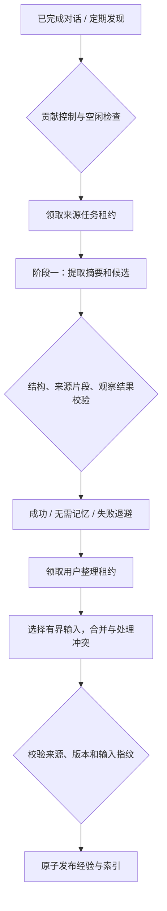

# Agent Memory 生命周期

状态：2026-09-16 当前实现说明。范围为 Interview Copilot 的低权威经验记忆；不替代 CareerProfile、History、CopilotPreference、Artifact 或运行状态，也不修改已迁移的 CareerOS 项目。

## 设计来源与适配

参考 [Codex memory pipeline](https://github.com/openai/codex/blob/main/codex-rs/memories/README.md) 的两阶段提取、整理、渐进读取和遗忘机制，在 Python / SQLAlchemy / Celery 中重新实现。没有引入 Rust runtime，没有复制其文件工作区，也没有授权模型生成可执行脚本。

| Codex 概念 | 本项目实现 |
|---|---|
| Rollout discovery | 已完成且空闲的 ConversationTurn；即时延迟派发 + Beat 定期补扫 |
| Stage-1 raw memory / rollout summary | `memory_extractions` 的候选、摘要、来源摘要哈希与任务状态 |
| Global consolidation | 每用户 `memory_workspaces` 租约；不同用户独立运行 |
| MEMORY.md | `long_term_agent_memories`，含适用条件、来源、版本与低权威经验 |
| memory_summary.md | 版本化检索索引；召回时从有效记录生成当前索引，避免读取过期缓存 |
| Rollout evidence | 候选证据片段、原始 Turn 身份与现有 History |
| Git diff / baseline | 输入指纹 + 原子事务发布 + revision；删除会撤销旧发布租约 |
| Read usage | 读取收据、回答引用、用户有帮助/没帮助反馈分别记录 |
| Forgetting | 未使用保留窗口、来源删除传播、内容清除与不复活标记 |

这是机制迁移，不是 Codex 源码逐行移植。可复用流程作为有适用条件的经验保存，不自动升级成系统指令或可执行 Skill。

## 写入流程

- 只处理 `completed` Turn；会话不能有正在执行的 Turn 或待提交工作。默认空闲等待 600 秒。
- 不再依赖“我更喜欢”等固定词。读取目标轮前最多 12 条消息、目标轮最多 12 条已完成/失败 Tool Call 作为上下文。
- Tool Call 使用实际 `completed` / `failed` 状态；不将运行中、待确认或结果未知的调用当作已验证结果。
- 阶段一候选明确区分用户报告的结果、已验证工具结果、未验证内容。未验证内容不能进入长期整理；引用外部文本本身不等于经历过其中的行为。
- 每条候选必须包含可在允许的来源中精确匹配的证据片段。助手自述不是独立验证。
- 模型自报的 confidence 未经校准，不使用固定分数作真假或准入门槛。整理不能把置信度提高到支持证据之上。
- 工作流经验仍是低权威建议，不能写入身份、权限、职业事实或永久能力判断。
- 无有用内容是 `no_output`，与 `failed` 分开保存。异常只存错误类型，避免把模型服务响应中的敏感内容写入错误列。
- 来源处理结果持久化，成功空结果也不会被反复提取。失败退避和租约到期允许恢复。
- 模型调用期间不占数据库锁。源任务领取由 Turn 行锁串行；整理由用户锁和持久租约串行。所有发布都检查租约 token；来源变化会拒绝过时输出。

## 整理、控制与删除

默认每用户最多选 40 个提取来源，整理输入预算为 16,000 token。按实际引用、明确反馈、时间排序，超预算时移除完整低优先级记录，不能截断证据。

整理输出是一组有界来源的完整投影：可以合并、拆分、修订或省略低价值经验。相反效果的证据聚合必须保留 `mixed`，不能直接以最新文字覆盖旧结论。确定性校验覆盖证据身份、结构、用户边界和置信度上限；具体语义是否合理仍依赖模型与评测。

用户编辑的经验标记为 `manual`，自动整理不能覆盖。账户和会话的“使用”与“贡献”独立；关闭贡献不删除已形成的记忆。部署开关也不能绕过用户贡献选择。

删除记忆或来源时：

1. 清除对应提取摘要与候选，保留无正文的来源处理标记。
2. 清除受影响的整理内容、证据副本与索引，立即退出召回。
3. 撤销用户工作区的发布租约，使已经发往模型的旧任务不能复活内容。
4. 多来源记忆可在下一次整理中依据仍有效的来源重新形成。

删除某条经验会保守抑制其整个来源 Turn，可能同时使该轮支持的其他自动经验失效。这是明确的遗忘边界，避免模型换 semantic key 重建用户要求删除的内容；未来新对话中用户重新提供的独立信息不等同于旧来源复活。

默认 60 天未使用的自动提取来源会清除正文并标记 `forgotten`。保留期间的原始聊天不因记忆遗忘而自动删除，聊天历史有独立的生命周期。来源身份、版本和无正文审计数据也不是全文擦除的替代承诺。

## 读取和效果记录

Context Compiler 先取当前用户最多 100 条有效记忆的简短索引，让内部模型按语义选至多 4 条，再读取正文和证据。读取后重新检查用户、会话、有效状态与版本，防止检索期间删除或修改发生后继续注入旧内容。

- 本轮要求忽略记忆时跳过；无关任务允许返回空结果。
- 召回超时上限 12 秒，失败由会话引擎记录并退出可选记忆环节，不阻断正式任务。
- `recall_count` 表示上下文编译阶段选中并读取过，不保证最终被模型看到或采用（后续上下文预算还可能裁剪）。
- `usage_count` 表示完成的回答引用了提供的记忆来源链接，不代表内容正确或任务成功。
- 收据支持用户标记 helpful / unhelpful；与模型引用独立，并参与后续候选优先级与整理。
- 引用链接指向设置中的对应经验；原始来源可返回原对话。

## 部署与数据迁移

迁移 `0044` 只新增三张流水线表和旧记忆表的五个字段。现有记录标记 `legacy`，仍可读取和管理，不被自动整理静默改写。没有扫描或转换已废弃的 mixed Memory 表。

源代码默认 `AGENT_MEMORY_PRODUCER_ENABLED=False`，保留部署发布门禁。验证后在部署 `.env` 显式设置 `AGENT_MEMORY_PRODUCER_ENABLED=true`；用户仍需在设置中允许已完成对话贡献记忆。生产、召回的选择不会在迁移时自动替用户更改。

启动 API、后台 worker 与 Beat 前执行 `python -m alembic upgrade head`。日常 `scripts/start.ps1` 已包含该步骤。后台模型任务走 `background` 队列，发现任务走 `default`，不会进入用户实时对话的 `turns` 队列。

检查接口：

- `GET /api/v1/personalization/memory-pipeline`
- `GET /api/v1/personalization/memory-receipts`
- `PUT /api/v1/personalization/memory-receipts/{id}/feedback`
- 原有记忆列表、编辑、失效、删除、提升为明确偏好的接口保留。

## 验证与边界

契约与事务测试：`backend/tests/test_services/test_memory_pipeline.py`。
真实 PostgreSQL 并发领取和非空旧数据升级：`backend/tests/test_db/test_memory_pipeline_postgres.py`。
真实内部模型合成场景：`python evaluation/memory_lifecycle_eval.py --live --output data/logs/memory-eval.json`。

真实模型与完整服务链路（临时 SQLite，不使用用户数据）：`python evaluation/memory_lifecycle_eval.py --live --integration-only --output data/logs/memory-integration.json`。

合成评测验证提取、整理、来源匹配和语义选择，不能证明长期实际任务成功率。上线后需要积累经用户评价的样本，再对“关闭记忆 / 旧方式 / 新方式”做真实任务对照。跨会话能力理解聚合仍属于独立的 AbilitySignal 业务能力，不因迁移通用经验流水线而宣称已经实现。

当前边界：90 天发现窗口、每次最多扫描 100 个候选 Turn；长对话仅取有界最近上下文。没有恢复源对话中从未持久化的信息，也不保证找到所有潜在经验。
