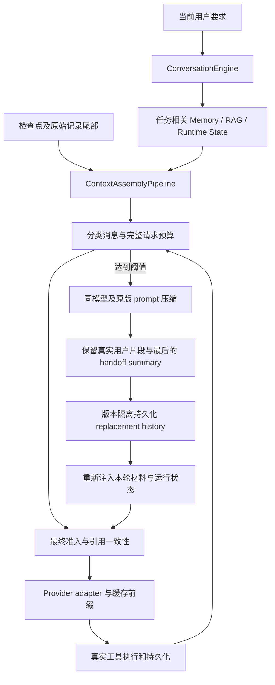

# 上下文管理：从输入到恢复

当前实现以 Codex 公开本地 compaction 为基线，采用持久化 replacement history。详细源码对应、适配差异、验证和边界见 [迁移说明](../implementation/codex-context-source-migration.md)。

Context 是模型投影；History 是原始记录；Memory 是跨任务经验；Runtime State 是真实任务与确认状态。压缩不能改变后面三者，也不能创造用户授权。

自动压缩覆盖 Chat 入模前、Agent 入模前及轮内；手动压缩与状态诊断提供本人会话 API。稳定系统和工具 schemas 位于前缀，动态上下文与运行状态随后追加。缓存只是供应商优化，不替代任何上下文。

旧 summary/cursor 列保留但不驱动生产上下文；首次加载旧会话从完整原始记录重建。失败或过期压缩不发布替换历史。重启后从检查点与持久化尾部恢复。
