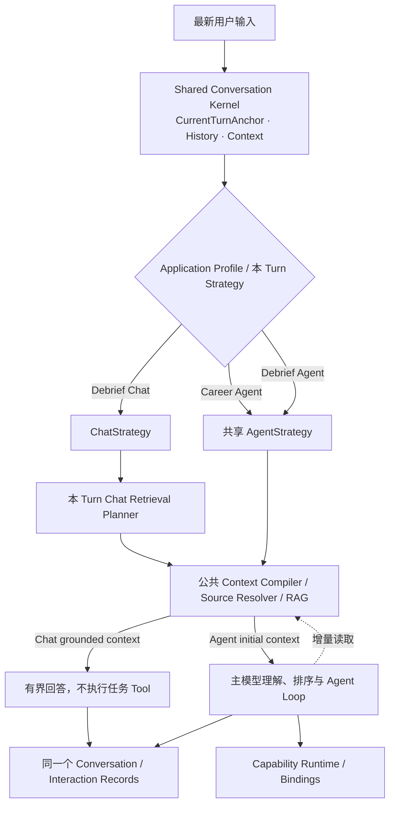
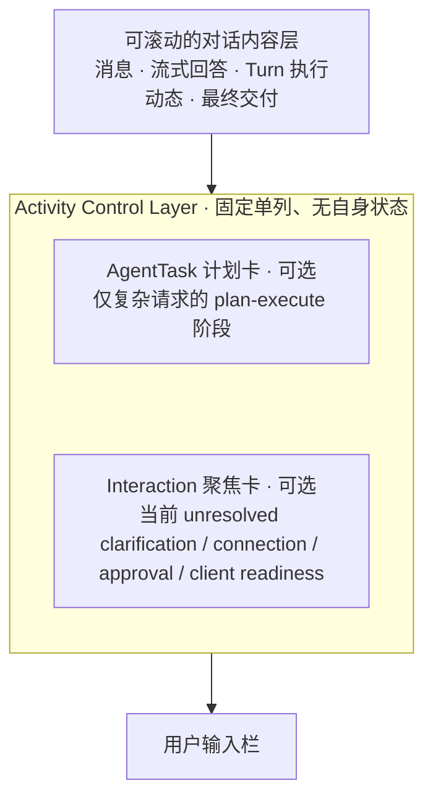
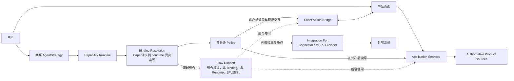

# 全流程求职 Copilot 产品边界与技术架构

> 状态：唯一现行产品与目标架构基线（2026-08-12）
> 适用范围：产品定位、信息架构、领域对象、上下文与 Memory、Agent/Chat/RAG、自动化、Capability、Tool、Skill、权限、Evidence、迁移与实施。
> 实施约束：后续代码、页面和 Stage Spec 必须遵守本文；当前源码、页面数量、API 路由、演示 Tool 和已连接 Provider 都不能反向定义产品边界。

## 0. 文档契约与局部覆盖规则

### 0.1 唯一现行定义

本文是当前唯一具有规范效力的产品与目标架构文档。后续 Stage Spec 只能在本文边界内冻结阶段实现，不能另立、复制或覆盖第二套产品语义。

文档维护遵守以下规则：

1. 用户明确确认的结论，以及用户完整审阅后认可且未提出异议的方案，都属于当前基线。仍有效的约束、理由、例外、交互语义和验收条件必须一起保留，不能只留下最后一句摘要。
2. 新决定只替代与其明确冲突的局部。术语调整或顶层结构变化不能成为删除其他有效细节的理由。
3. 每个概念只在一个主题章节拥有完整定义；其他章节只引用或说明如何消费，不能复制一套略有差异的状态、权限或生命周期。
4. 广义原则与主题规则发生表面歧义时，以负责该对象或流程的主题章节为准；真正冲突仍视为文档缺陷，必须在编码前统一，而不是让实现者自行选择。
5. 新决定影响已有内容时，必须同时修正文档正文、图示、实施路线、开放问题、验收条件和已经存在的 Stage Spec，确保任何位置只能读到一套现行语义。
6. 当前文档不保留已失效方案、旧术语、兼容性叙事或“新旧并存”的说明。历史由版本控制或明确会话归档承担；尚未进入版本控制的内容不得声称已经由 Git 保存。
7. 尚未确认的方案只能进入第 18 节“当前开放问题”，不得由源码便利、模型偏好或常见做法补成产品事实。

### 0.2 不过度设计

清晰架构不等于增加字段、状态、表、服务、Registry 或管线。只有出现独立的不变量、生命周期、权限、失败、恢复或回执语义时才拆分；高度相似的内容必须共享模型、Application Service 或基础设施。

以下内容默认不重复持久化：

- 可以从事实时间线或其他权威源计算的投影；
- 只属于当前执行现场的中间状态；
- 可以按权限和连接状态动态解析的能力可用性；
- 可以从 Interaction Records 重建的索引关系；
- 没有当前真实闭环和消费者的未来字段。

本文中的名称首先表达产品语义与实现不变量，不等于一项概念必须对应一张表、一个类、一个服务或一个目录。具体物理字段只在对应 Stage Spec 中为真实闭环冻结。

### 0.3 Stage Spec 与阶段冻结

本文回答产品最终要成为什么；Stage Spec 回答某一阶段具体实现什么。每个阶段编码前必须形成可验收的 Stage Spec，并至少冻结：

1. 本阶段依赖的本文章节、用户场景、输入、交付结果和明确非目标；
2. 本阶段闭环真正需要的对象字段、状态转换、来源、幂等、撤销、取消、重试、并发、失败和恢复语义；
3. 页面、Agent、Application Service、确定性同步器、Scheduler 和外部 Provider 的责任；
4. Provider connection/scope、Standard/Auto、逐调用 Policy、Evidence 和 receipt/read-back 要求；
5. 现有数据、旧 Tool、旧 Memory 与未完成执行的兼容或迁移方式；
6. 可执行验收测试和需要人工确认的体验点。

Stage Spec 经用户讨论确认后才进入编码。实现发现必须改变产品语义时，应先停止扩大修改，记录偏差，更新本文与受影响 Spec 并重新讨论。每阶段完成后必须汇报实际改动、验证结果和与 Spec 的偏差，确认后再进入下一阶段。

### 0.4 多视图图示规则

同一套架构可以从产品心智、责任与依赖、单 Turn 控制流、Context 装配、Capability 执行、Policy 决策、代码所有权和数据契约等不同视角表达。每张图都必须说明：本图的视角、箭头表示和不表示什么，以及为了聚焦而省略了什么；省略不等于对应边界失效。

只有在对象、scope、生命周期时点和关系语义都相同的前提下，对唯一所有者、事实源、identity/基数、状态转换、权限裁决、执行顺序、依赖方向或完成 Evidence 给出互斥定义，才构成真正冲突。不同排版、控制流与依赖关系使用不同箭头、同一组件被折叠或展开、局部省略，以及一张图把 AgentStrategy 展开为 Loop 而另一张图合并为单个节点，都不构成冲突。

同视角、同范围的新图明确替代旧图时才删除旧图；不同视角下仍正确的图必须并存。共享不变量变化时同步修订所有受影响视图，局部细化只修改所属视图。图前统一使用简短说明：`视角：……；箭头表示……，不表示……；为聚焦本问题，本图省略……，其余边界仍以相关主题章节与第 19 节为准。`

## 1. 产品定位、真实性边界与七个业务域

### 1.1 产品定义

全流程求职 Copilot 以求职者本人为唯一服务对象，以长期、连续演进的求职状态为核心数据，以自然语言 Agent 作为通用协作和任务执行入口。产品目标是尽可能完成用户求职道路上可自动化的工作，而不是把当前页面、后端路由或 Tool 数量包装成产品边界。

产品覆盖长期且可能反复变化的求职过程：认识自身条件和目标方向、发现和研究机会、准备材料、投递与沟通、跟踪招聘流程、准备和复盘面试、比较与协商 Offer，以及跨方向、跨岗位的持续推进。求职不是一条保证成功的线性流程，也不要求用户先建立固定“秋招”“社招”或其他求职周期。

Agent 可以接收所有直接服务于用户本人求职的任务。“可以接收”只承诺给出真实交付：直接回答、调用真实能力完成、生成待确认草稿、形成可验证的内部或外部结果、部分完成并说明剩余步骤，或明确报告缺少 Provider、授权、数据、事实或 Evidence。文本声明不能冒充已经执行的动作。

### 1.2 七个稳定业务域

| 业务域 | Agent 应能理解和推进的范围 | 关键边界 |
|---|---|---|
| **个人定位、目标方向与能力成长** | 整理和核验 CandidateProfile，发现资料缺口，维护 TargetDirection，聚合有来源且可纠正的 AbilitySignal，解释方向适配、能力差距和学习重点 | 模型推断不能升级为个人事实，也不能反向改写来源材料或面试记录 |
| **岗位发现与研究** | 搜索公开或已连接来源，真实读取 URL，研究公司和具体岗位，匹配方向，筛选、去重和比较机会，整理招聘方、内推和人脉线索 | 普通结果默认只汇报；明确保存、跟踪、准备或真实投递后才进入长期岗位状态 |
| **材料与申请准备** | 按用户需要读取、生成、修改、核验、版本化和导出简历、求职信、自我介绍、项目说明、申请问答与准备清单 | 材料编辑不是岗位必经流程，生成或推荐不证明已经对外使用 |
| **投递进程与协同** | 建立和更新 JobOpportunity、ProcessEvent 与 NextAction，理解邮件、官网和日历 Observation，安排提醒、生成沟通，并在真实连接和授权存在时执行投递或外部协调 | 人脉、内推和招聘方沟通是投递渠道，不另设业务域 |
| **面试全流程** | 公司和岗位研究、准备计划、知识补强、问题预测、模拟面试、录音转写、真实面试复盘、问答修订、能力信号和后续行动 | Mock Interview 是独立实时 Flow；真实面试和受限测评不能隐蔽代答 |
| **Offer 分析与协商** | 提取和核验最终条款，进行换算、估值、风险和多 Offer 比较，生成谈判策略与草稿，并按权限执行普通沟通 | 接受、拒绝、签署和确认入职始终由用户本人完成 |
| **全局推进与持续协作** | 跨方向和大量岗位汇总状态、发现阻塞和日程冲突、形成日/周计划、编排跨域复杂请求，并消费用户已创建的持续自动化 Observation | Agent 不为自己建立持续目标；持续工作必须是用户可见、可关闭的 PersistentTask |

七个域是 Product Capability 的业务分组，不是页面、Tool 清单或用户必经流程。邮箱、浏览器、日历、文件系统、Canva、搜索服务、招聘平台 API 和 MCP 是跨域 Integration/Binding；Skill 是跨域 instruction 与编排内容，不是 Provider 或执行能力。

### 1.3 六类行为与真实交付

各业务域可以复用六类行为，而不为每种组合创建专用工具：

1. **理解与推理**：解释、分析、比较、规划和建议，并区分事实、推断和建议。
2. **读取与观察**：读取正式状态、Artifact、History、Long-term Agent Memory 或外部来源，并保留来源、时间、权限和权威类型。
3. **生成与转换**：形成文本、报告、清单、文件或 Artifact 版本；产物不等于已经保存或对外使用。
4. **内部状态变更**：通过 Application Service 改变正式对象，并返回对象引用、变化摘要、来源，以及适用时的撤销或修正路径。
5. **外部执行**：发送、提交、预约或修改外部系统；必须通过 Policy，并以真实 receipt 或 read-back 证明结果。
6. **持续观察与触发**：用户开启后由连接器按 cursor 获取和去重 Observation，需要语义判断或交付时启动有界自动化 Turn，不让 Agent Loop 永久运行。

一次 Turn 可以产生一种或多种交付：

- 回答、解释、分析或报告，没有声称改变状态；
- 已创建或更新的 Artifact，能够返回真实内容、版本或引用；
- 已完成的内部状态变化，能够返回 Application Service 结果、对象引用、变化摘要与来源，并在适用时说明撤销或修正路径；
- 已执行的外部动作，能够返回与 Tool Call 关联的 Provider receipt 或 read-back；
- 已真实启用且用户可查看、暂停或关闭的 PersistentTask，或已安排的 Reminder；
- 部分完成、等待确认或被能力、连接、权限、事实、Evidence 明确阻塞，并说明已完成部分与用户下一步；
- 已由第一方客户端真实接收的语义化界面动作，例如导航、带入已确认输入或进入交互 Flow；客户端确认只证明界面动作成功，不能冒充业务写入、外部执行或用户已经完成后续操作。

这些结果不能互相冒充：回答不等于 Artifact，建议不等于状态变化，邮件草稿不等于发送，材料推荐不等于实际投递，创建自动化不等于未来事件已经发生，AgentTask 阶段文本也不等于真实执行成功。普通分析、比较和研究默认只在当前回答中交付；用户明确要求保存时才创建 Artifact，明确要求记录或更新状态时才调用相应领域命令。

### 1.4 不可跨越的边界

功能范围可以广，但以下边界始终高于完成率：

1. **用户身份**：Agent 不冒充用户作出职业、合同或身份承诺，不代替用户接受或拒绝 Offer、签署协议、确认入职，也不陈述用户未确认的个人事实。
2. **事实真实性**：不得虚构教育、经历、项目、薪资、申请状态、面试结果或外部动作；模型推断必须保持为推断。
3. **当前意图**：所有可选工作都服务于用户当前明确意图。Agent 可以推荐通常正确的做法，但推荐不能自动启动新任务；用户已明确提出范围清楚的请求时，该请求本身就是任务意图，不机械重复询问。
4. **最小授权**：读取、内部写入、外部执行和身份行为遵守统一 Policy。连接存在、选择 Auto 或持续授权都不能覆盖对象自身规则与用户保留决定。
5. **证据可追溯**：私有资料、时效事实、领域变化和外部动作必须按 claim 类型追溯到用户陈述、来源快照、业务对象、真实调用、receipt 或 read-back。
6. **用户最终决策**：职业目标取舍、是否投递、谈判底线、接受或拒绝 Offer 等决定由用户作出；Agent 可以分析、准备与执行用户已经明确决定的普通动作。

真实面试或明确禁止外部协助的测评中，产品不提供隐蔽代答、冒充用户或规避规则的能力；可以做事前准备、允许范围内辅助和事后复盘。产品不是招聘方 ATS，不替企业筛选候选人，也不保证面试、Offer 或薪资结果。与用户本人求职无直接关系的通用个人助理任务不进入产品领域。

## 2. 四个工作空间，以及页面与 Agent 的关系

### 2.1 一级产品心智

当前采用四个一级工作空间和一个“设置与连接”入口：

| 工作空间 | 用户心智 | 聚合内容 |
|---|---|---|
| **Copilot** | 我现在该做什么，或直接把任务交给 Copilot | 统一自然语言入口、当前状态摘要、阻塞、行动与复杂任务进度 |
| **求职进程** | 我有哪些具体岗位，它们分别进展到哪里 | 岗位发现与研究、岗位线、事实时间线、日程节点、Offer 与历史分析 |
| **求职资料** | 我的事实、方向和材料是否准确、清楚、可复用 | CandidateProfile、TargetDirection、Artifact 及知识资料 |
| **面试中心** | 下一场如何准备，过去一场如何改进 | 面试日程、专项准备、模拟面试、真实面试复盘与能力趋势 |

模型、Skill、MCP、邮箱/日历等外部连接、账号、权限与安全属于“设置与连接”，不占一级求职导航；本文不冻结它位于头像菜单还是其他具体 UI 位置。

四个工作空间是产品心智，不是四张固定页面、四条路由、四个后端模块或四个新聚合根。“机会清单”“岗位材料包”“决策”等词只能作为视图或任务心智，不能未经 Stage Spec 自动变成领域对象。一个工作空间可以由组合视图、筛选、抽屉、对象详情和局部 Flow 构成；页面数量、是否常驻输入框、Offer 比较采用页面还是一次性报告，都由交互 Stage Spec 根据真实用户流程决定。

### 2.2 页面与 Agent 的职责

- 页面负责清晰、友好、可见、易比较和易管理的结构化体验，适合总览、批量操作、管线管理、版本校验、来源检查和高频操作。
- Agent 负责理解当前意图、组合跨领域能力、执行任务并汇报真实结果。它贯穿所有工作空间，但不替代页面内容和对象视图。
- 涉及正式业务读取或变更时，页面、Agent、同步器和后台触发必须调用相同 Application Service，并遵守相同业务不变量、权限与 Evidence 规则，不能形成第二套状态机；纯客户端导航和未保存预填不伪装成业务操作。
- Agent 结果不要求对应页面。只需汇报进度或完成情况的任务可以完全在 Conversation 中结束。
- Conversation 中的 Agent 执行呈现只负责让用户理解语义化执行动态、复杂请求的阶段计划、当前待处理交互和真实调用结果；它不能取代岗位、资料、面试、Offer 等领域页面。执行呈现的内容层、固定单列活动控制层和 Tool 渐进披露统一由第 11.6 节定义。
- 用户当前所在页面、路由、页面选中项、DOM、视觉内容和页面缓存都不自动进入 Agent 上下文。用户在本 Turn 主动附加或明确指定的附件、URL 和产品对象引用属于当前输入；已经显式附加到同一 Conversation 的文件及当前 Debrief Project Source 可以在后续 Turn 按最新任务需要重新读取，但不会每轮自动注入，也不能取得任务方向。
- 页面提供的“交给 Copilot”“用此对象继续”等明确入口，可以把带稳定 identity 的 typed object reference 作为用户可感知的本 Turn 输入；服务端仍需按 identity 重新读取权威内容并校验所有权与权限，不能信任客户端复制的业务事实。这是用户主动提供的对象引用，不是页面环境自动进入上下文。未保存草稿只有在用户明确提交时才能进入 Turn，并始终标识为草稿而非正式事实。
- Agent 可以通过有真实 typed handler 的 **Client Action Bridge** 导航到产品视图、带入本 Turn 已确认的数据、预填交互或进入明确的 Flow。Agent 发出产品语义目标，不接触具体路由、DOM、selector、任意 click/type 或万能表单 patch；没有真实 handler 或客户端不可达时必须明确失败。
- 页面导航和临时预填不改变 Domain State，也不证明用户已经查看、接受或保存。正式业务变化仍通过同一 Application Service，外部动作仍经过 Policy 并取得 receipt/read-back，Flow 启动仍以对应 Runtime/Application Service 返回的真实 identity 与状态为准。
- 用户明确要求跳转或启动交互时，Agent 可以直接执行相应语义能力；如果 Agent 只是建议查看某个页面，则返回可选页面动作，不应擅自抢占用户界面。页面跳转不是完成任务的必经步骤，后台 PersistentTask 和没有交互客户端的 Turn 也不能改变用户当前页面。
- Client Action 只交付给发起当前 Turn 的交互客户端实例，不广播给其他标签页。页面存在未保存内容、设备权限或其他本地安全条件时，由客户端原生 guard 让同一 Turn 进入可恢复 waiting，不把未提交表单内容发送给模型；原客户端不可恢复时必须由用户明确接管，不能自动投递到任意新标签页。
- 当前阶段只使用产品设计好的页面、Capability-owned typed handler，以及第 11.6 节固定的 AgentTask 计划卡、Interaction 聚焦卡、语义执行动态与 typed Tool 详情；不建设模型生成组件树、通用 UI schema、任意 HTML/JavaScript、客户端代码执行或其他生成式 UI 协议。

导航改造不能只改菜单名称而保留数据孤岛。在相应领域读模型和交互 Spec 可用前，现有路由可以保持可访问；随后按四个工作空间的聚合心智迁移。

## 3. Product Context Sources 与当前任务所有权

### 3.1 六种来源边界

Product Context Sources 按所有权、权威性、生命周期和读取规则分为六类：

| 来源边界 | 唯一职责 | 明确不承担 |
|---|---|---|
| **Authoritative Domain State** | CandidateProfile、TargetDirection、JobOpportunity、ProcessEvent、NextAction、Interview、Offer、AbilitySignal 等正式业务状态 | 保存原始会话，或让模型摘要改写事实 |
| **Knowledge & Evidence** | Artifact、文件、邮件/网页/日历 Observation、来源快照、RAG 内容和真实 Tool/Provider 结果 | 保存 Agent 的长期交互经验，或让检索结果自动成为当前事实 |
| **Interaction Records** | 用户消息、隐藏自动化输入、Agent 回复、附件引用和完整 Tool Call/Result；回答“当时说过或做过什么” | 判断历史陈述现在仍然真实 |
| **Long-term Agent Memory** | Agent 从过去交互经验中选择、压缩和巩固的长期协作表征 | 复制正式事实、当前任务、文档正文、History、权限或设置 |
| **Personalization & Policy State** | 用户确认的 CopilotPreference，以及各自独立管理的授权、通知和同步设置 | 接受未经确认的模型偏好推断，或依赖隐藏记忆扩大执行权限 |
| **Runtime Recovery State** | Checkpoint、watermark 和必要恢复引用，只用于恢复执行现场 | 充当当前任务、业务事实、长期 Memory 或新 Turn 的续跑指令 |

这是概念所有权，不要求六套数据库、服务或检索管线。Conversation Attachment 是 FileAsset/Knowledge & Evidence 的 Conversation 可见范围，其附加动作和 AttachmentRef 仍属于 Interaction Records；Debrief Project 是 Application Profile 基于 InterviewRecord 建立的可见范围投影，结构化面试事实仍归 Authoritative Domain State，录音、转写和文件仍归 Knowledge & Evidence，各 Conversation 仍归 Interaction Records。scope 不改变任何来源的所有者、权威类型或事实等级，也不产生第七种 Product Context Source。上传资料、邮件、网页、日历、Evidence、原始 History、Preference、权限、系统指令和 Skill 都不属于 Long-term Agent Memory。

CareerState 只是页面和 Context Compiler 按当前任务从正式对象动态装配的用户级视图，不是一张重复保存所有事实的万能表。当前直接以用户及其正式领域对象为根，不建立固定求职周期、万能 CareerWorkspace 或通用 Project 管理。第 7 节定义的 Debrief Project 只是 InterviewRecord 已经具有的领域范围，不是通用求职容器；只有未来出现真实、稳定且用户可理解、又不能由 TargetDirection、JobOpportunity、Interview、Conversation 或 PersistentTask 表达的多计划隔离需求时，才重新讨论通用 Project。

### 3.2 Active Working Context 与 CurrentTurnAnchor

Shared Conversation Kernel 中的 Active Working Context 只包含当前 Turn 的权威输入、当前 Strategy 正在处理的任务理解、注意中的少量相关上下文、正在执行的工具链和必要中间状态。它对应当前活动加工状态；Checkpoint 只是可替换恢复快照，不是工作记忆本身。

每个 Turn 通过持久化的 conversation identity、turn identity 和 input identity 建立 CurrentTurnAnchor：

- 普通用户 Turn 只有最新用户输入拥有执行方向；附件、用户明确提供的对象引用和其他结构化数据只是受该输入约束的上下文，不能与用户原文争夺任务所有权。
- 自动化 Turn 由用户已经确认的 PersistentTask 当前定义与本次 trigger/Observation 共同限定，不伪装成用户手工消息。
- 摘要、Long-term Memory、Checkpoint 和旧 AgentTask 都不能替换当前锚点。

新的用户 Turn 始终重新解析最新输入。旧 AgentTask 只有在新输入明确继续时才重新激活；明确取消、替换或改变目标时放弃，无关新请求中不注入旧任务。上一轮普通处理不形成跨 Turn 待恢复任务。只有继续与否仍有可能造成真实副作用、错误写入或明显错误交付且无法可靠判断时才询问。

### 3.3 Interaction Records 与读取过程

Interaction Records 是精确交互轨迹，对“当时说过、调用过或返回过什么”具有权威性，对其中陈述现在是否仍真实没有权威性。History Search 精确回读用户原话、历史承诺、Tool 输入、Tool 结果和错误；需要准确内容时回到原始记录，不从摘要重建。

Turn 执行动态、对话内 Tool 展开和深层审计只是同一 Interaction Record、Tool Call/Result 与 Evidence 的不同读取投影；展示深度、聚合和折叠不改变 call identity、来源权威性、Evidence 强度或原始记录的保留边界。

Shared Conversation Kernel 只有三种语义不同的读取过程：

- **Fact & Knowledge Retrieval**：读取当前 Domain State、Knowledge 与 Evidence；长内容可以使用公共 RAG。
- **History Search**：精确查找 Interaction Records。
- **Memory Recall**：从 Long-term Agent Memory 选择相关经验表征。

三者可以共享索引、FTS、向量检索、排序和 Token 预算基础设施，但输出必须保留来源类型、时间、权限和权威标签。Recall 是过程，不是新的持久化对象；FTS、向量索引和普通 Conversation Digest 只是可删除、可重建的投影。

History 保留、Long-term Memory 的形成与召回、CopilotPreference、业务数据、外部同步和执行授权分别管理。删除某类协作记忆、会话记录或 Preference 不得级联删除正式业务状态；具体保留与删除交互由相应 Stage Spec 冻结。

## 4. CandidateProfile、TargetDirection、AbilitySignal 与 Artifact

### 4.1 对象职责

| 对象 | 唯一职责 | 不承担的职责 |
|---|---|---|
| **CandidateProfile** | 用户可见、可修改且有来源的个人事实 | 保存目标偏好、模型能力结论或简历正文 |
| **TargetDirection** | 用户可见、可编辑的求职目标、偏好和约束 | 充当固定求职周期，或被一次搜索静默改写 |
| **AbilitySignal** | 有来源、可解释、可纠正的能力信号 | 成为人格定论，或反向覆盖事实和原始记录 |
| **Artifact 及其版本** | 用户材料、知识文档和 Agent 交付内容与真实版本历史 | 充当个人事实，或证明内容已经对外使用 |

这些对象可以共享存储或版本基础设施，但业务语义不能合并。ArtifactVersion 表示 Artifact 生命周期中的可追溯版本语义，不要求提前拆成独立聚合根或表。

### 4.2 CandidateProfile

CandidateProfile 保存教育、经历、项目、技能、成果和联系方式等用户事实，并保留来源与必要有效时间。教育、经历和项目允许历史区间；联系方式和当前地点表达当前有效值。具体字段由 CandidateProfile Stage Spec 冻结。

个人事实的权威顺序为：

1. 用户当前明确纠正；
2. 用户已经确认的结构化 Profile；
3. 简历、证书和其他有来源文档提供的候选或冲突依据；
4. Long-term Agent Memory 与模型推断只可辅助发现，不是事实源。

用户通过简历管理、求职资料入口，或在 Conversation 中明确要求“保存/设为我的简历”而导入第一份简历时，系统只生成“来源于该简历”的待确认 Profile 候选，不能静默覆盖档案，因为简历可能已经过时、为特定目的裁剪，或与其他版本和来源冲突。交互应允许批量接受无冲突候选，只对真正冲突的内容突出当前值、候选值与来源并逐项确认。仅在聊天输入框附加一份简历只建立当前 Conversation 的 AttachmentRef，不保存为简历、不进入全局资料，也不生成 Profile 候选；未确认候选只可用于分析其来源简历，不得作为全局事实注入其他任务。

用户在对话中明确给出全新且无冲突的个人事实时，Agent 可以通过 CandidateProfile Application Service 写入并简短通知。用户明确说“之前写错了，应该是……”时，该纠正本身就是确认。模型仅检测到事实可能变化、但用户没有表达修改意图时，必须展示当前值、候选值和来源并询问；文档冲突与模型推断也只能待确认。

Profile 更新不自动改写简历，也不自动创建材料任务；简历措辞变化同样不能反向修改 Profile。已确认事实按当前任务精确选择，长文档通过公共 RAG 读取，未确认冲突不作为事实注入。

### 4.3 TargetDirection

用户可以先给出一个或多个大致目标方向，Agent 根据后续对话和已经保存的求职行为帮助补全。Agent 推断出的新方向或实质变化只能先作为建议；方向不能只隐藏在模型上下文中，必须在求职资料中可见、可编辑，并可在 Copilot 显示摘要和待确认建议。

同一优先级可以存在多个方向，方向的优先级与 active、exploring、paused、archived 等生命周期语义相互独立。方向可以表达职位关键词、职级、地点、工作方式、薪资、行业、技术方向和排除条件；这些是产品语义，不是已冻结的必填字段。

一个 JobOpportunity 可以匹配多个方向。关联必须能够解释来源、匹配理由以及是否需要用户确认，但物理关系形态留给 Stage Spec。一次临时搜索条件不会修改长期方向；用户当前明确请求始终高于长期偏好。

### 4.4 AbilitySignal

AbilitySignal 可以来自具有充分上下文的模拟面试、真实面试、复盘、问答表现和漏斗分析，并用于能力成长视图。每个信号必须保留可解释来源并允许用户纠正。

AbilitySignal 不能把一次结果固化为人格或总体能力定论，也不能反向改写 CandidateProfile、简历、面试记录、JobOpportunity、ProcessEvent 或其他来源事实。岗位漏斗同时受到匹配、市场、渠道、时间窗口和材料表达影响，只能形成诊断假设，不能直接声明用户能力不足。

### 4.5 Artifact、材料与实际使用

Artifact 及其版本复用一套版本化内容基础设施，可以承载简历、求职信、自我介绍、项目说明、知识资料、准备材料和 Agent 交付报告。共享基础设施不等于业务语义相同：个人档案是事实，求职材料是对事实的选择与表达，知识资料是检索来源，Agent 报告是一次任务产出。

简历通常是长期稳定、跨同一方向多个岗位复用的通用材料。编辑和岗位定制是低频、按需能力，不是创建岗位、读取 JD 或发现匹配差异后的自动步骤。目标方向发生变化、岗位与当前材料明显不匹配、岗位存在特殊材料要求时，Agent 可以解释差异并建议调整；只有用户明确要求或确认建议后才生成或修改版本。

材料与岗位只保留两层产品语义：

- **related**：材料曾为该岗位准备、生成或推荐，但不证明实际使用；
- **submitted**：该具体版本确实用于本次投递。

submitted 只能由用户明确确认，或由能证明具体文件/版本的真实外部 receipt/read-back 建立。生成、推荐、选择、下载和导出都不能证明实际使用；只证明“投递成功”但没有材料信息的邮件或网页回执，也不能推断版本。

Conversation Attachment、Debrief Project Source 与正式 Artifact 是不同逻辑 scope，可以在显式晋升时复用同一底层 FileAsset/blob，但必须建立新的来源引用、版本与生命周期，不能通过修改原 AttachmentRef 暗中扩大可见范围。任何 scope 晋升都不自动改变 CandidateProfile，也不证明材料已经 submitted。

一个已证明 submitted 的历史版本引用必须冻结；后续编辑创建新版本，CandidateProfile 的后续修正也不能倒改过去实际使用的材料。系统不为了补齐内部关系字段机械打断用户，只有材料事实缺失或冲突会实质影响当前交付时才发起最小确认。

分析材料版本与投递效果至少需要同一岗位线的 JD 来源快照、确证的 submitted 版本、投递渠道和后续 ProcessEvent/outcome。关键证据缺失时只能报告数据缺口或相关假设；即使证据齐全，也必须说明岗位匹配、市场、渠道和时机等混杂因素，不能包装成因果证明。

## 5. JobOpportunity、ProcessEvent 与漏斗

### 5.1 一条具体岗位的招聘流程

JobOpportunity 表示用户针对一个具体岗位和招聘批次推进的一条招聘流程。它不是公司记录、普通搜索结果，也不是一条保证走到 Offer 的成功路径。

以下任一条件成立时才进入长期岗位状态：

- 用户确认已经投递；
- 已授权同步取得明确投递成功 Evidence；
- 用户决定为某个具体岗位开始针对性准备；
- 用户明确要求保存或跟踪尚未投递岗位。

仅浏览、搜索、匹配、比较、研究岗位或查看 URL 时默认只汇报。用户要求保存一份研究报告时保存 Artifact，也不等于建立岗位线。岗位存在也不意味着必须生成岗位专属简历、求职信或准备计划，这些始终由用户意图决定。

同一公司中的不同具体岗位分别建线。标题相似但地点、团队、招聘编号或招聘批次不同的岗位通常也分别建线。同一具体流程从邮件、官网、招聘平台和日历取得的观察归入同一条线，不因来源不同重复创建。

同一具体岗位的流程仍在进行时不创建第二条申请线。流程终结后，只有明确的新投递、独立申请编号或用户确认“这是重新申请”，才创建新的 JobOpportunity。当前不拆独立 Application 对象，也不增加显式前后继字段；共同岗位标识和时间足以支持当前历史查询，真实跨申请关系需求出现后再扩展。

### 5.2 粗粒度阶段与当前步骤

岗位只保留四个稳定 phase：

| phase | 用户显示 | 进入条件 |
|---|---|---|
| pending_application | 待投递 | 用户开始针对具体岗位准备，或明确跟踪尚未投递岗位 |
| applied | 已投递 | 用户确认、真实回执或高置信度投递成功事件 |
| in_process | 招聘流程中 | 已确认进入测评、招聘方沟通、作业、面试、背调等后续环节 |
| offer | Offer | 收到来源明确或用户确认的 Offer |

普通投递回执、“简历已收到”或泛化的“正在审核”仍属于 applied。筛选、电话沟通、测评、笔试、作业、面试轮次和背调没有稳定顺序，也不是每家公司共有，因此作为 ProcessEvent 表达，不增加一级 phase 或全局轮次枚举。流程可以跳过环节、长期停滞、在事实纠正后回退，并在任何阶段结束。

页面使用“粗粒度 phase + 当前步骤”的双层表达。current_step 从最新有效 ProcessEvent 投影为用户可理解的事实摘要，例如“在线测评待完成”“已约一面”“已完成终面，等待结果”。它不是第二套状态机，不能由模型脱离事实自由编造。

岗位列表至少应让用户看见 phase、current_step 和最近更新时间；是否预览关联 NextAction 属于交互 Stage Spec。岗位详情展开完整事实时间线、来源和 Evidence。阶段开始时间、结束步骤和等待时长优先从 ProcessEvent 计算；是否为查询性能持久化投影由 Stage Spec 决定，但事件始终是可追溯来源。

pending_application 不能无限累积。长时间没有投递 Evidence 或准备进展时，系统以简单提醒让用户选择继续准备、确认已经投递或删除岗位；不增加“关注中”“考虑中”等临界 phase。提醒阈值与删除采用软删除、可恢复归档还是其他方式仍是开放问题。

### 5.3 ProcessEvent：只追加已确认事实

ProcessEvent 是岗位流程的追加式事实时间线，回答“已经发生了什么”。它可以表达投递确认、测评邀请、面试安排或完成、招聘方拒绝、岗位关闭、用户退出、Offer 到达和用户纠错等事实。

每个事件必须能够追溯：

- 事件实际发生时间与系统发现时间；
- 用户陈述、邮件、网页、日历、平台或真实 Tool 调用等来源；
- 对应 Evidence；
- 必要的原始描述；
- 如果是纠错，所修正或撤销的既有事件关系。

以上是语义不变量，不要求立即冻结统一字段名；不同 Provider 不需要强行提供相同轮次、编号或描述结构。

任何会改变当前投影的 ProcessEvent，都必须能通过事件时间线与修正/撤销关系审计性地重建事件发生前后的投影。该要求不意味着必须保存重复的 old_state/new_state 字段；优先通过事件重放计算，是否为了查询性能持久化投影由 Stage Spec 决定。

External Observation 回答“外部来源出现了什么”，用户陈述是 user assertion，二者不是同一种来源。ProcessEvent 只接收已经确认的事实。模糊邮件、网页变化、语义相似但无法唯一归属的观察和模型推断，在确认前停留为 Observation 或待确认候选，完全不进入事实时间线。

用户已经开启相应同步后，高置信度、唯一匹配且位于授权范围内的事实可以自动追加，但必须即时通知、保留原始 Evidence，并提供可撤销或修正路径。错误识别通过追加修正或撤销事件恢复投影，不覆盖或删除原始历史。JobOpportunity 上的 phase、current_step、outcome 和注意信号只是当前投影，不能反向改写事件历史。

### 5.4 Outcome、封存与长期无回复

outcome 与 phase 分离，只保存五种明确终局：

- rejected：招聘方明确未通过；
- withdrawn：用户明确退出；
- posting_closed：来源明确表明该用户的申请流程也已经终止；
- declined_offer：用户拒绝当前岗位的 Offer；
- accepted：用户接受当前岗位的 Offer。

没有终局 outcome 即表示流程仍未结束，不增加重复的 active 值。公开职位页面下线不能自行推断用户被拒绝，也不能仅凭无回复设置 posting_closed。

长期无回复只形成“无进展”注意信号，用于排序、汇总和提醒，永远不自动成为失败事件或终局。普通无回复不为大量岗位机械创建 NextAction；需要跟进时可以形成聚合建议，由用户决定是否计划或执行。注意信号的具体分类留给 Stage Spec，不提前冻结状态大全。

出现终局后，岗位线退出主动集合并封存为只读业务历史：

- 不再接收自动业务更新；
- 不生成新的 NextAction、Reminder 或常规 Agent 建议；
- 不进入日常 Career Context；
- 保留 JobOpportunity、ProcessEvent、Evidence、实际材料使用引用和相关 Interview/复盘；
- 仅在用户查看历史、明确纠错，或进行查询、漏斗和能力分析时读取。

业务历史不因创建新岗位线而改写或合并。产品级数据删除由独立数据治理规则处理，不能通过普通流程更新隐式清除历史。

终局后到达的普通消息不能继续追加到封存线。晚到或与终局矛盾的推进消息进入待确认，不能自动恢复旧线或创建新线。用户确认原终局识别错误时，通过追加修正/撤销 ProcessEvent 恢复旧线；用户确认是新投递时创建新线。

### 5.5 岗位身份线索、匹配与去重

岗位身份线索允许随 Evidence 逐步补充，不要求创建时一次填齐。产品需要能够保存或关联以下语义，但首阶段字段由真实 Provider 能力决定：

- 公司原始名称及可选规范化关联；
- 岗位原始标题；规范化标题只用于搜索和候选匹配；
- 地点、团队和带观察时间的 JD 快照；
- 来源 URL、平台和 requisition/job ID；
- 外部 application ID、邮件线程或可信平台记录 ID；
- 投递时间、使用账号和 Evidence。

自动关联按以下证据顺序判断：

1. 完全一致的外部申请编号、招聘岗位 ID 或可信平台记录 ID；
2. 完全一致的规范化岗位 URL，或可验证属于同一申请的邮件线程；
3. 公司、岗位、地点、近期投递时间、账号等多项线索组合后只剩唯一候选；
4. 只有公司名、模糊标题或模型语义相似时，只能提出候选，必须确认。

Career Profile 下的共享 AgentStrategy 负责理解岗位别名、邮件正文和登录态官网页面并比较候选；Application Service 只守所有权、唯一性、幂等、合法状态、Evidence 和可撤销等确定性不变量。无需为抽取、匹配和置信度各建一套职责重叠的微型服务。

匹配结果遵循以下分支：

- 明确投递成功 Evidence 含唯一岗位/申请标识且不存在候选：创建 applied JobOpportunity 并通知；描述不完整时标明待补全；
- 与一个现有岗位存在唯一强匹配：向原岗位追加事件，不重复创建；
- pending_application 岗位收到明确投递成功 Evidence：推进原对象为 applied，不另建岗位；
- 存在两个或更多合理候选：让用户选择已有岗位，或明确选择创建新岗位；确认前不进入 ProcessEvent；
- 只有招聘宣传、推荐、营销内容或普通搜索结果：不创建 JobOpportunity；
- 用户只提供 URL 请求分析：默认只汇报，明确加入待投递或确认投递后才持久化。

系统可以提示疑似重复，但不能仅靠模型相似度自动合并。用户确认合并后，双方外部标识、Evidence 和 ProcessEvent 都必须保留，并通过可撤销关系保持追溯；误合并必须可恢复。同一公司不同岗位不能因公司相同而合并。

### 5.6 岗位 URL 与漏斗分析

公开岗位 URL 必须通过真实网页读取形成带原始 URL、观察时间和来源的 JD 快照。默认分析至少覆盖：

- 公司和具体岗位；
- 核心职责与要求；
- 与 CandidateProfile、TargetDirection 的匹配和缺口；
- 信息缺失、异常条款或其他风险；
- 是否需要材料调整及理由；
- 用户下一步可以采取的行动。

分析默认只汇报。用户自己已经在官网投递时，可以先按明确 user assertion 记录；浏览器成功页、确认邮件或平台回执提供更强的 claim-specific Evidence。

登录、验证码、地区限制、动态渲染或站点反自动化导致无法读取完整页面时，Agent 必须说明读到了什么、缺少什么以及可用降级方式，不能用标题、搜索摘要或模型常识冒充完整 JD。产品不以不稳定的服务端通用爬虫宣称支持所有招聘网站。

漏斗可以按 TargetDirection、实际 submitted 材料版本、投递渠道和时间分析阶段转化率、等待时间与结束分布。只有保存了相应 JD 快照、材料引用、渠道、事件和结果，才能解释具体变量。分析必须展示样本与 Evidence 覆盖，并说明岗位匹配、市场、渠道、时机和材料表达等混杂因素；漏斗结果只是诊断信号，不能直接归因为用户能力。

## 6. NextAction 与 Reminder

### 6.1 顶层行动语义

NextAction 与 ProcessEvent 同层，是用户级求职状态对象，回答“接下来值得决定或完成什么”。它高于运行时 AgentTask，不是 Agent 内部阶段。它可以独立存在，也可以关联 JobOpportunity、Interview、Offer、Artifact 或用户全局状态；关联不表示被这些对象拥有。

产品不拆 SuggestedAction、Todo 和 Reminder 等多个相似目标对象。NextAction 只采用四个状态：

- suggested：基于已确认事实提出的建议；默认只展示，不代表用户同意，不主动通知，也不自动执行；
- planned：用户直接提出、接受建议，或已有明确提醒设置允许安排通知；
- done：行动已完成，并由用户确认、正式状态变化或相应真实结果支持；
- closed：行动不再需要；可以解释为用户忽略、被新事件取代、前提失效或岗位终局，但不扩张为更多结束状态。

NextAction 不需要 in_progress。Agent 正在执行复杂工作时由 AgentTask 表达 plan-execute 的计划阶段与推进位置；Turn 持有 waiting、blocked、failed 或 cancelled，只有需要用户输入或决定的 waiting 另外具有 durable pending interaction；用户行动只需建议、计划、完成或关闭。

只有明确日期/截止、用户承诺，或跨会话仍有明确决策价值的建议才创建 NextAction。Agent 当场完成回答、分析或小型生成时不创建；只在当前回答中有价值的建议也不持久化。

NextAction 必须保持轻量，不能演变为通用项目管理器。产品不要求用户维护负责人、标签、子任务、复杂重复规则或人工优先级；紧迫度、逾期、重复、冲突和展示顺序优先由时间、来源和关联事实计算。只有求职行动出现独立且真实的新不变量时，才讨论增加结构。

### 6.2 时间、聚合与冲突

时间语义只保留三类：

- fixed：已经确认的起止时间，例如面试或电话沟通；
- deadline：最晚完成时间，例如测评、作业或 Offer 回复期限；
- flexible：需要处理但没有硬时间，例如整理材料或考虑跟进。

行动必须具有用户可理解、可执行的内容，能够关联必要对象，并保留原始时间文本与来源时区。系统还必须能区分行动来自用户请求、ProcessEvent、Agent 建议还是用户已经确认的持续策略，使 suggested/planned 的形成、通知资格和后续审计都可解释；这是来源语义不变量，不要求现在冻结成枚举字段。关闭原因、来源事件、完成 Evidence 和其他物理字段形态由 NextAction Stage Spec 冻结，本文只要求状态变化能够解释且可追溯。

用户可以同时推进大量岗位，同一天也可能有多个面试、测评和截止事项，因此不存在唯一全局或岗位级“首要行动”。顶层读模型按以下决策价值聚合：

- 固定时间重叠，或固定日程使临近 deadline 明显无法完成的冲突；
- 今天必须参加、到期或已经安排的行动；
- 即将到期的固定日程和截止事项；
- 已 planned 但尚未排期的行动；
- 仍为 suggested、尚未成为用户承诺的建议。

系统可以确定性检测时间重叠、临近截止、跨类型可行性冲突和重复提醒。Agent 结合路程、准备时间、岗位方向和用户约束解释冲突并提出方案，但不能自行取消、改期、放弃测评或代表用户发送沟通。具体由独立页面、Copilot 摘要还是组合视图承载，留给交互 Stage Spec。

### 6.3 事件驱动转换与去重

- 用户明确说“明天下午提醒我完成测评”时直接创建 planned，不重复确认；
- 已确认具体时间的面试可以形成 planned + fixed，通知遵守用户设置；
- 需要用户选择面试时间时，先形成“选择并回复时间”的 suggested；
- 测评邀请事实进入 ProcessEvent，完成测评通常先形成 suggested + deadline，除非用户已经明确要求计划或提醒；
- 模糊来源或时间在确认前不进入 ProcessEvent，也不创建已计划行动；
- 新 Evidence 证明行动完成时转为 done；
- 新事实使行动失效、被取代或岗位终局时转为 closed，不删除历史；
- 普通投递回执只更新事实，一般无回复只形成注意信号，不机械创建大量待办；
- 邮件、日历和官网描述同一事项时，按来源 identity 与 Evidence 去重。

“检查多个长期无回复岗位”究竟使用一个批量行动，还是保持独立行动并由读模型聚合，留给批量交互 Stage Spec；当前不预建多对多关系。

### 6.4 与 current_step、AgentTask 和 Reminder 的关系

current_step 是从已确认 ProcessEvent 投影的当前事实摘要，不需要用户接受，也没有 suggested/planned 生命周期。NextAction 是未来可以接受、安排、完成或关闭的行动。两者文字可能相近，但事实语义和生命周期不同。

NextAction 与 AgentTask 不互为前置条件：

- 用户当场交付的复杂请求可以创建 AgentTask 而没有 NextAction；
- 用户可以手动完成 NextAction 而没有 AgentTask；
- 用户把 NextAction 交给 Agent 时，简单执行只形成 Turn、Tool Call、Application Service 结果或 receipt/read-back，不为此创建 AgentTask；
- 只有当前执行本身复杂、多阶段时，AgentTask 才引用相关 NextAction；
- AgentTask 自述完成不能证明 NextAction 已完成，仍需 claim-specific 结果或用户确认；
- NextAction 不拥有 AgentTask，当前也不预建 execution_records、attempt 集合或 attempt 字段；历史关系通过 Turn/AgentTask 引用和 Interaction Records 查询。

Reminder 只是 planned NextAction 的通知安排，不是独立业务目标。全局通知渠道和安静时段属于设置。只有需要持续读取来源、维护 cursor 或调用 Agent 判断的工作才创建 PersistentTask；产品不再建立 ScheduledTask、MonitorTask 或 NotificationTask 等第二套持续生命周期。

## 7. Interview 与 Offer

### 7.1 Interview、Debrief 与 Mock

真实 Interview 通常关联具体 JobOpportunity，并承载面试日程、准备内容、来源明确的事实、录音/转写、问答和复盘结果。Mock Interview 可以围绕具体岗位练习，也可以作为不关联岗位的通用训练。准备材料与复盘报告属于 Artifact；能力结论通过 AbilitySignal 形成，不能反向改写原始转写、问答或岗位事实。

一次真实面试复盘以其 InterviewRecord 作为天然的 Debrief Project 范围，可以包含多条彼此独立的 Conversation。该 InterviewRecord 的录音、转写、当时的简历与 JD、问答、评分、分析及明确加入本次复盘的其他来源对这些 Conversation 共同可读；在某条 Conversation 输入框直接附加的文件仍只属于该 Conversation，不自动提升为 Debrief Project Source。每条复盘 Conversation 都使用 Debrief Application Profile，并允许 ChatStrategy 与共享 AgentStrategy 按 Turn 无缝混合。

Debrief Project 是 InterviewRecord 的既有领域语义，不增加通用 Project 聚合根、通用项目页面或另一套生命周期。用户若要让聊天附件供同一复盘的其他 Conversation 使用，必须明确执行“添加到本次复盘资料”；该操作只扩大到当前 InterviewRecord，不自动保存为用户全局资料。Mock Interview 是独立的实时、逐轮、强流程约束 Flow，不进入普通 Conversation 的 Strategy Router 或通用 Agent Loop；它可以复用模型、语音、存储、Artifact 和 Evidence 等底层服务。

Career Agent 可以根据用户本 Turn 明确提供的简历、JD、面试类型和风格等输入调用真实 Mock Capability。Flow Handoff 的顺序固定为：解析并校验明确来源；Application Service 校验配置但不虚报已经开始；Client Action Bridge 把 typed 配置带入对应体验并检查麦克风、浏览器权限和其他本地 readiness；需要用户现场操作时，由 Turn 在原 Tool Call/Capability 边界进入 waiting，并保留同一 call identity 作为恢复关联；就绪后由真实 Mock Runtime 入口 create/start 并返回 session identity 与运行状态；客户端再依据该 identity 进入实时界面。预填 acknowledgement、设备 readiness、Runtime start 结果和进入实时界面的 acknowledgement 分别记录，只有 Runtime 返回的真实 identity/status 能证明面试已经启动。

Agent Turn 在真实 Runtime 成功交接或明确失败后结束，不把后续实时逐轮面试包进通用 Agent Tool Loop。进入实时流程后由 Mock Interview Flow 持有整场交互；仅导航、预填或设备就绪都不能声称面试已经启动。

真实面试或明确禁止外部协助的测评中，产品不隐蔽代答或冒充用户。面试准备、合法辅助、录音转写、事后复盘、问答修订和能力成长仍在产品范围内。

Interview、InterviewRecord、逐题问答、录音和复盘 Artifact 的最小物理结构，以及模拟与真实面试之间需要哪些共享关联，由 Interview Stage Spec 冻结。

### 7.2 唯一当前 Offer

Offer 是 JobOpportunity 下的正式业务事实，不是 Agent 报告或聊天摘要。每条岗位线最多维护一个当前最终 Offer，不建立用户需要管理的 OfferVersion 集合。

谈判邮件、草稿、初始文件和先前条款来源作为 Evidence 或 Artifact 保留。正式来源或用户确认最终条款变化时，更新唯一当前 Offer，并保留来源和操作审计；不能用分析结果或无来源摘要覆盖条款事实。新来源到达但无法判断它是在补充现有条款还是替代最终条款时，必须先展示差异并等待用户确认，不能直接覆盖当前 Offer；这项保护不因不建立 OfferVersion 集合而省略。JobOpportunity 的 offer phase 只表示流程进入 Offer 阶段，Offer 保存当前最终条款，用户接受或拒绝后由 ProcessEvent 设置终局 outcome。

### 7.3 条款事实、分析与比较

Offer 只保存来源明确或用户确认的条款事实，例如职位、地点、用工类型、基本薪资、奖金、股权、福利、试用期、入职日期、回复截止和附加条件。不同公司条款差异很大，应采用少量常用结构与可扩展条款，不建立几十个必填字段。

原始币种、计薪周期、税前/税后口径和原文必须保留。口头承诺可以按用户确认保存为非正式条款或待书面确认事项，不能冒充书面 Offer。模型提取出的薪资、币种、股权、期限等有歧义时必须待确认；用户明确输入并确认的条款可以成为事实并标记用户来源。

年化、汇率、税后估算、股权估值、评分、风险和推荐结论都是带假设的分析结果，与原始条款严格分离，不能反写为 Offer 事实。使用汇率、行情、税务或其他外部数据时，分析必须保留来源、观察时点和必要 Evidence，并明确币种、税制与估值方法等假设；来源或时点变化时重新计算。

多 Offer 比较是按需能力，不是收到 Offer 后自动执行的流程。Agent 只基于已确认条款、CandidateProfile、TargetDirection 和用户当前约束生成可解释报告，并展示缺失信息、未确认条款、偏好和换算假设。当前不增加 Decision 对象；用户要求保存时生成版本化分析 Artifact。

### 7.4 截止、协商与用户保留决定

明确回复截止可以产生 suggested + deadline NextAction。谈判分析、策略、话术和草稿按用户意图执行。代表用户发送普通谈判沟通必须通过真实 Binding 和参数级 Policy，成功后返回 receipt/read-back。

接受 Offer、拒绝 Offer、签署协议和确认入职始终由用户明确执行，不能被模型推荐、Auto 或持续授权替代。接受或拒绝只终结当前岗位线，不自动终结其他岗位。

## 8. Long-term Agent Memory、CopilotPreference 与迁移依据

### 8.1 严格 Memory 边界

严格意义上的持久 Memory 只有 Long-term Agent Memory。它是过去交互经验在 Agent 内部形成、以后可能影响协作的选择性表征，不是“所有以后还能访问的信息”，也不是 History、事实库或文档全文副本。

当前只需要两种产品语义，不因此预设两张表：

- **情景式交互记忆**：保留特定会话、任务和反馈情境，并指向源 conversation/turn；
- **概括式协作记忆**：从重复经验或明确反馈中形成稳定协作认识。

两者必须选择性、非权威、有来源、可修订、可删除和可遗忘。明确排除：

- 当前任务、临时计划、AgentTask 阶段和未完成调用；
- CandidateProfile、TargetDirection、JobOpportunity、ProcessEvent、NextAction、Offer、AbilitySignal 等正式事实；
- 文件、简历、邮件、网页、知识文档和报告正文；
- 权限、通知、同步设置和 CopilotPreference；
- Runtime Instructions、系统策略、Stage Spec、Skill 和 Tool 定义；
- 用户未接受的身份、能力或偏好推断。

### 8.2 生命周期与召回安全

Long-term Agent Memory 遵循一个生命周期：

1. 从已完成或稳定的交互片段形成候选；
2. 去重、概括、判断未来价值并关联源 turn；
3. 按当前任务需要召回，携带来源与形成时间，并标明它是过去经验而非当前事实；
4. 涉及精确措辞、历史承诺或 Tool 轨迹时回读 History；涉及现实状态时回到 Domain State 和 Evidence；
5. 新反馈冲突时修订或失效 Memory，不修改原始 History；无法回源核验时标记未验证，不作为确定事实；
6. 在来源删除、内容陈旧、长期无价值、长期未命中或已被正式对象/设置取代时降权、失效或删除；不级联删除 Evidence 或业务历史。

用户要求忽略或关闭 Long-term Memory 召回时，本 Turn 必须像没有这些记忆一样执行，不能引用、暗示或让旧 Memory 隐性影响结果。允许读取既有 History/Memory 与允许后台形成新 Memory 是两个独立控制问题，具体开关仍待 Memory Stage Spec 确认。

用户应能在隐私与设置中理解 Long-term Memory 保存了什么、来自哪里、何时形成，分别控制召回与后台形成，并执行修订、失效或删除；这些控制不与 CandidateProfile、业务历史、外部同步或执行授权共用一个总开关。

### 8.3 CopilotPreference 与“记住”

CopilotPreference 是用户确认后的 Personalization State，不是 Memory 本体。它只调整输出语言、回答详略、先结论后明细、Agent 主动程度等协作体验。Long-term Memory 可以形成带来源的偏好候选，但只有用户直接设置或明确确认后才能写入 Preference。

用户说“记住”表达自然语言意图，不指定存储类型，系统不存在万能 save_memory：

| 用户意图 | 正确所有者 |
|---|---|
| 当前地点、联系方式、经历等个人事实 | CandidateProfile；冲突时展示差异并确认 |
| 长期岗位方向、地点、薪资和取舍约束 | TargetDirection |
| 已投递或招聘流程事实 | JobOpportunity、ProcessEvent 与相应 Evidence |
| 以后回答的协作方式 | CopilotPreference |
| 过去讨论的理由 | History Search；确有长期协作价值时形成有来源的 Long-term Agent Memory |
| 用户明确要求保存一份文件 | 既有 Artifact/Knowledge & Evidence 边界，并按授权 scope 进入公共 RAG；仅附加到 Conversation 不属于保存 |
| 能力表现 | 有业务 Evidence 的 AbilitySignal 流程，而不是一次聊天自述直接设置等级 |

提醒渠道和同步范围进入各自设置，工具执行许可进入 Policy/Grant，某次分析或建议默认只在当前回答；用户要求保存时形成 Artifact 或经对应领域规则形成正式状态。产品不建立混合展示“画像 Markdown、能力状态和学习策略”的一级 Memory 工作空间。

### 8.4 旧 Memory 的迁移根因

迁移不能只改名称。现有混合 Memory 至少存在以下职责冲突：

- user_profile 混合身份经历、目标方向、求职偏好、表达风格和行为倾向，分别侵入 CandidateProfile、TargetDirection 与 CopilotPreference；
- ability_states 实质属于 AbilitySignal/能力成长，却受 Memory Tool 和总开关管理；
- learning_strategy 同时承载长期训练偏好、一次性方法报告和可执行建议，应分别路由到 Preference/成长语义、Artifact 和经用户确认的 NextAction；
- 通用上下文每轮装入完整 Profile、大量能力状态和策略，污染 Active Working Context；
- 实时抽取、dreaming 和万能 save_memory 允许模型绕过领域写入规则；
- 单一“全局记忆”开关错误地同时控制档案、能力、求职状态、History 和 Memory Recall。

第一阶段迁移至少包括：

1. 从 callable catalog 移除可绕过领域服务的万能 save_memory 和 legacy recall_memory handler；
2. 保留 Shared Kernel 管理、只读取 Long-term Agent Memory 的严格 Memory Recall；精确历史继续由 History Search 负责；
3. 个人事实、方向、岗位、行动和能力使用明确领域命令；
4. 优先完成 CurrentTurnAnchor、Checkpoint、watermark、近期用户原文和模型投影中的 Tool Call/Result 配对完整性，先解决任务漂移；
5. 保留原始 Interaction Records，Checkpoint 只作可替换恢复投影；
6. 只实现少量显式 CopilotPreference，不从几次行为静默学习；
7. 暂不复制 Dream、每日自动整理、多级 Memory 文件或子 Agent Memory；
8. 旧数据按所有权路由迁移，不能把旧 Markdown 或摘要整体搬入 Long-term Agent Memory。

如果以后启用后台 Memory writer，它只能写低权威、可修订的长期协作经验，不能写 Career State、Evidence、权限或设置。Runtime 必须限定可写作用域并保证单写者；同一来源范围已有候选时跳过或合并，不能产生竞争副本。写入失败不影响原始 History、业务状态和当前 Turn，也不能推进删除或裁剪边界。

### 8.5 参考理由

Claude Code 与 MiMo Code 只提供可迁移不变量，不决定求职产品领域：

- Claude Code 的 CLAUDE.md/rules 是高优先级 instruction，不是语义 Memory；稳定规则、权限和用户设置必须显式存在，不能被摘要修改。
- Session Memory 服务当前任务与压缩恢复；最近真实消息必须保留，模型投影中的 Tool Call/Result 不能拆成孤立半边，精确旧调用仍以原始会话记录为准。
- Auto Memory 的参考价值只适用于未来协作有价值、无法从权威来源直接推导的低权威交互背景、反馈与协作经验；外部资料及其引用仍归 Knowledge & Evidence。Long-term Agent Memory 可以保存指向源 conversation/turn 的来源引用，但不能把外部资料指针变成一种 Memory 内容类型。当前任务、代码或领域事实、文档正文必须排除。
- 召回内容是时间点观察，需要验证陈旧性；高信号主题索引不能替代原始 session transcript。
- MiMo 的 memory 目录混合 checkpoint、notes、task progress 与长期内容，说明磁盘目录不能决定概念语义。
- Checkpoint 与 compaction 处理不同故障层；Checkpoint 必须保留当前意图和来源引用，写成功后才能推进 watermark。
- 参考实现中用于 memory search 的纯 FTS、向量索引和 Digest 只是索引或 cache；只有承载经过选择的长期交互经验表征时才属于 Long-term Agent Memory。History trajectory 才是精确回退，无法核验的召回不能冒充事实。
- 代码仓库天然提供 project scope 和可复核事实，长期求职没有相同边界，因此不能照搬用户级大 MEMORY 文件。

认知科学同样支持这一边界：工作记忆是当前活动加工状态，因而对应 Active Working Context；情景回忆具有建构性，精确措辞必须回到 History；巩固把具体经验转为概括认识，Long-term Memory 不应复制 History；再巩固允许修订 Memory 但不改写原始交互；主动遗忘意味着 Memory 必须选择性保留。软件拥有关系数据库、邮件、文件和 Evidence 等可验证来源，因此这些事实不能因为人类会“记住”就归 Memory 所有。Skill、Tool、Prompt、Policy 与 Runtime Instructions 是显式规则和能力，也不是程序性 Memory。

## 9. 外部观察、邮箱、官网与附件

### 9.1 Observation 与持续来源

外部 Integration 可以在当前 Turn 中作为一次性 Tool；只有用户创建或开启相应同步后，邮箱、官网、日历和招聘平台才成为持续 Observation 来源。Canva、一次性网页读取等能力不会因属于 Integration 就自动持续运行。

External Observation 只回答“外部来源出现了什么”。它与 user assertion、ProcessEvent、当前投影和 NextAction 分别拥有不同语义。读取外部来源、修改内部状态、写入外部系统和代表用户沟通也是不同权限。

持续同步分为两个职责：

- 确定性 Connector 按 Provider cursor 拉取增量、去重、保存 Observation，并在安全条件下推进 cursor；
- 需要语义理解、岗位匹配、跨域判断或用户可读交付时，启动 Career Profile 下共享 AgentStrategy 的有界自动化 Turn。

Connector 不能把模糊内容直接写入 ProcessEvent；Agent Turn 也不能绕过 cursor、幂等、领域不变量和 Evidence。

### 9.2 邮箱接入与事件应用

邮箱同步是用户可见、可关闭的持续能力，不是让每个普通 Turn 临时扫描整个收件箱。产品目标按真实 Provider 能力逐步覆盖：

- Gmail / Google Workspace 的官方 OAuth 和增量通知；
- Outlook、Hotmail、Microsoft 365 的官方 OAuth 和变更订阅；
- 支持标准协议的其他主流邮箱；
- 用户不愿授权完整邮箱或 Provider 暂未接入时，可使用专属转发地址作为低权限降级。

以上是目标能力，不是已经全部实现的承诺，接入顺序由邮箱 Stage Spec 冻结。“读取求职事件”与“代表用户发送邮件”是独立 Capability 和授权；第一阶段只读，不自动回复、发送、接受面试安排或代表用户承诺。

系统只处理求职候选邮件，并采集、保留完成识别、去重、关联和审计所需的最少数据。正文、附件和保留期限不能默认覆盖整个邮箱。邮件正文、附件和网页都是不可信输入，不能改变 Runtime instruction、Skill、Policy 或任务范围。

明确申请确认、拒信、测评、面试邀请或改期、Offer 等，在来源可信、能够唯一关联岗位且语义明确时，可以作为高置信度事实自动更新并即时通知，且必须允许撤销。明确投递成功邮件可以自动创建尚未记录的 applied JobOpportunity；若岗位/批次身份可靠但描述字段不完整，可以创建待补全岗位并通知；身份本身不可靠时先待确认。猎头泛询、营销推荐、仅声称“状态有更新”或无法唯一匹配岗位的内容不进入 ProcessEvent。

同步按 provider message identity、application/requisition identity、邮件线程、岗位、账号和时间等 Evidence 去重。同一事实来自邮件、官网和日历时合并来源，不重复创建事件或行动；晚到旧消息不能使当前阶段回退。语义识别、岗位关联和是否足够明确由 AgentStrategy 结合 Evidence 判断，Application Service 只维护所有权、权限、幂等、合法状态、可撤销和 Evidence 等确定性不变量。

云端部署与本地部署必须分别设计令牌、凭据、撤销和同步边界，不能把一种保存方式当成共同默认。邮箱凭据、正文/附件保留和通知渠道仍是开放问题。

### 9.3 官网和登录态来源

公开 URL 使用真实网页读取能力，并按第 5.6 节形成来源快照和分析。用户自行完成官网投递可以先按 user assertion 记录；成功页、确认邮件或平台回执提供更强 Evidence。

需要登录态的官网检查优先使用用户授权的本地已登录浏览器、浏览器扩展或正式平台连接器。无法读取时应报告读取范围和能力缺口，不使用搜索摘要冒充官网当前状态。持续官网检查只有在用户创建或开启相应自动化后运行。

### 9.4 Attachment

附件不是“把文件正文拼进 Prompt”，而是用户把一个有稳定 identity 的来源显式授予某个 Context scope 使用。文件存储、可读取范围、是否成为长期资料以及能否证明某项事实是四个独立问题；上传成功不能同时代表它们。

#### 9.4.1 两种文件上下文范围

当前只实现两种共享范围，不建设通用 Project 管理：

产品心智借鉴 Claude/ChatGPT 对“当前聊天可用的附件”和“供一个明确 Project 内多条聊天共享的来源”的区分；这里对齐的是上下文可见范围，不照搬通用 Project、账号级文件 Library 或其具体存储生命周期。本项目把第二种范围严格映射到已经存在业务边界的 InterviewRecord。这样普通聊天附件获得跨 Turn 可用语义，复盘又能共享其固有材料，同时不会提前增加通用项目管理。

| 范围 | 建立方式 | 可读取者 | 明确不发生 |
|---|---|---|---|
| **Conversation Attachment** | 用户在任意普通 Conversation 的输入框直接附加并发送 | 只有该 Conversation 的当前及后续 Turn | 不进入兄弟 Conversation、Debrief Project Source、CandidateProfile、Artifact 或全局资料 |
| **Debrief Project Source** | InterviewRecord 固有来源，或用户明确“添加到本次复盘资料” | 绑定同一 InterviewRecord 的所有 Debrief Conversation | 不进入其他复盘、Career Conversation 或用户全局资料 |

Conversation Attachment 能力在 Career 与 Debrief 的所有普通 Conversation 中一致可用。一次 InterviewRecord 是唯一采用 Project 心智的领域范围：它让同一记录的结构化问答、评分和分析，以及录音、转写、当时的简历/JD和明确加入的文件，按各自原有 Product Context Source 类型对其 Debrief Conversation 可见。本文用 **Debrief Project Source** 简称这个 scope 内可读取的来源引用，而不是把它们重新分类为一种 Source 或复制进万能 Project 记录。某条复盘 Conversation 临时附加的文件仍只属于该 Conversation；只有用户明确提升到“本次复盘资料”后，其他同一 InterviewRecord Conversation 才能读取。

Artifact/长期知识资料是用户明确保存后的既有产品对象，不是第三种聊天附件。未来若有真实需求，可以让新的通用 Project 复用相同 scope 机制；当前不提供通用 Project 对象、页面、指令或跨对话文件管理，也不让底层字段提前暗示它已经存在。

#### 9.4.2 最小身份与派生投影

附件链路只保留必要身份，不新建 AttachmentSession、AttachmentMemory、ContextFile 或第二套资料模型：

1. 原始上传先产生有所有权、不可由文件名冒充的服务端 FileAsset/source identity；Provider 侧 file id 只是可丢弃的 Binding 缓存，不能成为产品身份。
2. 用户发送消息时，Interaction Record 冻结结构化 AttachmentRef 与当时使用的来源版本；不在用户文本中拼接伪标记，也不因后续替换而倒改旧 Turn。
3. OCR、抽取文本、页结构、缩略图、chunks、embeddings 和检索索引只是可删除、可重建的解析投影，不是新的产品事实或长期资料。
4. 每次实际读取都重新校验用户、scope、来源版本、解析能力、删除状态和当前权限；文件名、上传成功、已有摘要或模型声称读取都不能证明正文可用。

草稿选择文件后可以先创建 FileAsset 并异步解析，但在消息发送前尚未建立 Conversation Attachment。发送前移除或取消必须真实解除草稿引用，并回收没有其他有效引用的临时文件；不能只隐藏客户端芯片而留下以后会被 Conversation 读取的隐形来源。

#### 9.4.3 Turn A 与后续 Turn

附件采用“持续可用、按需装载”，不是“只在上传 Turn 使用一次”，也不是“以后每个 Turn 都重复携带全文”：

1. 上传并发送的 Turn A 一定保存 AttachmentRef；该文件是本 Turn 的显式来源范围，实际使用全文、片段、页面视觉或结构化读取由当前任务决定，不能被通用 top-k 静默遗漏。
2. 后续 Turn 不复制新的 AttachmentRef，也不无条件重新注入文件名、manifest、全文或 chunks。当前 Conversation 的可用附件集合从仍有效的历史 AttachmentRef 推导，Source Resolver 只在最新输入明确引用、延续上一任务或当前任务确实需要时选择它。
3. “刚才那份简历”“继续比较第二个文件”等能够依据当前任务锚点、最近使用来源和唯一 identity 确定时直接解析；多个来源仍有实质歧义时进行最小确认，不能只凭语义相似擅自选一个。
4. 与文件无关的 Turn 完全不装载它。来源可用不等于每轮 RAG、每轮 Prompt 注入或每轮重新付费解析。
5. Compaction 不复制文件正文，也不删除历史 AttachmentRef。压缩后只有当前 Turn 确实需要该来源时，才按冻结的确切版本、当前 scope 与权限从权威 FileAsset/解析投影重新取得；不能自动重读全部历史附件，也不能用“最新版本”替换原引用。摘要不能代替原文件或使已删除附件复活。

#### 9.4.4 读取、RAG 与 Evidence

Conversation Attachment、Debrief Project Source 和用户明确授权的长期资料都进入 Shared Context/Evidence 基础设施，但必须在检索前应用用户与 scope 过滤，不能先从全局候选中召回再事后删除越界结果。ChatStrategy 与 AgentStrategy 使用同一 Source Resolver、解析能力、公共 RAG、grounding、引用和显式失败规则；Agent 可以在 Loop 中追加读取，却没有私有 `read_file` 宇宙。

读取方式由 Runtime 按文件类型、长度和当前任务自动选择，不向用户暴露“全文/RAG”技术开关：

- 短文档可以直接读取完整规范化内容；
- 长文档通过公共 RAG 定位相关片段，需要时继续分页或按章节读取；
- 简历完整审查、Offer 条款提取、多文件比较等要求完整覆盖的任务，必须执行全文或可证明的分段覆盖，不能让跨文件 top-k 遗漏某个明确要求的来源；
- PDF、扫描件、图表和版式任务按需使用页面视觉/OCR，表格按 Sheet 与行列结构读取，音频先形成可引用转写；只提取到文本时不能声称检查了视觉布局；
- 用户本 Turn 明确指定且有权访问的文件必须成功读取并引用，或明确进入等待/失败处理，不能用旧摘要、同名文件或模型常识替代。

回答的来源卡只展示实际使用过的来源，不把“已附加但未读取”冒充 Evidence。可定位的主张保留文件 identity/版本、文件名、页码/章节/片段，表格保留 Sheet/范围，外部来源保留 Provider、原始引用、访问时间与版本；无法可靠定位时标记为概括，不能伪造页码。Context Compiler/Source Resolver 的附件预读产生带来源、版本和 scope 的 `SourceResult`，不生成 `tool_call_id`，也不伪装成 Tool Call/Result；只有模型真实发起的 Tool 调用才形成配对的 Tool Call/Result，外部动作成功仍需 receipt/read-back。附件内容始终是不可信数据，不能改变 Runtime instruction、Skill、Policy、工具权限或任务范围。

#### 9.4.5 上传、等待与失败体验

多文件上传按文件独立处理并允许部分成功。界面使用四个最小生命周期状态：上传中、处理中、可用、失败；“可用但只读取文本、OCR 质量低或部分结构不可读”等作为可见 warning，不扩张成另一套业务状态机。每个文件显示自身进度并可取消，单个失败不取消其他文件。

原始字节完成所有权与格式校验后，用户可以发送消息；若本 Turn 的显式附件仍在解析，Turn 进入可恢复 waiting，并释放模型调用、Conversation/Agent 执行 Worker、SSE/模型流与 Agent Loop。独立、有限的 ingestion job 继续解析，并只在实际处理期间使用自己的 Worker；完成后唤醒同一个 Turn。失败时提供重试、移除失败文件后继续、取消本 Turn 三种动作。失败文件不能产生强 Evidence，重试解析不创建新的用户附件 identity；只有原始内容发生变化才形成新版本/来源。

草稿与 Turn 恢复必须覆盖：切换 Conversation 后返回、上传/解析期间刷新、创建 Turn 前提交失败、Turn 已创建但 SSE 中断，以及用户取消上传或 waiting Turn。能够恢复时保留原文本、选择顺序、AttachmentRef 与已完成进度；无法恢复时明确展示状态并允许处理，不能静默丢失或留下以后会被自动读取的孤儿来源。所有恢复与重试保持幂等，不重复创建用户消息、AttachmentRef 或解析投影。

具体支持格式、大小与数量限制、warning 阈值、进度传输协议、孤儿回收时限和预览组件由 Attachment Stage Spec 冻结。这些基础设施限制不改变上述 scope、等待和真实性语义。

#### 9.4.6 移除、删除、替换、晋升与权限

- **发送前移除**：撤销草稿引用，并在没有其他有效引用时回收原始文件与解析投影。
- **从当前 scope 移除**：阻止未来 Turn 继续读取；历史 Interaction Record 保留不可伪造的 tombstone，既有回答可以保留，但来源卡显示不可访问。Conversation Attachment 与 Debrief Project Source 分别从各自 scope 移除，不能用一个含糊按钮同时影响另一范围。
- **永久删除文件**：在没有其他保留引用，或用户明确理解级联影响后，删除 Copilot 可控存储中的原始文件及所有解析投影；这是破坏性操作，必须确认。已经发送给回答模型或其他外部 Provider 的内容受相应 Provider 的保留与删除政策约束，产品必须在传送前披露，不能承诺追溯清除其不可控副本。
- **替换**：新内容形成新的来源版本，旧 Turn 继续引用当时版本；不能原地改写历史 Evidence。
- **保存为长期资料**：只有用户通过资料/简历流程上传，或在 Conversation 中明确要求保存、设为简历或形成 Artifact 时才扩大 scope，并复用既有 Artifact/Knowledge & Evidence 版本语义。仅附加到聊天不会触发 Profile 候选；第 4.2 节的首次候选只在明确简历导入后发生。
- **删除 Conversation**：按 Conversation 的数据保留规则删除消息与局部 Interaction Records，不要求在已删除的 scope 内继续保存 AttachmentRef/tombstone；同时清理只由该 Conversation 持有且未被明确晋升的附件。已提升为 Debrief Project Source 或长期 Artifact/Evidence 的独立引用按其新 scope 保留。确认界面必须同时说明消息和未晋升附件将被删除、已晋升来源不会随之删除，以及共享 blob 只在没有其他有效引用并满足保留规则时清理。

用户把文件明确附加到 Conversation，已经授权产品在该 Conversation 内部读取，不为每次片段读取重复审批。由当前用户选择且已披露数据处理边界的回答模型处理本 Conversation，是正常对话处理，不逐 Turn 重复审批；改送 Canva、Drive、邮箱、MCP、不同用途模型/Provider，或执行公开分享、跨 scope 晋升、覆盖和永久删除，属于新的外传或影响范围，仍必须经过当前意图、Policy 和相应确认。外部保存只有取得 receipt/read-back 后才能报告成功。上传、选择、下载、导出或生成文件都不能证明某个材料版本实际用于投递。

## 10. Application Profile、Shared Kernel 与 Chat/Agent/RAG

### 10.1 三层责任与普通 Conversation 单 Turn 控制流

运行时只有三层稳定责任，并不意味着全文只能有一张架构图：

    Application Runtimes
    ├─ Career Profile ───── 共享 AgentStrategy
    ├─ Debrief Profile ──── ChatStrategy / 共享 AgentStrategy
    └─ Mock Interview Flow ─ 独立实时流程

    Shared Conversation Kernel
    ├─ Turn / CurrentTurnAnchor / Active Working Context / Context Compiler
    ├─ Strategy Router / waiting / Compaction / Checkpoint / Recovery
    ├─ Tool Executor / Policy / Evidence 共享设施
    └─ Fact & Knowledge Retrieval / RAG / History Search / Memory Recall

    Authoritative Product Sources
    └─ 第 3 节定义的六种权威来源

视角：责任与依赖视图；纵向层次表示上层消费下层提供的稳定责任，不表示 Prompt 物理顺序、单次调用顺序或每个名称都必须成为独立组件；为聚焦责任所有权，本视图省略 Capability 内部执行路径和持久化物理组件，其余边界仍以相关主题章节与第 19 节为准。

这里的 Authoritative 表示六类来源分别对自身记录类型拥有唯一所有权，不表示 History、Long-term Agent Memory 或 Recovery State 中的内容能够证明当前领域事实；事实权威性和 Evidence 强度仍按来源类型、时间与具体 claim 判断。

普通 Conversation 的单 Turn 主路径如下；Mock Interview 仍是独立实时 Flow：

视角：普通 Conversation 单 Turn 控制流；实线表示本 Turn 的控制或数据流，虚线表示 Agent Loop 的增量读取，不表示代码包依赖或领域对象所有权；为聚焦 Chat/Agent/RAG 编排，本图省略产品操控 Binding 的内部执行、Mock 实时 Flow 内部步骤和持久化物理组件，其余边界仍以相关主题章节与第 19 节为准。

图中的 Application Profile 与 Flow、Shared Conversation Kernel、Authoritative Product Sources 仍是三层职责；`Context` 节点使用第 3 节定义的六种来源边界并按 claim 判断权威性，`Capability Runtime / Bindings` 的产品内外执行路径在第 13.7～13.8 节展开。三层表达职责与依赖，不要求每个名称成为独立组件。

### 10.2 Profile、Kernel、Strategy 与 Flow

**Application Profile** 只定义场景锚点、Context Contract 和允许的 Strategy：

- Career Profile 是通用求职入口，只允许共享 AgentStrategy；
- Debrief Profile 从 Conversation 自身不可伪造的 Application identity 绑定当前 Interview/InterviewRecord，把它作为唯一 Debrief Project scope；结构化问答、评分和分析仍通过 Domain State 读取，转写、当时材料和明确加入本次复盘的来源仍按 Knowledge & Evidence 读取，并允许 ChatStrategy 或同一 AgentStrategy；
- Profile 不拥有独立 Agent Loop，不负责解析用户意图，也不自行选择 Capability；Agent Turn 的语义理解、多目标排序和 Capability 选择归共享 AgentStrategy 的主模型循环，Debrief Chat 只在 ChatStrategy 内使用受限的本轮检索规划。

**Shared Conversation Kernel** 负责 Turn 生命周期、CurrentTurnAnchor、Active Working Context、Context Compiler、Strategy Router、等待、流式传输、Compaction、Checkpoint、Recovery，以及对共享 Tool Executor、Policy、Evidence、History Search 和 Memory Recall 设施的统一编排。这里的“负责”表示生命周期和语义入口由 Kernel 统一控制；Tool Executor 与 Policy 的代码实现所有权仍在 `agent_runtime`，Kernel 不复制第二套执行器。它不拥有业务 Profile、Agent Loop 或页面语义。

**AgentStrategy** 是 Career 与 Debrief 唯一共享的 Agent 执行实现。主模型直接依据 CurrentTurnAnchor 理解最新输入、排列多目标、决定直接回答、安全调查、澄清、连接、审批或执行；系统不在它前面建设 Intent 模型、Intent 对象或独立 Planner。AgentStrategy 负责 Agent Loop、Capability 选择、Tool 调用编排、安全并行、必要时创建和推进 AgentTask，并向 Shared Kernel 交付真实调用状态与候选结果。只有 Shared Kernel 执行确定性完成检查并裁定、写入统一 TurnOutcome。

**ChatStrategy** 是 Debrief 中基于公共 Context Acquisition/RAG 的有界、无副作用回答策略。它可以做检索、重排、引用和回答，但不获得执行型 Tool、AgentTask 或外部副作用能力。由于 Chat 不进入迭代 Tool Loop，它在回答前保留一次受限的 **Chat Retrieval Planner**：只把当前输入、当前 Debrief 锚点和可用会话投影转换为本 Turn 的检索请求与来源聚焦，然后由公共 Context Compiler/RAG 执行。

Chat Retrieval Planner 是临时运行步骤，不是 Intent Resolver、产品对象、持久计划或未来 Turn 的任务所有者；它不能创建 AgentTask、选择执行型 Tool、修改 Domain State、申请权限或规划后续 Turn。用户明确引用的来源和由 Profile 确定的复盘范围不能被 Planner 静默排除；规划失败时使用最新用户原文、显式引用和当前 Profile 进行保守检索并留下失败诊断，不能把失败解释为“不需要资料”。AgentStrategy 不调用这层独立 Planner，它在主模型循环中按需读取，但与 Chat 共用下文规定的 Source Resolver、公共 RAG、grounding、引用和失败边界。

**Mock Interview Flow** 是独立实时、逐轮、强流程约束的运行流，不进入普通 Conversation 的 Strategy Router 或通用 Agent Loop。它只复用模型、语音、存储、Artifact/Evidence 等底层服务，不共享普通 Conversation Kernel 的活动执行状态。

Career Profile 下的直接回答、普通分析和简单 Tool 处理都是 AgentStrategy 的正常决策，不建立平行 Chat 模式。Career 与 Debrief 不 fork Prompt 主体、Agent Loop、Tool、Policy、Evidence、AgentTask 或完成控制；Debrief 差异只来自薄 Profile。

### 10.3 Chat、Agent 与公共 RAG

Chat/Agent 回答“本 Turn 如何执行”，RAG 回答“如何从非结构化来源取得相关知识与 grounding”。RAG 是共享检索过程，不是与 Agent 平行的产品模式，也不是 Chat 专属链路。

所有普通 Conversation Turn 都经过 Shared Context Compiler，但不是每一轮都必须运行 RAG：

- CandidateProfile、TargetDirection、JobOpportunity、ProcessEvent、NextAction、Interview、Offer、复盘问答/评分/分析和 AbilitySignal 等结构化事实通过 Application Service 精确读取；
- 简历、当前 Conversation Attachment、当前 Debrief Project scope 内的录音/转写/文件、长邮件、网页快照、知识资料和长报告通过带预过滤 scope 的公共 RAG/文档读取；
- 用户原话、历史承诺和 Tool 轨迹通过 History Search 精确回读；
- 长期协作经验通过 Memory Recall 选择性召回。

Debrief Chat 的 Retrieval Planner 可以在一次规划中形成多条相互独立的检索请求并并行读取，弥补 Chat 无法通过多轮 Tool Call 逐步选择资料的限制。它只规划补充读取，不能取消用户显式来源、Profile 锚定来源或其他确定性装配内容。Agent 不运行独立 Retrieval Planner，可以在主模型 Loop 中追加检索，但不能绕过公共检索质量、所有权、权限、来源新鲜度和 Evidence 规则。

### 10.4 Context 编排与 Prompt Cache

Context Compiler 不新增产品领域对象、持久化分级表或巨型 Context Registry。Product Context Sources 决定信息由谁拥有和如何回源；Context 编排只负责在当前 Turn 中把真实需要的信息以正确身份交给模型。

一次普通 Conversation Turn 采用同一编排：

1. 先持久化最新用户原始输入并建立 CurrentTurnAnchor；最新输入决定本 Turn 的方向。
2. 从 Conversation 自身不可伪造的 Application identity 取得当前 Application Profile；Debrief Conversation 在此确定唯一 InterviewRecord/Debrief Project scope owner。scope owner 不能由模型、附件内容、页面状态或用户伪造的对象 id 推断。
3. 确定性解析用户本 Turn 主动附加或明确指定的附件、URL、Artifact 和领域对象引用，并基于第 2 步的 owner 校验 identity、所有权、Conversation/Debrief Project scope、授权、版本与可读取状态。任何页面的当前路由或选中项都不参与这一步；输入框附件只能建立当前 Conversation scope。
4. 解析本 Turn Strategy，装配共享 Runtime 规则、真实性边界、Policy、当前有效的 CopilotPreference 和少量可调用 Tool schema；完整 Provider/MCP/Skill 目录不进入每轮 Prompt。
5. 从最近有效 Compaction boundary 恢复会话投影：较早内容的非权威摘要、保留的近期原始消息、用户纠正、未完成承诺以及 Tool Call/Result 的配对完整性。需要核验原话或历史结果时仍回到 Interaction Records。
6. 先装配不依赖检索规划的初始上下文：Profile 锚点、允许直接读取的结构化事实、已经校验的显式来源引用、当前会话投影和必要 Runtime 状态。用户明确提供的来源内容只作为数据加入当前输入附近；显式来源必须按当前任务完成真实读取，或明确进入 waiting/失败，不能被后续规划静默过滤。
7. Debrief Chat 在上述初始上下文上调用 Chat Retrieval Planner，形成仅供本 Turn 使用的补充检索请求与来源聚焦；随后由 Source Resolver 执行显式来源读取和计划内补充检索，从当前 Conversation 的历史附件及当前 Debrief Project scope 中按原 Product Context Source 类型选择需要的来源，不把 scope 内全部内容每轮注入。AgentStrategy 不经过独立 Planner，直接让共享主模型依据初始上下文理解与排序，再在 Loop 中按需请求 Source Resolver、公共文档读取/RAG、History Search 或 Memory Recall。两条路径的互不依赖读取都可以并行，结果都必须保留时间、权限、权威类型和引用。
8. ChatStrategy 基于完成的有界公共读取生成回答；AgentStrategy 在相同质量与权限边界下进入 Tool Loop。最新用户原文始终是当前任务指令，Planner、来源结果和初始上下文都不能取得任务方向。
9. 每次 Tool Call、Policy 结果、Tool Result 和运行中新增的真实来源按原 identity 追加到执行链，再进入下一次模型调用，直到形成 completed、waiting、blocked、failed 或 cancelled 之一。

模型请求的逻辑排列保持稳定：

    共享 Runtime 规则、真实性边界与 Policy
      → 当前 Application Profile、Strategy 与相关 CopilotPreference
      → Compaction 后的会话投影和保留的近期原文
      → 本 Turn 明确提供及按当前任务选中并已真实读取的资料与对象数据
      → 最新用户原始输入
      → 执行中逐次追加的 Tool Call / Tool Result

这里的物理消息位置不改变指令优先级：系统和安全边界始终有效，来源内容只是数据，最新用户输入拥有普通 Turn 的任务方向。用户明确指定且有权访问的来源如果无法读取，应在原 Turn 中完成连接、授权或失败处理；不能用相似来源、旧摘要或模型常识静默替代。

Prompt Cache 只优化重复模型调用的成本和首 Token 延迟，不是 Product Context Source、Memory、Evidence、权限缓存、事实缓存或 Recovery State。每次调用仍先构造语义完整的 system、user context、messages 与 Tool schema；cache miss、过期或失效只能影响性能，不能改变来源选择、权限判断、执行路径和回答语义。

缓存布局遵守“稳定前缀、动态尾部”：长期稳定的共享 Runtime 规则、真实性边界、通用 Tool 协议和同一 Profile 下的稳定说明靠前；最新输入、附件与来源内容、Memory/History 召回、连接与权限状态、Tool Result 和运行通知保持在动态区域。Tool schema 使用稳定基座和当前请求 overlay；Provider 连接或可发现能力目录的增减作为动态 catalog delta 追加，不重算无关稳定 system 前缀。连接、scope、权限和当前可执行性始终在调用时实时解析，不能从缓存或 schema 推断。

实现可以使用少量命名、可独立重算的 Prompt section；新 Conversation、清空、Compaction 后重载、Runtime/安全规则或模型变化、Profile/Strategy 变化，已加载 Tool 的 name/schema/执行语义变化、Skill/Policy 内容变化或用户身份隔离范围变化，都必须使受影响部分重新计算。附件/其他来源发生版本替换、scope 移除、永久删除、授权撤销或解析投影失效时，必须重算相应动态 Source section 并使旧正文不可用，但不应使无关稳定 system 前缀整体失效。普通 Provider 连通性和目录增量只更新动态尾部。具体 Provider cache scope、TTL、cache key 和分段位置由 Stage Spec 与模型供应商能力决定，不进入产品领域模型；私有前缀不得跨用户或越过授权范围复用。

### 10.5 同一可读取上下文宇宙

在同一 Application Profile 与授权范围下，ChatStrategy 和 AgentStrategy 必须可达相同类别的 Context Sources：

- 当前 Profile 锚点和相关结构化 Domain State；
- Artifact、当前 Conversation 中仍有效的 AttachmentRef，以及当前 Debrief Project scope 内按原有 Product Context Source 类型可见的资料与来源版本；
- 外部 Observation、Evidence 与真实 Tool/Provider 结果；
- Interaction Records 与完整 Tool 轨迹；
- Long-term Agent Memory；
- CopilotPreference、连接和 Policy 状态。

Debrief 两种 Strategy 都能按各来源原有所有者与权威规则读取当前 InterviewRecord 的 Project-scoped context、当前 Conversation 自己的附件、相关 Career State、History、Memory 和 Preference。兄弟 Conversation 的聊天附件不属于共享 Project scope；Agent 只额外获得迭代决策、执行型 Tool、调用级 Policy 和 AgentTask。

系统不建立 Context Source Registry 领域对象。Agent 从外部 Tool 新取得的信息自动按所有权进入现有边界：完整 Tool Call/Result 进入 Interaction Records，可复用来源快照和 Evidence 进入 Knowledge & Evidence，正式状态通过 Application Service 写入 Domain State。Chat 随后通过相同 Kernel 和权限读取，不存在 Agent 私有资料路径。

用户明确指定且有权访问的来源必须成功读取并带来源进入上下文，或明确报告无法访问；不能静默遗漏后继续给出仿佛基于该来源的回答。任意本地路径、未授权账号和未导入数据不自动属于共享范围。

Context Source 覆盖测试应在同一 Debrief Profile 下逐类验证两种 Strategy 的来源可达性、权限、新鲜度、引用和显式失败；不要求两种 Strategy 输出完全相同的文本。

### 10.6 Debrief 中的无缝切换

1. Strategy 在创建 Turn 时形成不可变快照；Conversation 只保存下一次提交的当前选择，不把一种 Strategy 固定为整段会话的执行方式。
2. Chat/Agent 切换控件只影响下一次用户提交。新的输入建立新的 CurrentTurnAnchor，已经开始的 Turn 不在中途换 Strategy，而是先形成 completed、waiting、blocked、failed 或 cancelled 之一。
3. 切换保持同一 conversation identity、Interview 锚点、Interaction Records、权限和来源范围；不复制 History，不新建 Conversation，也不生成桥接摘要。
4. Debrief Conversation 可以按 Turn 交叉使用 ChatStrategy 与共享 AgentStrategy。Chat 后可以让 Agent 继续执行，Agent 后也可以回到 Chat 分析；两者都通过 Shared Kernel 读取同一会话轨迹。
5. 最新用户输入始终决定新 Turn 的方向；模式切换本身不授权沿用旧任务，也不让旧 AgentTask 自动接管。
6. Chat 文本可以作为交互背景；产品写入或外部执行前，Agent 必须回到正式来源和 claim-specific Evidence 核验。Chat 在消费先前 Agent 结果时也必须从 Interaction Records 中保留的真实来源和 Tool Result 重新 grounding，不能把 Agent 最终措辞升级为权威事实。

## 11. Turn、AgentTask、Checkpoint 与 Agent Loop

### 11.1 Turn 与当前任务所有权

Turn 是一次输入到最终响应、等待、阻塞、取消或失败的统一执行容器，不等于任务。输入只有两种真实 provenance：

- 普通 Conversation 中可见的用户输入；
- 由已确认 PersistentTask 当前定义和本次 trigger/Observation 编译出的隐藏 automation input。

系统不能为恢复旧任务伪造用户消息。每个 Turn 使用持久化 conversation identity、turn identity 和 input identity 建立 CurrentTurnAnchor。最新用户输入唯一拥有普通 Turn 的执行方向；附件、对象引用、来源内容、摘要、Memory、Checkpoint 和旧 AgentTask 都不能替换它。

新用户输入到达时：

- 明确继续上一复杂请求，才恢复其休眠 AgentTask；
- 明确取消、替换或改变目标时，放弃旧 AgentTask；
- 新请求无关时，不把旧任务内容注入当前执行；
- 只有是否继续会造成真实副作用、错误写入或明显错误交付且无法可靠判断时才询问。

普通 Turn 中未完成的小处理没有跨 Turn AgentTask。清理或放弃 AgentTask 不删除已经形成的 Interaction Records、Artifact、Evidence、Domain State 或外部 receipt/read-back。

### 11.2 AgentTask 创建门槛与最小骨架

直接回答、普通分析、简单生成和一次或少量直接 Tool 调用都在 Turn 内完成，不创建 AgentTask。

只有当前请求确实需要多个有意义阶段、过程追踪或完整性交付时，才创建一个 AgentTask。模型根据阶段独立性、遗漏风险、追踪价值和交付复杂度判断，不使用“至少三步”等机械阈值。

一个复杂请求对应一个 AgentTask 聚合，保留以下语义：

- 当前复杂请求及整体完成条件；
- 可调整的有序扁平阶段清单；
- 能区分尚未开始、当前进行、已经完成和明确跳过的最小阶段语义；
- 当前阶段位置与可追溯的计划修订轨迹。

这些是最小运行语义，不提前冻结字段。真实 Tool Call/Application Service 结果、Artifact 与 Evidence 继续分别归 Turn/Interaction Records、Tool Call/Result 和 Artifact/Evidence 的唯一事实所有者；AgentTask 不复制其日志或详情，Kernel 在完成裁定与恢复时沿 Turn、call 和 record identity 查询。阶段用于 plan-execute 的计划可见性、断点定位和结构完整性，不是独立领域对象。Agent 可以依据当前目标内的新事实、Tool Result 或用户修正，增加、合并、拆分、重排或跳过尚未完成阶段，也可以识别相互独立的阶段并交错推进，但不能扩大用户目标；真正并行只发生在第 15.2 节证明安全的具体 Tool Call 批次。阶段必须表达有意义的交付步骤，不能把每次 Tool Call、审批、连接、重试或 Runtime waiting 拆成计划阶段。已经展示并完成的阶段不静默改写；新证据使其结果失效时，以明确修正阶段和 Interaction Records 保留变更轨迹。

本项目采用普通单 Agent 执行：一个复杂请求只有一个 AgentTask 聚合和一份可修订的扁平阶段清单，不为阶段创建独立持久任务节点或 Session 全局任务池。局部先后关系通过阶段顺序和当前前置判断表达；具体调用能否并行由 Tool Executor 根据输入、副作用和资源冲突判断，任务清单本身不承担调度。默认只有一个主阶段处于 in_progress；并行调用发生在阶段内部，不把计划扩张为 DAG。

AgentTask 通常服务并完成于当前 Turn。等待审批、连接、澄清、资料或基础设施恢复时，waiting 由 Turn 持有；只有需要用户输入或决定时才另外形成 durable pending interaction，Checkpoint 保存恢复引用。AgentTask 只冻结同一计划及当前阶段，当前阶段保持进行中，不新增 waiting/blocked 阶段，也不会因此变成 PersistentTask。阶段状态的物理枚举留给 Agent Runtime Stage Spec，不能扩张成第二套 TurnOutcome。

### 11.3 确定性完成保障

所有 Turn 共用的完成保障只是 Shared Kernel 中的一段确定性控制逻辑，不新增产品对象、通用状态机或第二套任务生命周期。它按当前交付实际涉及的范围检查：

1. **真实性**：外部动作具有与原 Tool Call 关联的 Provider receipt，必要时完成 read-back；内部写入具有 Application Service 结果；事实分析保留适配该 claim 的 Evidence；交付文件保留 Artifact/version。
2. **执行完整性**：模型可见投影中没有孤立的 Tool Call/Result；当前调用已经得到 Tool Result、Policy Result 或明确 waiting 恢复位置；等待连接、授权、用户决定和解析中的显式来源不能被伪装成已完成。
3. **结构完整性**：只有本 Turn 当前激活或明确承接了 AgentTask 且正在裁定候选 completed 时，才检查其适用扁平阶段是否已经 completed 或明确 skipped。waiting 不要求计划提前完成；blocked、failed 或 cancelled 只冻结当时的计划快照和未完成阶段，不能把 TurnOutcome 复制进阶段或伪装成 completed。普通 Turn 没有 AgentTask 完成门禁。

模型自述“已完成”、AgentTask 标题、阶段文本和自由文本 Evidence 都不能代替真实结果。Shared Kernel 只依据上述确定性条件裁定完成。

AgentTask 及阶段更新必须幂等；计划 completed 或冻结后的历史快照不能被旧摘要、Memory 或 Recovery 自行复活。结构检查只查看本 Turn 激活的 AgentTask，不扫描整个 Session，也不伪造用户消息强制续跑。Turn 的 waiting、blocked、failed 与 cancelled 始终由 TurnOutcome 持有，不复制成 AgentTask 或阶段状态。

### 11.4 Checkpoint 与 Compaction

Checkpoint 是 Shared Kernel 的维护机制，不是 AgentTask 业务阶段，也不是模型必须调用的 Tool。Kernel 在等待授权、Compaction、关键持久化副作用后、长执行保护或释放资源前自动保存最小恢复状态。

Checkpoint 可以引用：

- CurrentTurnAnchor 和当前 Strategy；
- 存在时的 AgentTask identity、当前计划快照与当前阶段；
- pending Tool Call、Policy decision、授权范围与幂等 identity；
- 已落盘 Artifact、Evidence、receipt/read-back 和既有来源引用。

Checkpoint 不复制来源全文，只保存恢复当前执行确实需要的 AttachmentRef、Debrief Project Source 和其他来源 identity，不把摘要当事实，也不决定下一次用户输入应该继续什么任务。Checkpoint 只有成功持久化后才更新自己的有效恢复版本；失败继续使用最后有效 Checkpoint，不单独推进 active compact boundary。

Compaction 与 Checkpoint 是两个维护过程：Checkpoint 保存执行恢复引用，Compaction 只缩短当前模型可见的 Conversation 投影。完整 Interaction Records 始终是精确原话和调用轨迹的最终来源；压缩摘要不是正式事实、AgentTask 状态或新任务指令。

压缩后的模型上下文按统一顺序恢复：有效 compact boundary、较早内容的非权威摘要、保留的近期原始消息、重新取得的当前来源与 Runtime 状态。压缩必须保护最新真实用户原文、用户纠正、当前范围、未完成承诺、CurrentTurnAnchor、等待中的调用 identity、当前执行需要的来源引用，以及 Tool Call/Result 的配对完整性。历史 AttachmentRef 始终留在完整 Interaction Records 中；它无需复制到每个后续 Turn，也不能只因离开近期消息窗口就失去当前 Conversation scope。旧调用可以整对移出模型投影；凡仍保留的 `tool_use` 和 `tool_result` 都必须按原 call identity 成对存在，不能留下 orphan。大 Tool Result 只有在完整内容已经可靠落入 Artifact、Evidence 或 Interaction Records 后，才可以在同一 `tool_result` 中用带原 call identity 的引用替代正文。

Compaction 结果只有成功持久化后才能成为新的 active compact boundary。存在活动执行恢复状态时，相关 Checkpoint 与 Compaction 结果必须都已成功持久化，才能切换 active boundary 或裁剪旧模型投影；任一失败都继续使用最后有效边界，完整 Interaction Records 不删除。没有活动执行恢复状态时，Compaction 可以独立提交。恢复时从 Application Profile、Authoritative Sources、Policy、当前 callable Tool、未决审批、已落盘 receipt/read-back 和 Capability/Provider 动态 delta 重新装配，不能复制陈旧全文或从摘要推断正式状态。模型可以贡献简短恢复提示，但不能手工维护完整快照、修改 AgentTask 终态或取得新 Turn 的任务所有权。

Compaction 由模型与 Provider 的上下文容量和实际 Token 使用触发，不是固定 Agent 步数预算。它只让 Agent Loop 暂时把控制交给 Kernel；恢复完成后在同一 Turn 继续执行。普通多轮、一次或多次压缩后的多轮，以及等待后恢复，都遵守同一 CurrentTurnAnchor、来源、Tool 配对和完成语义。

### 11.5 Agent Loop 终止

Agent Loop 只依据真实控制流和第 11.3 节的确定性检查收敛：

1. 模型产生真实、结构化的 Tool Call 时，Runtime 解析具体调用，经过 Capability/Binding、Policy 和安全批次检查后执行，把真实 Tool/Policy Result 回灌，再继续模型循环。Provider 的 finish reason、自由文本中的 Tool-like 片段和模型自述都不能代替实际 Tool Call。
2. 模型没有产生真实 Tool Call 时只形成**候选完成**，不直接写入 completed。
3. Shared Kernel 执行适用于本次交付的确定性完成检查；存在 AgentTask 时再检查其当前扁平阶段。检查通过才可 completed；存在待用户动作则 waiting；无法取得目标所需能力或证据则 blocked；不可恢复的执行故障则 failed；用户停止则 cancelled。

全链路只使用五种最小 TurnOutcome：

- **completed**：当前用户目标和必要交付已经真实完成，适用的确定性检查通过；
- **waiting**：同一个 Turn 正等待用户补充、确认、连接、授权、决定或其他明确可恢复条件，条件满足后从原 identity 继续；
- **blocked**：系统正常运行，但目标因当前不存在或不可取得的 Capability、事实或 Evidence 无法完成，且继续自循环不会改善；向用户交付已有部分和缺口，同时保留可用于能力边界改进的原因；
- **failed**：Provider、协议、持久化、恢复或其他基础设施故障在局部恢复耗尽后使执行无法安全继续；
- **cancelled**：用户停止或取消本次 Turn，已经发生的副作用和回执仍按事实保留。

“部分完成”是上述结果可以携带的交付说明，不增加第六种 Outcome；`error` 是带来源的诊断事件，也不能单独决定 Turn 终态。Shared Kernel 是 TurnOutcome 的唯一裁定与写入位置，数据库、SSE `done`、恢复逻辑和 UI 必须消费同一结果，不能由 Strategy、Worker 和前端分别推断。

正常执行不设置统一 `max_steps`、`max_tool_calls`、总 Token 阈值或墙钟时长作为完成条件，也不得在达到某个全局数值后禁用 Tool 并强迫模型生成“最终答案”。达到上下文保护边界时由 Kernel 完成 Compaction 后继续同一 Turn，不把维护动作伪装成任务终局。

硬边界只绑定可识别的局部故障或资源风险：单次模型/Tool/网络调用超时与取消、可恢复 API/认证错误的有限重试、输出截断的有限续写、空输出或无效结构化输出的有限修复、相同 Tool 与规范化 input/相同输出重复、重新规划后仍没有新状态或 Evidence、Compaction/Checkpoint 恢复失败，以及 emergency watchdog/Worker lease。局部保护按故障签名生效，只有获得真实新进展才解除；耗尽后按实际情况形成 blocked、failed 或 waiting，保留已有结果和 Checkpoint，不能伪装成 completed。具体阈值只在相应 Stage Spec 中按故障类型冻结，不能扩张成 AgentTask 的总步数预算；watchdog 只识别失活和负责恢复/终止资源，不判断业务目标是否完成。

### 11.6 Agent 执行呈现与同一事实投影

Agent 执行呈现遵守“用户默认看语义进度，真实 Tool 轨迹可在当前对话展开，更深审计按需查看”。它只从 Turn、AgentTask、当前待处理交互、Tool Call/Result、Interaction Records、Evidence 与 TurnOutcome 派生，不新增 Presentation 领域对象、执行状态机、第二套 Tool 记录或事实源。

视角：普通 Conversation 中一个活动 Turn 的呈现层级；纵向顺序表示固定页面排布，不表示领域所有权或 Runtime 调用顺序；为聚焦用户呈现，本图省略 Context、Agent Loop、Application Service 与 Integration 内部步骤，其余边界仍以相关主题章节与第 19 节为准。

Activity Control Layer 在所有宽度下保持固定单列：AgentTask 计划卡在上，Interaction 聚焦卡在下并靠近输入栏；不存在的卡不占位。不同屏幕只调整宽度、间距、截断和换行，不建设左右双栏、角落悬浮或另一套响应式语义。容器本身没有展开、waiting 或组合状态，两张卡也不互相读取或派生状态。

AgentTask 计划卡只在本 Turn 已创建、激活或明确承接了 AgentTask 时出现，默认紧凑显示任务目标、已完成阶段数/总数、当前阶段和存在时的下一阶段，展开后显示完整扁平计划。它只消费第 11.2 节的 plan-execute 状态，不显示 waiting、连接、审批、澄清、TurnOutcome、Tool 日志、重试、receipt 或 Evidence 详情。Interaction 出现时，计划卡保持原 identity、当前阶段和用户的展开状态；当前阶段继续处于进行中，不变成“等待用户”，Interaction 消失也不能直接修改计划。

Interaction 聚焦卡只在当前 Turn 必须取得用户输入或决定时出现，负责 clarification（包括冲突选择）、首次连接或 scope、逐调用 approval 和 client readiness。一个 Turn 同一时刻只有一个当前 unresolved Interaction；批次授权在同一卡中整体表达，后续需要用户处理的问题只在当前 Interaction 解决并恢复执行后按需生成。卡片说明需要用户参与的原因、对象/账号/动作、影响和可选操作。附件解析、短暂 Provider 重试等不需要用户输入的自动等待只进入 Turn 执行动态，不生成 Interaction 卡。

用户提交交互结果时，卡片先进入局部 submitting 并阻止重复提交；只有服务端按原 interaction/action identity 幂等接受并持久化 resolution 后，active 卡才移除。acknowledgement 只证明答复已收下，不自动证明 Tool 成功或 waiting 已解除；Runtime 依据结果恢复同一 Turn、必要时同一 Tool Call，继续、保持 waiting、重新规划或收尾。已解决的完整卡不永久占据控制层，而是在 Turn 执行动态中留下紧凑的 requested/resolved 决策记录；“用户已批准”与随后真实动作的 success/failure/receipt 必须分开呈现。

Turn 执行动态属于可滚动内容层，按真实 identity 原位更新当前 Turn 中对用户有意义的活动、结果和错误。纯回答没有真实执行时不渲染空面板或“已完成”卡；少量直接 Tool 只显示紧凑动态；复杂 Turn 同时拥有独立计划卡和执行动态。相同、连续、低风险的读取或搜索可以聚合，高频进度合并更新；写入、外部副作用、用户决定、失败、部分结果和真实 receipt/read-back 不得因聚合而隐藏。最终自然语言回答仍是主要交付，执行动态只保留真实动作与结果摘要，不能把建议、草稿或计划阶段冒充已执行。

每个真实 Tool Call 以 call identity 作为唯一 UI identity，并提供三种渐进展示深度：

1. **默认语义动态**：展示用户可理解的 Capability 动作、作用对象与必要范围、running/completed/failed/cancelled 等真实状态、一句结果摘要，以及适用时的 Evidence/receipt 标记；不默认展示内部 Tool 名、call id、原始 JSON、无用户价值的维护调用或短暂恢复噪声。
2. **对话内执行详情**：用户可以在原动态位置展开聚合组或单个调用，查看用户可读的 Capability/Tool 与 concrete Provider、时间与耗时、脱敏 typed input、typed result/部分结果/错误、Policy 决定、简明重试/替代/降级过程，以及 Evidence、Artifact、receipt/read-back 引用。这是普通 Conversation 的透明度能力，不要求进入开发或审计模式；Tool Use 与 Result 必须按同一 call identity 联动，不能依赖数组相邻、FIFO 或文案匹配。
3. **深层审计与排错**：从同一调用进入按需详情，查看稳定 Turn/Tool Call identity、Capability 到 Binding/Provider 的解析、规范化 envelope、精确时间线、模型原调用顺序与真实完成顺序、Policy 来源、幂等/等待/恢复/重放记录、Provider receipt identity、故障签名和局部熔断。它仍是受权限和脱敏约束的用户可读投影，不是无限 raw dump，也不能把调用发生本身升级为业务 Evidence。

三种深度共用同一耐久 Tool Call/Result、call identity、成功判断和服务端脱敏契约，但根据展示目的形成不同读取投影；默认行、inline 展开和 audit 详情不能形成三份持久状态、两套 reducer 或不同成功判断。所有层都在服务端按 typed contract 做结构化脱敏，永远不展示 API Key、OAuth token、cookie、密码、验证码、认证头、内部签名、加密材料、系统 Prompt、隐藏安全规则、模型 chain-of-thought、其他用户/租户数据或当前 scope 无权访问的内容；“审计”不能绕过权限或数据最小化。

并行调用按模型原 Tool Call 顺序稳定安放，每个 call identity 在真实进度或完成事件到达时立即原位更新，不因完成先后重新排列或等待最慢调用；模型输入和 Conversation 规范历史仍按第 15.2 节的原调用顺序回放。刷新、断线、页面切换或 waiting 恢复时，从耐久的 Turn、AgentTask、当前未解决交互、Interaction Records 与 Tool Call/Result 重建相同投影；SSE/Redis 只提供实时增量，不能成为唯一恢复来源，UI 也不能通过流关闭、loading 状态或本地 Block 猜测 TurnOutcome。Compaction 只改变模型上下文投影，不删除对话内执行轨迹、决策记录或 Evidence。

Turn completed、blocked、failed 或 cancelled 后 Activity Control Layer 消失；waiting 期间仍保留适用的 Interaction 聚焦卡与 AgentTask 计划卡。存在过 AgentTask 时可以在对应历史 Turn 中保留一条可展开的计划摘要，resolved Interaction 只保留紧凑决策记录，Turn 执行动态和真实结果继续按保留规则可读。PersistentTask 的跨 trigger 卡片合集仍由第 12.5 节定义，不与一个活动 Turn 的 Interaction 聚焦卡合并；二者最多复用可信卡片壳层。

## 12. PersistentTask 与专用 Conversation

### 12.1 产品语义与创建边界

PersistentTask 是用户可见、可暂停和可删除的顶层长期自动化，适用于“每日读取求职邮件”“事件发生后检查招聘进展”等持续需求。它统一支持 scheduled 和 event-driven 触发；每次触发只启动一个目标有限的 Turn，不让 Agent 常驻数周。

PersistentTask 只能由用户直接创建，或由 Agent 根据用户明确提出的持续需求协助设置连接、触发、范围和授权。一次性请求、一般建议或观察到的习惯不能自动变成 PersistentTask；Agent 不能为自己设立长期目标。

每个 PersistentTask 只维护一份用户确认的当前定义，表达：

- 持续做什么；
- scheduled 或 event-driven 触发；
- 允许读取的数据范围；
- 允许执行的动作范围。

具体物理字段、重试与通知格式留给 Stage Spec。Career State、Evidence、Policy、Provider Binding、连接状态和相关 History 在每次执行时读取，不复制到定义形成陈旧副本。

### 12.2 一对一专用 Conversation

一个 PersistentTask 在整个生命周期内始终对应一条 Dedicated Conversation。历次执行不按天、触发次数或 Turn 数量创建新 Conversation。

专用 Conversation 保存：

- 创建任务时的用户原始长期指令；
- 带 provenance 的隐藏 trigger/Observation；
- Agent 文本与流式进度；
- Tool Call/Result；
- 审批请求与用户决定；
- 通知摘要和最终结果。

普通 Copilot Conversation 不自动注入这些轨迹；用户明确查询时才通过 PersistentTask/History 定向读取。用户可以进入任务 Conversation 查看进度、批准/拒绝、补充信息、暂停或修改任务。

任务视图应让用户理解当前 active/paused 状态、是否存在活动或等待 Turn、最近结果、最近失败原因、下一次计划或触发类型、待处理卡片，以及停止本次、暂停和删除入口。这些可以是计算投影，不要求复制进任务定义。

### 12.3 自动化执行就是 Turn

scheduled/event trigger 把当前任务定义与本次 trigger/Observation 编译成隐藏 automation input，并在专用 Conversation 中创建普通 Turn。它不显示为用户手工消息，不建立独立 Run 领域对象、Run 状态机或重复身份；技术日志如使用 run，只能是 Automation Turn execution 的别名，权威身份仍由 conversation identity 与 turn identity 构成。

只有本次执行本身复杂、多阶段时才创建 AgentTask。简单邮件识别、状态读取、确定性同步或摘要生成可以直接在 Turn 内完成。

“有界”约束本次目标和活动计算，不限制等待用户的墙钟时间。进入 waiting approval 后释放模型、Worker、网络连接和活动进程；用户批准或拒绝后，从原 pending Tool Call 和幂等 identity 恢复同一 Turn。拒绝作为真实 Policy 结果返回 Agent，由其调整方案或如实收尾。

### 12.4 单 Turn 串行与 trigger 合并

同一 PersistentTask 同时最多只有一个 active 或 waiting Turn。串行规则用于避免专用 Conversation 消息交错、审批归属冲突、cursor 竞争和重复外部副作用，同时又不因一个待决审批停止确定性增量观察：

1. 后续 scheduled/event trigger 不启动并行 Turn，而是合并为一次待处理触发。
2. 确定性、只读且支持 cursor/dedupe 的 Connector 可以继续拉取增量、推进安全 cursor 并保存 Observation，不占用 Agent Turn。
3. 当前 Turn 结束后，如存在新增有效 Observation，只启动一次补偿 Turn 批量处理。
4. 不按等待期间错过的 tick 数量逐个补跑。
5. 用户主动停止本次执行后，本批已合并 trigger 不立即启动补偿 Turn；已取得 Observation 留到下一次正常或手动触发。

不同 PersistentTask 可以独立调度，但 Dedicated Conversation 不保证账号、对象、邮箱、日历或其他资源不重叠。每个实际 Tool/Application Service 调用仍必须根据领域对象、Provider 资源、幂等和并发冲突决定是否串行；不能仅因任务不同就假定并行安全。

trigger 合并、cursor、Observation 积累、补偿 Turn 和卡片队列属于 Scheduler/Automation Intake。Shared Kernel 只负责 Turn、waiting、Recovery、Tool、Policy 和 Evidence；普通 Conversation 不认识 tick、cursor 或自动化队列。

### 12.5 卡片式待处理合集

由该 PersistentTask 产生的模糊 Observation、冲突、待确认状态变化和外部动作审批只在专用 Conversation 中形成卡片式合集：

- 一张卡只处理一个清晰对象或决定；
- 展示来源、关联岗位/对象、建议动作、关键差异和必要 Evidence；
- 用户可以批准、拒绝、修正或跳过，再进入下一张；
- 同一对象或外部事件先去重，不生成重复卡；
- 已在授权范围内完成的高置信度结果只汇报，不再生成确认卡。

卡片不是 NextAction，也不是全局 Copilot 队列。只有经相应领域规则确认后形成的 ProcessEvent、NextAction、CandidateProfile 更新或其他正式变化才进入共享 Domain State。

### 12.6 用户控制、删除与修改

PersistentTask 只保留 active 与 paused 两种生命周期语义；删除是需要明确确认的破坏性操作，不增加 closed：

- **停止本次执行**：取消当前 Automation Turn，PersistentTask 仍为 active，未来正常触发仍可启动新 Turn。
- **暂停自动化**：停止未来 scheduled/event trigger，可以恢复；不隐式取消已经开始的 Turn。需要同时停止当前执行时，用户另选“停止本次执行”。
- **删除任务**：停止当前 Turn、撤销后续调度，并删除 PersistentTask、其 Dedicated Conversation、任务局部 Interaction Records、未处理卡片和局部恢复状态；不能撤销已经发生的外部动作，也不级联删除已经正式进入共享 Domain State、Artifact 或 Evidence 的结果。删除前必须明确展示这些影响并确认。

用户在任务 Conversation 中明确提出的定义修改可以直接生效并简短通知。Agent 可以在既有目标与范围内调整执行方法；从用户行为推断出的目标、账号、数据或动作范围变化只能提出建议，等待用户确认，不能静默改写任务。

Reminder 仍是 planned NextAction 的通知安排。只有持续读取来源、维护 cursor 或调用 Agent 判断的自动化才使用 PersistentTask；不再增加第二套通知任务生命周期。

## 13. Capability、Provider Binding、Tool 与 Skill

### 13.1 四种解析职责

- **Capability** 描述产品语义上的“能做什么”，例如搜索岗位、读取邮件、发送邮件、读取 URL、编辑材料、管理日历或进入一次模拟面试体验。
- **Provider Binding** 描述当前 Capability 由哪个真实实现提供。实现可以调用内置 Application Service、第一方 Client Action Bridge 中注册的 typed handler、官方或第三方 Connector、本地 Adapter 或用户 MCP；一个领域 Capability 也可以组合多个端点。
- **Skill** 描述如何理解、规划和编排已经存在的 Capability。Skill 是 instruction，不是 Provider、Tool 或执行器。
- **Policy / Grant** 分别描述连接提供的 scope，以及带具体账号、对象和参数的本次调用是否允许。

四项是解析职责，不是四个领域聚合根，也不要求四张表、四套 Registry 或四个微服务。Provider Binding 是 Capability 到具体真实实现/Tool Contract 的运行时关系，不是业务对象；连接凭据和 scope 仍由连接与 Grant 边界管理。

只有作为 Agent Binding 暴露的 Application Service 用例、由 Client Action Bridge 支持的 Capability、官方或第三方 Connector、本地 Adapter 与 MCP 能力才适配为统一 Tool Contract，并遵守相同 typed 输入输出与 Policy；页面和确定性同步器仍可直接调用 Application Service，不要求每个 Service 方法都成为 Tool。客户端 acknowledgement、Application Service 结果、Evidence 和 receipt/read-back 根据实际 claim 分别提供，不能互相冒充。Skill 不属于 Tool Binding。

### 13.2 Capability Resolution 与动态可执行性

统一解析路径为：

    CurrentTurnAnchor 与最新用户原文
      → AgentStrategy 主模型理解任务并识别所需 Capability
      → 查找真实 Binding
      → 校验实现可用性、账号连接、Provider scope 与用户指定
      → 比较质量、费用、隐私和副作用差异
      → 选择 concrete Tool Contract 并取得 typed input
      → 参数级 Policy 计算 allow / ask / deny
      → 调用真实 handler
      → 返回 typed data 与 claim-specific Evidence / receipt / read-back
      → 必要时通过 Application Service 更新正式 Domain State

产品可以保存紧凑、版本化的 Capability 元数据，用于理解任务、展示可连接能力和说明缺口；Tool Catalog 只注册存在真实 handler 的 Tool。当前 callable view 由 Resolver 根据 CurrentTurnAnchor、Application Profile、已选 Skill、连接、scope、Policy 暴露条件和输入动态派生，不持久化“用户 × Capability 状态大全”。

当前用户的真实可执行性只分四种结论：

1. 已有真实 Binding、数据和权限，现在可以直接完成；
2. 已有真实实现，连接、scope、关键输入或确认完成后可以执行；
3. 当前只能研究、分析、生成草稿或协助用户完成；
4. 属于用户保留决定或产品禁止自动化。

已有真实实现但尚未连接的 Capability 可以作为 connectable capability 展示，不能作为 callable Tool schema 注入模型。完全没有真实 Binding 时直接报告能力缺口；不得展示虚假连接流程、演示 handler、固定文本、占位 schema、伪造 ToolResult 或 Prompt-only Tool。

### 13.3 首次连接与 Provider 选择

首次命中“已有真实 Binding，但尚未连接或缺少必要 scope”的 Capability 时：

1. Runtime 在原 Turn 中发起最小连接、账号选择或 scope grant 引导；
2. Turn 暂停在原 Capability Resolution 边界，并释放活动计算资源；
3. 用户完成后重新校验 availability、账号、scope 和 Policy，再继续同一 Turn；
4. 用户拒绝、连接失败或 scope 仍不足时，把真实结果返回同一 Turn，由 Agent 说明限制并交付无需该能力的部分；
5. 完全没有 Binding 时只报告缺口，不进入连接 UI。

具体 Tool input 已经形成后才发现需要逐调用审批，则暂停在 Tool Call/Policy 边界。连接等待与调用审批是两个恢复位置，均保持相同 conversation/turn identity，但不能互相替代。

Provider 选择遵守：

1. 用户明确指定时优先，例如“用 Canva 修改这份简历”；
2. 用户未指定且多个实现的输入、输出、质量、费用、隐私和副作用基本等价时，Agent 可以选择已连接、scope 足够且符合设置的实现；
3. 费用、隐私、质量、账号、结果形态或副作用存在实质差异时，必须说明差异或请求选择；
4. Skill 可以推荐 Provider，但不能覆盖用户明确选择、Provider scope 或 Policy；
5. provider-neutral 契约只用于真正可互换的能力；Provider 独有价值使用 namespaced extension，实际结果始终保留 concrete provider/source identity。

### 13.4 MCP 与扩展信任边界

1. 用户导入 MCP 只增加候选 Binding，不提升信任、权限或自动化等级。
2. 未知 Tool 保守视为非只读、非并发安全，并进入严格 Policy；扩展自己的风险声明不能自动降低未知写入或外部动作的风险。
3. MCP 返回的网页、邮件、文件和文本是不可信数据，不能把其中 instruction 升级为系统指令，也不能直接写入 Domain State。
4. 正式业务写入仍通过 Application Service；外部成功仍需要 receipt 或 read-back。
5. 用户必须能查看扩展来源、账号/数据范围、所需权限和启用范围，并能停用 Skill、MCP Server 或具体高风险能力。

### 13.5 最小 Tool Contract

Tool Contract 只冻结语义责任，不在架构层冻结一组万能物理字段。每个 concrete Tool 必须：

- 有稳定、真实且描述清楚的 Tool identity；
- 定义 typed input 与 Tool 自己的 typed data；
- 绑定真实 handler，并能判断当前实现和连接是否可用；
- 根据具体 input 暴露足够的读取/写入、副作用、破坏性和并发语义，供 Policy 与 Executor 判断；
- 对结果大小、流式内容或 Artifact 化提供与该 Tool 相适配的上下文保护；
- 保留真实 Tool Call identity 和来源。

Tool name 是 Tool Contract 的稳定 identity，不是 Product Capability identity。当前无需为没有真实兼容需求的场景新增 capability_id 或 contract version 字段，但 Capability 与一个或多个 Tool/Binding 的映射仍由 Resolver 维护。

成功结果共享极薄语义包装：

    ToolResult of T
    ├─ data: T
    └─ optional evidence references

T 完全由具体 Tool 定义。岗位搜索、邮件发送、日历变更和领域写入拥有不同 typed data，不能塞进包含大量可选字段的万能模型。实际 call identity、provider、目标、执行时间和 receipt/read-back 由 Tool Call Record、typed data 与 Evidence 按所有权共同保存，不要求复制到每个 payload。

Policy ask/deny 发生在调用前；缺少连接由 Resolver 处理；AgentTask 只追踪复杂请求的计划交付进度；执行异常由 Tool Executor 捕获，waiting/blocked/failed 由 Turn 持有。错误链路必须能够表达真实失败位置、是否可安全重试或恢复、失败前是否已经发生副作用、已产生的部分结果/Evidence/receipt，以及仍需用户补充的事实、连接、授权或决定。这是错误语义，不预先冻结巨型统一错误 schema；任何错误都不能包装成貌似成功的自然语言。

单个串行或并行 Tool 的拒绝、超时、异常和部分结果都以绑定原 call identity 的 Policy/Tool Result 回灌 Agent，并保留已经成功的兄弟调用；它们可以产生 SSE 诊断事件，但不能直接把整个 Turn 写成 failed。Agent 在看到适用批次结果后选择局部重试、重新规划、替代、降级或诚实收尾；只有这些路径不能使执行安全继续时，Shared Kernel 才根据真实原因裁定 waiting、blocked 或 failed。

### 13.6 Tool 拆分与三个责任 Pool

只有至少存在一个真实实现，并且以下边界发生变化时，才拆成独立 Tool Contract：

1. typed input/output 的核心语义；
2. 读取、内部写入、外部副作用或用户保留决定；
3. Provider grant、账号或数据 scope；
4. Evidence、receipt/read-back、幂等、撤销或失败恢复；
5. 并发安全或执行生命周期。

如果这些语义相同，只是页面、Provider 或筛选条件不同，应优先复用；如果不同，即使 UI 看起来只有一个按钮，也必须拆分。具体原则：

- 同一权威源、权限、分页和 Evidence 语义下，结构化读取可以用 typed id/filter/query 适度聚合；
- 长文档正文继续使用公共 RAG/Artifact read，不塞进万能 Career State query；
- JobOpportunity、ProcessEvent、NextAction、Offer、CandidateProfile 等写入按领域命令和不变量拆分，不提供任意 patch Career State；
- 邮件读取与发送、日历查询与管理、岗位搜索/读取与投递分别按 Grant、副作用和 receipt/read-back 拆分；
- Artifact 读取、创建/修订和导出可以按共同生命周期形成少量稳定契约，简历、求职信和报告优先作为 artifact type；
- Browser、Canva 和 MCP 只实现明确声明的 Capability，不天然获得任意 click/type、文件系统或账号操作。
- 产品自有前端可以通过第一方 Client Action Bridge 实现少量明确的语义化导航、预填和 Flow Handoff；Bridge 中只注册由具体 Capability 拥有的 typed handler，不向 Agent 暴露 DOM、CSS selector、任意路由、任意脚本执行或万能 `execute_ui`。语义和失败边界相同的页面目标复用一个 typed Capability，不为每个页面和按钮制造 Tool。

Tool Catalog 只作三个逻辑责任分组，三者共用 Registry、Tool Contract、Executor、Policy 和 Evidence：

- **Runtime Control**：Skill/Tool discovery 与 Skill load、确有需要的当前 AgentTask 查询/更新、History Search、严格 Memory Recall。Checkpoint、Compaction 和 Recovery 由 Kernel 自动维护，不是默认模型 Tool。
- **Product**：通过 Application Service 读取或变更 CandidateProfile、TargetDirection、AbilitySignal、JobOpportunity、ProcessEvent、NextAction、Interview、Offer、Artifact 及 PersistentTask，并通过 Client Action Bridge 完成有边界的语义化导航、临时预填和交互 Flow Handoff。
- **Integration**：web search、URL read、email search/read/send、calendar query/manage、opportunity search/read/submit，以及有边界的浏览器、文件、搜索和设计服务。

分组影响发现、展示和统计，不复制 Registry、Executor、Policy 或 Evidence。完整目录可以包含若干语义清楚的 Tool；简洁不等于 Tool name 越少越好，真正需要限制的是重复概念、万能 operation schema 和每个 Turn 同时暴露的 schema 数量。

### 13.7 Application Service 与渐进 Tool 发现

Application Service 是领域查询和写入的真实入口，负责所有权、对象 identity、状态不变量、合法转换、幂等、事务、并发冲突、Evidence 关联、修正、撤销和审计。页面、Agent 和同步流程涉及正式业务读取或变更时都调用同一 Service。

Tool 只是 Agent 的薄适配器：解析 typed input，经过 Policy，调用 Service、Integration 或 Client Action Bridge，返回 typed data，以及与实际 claim 相适配的 acknowledgement、Application Service 结果、Evidence 或 receipt/read-back。事务 helper、投影更新、去重、版本校验、审计写入和仅供内部编排的函数不暴露为 Agent Tool；不是每个 Service 方法都需要成为 Tool。

纯导航和未保存的表单预填可以由 Client Action Bridge 中的 typed handler 完成，并返回客户端 acknowledgement；一旦动作会创建 Runtime、保存 Domain State 或触发外部副作用，就必须调用对应 Application Service、Flow 入口或 Integration。客户端 acknowledgement 进入 Interaction Records，只证明客户端接收并完成了该界面动作，不代替业务结果、Evidence 或 Provider receipt/read-back。后台 PersistentTask、无交互客户端的 Turn 和第三方 MCP 都不能伪造第一方客户端能力。

完整 Provider/MCP Catalog 不进入每轮 Prompt。Runtime 根据 CurrentTurnAnchor、Application Profile 的允许策略、已选 Skill 和所需 Capability 形成候选，再只注入少量相关、真实且当前可以暴露的 Tool schema；必要时通过 Tool Search 继续发现。

### 13.8 第一方产品操控与 Client Action Bridge

Agent 操控的是产品语义 Capability，不是页面、DOM 或前端实现。页面和 Agent 是 Application Service 的平等调用者；只有任务需要改变用户当前体验时，Capability Runtime 才通过受控的 Client Action Bridge 请求客户端效果。

视角：产品操控执行视图；实线表示调用或结果流，虚线表示领域 Capability 内部的组合方式，不表示领域对象所有权；为聚焦第一方产品操控，本图省略 Context/RAG、Agent Loop 内部步骤和具体持久化组件，其余边界仍以相关主题章节与第 19 节为准。

Runtime 总体有三个效果目的地：Application Service 负责正式产品读取与写入；Client Action Bridge 负责第一方客户端展示、导航、临时预填和现场交互；Integration Port 负责产品边界外的 Provider、Connector 与 MCP。所谓“两个产品内执行端口”只指前两者，Integration 仍属于既有外部系统边界。三者不是三种需要持久化的 Binding 对象；Provider Binding 只是 Capability 到真实实现的解析关系，可以是代码注册，也可以在确有用户配置和连接生命周期时保存配置，不能为了形式统一强制建立数据库记录。

Application Command 只是 Application Service 的 typed 输入，Client Action 只是当前调用中的一次 typed 客户端效果，Flow Handoff 只是某个领域 Capability 对 Service 与 Bridge 的组合方式。三者都不是新的领域对象、数据库表或通用状态机；Flow Handoff 也不是第三套 Runtime、Binding 类别或万能流程协议。正式 identity、状态与结果始终属于底层真实领域对象和 Runtime，例如 Mock Interview Runtime；等待、恢复和审计复用既有 Turn、Tool Call 与 Interaction Records。

Capability 按稳定的用户意图和产品语义设计，而不是按页面、按钮或表单字段设计。更新岗位状态调用岗位领域命令，保存材料调用 Artifact Service，打开岗位详情使用有边界的语义导航，配置模拟面试使用 typed Mock 配置；客户端 handler 负责把配置映射为当前页面字段。禁止一页一 Tool、逐字段 `set_form_field`、任意 route/DOM/selector/click/type、万能 JSON Patch、组件 props 写入和 `execute_ui`。Skill 只能选择和组合已有 Capability，不能产生缺失 handler、页面权限或执行能力。

Client Action 的最小运行协议是“既有 Conversation/Turn/Tool Call identity + 与该调用关联的可幂等 action identity + Capability-owned typed action + acknowledgement/refusal/failure”。一个 Tool Call 可能依次产生多个客户端动作，因此 action identity 必须能区分和去重，但具体字段、存储形态与传输 envelope 留给 Stage Spec，不能预建万能 ClientAction 领域表。执行顺序为：

    Capability Tool Call
      → 先持久化 typed Client Action 与恢复位置
      → 只投递给发起当前 Turn 的客户端实例
      → 客户端白名单 handler 执行
      → typed acknowledgement / refusal / failure 写回原 Turn 与原 Tool Call
      → Runtime 判断继续下一 action、进入或保持 waiting、重新规划或收尾
      → 满足当前恢复条件时重新读取 authoritative state
      → 返回与真实 claim 匹配的 typed result

服务端到客户端的 SSE 只承载可重放的交付投影，Interaction Records 与 Tool Call 记录才是恢复来源；客户端通过认证写入端点返回 acknowledgement/refusal/failure。每个结果只是原 Tool Call 的一条 typed 输入：例如“权限提示已展示”可以 acknowledgement，但 Turn 仍保持 waiting；只有满足已持久化恢复条件的结果才能解除 waiting。waiting 释放模型调用、Conversation/Agent Worker、SSE/模型流和 Agent Loop，不靠长连接或协程挂起；重复请求与重复 acknowledgement 必须幂等，拒绝或失败作为原 Tool Call 的真实结果回灌 Agent。客户端 acknowledgement 只能证明页面已打开、临时配置已应用或设备 readiness，正式保存或 Runtime 启动只能由 Application Service 的 authoritative result/identity 证明，外部执行只能由 Integration receipt/read-back 证明。

Client Action 只发送给发起 Turn 的客户端实例。其他标签页可以观察执行状态，但不能并行消费动作；原客户端短暂重连可以重放尚未处理的动作，无法恢复时必须由用户明确“继续/接管”后才能绑定新实例，不能自动转投任意标签页。Bridge 挂在不会随目标页面卸载的产品级壳层，并可以声明当前支持的 typed handler；handler availability 是能力可用性，不是页面内容或隐式上下文。

前后端复用或生成同一份 typed action contract，并以 handler contract test 防止协议漂移；这不要求建设通用 action payload。Bridge 和 handler 只实现能力，不能授予权限，具体调用仍在执行前经过 Policy。Flow 中某一步成功、后一步失败时，由对应领域 Capability 解释已完成状态、可恢复位置和是否需要补偿，不建设万能补偿状态机，也不回滚无法安全撤销的真实结果。

普通交互 Turn 缺少必需客户端时，对应 Client Action 明确不可用；仅为方便查看的页面动作退化为可选入口，不阻塞已经完成的后台工作。PersistentTask Turn 可以调用已授权的 Application Service 与 Integration，但没有活跃客户端时不得导航、预填或操控普通主入口；确需现场交互时只在该 PersistentTask 自己的 Dedicated Conversation 卡片合集形成待处理项或通知，用户打开并明确继续后复用第 11.6 节的 Interaction 聚焦卡与同 Turn 恢复，不能把动作转移到普通 Career Conversation。

当前阶段只实现固定产品页面、产品编写的 typed handler，并复用第 11.6 节的可信 Interaction 聚焦卡、执行动态和 typed Tool 结果投影；Client Action 不另建等待卡或结果卡系统。不建设通用生成式 UI 协议、模型生成组件树或 UI schema，也不执行模型生成的 HTML、JavaScript 或客户端代码。未来只有真实、反复出现且固定页面无法清楚承载的比较或确认场景，才重新讨论受限可信组件目录；Client Action Bridge 本身永远不是生成式 UI 后门。

### 13.9 Skill 的三层加载

Skill 使用共享发现基础设施完成三层渐进暴露：

1. **Catalog / Discovery**：只暴露紧凑元数据；
2. **Activation**：选中后完整读取主 SKILL.md；
3. **Resource Disclosure**：按主说明的明确路由，读取当前步骤需要的 references、scripts、templates、assets 或其他资源。

渐进发生在 Skill 选择和附属资源选择上。一旦选中主 Skill，就必须完整读取，不能只摘取看似相关的段落后自行补全规则。“加载”主要指何时暴露给模型；Registry 可以预扫描、解析和缓存文件，只要正文不进入无关 Turn。

Catalog 必须能够表达 name、紧凑 description、source、可验证版本/更新时间、启用状态、适用 Profile/任务范围、required capabilities 摘要与模型可达性等语义，但物理字段留给 Skill Stage Spec。向模型 listing 前，必须按用户作用域、Application Profile、启用状态、Runtime/Policy 与 model reachability 过滤；用户安装不表示所有 Profile、模型和 Turn 都可见。

选择优先级为：

1. 用户明确点名或选择；
2. 用户明确继续的 AgentTask 已绑定且版本仍可用；
3. 当前任务与 description/适用范围高置信匹配；
4. Skill Search 返回不确定候选，Agent 选择最小必要集合；工作流存在实质差异时询问用户。

没有合适 Skill 时正常执行，不强迫每个 Turn 套用 Skill。Skill 默认绑定当前 Turn/AgentTask，不永久污染 Conversation。Checkpoint 只记录继续当前任务需要的 Skill identity、source 和版本引用；恢复时重新验证可用性并完整加载。新的无关任务重新选择，旧 Skill 不能取得当前任务所有权。

PersistentTask 明确依赖某个 Skill 时只保存可验证引用，每个自动化 Turn 重新校验。Skill 被删除、禁用或发生不兼容更新时，该次执行明确阻塞或请求用户确认，不能静默更换工作流。

Skill 的指令与权限边界：

1. 当前用户指令、Runtime/系统策略和不可绕过 Policy 高于 Skill；用户安装的 Skill 不能升级为系统指令。
2. allowed-tools 只能缩小当前原本可用的 Tool 集合。
3. required capabilities 只触发 Capability Resolution，不能提供连接、scope 或授权。
4. Skill 可以推荐 Provider，但不能覆盖用户明确选择或 Provider 差异规则。
5. Skill 的计划、建议和输出不证明执行成功。
6. Skill 与 Tool/MCP 可以共享 Catalog、搜索、选择、缓存、上下文预算和激活设施，但 instruction 与 executable schema/handler 始终是不同内容类型。
7. 当前主 Agent 读取并遵循 Skill，由它编排已有 Capability；Skill 不被“内联执行”为独立执行者，也不 fork Agent。

## 14. Standard/Auto、参数级 Policy 与 claim-specific Evidence

### 14.1 三层权限语义

权限只保留三项语义：

1. **Capability availability**：是否存在真实 Binding、连接账号与必要 Provider scope；
2. **Execution mode**：当前 Conversation/AgentTask 使用 Standard 或 Auto；
3. **Call Policy**：取得具体 Tool input 后，本次调用得到 allow、ask 或 deny。

安装扩展、连接账号和选择 Auto 都不等于允许任意未来调用。Provider Grant 只证明账号授予的 scope，不批准具体动作；一次 ask 批准也不能扩大 Provider scope。

Policy 固定判断顺序为：

    不可跨越的产品边界与 hard deny
      → Provider connection、账号与数据 scope
      → 当前用户任务或 PersistentTask 已确认的目标和动作范围
      → 对应领域对象的确认、identity、状态与 Evidence 不变量
      → 是否仍缺少用户保留决定或关键事实
      → Standard / Auto
      → allow / ask / deny 与原因、结果证明要求

Policy 无法可靠判断、关键事实缺失、账号/对象/收件人有歧义、费用或数据范围变化、参数发生实质变化、外部状态冲突时，Auto 也必须 ask 或 deny。

### 14.2 Standard 与 Auto

**Standard**

- 只读与推理可以在所有权和 Grant 允许时直接执行；
- 内部可逆写入只有在最新用户任务确实包含该状态变化，且对象自身的确认、identity、Evidence 和状态不变量允许时才能直接执行，并展示结果摘要；“可撤销”本身不是写入授权；
- 对外发送、提交、预约或修改等普通外部动作，在产生副作用前请求确认；
- 用户当前原文已经明确授权的同一原子动作不重复形式确认；
- 对象、账号、收件人、关键内容或范围变化时重新判断。

**Auto**

- 在当前任务，或用户确认的 PersistentTask 目标与动作范围内，账号、对象、内容和关键参数明确时，普通外部动作可以直接执行；
- 每次外部动作都保留 receipt/read-back、结果摘要和可用撤销/修正路径；
- Auto 只减少普通审批，不启用未连接能力，不扩大 Capability、Provider scope、数据范围、对象范围、任务目标或未来任务权限；
- Policy 不确定时失败关闭，不能猜测用户意愿。

Client Action 仍遵守相同边界：用户已经明确要求，且为完成当前任务必需的可逆导航、打开视图和未保存预填，可以在 Standard 或 Auto 下直接执行；如果页面只是方便查看或 Agent 仅在建议用户查看，则只返回可选动作，不抢占当前界面。页面原生 unsaved guard、设备 readiness 或客户端不可达可以使原调用 waiting。正式保存、隐私外传、破坏性动作、外部副作用和用户保留决定继续按本节 Policy 判断，不能借“只是界面操作”绕过。

接受/拒绝 Offer、签署协议、确认入职，以及真实面试或明确禁止协助测评中的身份行为始终由用户完成。是否投递某岗位、谈判底线和代表用户发送的最终内容不按 Tool name 永久归类；应根据用户是否已经在当前任务或可见 PersistentTask 中作出足够明确的具体决定进行参数级判断。

### 14.3 Mode 范围与 ask

全 Tool 共用当前 Conversation/AgentTask 的执行模式，用户可以设置“新任务默认使用 Auto”。已经存在的 PersistentTask 保存各自独立的启停、数据和动作授权范围；一次模式切换不能静默改变未来自动化。

发生 ask 时只展示：

- 将做什么；
- 对哪个对象；
- 使用哪个账号；
- 关键内容摘要；
- 暂停原因。

用户决定只授权当前展示的具体动作和范围，不为同名 Tool 建立永久放行。原 Turn 保存 pending Tool Call、Policy decision、恢复位置和幂等 identity，释放模型、Worker、网络连接与活动进程；批准或拒绝后都恢复同一 Turn。批准不能重复执行已经产生副作用的调用，拒绝作为 deny 结果返回 Agent。

### 14.4 Evidence 按 claim 判断

Evidence 是 Chat、Agent、附件、RAG、Tool 与 Domain State 共用设施，不是一项来源永远对应固定“强弱等级”，也不要求建设额外 Evidence Ledger。证据是否足够取决于它要证明的 claim：

| 来源 | 能证明什么 | 不能自动证明什么 |
|---|---|---|
| 用户明确陈述或确认 | 用户这样说过；可按领域规则支持个人事实、用户决定或手动完成 | 外部系统确实发生动作 |
| source snapshot | 某文件、网页、邮件或对象在特定版本/观察时间呈现的内容 | 其中陈述必然真实，或外部写入成功 |
| Tool observation | 带真实 Tool Call identity、时间和 provider 的调用取得了该观察 | 观察内容天然正确，或外部写动作成功 |
| Application Service result | Copilot 内部领域命令已经成功写入或被拒绝 | 对应现实世界事件必然发生 |
| Artifact/version | 该内容产物与版本真实存在 | 内容事实真实，或已经对外使用 |
| Provider receipt 或 read-back | 对应外部写动作已由 Provider 确认，或执行后状态读取符合目标 | 用户未授权的身份决定 |
| model inference | 分析、建议，或在领域流程确有需要时形成待确认候选 | 正式事实、内部写入或外部执行 |

用户陈述可以成为 CandidateProfile 或用户确认事实的合法来源；它只是不能冒充外部回执。Tool Call identity 只证明真实调用发生，不能单独证明外部写入成功。外部“已发送、已提交、已预约、已修改”必须有与 Tool Call 关联的 Provider receipt 或 read-back。

模型生成内容、Skill 输出、AgentTask 文本、阶段状态和无调用 identity 的 Tool-like 文本不能证明执行。模型推断默认只在当前回答中；只有领域工作流确实需要用户确认时才形成待确认候选，不能因为模型产生推断就自动持久化 Observation。

任何来源进入正式领域对象时，仍须经过该对象自己的所有权、identity、确认、合法状态、幂等、修正和 Evidence 不变量。Evidence 引用的具体字段、Bundle 结构、来源卡和保留方式由对应 Stage Spec 冻结。

## 15. 单 Agent 边界与安全并行

### 15.1 当前单 Agent 结构

当前每个实际创建的 AgentTask 只有一个主 Agent。Skill 由该 Agent 读取和遵循，不实现 forked Skill、后台 actor、通用子 Agent、任务树或多 Agent 状态合并。

主 Agent 是当前 Turn/AgentTask 内的编排、Policy 结果承接和最终交付责任人，不是系统级 Career State 唯一写者或 Evidence 归档者。页面、同步器和其他受控入口都可以调用相同 Application Service；正式写入由 Service 守住领域不变量，Evidence 由实际用户来源、Connector、Tool、Provider 和 Service 按所有权形成。

单 Agent 不表示产品一次只能运行一个请求。不同 Conversation 和 PersistentTask 可以独立调度；能否实际并行仍取决于是否竞争同一领域对象、账号、Provider 资源或外部副作用。

### 15.2 Tool 并行条件

Tool Call 只有同时满足以下条件才可进入同一个安全批次并真实并行：

1. 相互没有数据依赖；
2. 全部 input 已经解析，Capability/Binding 可达，并且每个调用分别通过 Policy；
3. Tool 根据具体 input、effect 和资源 identity 判定并发安全，而不是只按 Tool 名称设置永久布尔值；
4. 不竞争同一领域对象、账号、文件、Provider cursor、幂等键或其他外部资源；
5. 失败可以独立解释、取消和重试，且不会破坏兄弟调用的语义。

候选批次必须在 dispatch 前完成上述预检。只要批次中任一调用需要 `ask`、首次连接或 scope 扩展，该尚未启动批次与所有后续批次都不得启动；Runtime 保存原调用与恢复 identity，进入 waiting 并释放活动资源。此前已经启动的独立批次可以完成并保存真实结果。批准后仍须重新检查 Binding、Policy 和资源冲突，只启动从未执行过的调用；拒绝形成真实 Policy Result，由 Agent 重新规划，不能让原计划中的后续动作越过拒绝继续执行。

读取与独立研究通常可以并行。领域写入、权限请求、具有顺序承诺的外部动作和未知 MCP 默认串行。一个并行调用失败时，已经启动且仍然安全独立的兄弟调用可以完成，所有结果都按原 Tool Call identity 保留，再由 Agent 决定重试、替代、降级或停止。

并行执行同时保留两种顺序：UI 的 `tool_done` 在每个调用真实完成时立即更新对应 call identity，不等待最慢调用；已安放的调用行按模型原始 Tool Call 顺序保持稳定，不因完成先后重新排列。下一次模型输入和 Conversation 中持久化的规范 Tool Result 序列同样按模型原始 Tool Call 顺序回放。执行结果可以在完成时先按 call identity 和真实时间耐久记录，但网络完成顺序不得改变模型或历史投影的推理顺序；Tool Use/Result 配对不能依赖相邻 Block、FIFO 或到达顺序。

### 15.3 为什么当前不建设子 Agent

完整子 Agent 不等于额外调用一次模型。即使只读 worker，也需要独立上下文、生命周期、流式进度、取消、超时、成本记录和父子结果协议；可调用 Tool 或写入状态的子 Agent 还需要权限委派、审批归属、Checkpoint/Evidence 归属、取消树、并发写冲突、结果合并与用户可见性。

求职 Copilot 当前最难的是跨领域事实一致性、用户身份、外部副作用和长期状态，而不是大量互相隔离的代码研究分支。主 Agent 拆解、Tool 级并行、不同 Conversation 独立调度、PersistentTask 触发，以及 Domain State/Artifact/Evidence 协作已经覆盖当前真实需求。

只有评测同时证明以下条件成立时，才重新讨论额外执行者：

1. 真实任务需要多个隔离研究上下文；
2. 单一上下文与 Tool 并行无法可靠完成；
3. 收益足以覆盖权限、一致性、恢复和用户体验成本。

第一步只考虑返回结构化结果、无写入、无外部副作用、无独立授权和用户交互的隔离只读 worker。父级主 Agent 仍负责当前执行的编排、结果整合和用户交付；所有正式写入继续通过 Application Service。

## 16. 目标代码分层与现有实现迁移

### 16.1 目标所有权

    presentation/        页面、API、SSE、AppShell 级 Client Action Bridge，以及从既有状态派生的
                         Turn 执行动态、固定单列活动控制层、可信 Interaction/AgentTask/Tool renderer；
                         投递 typed action、调用白名单 handler，并返回 acknowledgement/refusal/failure
    conversation/        Shared Kernel、Application Profile、Turn、Strategy 路由、
                         Active Working Context、Context Compiler、Prompt Assembly/Cache、History/Memory 读取、
                         pending interaction/client action 的持久恢复、TurnOutcome 与 initiating-client affinity
    agent_runtime/       唯一 AgentStrategy、Agent Loop、AgentTask、Capability Resolver、
                         Tool Catalog/Executor 与 Policy；不持有 UI waiting/approval 状态
    career/domain/       求职领域实体、不变量与领域事件
    career/application/  Profile、方向、岗位、材料、面试、Offer、行动等用例服务，
                         以及领域 Flow 的校验、真实 Runtime create/start 与结果
    rag/                 公共文档检索、grounding、引用与附件 Evidence
    preferences/         少量显式 CopilotPreference，不保存事实或执行授权
    integrations/        招聘平台、浏览器、邮件、日历、文件系统、设计服务与 MCP
    infrastructure/      数据库、对象存储、队列、向量索引、模型 Provider 与供应商级 Prompt Cache 适配

依赖方向由外向内：涉及正式业务读取或变化时，页面、Agent Tool Adapter、同步器和外部 Integration 都调用 application 层；纯客户端导航和临时预填由 presentation 中的 Client Action Bridge 消费语义动作，但不能绕过后续领域命令。Flow Handoff 只是领域 Capability 内部组合 application 与 Bridge 的方式，不创建独立目录、Service 或状态机。领域层不依赖 FastAPI、React、模型 SDK、向量数据库或具体 MCP。

目录只是目标所有权提示，不要求每项概念对应一个包。当前不因为架构图一次性创建空目录、数据表、微型服务或抽象接口；只有首个真实独立用例出现时才提取边界。

### 16.2 现有 Tool 的语义迁移

以下源码名称只是迁移入口，不成为长期产品概念；实施前必须重新核验现状。

| 当前入口 | 迁移后的所有权与语义 |
|---|---|
| web_search | provider-neutral Web Search Integration；结果保留实际 Provider、URL、观察时间和 Evidence |
| read_url | URL Read Integration；形成可引用来源快照，无法读取时明确失败 |
| search_knowledge | Shared Context/RAG 的知识检索，Chat 与 Agent 共同可达 |
| read_file | Attachment/Debrief Project Source/Artifact 读取；每次按真实 scope 类型和 owner identity 校验 Conversation、InterviewRecord 或正式 Artifact/Knowledge 的所有权、版本、解析、权限与删除状态，不能退化成 owner-wide 文件读取 |
| search_jobs / Lever | provider-neutral Opportunity Search；Lever 只是 Binding，搜索结果默认不创建 JobOpportunity |
| read_resume | Artifact read 读取简历正文；CandidateProfile read 读取已确认个人事实，不再混成“默认简历” |
| read_interview_history | Interview query 读取结构化摘要；长报告和逐题内容通过 Artifact/RAG 定向读取 |
| write_file | Artifact save/revise/export；不向 Agent 默认暴露任意文件系统写入 |
| recall_memory | 移除旧万能 handler；精确历史迁移到 History Search，严格长期经验由 Kernel 的 Memory Recall 读取 |
| save_memory | 取消万能写入；事实、方向、能力、Artifact 和 Preference 分别进入权威 Service，长期 Memory 使用独立受限生命周期 |
| query_planner | 收敛为仅供 Debrief Chat 当前 Turn 使用的 Chat Retrieval Planner；AgentStrategy 不经过独立 Planner |
| task_create/update | 只维护当前复杂请求的单个 AgentTask 聚合与可区分未开始、进行中、完成、明确跳过的扁平阶段计划；不成为普通 Turn 固定流程，不管理跨任务依赖，也不承载 waiting、approval、blocked 或 Tool 日志 |
| task_checkpoint | 取消模型主动维护；Checkpoint 归 Shared Kernel |
| `task_verify`（现有旧 Tool） | 删除旧验证链，不设置替代 Tool；完成判定归 Shared Kernel 的第 11.3 节确定性检查 |

迁移验收不能只检查 Tool 是否改名，还要验证真实 handler、typed data、Policy、claim-specific Evidence、失败语义，以及页面和 Agent 是否共用 Application Service。

### 16.3 当前源码审计入口

首轮 Stage Spec 需要重新核验：

- backend/app/agent_runtime/tool_registry.py
- backend/app/agent_runtime/tools/jobs.py、knowledge.py、resume.py、interview_history.py、file_tool.py、web.py、memory.py、tasks.py
- backend/app/agent_runtime/turn_tool_catalog.py
- backend/app/conversation/agent_strategy.py
- backend/app/conversation/query_planner.py、backend/app/agent_runtime/context_compactor.py
- backend/app/services/chat/turn_executor.py
- backend/app/services/chat/turn_event_buffer.py、backend/app/services/chat/chat_history_service.py、backend/app/services/chat/agent_recovery_service.py
- backend/app/services/chat/context_assembly_pipeline.py
- backend/app/services/chat/attachment_service.py、backend/app/rag/application/attachment_evidence.py
- backend/app/api/rag.py、backend/app/api/chat/streaming.py、backend/app/api/chat/sessions.py
- backend/app/models/file_asset.py、backend/app/models/knowledge.py、backend/app/models/conversation_turn.py
- backend/app/rag/ingest/pipeline.py、backend/app/worker/tasks/ingestion.py
- backend/app/models/agent_execution.py、session_task.py
- backend/app/services/chat/session_task_service.py
- backend/app/services/capabilities/conversation_capability_service.py
- frontend/src/pages/review/chat/SessionCapabilities.tsx
- frontend/src/components/layout/AppShell.tsx、frontend/src/router.tsx、frontend/src/pages/chat/GeneralChatPage.tsx、frontend/src/api/chat.ts
- frontend/src/pages/review/chat/ChatToolbar.tsx、ChatPanel.tsx、useChatStream.ts、types.ts
- backend/app/agent_runtime/harness_events.py、backend/app/agent_runtime/tool_call_executor.py
- frontend/src/pages/review/chat/MessageList.tsx、MessageBlocks.tsx、Bubble.tsx、useSessionRuntimes.ts
- frontend/src/api/knowledge.ts、frontend/src/api/fileAssets.ts

重点验证：现有 SessionTask 是否把阶段误当 Session 全局任务或混入 Turn waiting/blocked，旧完成门禁是否扫描无关工作，Capability permissions 是否默认放行未知扩展，Agent 是否绕过公共 RAG，上下文压缩是否可能恢复错任务，以及是否存在可复用的耐久 control event、断线重放、同 Turn waiting/resume、Tool Call 幂等、客户端实例绑定、认证 acknowledgement、Prompt Assembly 或 Prompt Cache 基础。还要核查 Tool progress/result 是否通过 call identity 原位归并，前端是否错误依赖相邻 `tool_use/tool_result`，Redis/SSE 过期后能否从耐久记录恢复，`done` 是否与 TurnOutcome 混淆，简单 Turn 是否渲染空 AgentTask/执行卡，以及默认、inline、audit 三层能否从同一耐久调用事实按共同脱敏契约形成各自读取投影。Client Action Bridge 应位于 AppShell 级稳定消费点；没有真实 handler 时不得为了满足目标架构虚构 UI Tool、页面自动化或缓存对象。

当前附件实现已经有 FileAsset、AttachmentRef DTO、ConversationTurn 快照、私有 chunks 和公共 Grounding 外形，但不能据此宣称阶段 1 已完成。实施前必须把以下已确认 P0 当作迁移输入而不是目标设计：上传时提前创建 conversation-scoped KnowledgeDocument，Composer 的 X/清空只删除本地芯片却留下以后仍可读取的“幽灵附件”，每轮把当前 Conversation 的全部 ready 文件及 chunks 作为候选装载，显式来源在校验后被删除时可能静默消失，Agent 仍跳过公共知识 RAG，失败文件缺少用户重解析与可靠草稿恢复。`chat_attachment` source_kind 和“不写全局 Milvus”只证明当前做了部分技术隔离，不代表 Conversation Attachment 已经拥有正确领域生命周期。

目标迁移保留 FileAsset、统一解析/清洗/chunk、服务端 AttachmentRef 快照、幂等 ingestion、Grounding/引用和事务性 blob 清理等可用基础。现有 KnowledgeDocument/DocumentChunk 可以作为内部解析投影逐步迁移，但不能继续让前端附件 API、Conversation scope 和长期资料共用含糊产品语义；是否需要独立物理表只由真实引用、解析和删除不变量决定，不能为了改名预建大聚合。

### 16.4 参考实现的可迁移依据

以下源码只用于解释不变量和校准 Stage Spec，不取得产品边界决定权；进入实施前必须重新核验行号和版本。Claude Code 路径以 D:\Projects\TypeScript\Claude Code 为根，MiMo Code 路径以 D:\Projects\TypeScript\MiMo-Code 为根。

| 主题 | Claude Code | MiMo Code | 本项目只迁移什么 |
|---|---|---|---|
| Skill 渐进加载 | src/tools/SkillTool/prompt.ts:20、25、70；src/skills/loadSkillsDir.ts:96、342；src/tools/SkillTool/SkillTool.ts:443 | packages/opencode/src/skill/index.ts:29、327、332；src/tool/skill-search.ts:27、38、46；src/tool/skill.ts:47、58、65；src/tool/skill-content.ts:14、26 | 元数据发现、主 Skill 完整加载、资源按路由披露、再次经过权限 |
| forked Skill / actor 成本 | src/tools/SkillTool/SkillTool.ts:122、206、223、623 | packages/opencode/src/tool/actor.ts:35、63、354、612、712、771 | 完整额外执行者需要独立上下文、权限、取消和结果协议，不能用额外模型调用冒充 |
| Standard / Auto | src/types/permissions.ts:16、28；src/utils/permissions/PermissionMode.ts:45、66、80；src/utils/permissions/permissions.ts:518、593、658、688、818、843、878、1169、1183、1230、1238、1252；src/utils/permissions/permissionSetup.ts:505、529、555、627 | — | 全局模式、参数级 Policy 和不可绕过例外，不复制 Bash/路径分类 |
| Tool Contract | src/Tool.ts:321、362、379、394、402、405、500、743；src/services/mcp/client.ts:1743、1765；src/tools.ts:329、345；src/services/tools/toolExecution.ts:1206、1282、1589 | — | 薄 typed success、input-dependent effect/concurrency、统一错误外层 |
| AgentTask 与 Recovery | src/utils/todo/types.ts:4；src/utils/tasks.ts:69、76、94、284、534；src/tools/TaskUpdateTool/TaskUpdateTool.ts:326；src/utils/sessionRestore.ts:72；src/services/compact/autoCompact.ts:241；src/utils/messages.ts:3680 | packages/opencode/src/session/todo.ts:9；src/task/schema.ts:7；src/task/registry.ts:272；src/task/gate.ts:53；src/session/prune.ts:237；src/session/llm.ts:155；src/agent/prompt/checkpoint-writer.txt:69 | 单 Agent 的复杂请求只保留一个 AgentTask 与扁平阶段，最新用户输入优先，Checkpoint 由 Kernel/维护 writer 产生 |
| Context 编排、Prompt Cache 与 Compaction | src/utils/queryContext.ts:44、61；src/utils/api.ts:437、449；src/constants/prompts.ts:560；src/constants/systemPromptSections.ts:16、27、43、61；src/query.ts:365、449、659、1535、1714；src/services/api/claude.ts:358、3213；src/services/compact/compact.ts:325、517、613、1399 | — | 规则、会话投影、明确来源、最新输入和调用结果分层；稳定前缀与动态尾部分离；缓存命中不影响语义；压缩保留近期原文与调用配对完整性，并从权威源重载 |
| Attachment 与显式来源 | processTextPrompt.ts:66-99；attachments.ts:1894-1963、3020-3198；messages.ts:1476-1526、3525-3588 | — | 显式引用先受控解析、来源数据与用户指令隔离、长内容按需读取、压缩后按引用恢复；不照搬隐式邻接、静默失败、伪 Tool 文本或本地 CLI 的文件身份 |
| Memory 边界 | src/utils/claudemd.ts；src/services/SessionMemory；src/services/compact；src/memdir/memoryTypes.ts、memoryScan.ts、findRelevantMemories.ts；src/utils/sessionRestore.ts | packages/opencode/src/session/checkpoint、prune.ts、compaction.ts；src/memory；src/tool/history.ts、memory.ts；src/memory/write-gate.ts | instruction、History、Recovery 与 Long-term Memory 分离，writer 作用域受 Runtime 强制 |
| 完成判定与局部熔断 | src/query.ts:551、829、1062、1168、1258、1267、1308、1357、1704；src/services/api/withRetry.ts:52、57、696 | packages/opencode/src/session/classify.ts:42、105；src/session/prompt.ts:160、3166、4217；src/session/prompt/text-loop-recovery.ts:3 | 真实 Tool Call 驱动循环、无 Tool 只是候选完成、正常 Turn 无固定步数，具体故障使用局部有限恢复 |
| Agent 执行呈现与 waiting | src/components/Spinner.tsx:161、280；src/components/TaskListV2.tsx:128、220；src/components/Messages.tsx:475、559、614；src/components/messages/AssistantToolUseMessage.tsx:61、238；src/components/messages/CollapsedReadSearchContent.tsx:142、220、260；src/components/messages/UserToolResultMessage/UserToolResultMessage.tsx:36；src/hooks/toolPermission/handlers/interactiveHandler.ts:44、137、154；src/screens/REPL.tsx:1672、4518、4606 | — | 借鉴复杂请求的 plan-execute 阶段与 waiting 交互分离，以及默认摘要、对话内展开和可读 transcript 共用 call identity；深层审计是本项目基于耐久执行记录补充的产品能力，不能把 Claude Code 的 verbose/transcript 当成审计源；等待恢复同一 Turn/call identity，不复制 terminal UI、DAG/owner/blockedBy、进程内无限 Promise 或 raw thinking |

### 16.5 导航和数据迁移原则

导航迁移在领域读模型可用后进行，避免只改 SideNav 名称而保留孤立页面。旧路由在替代体验未完成前可以保持可访问，但不能继续作为产品模块数量的依据。Agent 只发出稳定的产品语义目标，presentation 层负责映射当前路由、表单和 Flow；具体页面状态不反向成为隐式 Agent 输入。

旧 Memory、Tool、附件和任务数据必须按本文所有权迁移，不整体搬入新字段或用兼容层继续暴露万能语义。旧附件必须区分 Conversation Attachment、Debrief Project Source 与正式 Artifact/Knowledge；只有存在已持久化用户消息/Turn AttachmentRef 的旧记录才能迁移为 Conversation Attachment。只有 `conversation_id` 或 `source_kind=chat_attachment`、却从未被消息引用的记录属于 orphan/provisional，进入清理或显式迁移报告，绝不能因旧字段重新获得 Conversation scope。无法可靠确定其他 scope 的旧记录同样进入迁移报告或用户确认，不能默认升级为全局资料。迁移过程中已有业务历史、Artifact、Evidence 和 Interaction Records 不因重命名而丢失；可以复用底层 blob，但不能合并逻辑引用、版本或权限。

## 17. Stage Spec、阶段路线与评测

### 17.1 实施路线

每个阶段均遵守第 0.3 节冻结协议，讨论确认后再编码：

#### 阶段 0：共享会话执行与正确性基线

- Career/Debrief Profile 共享唯一 AgentStrategy，Mock Interview 保持独立 Flow；
- 移除 Agent 前置 Intent Resolver/Planner；Debrief Chat 保留只服务当前 Turn 的 Chat Retrieval Planner，并完成同一 Conversation 内按 Turn 切换 Chat/Agent 的无缝上下文与 Evidence 投影；
- 落地 CurrentTurnAnchor、最新输入所有权、Claude Code 式 Context Assembly、稳定前缀/动态尾部 Prompt Cache、可连续执行的压缩/恢复和 Tool Call/Result 配对完整性；
- Agent 通过公共 Context/RAG 链读取，不再绕过 RAG 质量与 Evidence；
- 实现按具体调用预检的安全 Tool 并行、UI 完成序/模型与历史调用序分离、五种统一 TurnOutcome、确定性完成门禁、语义终止和局部故障熔断；
- callable catalog 只保留真实 Tool，区分缺少 Binding 与缺少 connection/scope；
- 完成首次连接/授权在同一 Turn 的等待与恢复；
- 建立可复用的耐久 control event：由 Turn 在原 Tool Call/Capability 边界进入 waiting，恢复时复用同一 Turn 与 call identity；幂等 identity 与 initiating-client 投递基座供后续连接、审批、附件和 Client Action 共用；本阶段不建设业务 action 全目录或生成式 UI；
- 建立第 11.6 节的统一执行呈现基座：内容层保留 Turn 执行动态，活动控制层固定单列显示可选 AgentTask 计划卡和 Interaction 聚焦卡；简单 Turn 不产生空卡，waiting 不污染 plan-execute 阶段；
- Tool 事件按 call identity 归并并原位更新，修复相邻 Block 配对假设；默认语义动态、对话内展开与深层审计共用同一耐久 Tool Call/Result、成功判断和服务端脱敏契约，并形成不同读取投影，live、刷新、断线和 Redis/SSE 过期后都从耐久来源重建；
- 移除万能 Memory/Task Tool 对领域和恢复语义的绕过。

#### 阶段 1：附件与公共 Evidence

- 先形成 Attachment Stage Spec，再按第 9.4 节实现 FileAsset/source identity、结构化 AttachmentRef、解析投影和真实 scope 校验；现有同名 DTO、`chat_attachment` 或私有 chunks 不视为已经完成；
- Conversation Attachment 只在发送后属于该 Conversation，后续 Turn 持续可用但按最新任务装载；发送前移除必须真实撤销，其他 Conversation 不能读取；
- 落地仅用于 InterviewRecord 的 Debrief Project Source，使同一复盘的多条 Conversation 共享复盘固有或明确加入的来源，同时保持各自聊天附件隔离；不实现通用 Project；
- 会话/复盘索引在候选检索前应用 scope，不污染或竞争用户全局资料索引；Chat 与 Agent 共享 Source Resolver、解析、RAG、grounding、引用和显式失败；
- 完成四态文件进度、可见 warning、多文件部分成功、解析 waiting/同 Turn 恢复、用户重试、失败项移除后继续、取消与草稿恢复；逐项覆盖切换 Conversation 后返回、上传/解析中刷新、创建 Turn 前失败、Turn 创建后 SSE 中断和用户取消，恢复/重试不得重复消息、AttachmentRef 或解析投影；不允许无限 spinner 或显式来源静默消失；
- 按任务自动选择完整、分段、RAG、视觉/OCR、表格和音频转写读取，不提供全文/RAG 技术开关；完整审阅和多文件比较必须有可验证覆盖；
- 区分发送前移除、scope 移除、永久删除、替换、显式晋升和删除 Conversation。Conversation 仍存在时，scope 移除、永久删除或替换保留历史版本/引用或 tombstone；删除整个 Conversation 则按其保留规则删除消息和局部 Interaction Records，不要求在已删除 scope 内保留 tombstone。删除确认必须披露消息、未晋升附件及已晋升来源的不同后果；普通或 Dedicated Conversation 删除后，未晋升附件不可复活，Debrief Project scope、正式 Artifact/Evidence 不级联删除，共享 blob 仅在无其他有效引用且满足保留规则后清理；
- 验证聊天附件不会自动创建 CandidateProfile 候选、Artifact 或长期资料；只有明确导入/保存才能扩大 scope，外传和永久删除继续经过 Policy。

#### 阶段 2：Career State 最小闭环

- 实现 TargetDirection、JobOpportunity、ProcessEvent 和 NextAction 的最小真实闭环；
- 覆盖“明确方向 → 真实发现/读取岗位 → 用户纳入进程 → 记录投递/结果 → 推导行动”；
- Agent 与 UI 使用相同 Application Service，状态变化保留来源；
- 迁移 CandidateProfile、AbilitySignal 和现有混合 Memory 的明确所有权；
- 不引入固定求职周期容器或万能 CareerState 表。

#### 阶段 3：材料、Interview 与 Offer 聚合

- Artifact 版本、related/submitted 关系和历史冻结；
- 真实 Interview 与 Debrief 通常关联 JobOpportunity；一个 InterviewRecord 作为天然 Debrief Project 承载多条 Conversation 和 Project-scoped sources，但不扩张成通用 Career Project；Mock 既支持岗位专项练习，也支持不关联岗位的通用训练；
- Offer 最终条款、按需比较和谈判草稿；
- 形成首批第一方产品 Capability 与 Client Action Bridge Stage Spec，使 Agent 能用真实 typed handler 导航、预填并完成 Mock Flow Handoff；前后端共享或生成 typed contract 并建立 handler contract test；覆盖请求先持久化、只投递 initiating client、断线重放、显式接管、ack/refusal/failure、恢复同一 Turn 并关联原 call identity、幂等和无客户端降级，且分别验证预填、设备 readiness、Runtime start 与进入界面的结果；
- 首批 Client Action、Mock waiting 与 Flow Handoff 复用阶段 0 的 Interaction 聚焦卡、Turn 执行动态和 call-identity 审计投影，不另建等待或结果卡状态机；
- 本阶段不建设通用生成式 UI、页面级 Tool、逐字段 Tool、任意 route/DOM/视觉自动化或万能 `execute_ui`；
- 以真实读模型验证四工作空间，再完成必要导航切换，不机械创建四张页面。

#### 阶段 4：真实外部执行与权限

- 按真实优先级接入邮箱、浏览器、日历、招聘平台和设计服务；
- 落地 Standard/Auto、参数级 Policy、用户保留决定和 receipt/read-back；
- 连接、scope 与逐调用 approval 继续复用同一 Interaction 聚焦卡和同 Turn 恢复协议，Provider receipt 进入同一 Tool 投影，不建设权限专用第二套卡片系统；
- 实现 PersistentTask、Scheduler/Automation Intake、cursor、trigger 合并和卡片处理；
- 所有 MCP 与内置 Connector 遵守相同 Tool、Policy、Evidence 和 Domain State 边界。

#### 阶段 5：场景评测与持续优化

- 建立基于真实求职业务的场景集和回归集；
- 用评测决定 Tool 拆分、Context Contract、RAG 质量、AgentTask 门槛和未来是否需要只读 worker；
- 逐阶段优化，不以一次大爆炸式重构实现全部远景。

### 17.2 评测维度

至少评估：

- 当前任务识别正确率与旧任务误接管率；
- 单轮、普通多轮、等待恢复、Prompt Cache 命中/未命中和一次或多次 Compaction 后的任务连续性与语义一致性；
- 结构化状态变更正确率、重复/错误建线率和可撤销性；
- Context Source 覆盖率、显式指定来源读取成功率和静默遗漏率；
- Conversation Attachment 后续 Turn 按需读取成功率、无需重复上传率、未选中附件注入率，以及跨 Conversation、跨 InterviewRecord、Debrief→Career 和全局资料的 scope 泄漏率；
- 多文件分别覆盖率、解析 warning/失败诚实度、删除后正文复活率和 Compaction 前后 AttachmentRef/版本/scope 一致性；
- RAG 召回、grounding、引用与来源新鲜度；
- claim-specific Evidence 完整率及外部动作 receipt/read-back 覆盖；
- 权限违规率、无谓 ask 率和 Auto 越界率；
- Tool 重复调用率、无状态进展率、局部熔断诚实度、并行冲突率和恢复幂等性；单个 Tool 失败但仍可替代或部分交付时的 Turn 误失败率，以及成功兄弟结果丢失率；
- 候选批次因审批 waiting 时的错误启动率，UI 完成顺序与模型/History 原调用顺序的分别正确率；
- 简单 Turn 错误创建/展示 AgentTask 计划卡或空执行区域的比例，复杂 Turn 阶段投影完整率，以及 waiting、approval、connection、blocked 或 Tool 日志混入 plan-execute 阶段的比例；
- 固定单列活动控制层的卡片顺序、重复/跳动与显隐正确率，waiting 前后执行轨迹保留率，Interaction resolution 后紧凑记录保留率，以及同 Turn/同 call identity 恢复成功率；
- 并发 Tool 的非相邻 Use/Result 按 call identity 配对正确率、原位完成更新延迟、聚合展开完整率，以及 live、刷新、断线重连和实时事件过期后的执行投影一致率；
- 默认语义动态、对话内执行详情与深层审计对 Tool 状态、结果、Evidence/receipt 的一致率，各层敏感数据泄漏率，以及 audit 加载失败错误改变 Tool/Turn 状态的比例；
- Client Action 的跨标签页/错误客户端投递率、断线重放重复执行率、明确接管正确率、无客户端诚实失败率、unsaved guard 恢复率，以及 acknowledgement 被误报为业务/Flow/外部成功的比例；
- Mock Flow Handoff 中预填 acknowledgement、设备 readiness、Runtime identity/status 与进入实时界面 acknowledgement 的区分和恢复正确率；
- AgentTask 遗漏率、错误 completed 率、缺少 receipt/Evidence 却通过率、五种 TurnOutcome 在数据库/SSE/UI 的一致率、部分完成诚实度和恢复成功率；
- PersistentTask 重复副作用、trigger 合并和用户等待体验；
- 用户修正成本和结果可理解性。

Tool 数量、调用步数和是否使用 AgentTask 不是质量指标。评测集、gold/Evidence 标注和成本控制仍是开放问题；每个 Stage Spec 先建立与当前闭环相称的最小可执行测试，不能因完整公开 benchmark 不存在而省略测试。

## 18. 当前开放问题

以下问题尚未冻结，只能在对应 Stage Spec 中决定，不得在代码中先行变成事实：

1. 四个工作空间最终采用哪些页面、组合视图、详情、抽屉、批量操作和输入交互；Offer 比较等能力采用页面还是一次性报告；首批 Capability-owned typed Client Action catalog，以及执行动态、计划卡、Interaction 卡和 Tool 详情的视觉密度、文案、截断、键盘操作、窄屏尺寸、具体 typed renderer 与审计抽屉物理实现。固定单列活动控制层、AgentTask 在上/Interaction 在下、plan-execute 与 waiting 分离、Tool 三级渐进披露和同 call identity 投影已经冻结；只投递 initiating client、不广播、同 Turn 并关联原 call identity 幂等恢复、无客户端不执行页面动作、Flow Handoff 不是新状态机和当前不建设通用生成式 UI 同样已经冻结。
2. 用户明确从简历/资料流程导入首份简历后的 CandidateProfile 候选确认、批量接受、冲突突出和后续事实修正 UX；普通 Conversation Attachment 不触发候选这一前提已经冻结。
3. CandidateProfile 事实有效时间、TargetDirection、岗位—方向关联、AbilitySignal、Artifact、Interview、Offer 等对象的最小物理字段和迁移顺序。
4. JobOpportunity identity 线索中哪些由首批真实 Provider 提供并需要物理保存。
5. current_step、结束步骤、阶段时间、等待时长和注意信号是否为查询性能持久化，以及如何避免与 ProcessEvent 形成第二事实源。
6. pending_application 多久无进展后提醒；用户选择删除时采用软删除、可恢复归档还是其他方式，不得增加新 phase。
7. NextAction 的最小关闭原因、来源事件、完成 Evidence 的字段表达和页面聚合；四态与三种时间语义不得扩张。
8. 批量 NextAction 是关联多个岗位，还是保持独立行动并只在读模型聚合；当前不预建多对多关系。
9. 材料效果分析在样本不足或 Evidence 不完整时的展示下限、统计方法和混杂因素表达。
10. Attachment 支持格式与限制、进度传输、warning 阈值、预览/来源卡组件、孤儿回收时限、物理软删/恢复期和解析器选择。Conversation/Debrief Project scope、持续可用按需装载、四态与 waiting、自动读取策略、显式失败、删除后不复活和默认不晋升已经冻结；不得重新引入全文/RAG 技术开关或含糊的单一删除按钮。
11. 邮箱 Provider 接入顺序、高置信度规则、同步频率、即时通知渠道、正文/附件最小保留与期限。
12. 云端与本地部署的邮箱 OAuth token、凭据保存、撤销、迁移和故障恢复边界。
13. 登录态官网同步在本地浏览器、浏览器扩展和正式平台 Connector 之间的首选产品路径。
14. PersistentTask 的 trigger 合并、cursor、卡片合集、失败重试、通知和停止后不立即补偿的精确 Stage Spec。
15. History 保留、Memory Recall 与后台形成新 Memory 是否分别可控；Memory writer 的单写者、作用域、冲突合并、失败和遗忘语义。
16. 七个业务域映射为首批 provider-neutral Capability 时，哪些动作合并，哪些因权限、副作用、回执和失败语义拆分。
17. Tool Contract 的具体 typed input/data、结果预算/Artifact 化、错误结构、Provider extension，以及各 Provider 的用户可见摘要、分组、脱敏字段和审计保留细则；不得重开默认/inline/audit 三层或建立第二套 Tool 记录。
18. Skill Catalog 的最小元数据、listing filter、搜索置信度、缓存、更新检测和版本不兼容体验。
19. Career/Debrief Application Profile 的精确 Context Contract、Chat Retrieval Planner 的输入预算、检索请求数量、降级与指标、Chat/Agent 逐 Turn 切换控件的具体 UX，以及 Conversation Attachment、Debrief Project Source 与全局资料的读取优先级及跨 scope 隔离矩阵、Prompt Cache 分段/失效、Compaction 保护与重载矩阵和跨阈值恢复测试；同一 Debrief Conversation、切换只影响下一 Turn 和不使用 Agent 独立 Planner 已经冻结。
20. 首次 Provider connection/scope grant 与逐调用 Policy ask 的 UI control event、账号选择、scope 升级、拒绝和失败恢复文案与具体交互；这些场景必须复用已冻结的 Interaction 聚焦卡和同 Turn 恢复协议。
21. Agent 场景评测集、gold/Evidence 标注、成本控制、用户修正数据和隐私安全的构建方式。
22. 在什么真实评测结果下才值得引入隔离只读 worker；当前不实现通用子 Agent。

开放问题不得改变已经冻结的不变量：搜索与分析默认只汇报；最新用户输入拥有普通 Turn 方向；领域对象各有唯一事实所有者；简历编辑按需；submitted 必须有用户确认或相应真实外部证明；普通聊天附件只属于当前 Conversation，复盘共享只属于当前 InterviewRecord；模糊 Observation 不进入 ProcessEvent；长期无回复不是终局；外部成功必须 receipt/read-back；Skill 不能提供能力或授权；PersistentTask 只能由用户明确创建；简单 Turn 不创建 AgentTask；AgentTask 只表达 plan-execute 阶段；waiting 由 Turn 持有，只有需要用户输入或决定时才具有 pending interaction；Tool 轨迹支持默认摘要、对话内展开和深层审计且三者共用同一 call identity 与脱敏边界。

## 19. 验收不变量

### 19.1 产品与领域状态

1. 新能力必须直接服务用户求职，并映射到现有业务域与对象，而不是只增加 Prompt 或页面。
2. 普通分析、搜索、比较和建议默认不持久化；保存 Artifact 与改变 Domain State 是不同用户意图。
3. CandidateProfile、TargetDirection、AbilitySignal 与 Artifact 互不自动改写；模型推断不能升级为个人事实。
4. 材料 related 与 submitted 不混淆，submitted 版本引用不可被后续编辑覆盖。
5. JobOpportunity 以具体岗位/批次为边界；进行中的同一流程不会因多来源回执产生第二条线。
6. 模糊 Observation 在确认前绝不进入 ProcessEvent；错误通过追加修正/撤销恢复，不篡改历史。
7. 封存岗位不被自动更新或重新激活；晚到矛盾消息先待确认。
8. 长期无回复永远不自动成为拒绝或其他终局。
9. current_step、NextAction 和 AgentTask 不形成重复状态机。
10. 大量并行岗位和同日多个日程不会被压成唯一“首要行动”。
11. Offer 事实与换算/估值/风险分析分离，接受、拒绝、签署和入职由用户完成。

### 19.2 Context、Memory 与 RAG

12. 每项信息都能归入六种 Product Context Sources 之一，不产生重复事实源。
    Debrief Project scope 只能控制可见范围，不能改变来源所有者、权威类型或事实等级。
13. 最新用户输入唯一拥有普通 Turn 的方向；附件、对象引用、来源内容、摘要、Memory 和 Checkpoint 不能接管，当前页面、路由和选中项永远不是隐式 Turn 输入。
14. Interaction Records 保留精确原话和完整 Tool Call/Result；摘要不替代 History。
15. Long-term Agent Memory 不复制 Domain State、文档正文、History、Preference 或 Recovery State。
16. 用户禁用 Memory Recall 时，旧 Memory 不得显式或隐性影响该 Turn。
17. Chat 与 Agent 在同一 Profile 下可达相同类别的授权来源；不存在 Agent 私有知识路径或 Context Source Registry。Debrief Chat/Agent 使用同一 Conversation 并按 Turn 形成 Strategy 快照；Agent 不经过独立 Planner，Chat Retrieval Planner 只规划当前 Chat Turn 的补充检索，不能排除显式来源、取得任务所有权或产生执行能力。
18. 用户明确指定且有权访问的来源必须成功读取并引用，或明确失败，不能静默遗漏。
19. Agent 迭代检索与 Chat 有界检索遵守同一 RAG 质量、权限、新鲜度与 Evidence 规则；Prompt Cache 命中/未命中和 Compaction 前后不得改变这些语义，也不得复活旧任务、旧权限或已经禁用的 Memory。

### 19.3 Attachment 与 Debrief Project

20. 任意 Career 或 Debrief 普通 Conversation 都支持 Conversation Attachment；发送后只在该 Conversation 持续可用，后续 Turn 按最新任务选择读取，不重复附加，也不进入兄弟 Conversation 或全局资料。
21. 一个 InterviewRecord 是唯一的 Debrief Project scope；固有复盘来源和用户明确加入的来源可供其多条 Debrief Conversation 使用，但各 Conversation 的普通附件仍相互隔离。当前不实现通用 Project 对象、页面或生命周期。
22. 仅附加文件不会创建 CandidateProfile 候选、Artifact、简历版本或长期资料，也不会进入其索引；只有用户明确导入、保存、设为简历或加入本次复盘，才能按目标对象规则扩大 scope。
23. Turn A 的 Interaction Record 必须冻结服务端解析的 AttachmentRef 和来源版本；显式附件尚在处理时，同一个 Turn 进入可恢复 waiting，不能伪造用户消息。waiting Turn 释放模型调用、Conversation/Agent 执行 Worker、SSE/模型流和 Agent Loop；独立 ingestion job 继续运行并只在实际解析期间占用自己的 Worker。
24. 发送前移除或清空必须真实撤销草稿引用并回收无引用临时文件；切换 Conversation 后返回、上传/解析中刷新、创建 Turn 前失败、Turn 创建后 SSE 中断和用户取消都必须有明确恢复结果。恢复/重试不能重复消息、AttachmentRef 或解析投影，也不能只隐藏芯片或留下以后仍被读取的“幽灵附件”。
25. 后续 Turn 不得自动装载该 Conversation 的所有 ready 文件；Source Resolver 只选择当前任务需要的附件或 Project Source，与文件无关的 Turn 不注入 manifest、正文、chunks 或旧摘要。
26. 每个显式来源必须明确成功、waiting 或失败；删除、权限、解析和格式问题不能被静默过滤。多文件允许部分成功，失败项可重试、移除后继续或取消本 Turn，并显示文件级进度与质量 warning。
27. Runtime 按任务和文件类型自动选择完整读取、分段覆盖、公共 RAG、页面视觉/OCR、表格结构或音频转写；完整审阅与多文件比较必须证明每个明确来源得到覆盖，不向用户暴露“全文/RAG”技术开关。
28. 来源卡只列出实际读取的来源，并保留 identity、版本和可获得的页码、章节、片段或表格范围。附件预加载属于 SourceResult，不伪装成 Tool Call；真实 Tool Result 才能使用 tool_call_id 和执行回执语义。
29. scope 移除、永久删除、替换和删除 Conversation 具有不同语义，删除确认准确披露各自影响。Conversation 仍存在时，其 Interaction Records 保留引用或 tombstone，旧回答继续指向当时版本；删除整个普通或 Dedicated Conversation 时，按保留规则删除消息与局部 Interaction Records，不要求在已删除 scope 内保留 tombstone，未晋升附件不可复活，Debrief Project scope、正式 Artifact/Evidence 不级联删除，共享 blob 只在无其他有效引用且满足保留规则后清理。History、Compaction、Prompt Cache、旧索引或同名文件都不能使已移除内容复活或改写历史 Evidence。
30. ChatStrategy 与 AgentStrategy 共用 Source Resolver、scope 校验、解析、公共 RAG、grounding、引用与失败规则；Agent 不拥有 owner-wide `read_file` 或其他私有文件宇宙。
31. 当前 scope 内的普通读取，以及由用户选择且已经披露数据处理边界的回答模型处理当前 Conversation，不逐次重复审批；改送其他用途/Provider、跨 scope 晋升和永久删除继续经过 Policy，并精确说明目标、内容与影响。永久删除只承诺 Copilot 可控存储，已外传副本受对应 Provider 政策约束。附件内容始终是不可信数据，不能改变 Runtime instruction、Skill、Policy 或任务范围。

### 19.4 Turn、AgentTask 与 Recovery

32. 简单回答、分析和少量直接调用不创建 AgentTask。
33. 一个复杂请求只有一个 AgentTask 聚合与一份可修订的扁平阶段清单；阶段至少能区分未开始、当前进行、已经完成和明确跳过，物理枚举由 Stage Spec 冻结；顺序表达局部前置关系，Tool Executor 独立判断具体调用的安全并行。
34. AgentTask 只表达 plan-execute 计划及当前位置，不承载 waiting、connection、approval、clarification、blocked、failed、cancelled、Tool 日志或 Evidence 详情；waiting 时当前阶段保持进行中，Turn 终态只冻结当时计划快照。计划更新幂等且不能被旧摘要、Memory 或 Checkpoint 自行复活。
35. Checkpoint 与 Compaction 都由 Kernel 维护并分别以成功持久化结果为有效版本；存在活动执行恢复状态时，二者都成功后才能切换 active compact boundary，任一失败继续使用最后有效边界。
36. 无真实 Tool Call 只形成候选完成；Shared Kernel 按本 Turn 的真实性和执行完整性进行确定性检查，只有存在 AgentTask 时才检查其扁平阶段，不扫描 Session，也不伪造用户消息。
37. Turn 只使用 completed、waiting、blocked、failed、cancelled 五种 Outcome；部分完成是交付说明，error 是诊断事件。Kernel、数据库、SSE 和 UI 不得分别推断终态。
38. 正常 Agent Loop 不使用 `max_steps`、`max_tool_calls`、总 Token 或统一墙钟阈值代替语义完成；具体故障与资源风险必须具有有限局部恢复，耗尽后诚实形成 waiting、blocked 或 failed。Compaction 是同一 Turn 内可恢复的 Kernel 维护边界，不是任务终局。
39. Conversation 内容层在 Conversation/Turn 保留期间按其保留规则保存并可读当前 Turn 的语义执行动态；Activity Control Layer 只是固定单列、无自身状态的派生布局，AgentTask 计划卡在上、Interaction 聚焦卡在下，两者互不派生状态且不能替换执行动态。简单纯回答三者均可不渲染。
40. Interaction 聚焦卡只消费当前唯一 unresolved clarification（包括冲突选择）、connection、approval 或 client readiness；用户答复持久化后从 active 控制层移除，但 requested/resolved 记录和原调用结果继续留在同一 Turn。waiting 不删除既有轨迹、不创建新用户消息；恢复时继续同一 Turn，并以原 call identity 关联适用的 Tool Call，而不是让 Tool Call 拥有独立 waiting 生命周期。
### 19.5 PersistentTask

41. PersistentTask 只能由用户创建或根据明确持续需求协助创建，目标、数据和动作范围不可由 Agent 扩大。
42. 一个 PersistentTask 始终对应一个 Dedicated Conversation，每次执行身份就是其中一个 Turn。
43. 同一任务最多一个 active/waiting Turn；后续 trigger 合并且当前结束后最多一次补偿执行。
44. 不同 PersistentTask 只独立调度，实际并发继续受领域对象、账号和 Provider 资源冲突约束。
45. 卡片合集不污染普通 Copilot，也不在确认前写入 Domain State。
46. 停止本次、暂停未来和删除任务具有不同效果；删除任务会删除其 Dedicated Conversation 与任务局部记录，并按 Conversation 删除规则清理未晋升附件，但不回滚外部动作，也不级联删除已经进入共享 Domain State、Debrief Project scope、Artifact 或 Evidence 的结果。

### 19.6 Capability、Skill、Policy 与 Evidence

47. callable Tool Catalog 中每个 Tool 都有真实 handler；不存在 demo、placeholder、固定文本或伪成功。
48. 已有 Binding 但缺连接时在同一 Turn 引导、等待和恢复；完全没有 Binding 时直接报告缺口。
49. Skill listing 经过用户 scope、Profile、启用状态、Policy 与 model reachability 过滤；选中主 Skill 后完整加载。
50. Skill 是 instruction，不是 Provider 或执行器，不能扩大 Tool、scope、Policy 或 Evidence 强度。
51. 每个具体 Tool Call 都得到 allow、ask 或 deny；Auto 不等于 bypass。
52. 内部可逆写入仍需当前任务意图和对应领域不变量；可撤销性不能独立授权写入。
53. ask 只授权展示的对象、账号、内容和范围，并恢复同一 Turn。候选并行批次中出现 ask/连接等待时，该尚未启动批次及后续批次零调用启动；恢复后每个调用至多执行一次。
54. Evidence 按 claim 判断；Tool Call identity 只证明调用，外部执行只有 receipt/read-back 才能汇报成功。
55. waiting 不持有模型、Worker、网络连接或活动进程。
56. 单个 Tool 的 deny、超时、异常或部分结果必须以原 call identity 回灌，不能由诊断 error 自动终结 Turn；适用的局部重试、重新规划或降级仍无法安全继续时，才由 Kernel 裁定 waiting、blocked 或 failed。已经成功或仍可安全完成的独立兄弟结果不能丢失。
57. 并行 Tool 按原调用顺序稳定安放，并在真实完成事件到达时按 call identity 原位更新；Tool Use/Result 配对不得依赖相邻 Block、FIFO 或到达顺序。下一次模型输入与 Conversation 规范历史仍按原 Tool Call 顺序回放。
58. 默认语义动态、对话内执行详情与深层审计只是同一 Tool Call/Result 的三种展示深度；inline 和 audit 加载不改变 Tool/Turn 状态。所有层都遵守 typed 服务端脱敏、原 scope 与 Policy，审计不能暴露 secret、隐藏 Prompt/Policy、chain-of-thought 或跨租户数据，也不能增强 Evidence 强度。

### 19.7 架构与演进

59. 页面、Agent、同步器与后台触发涉及正式业务读取或变更时通过同一 Application Service，并遵守同一领域和权限规则；Agent 只通过有真实 Capability-owned handler 的 Client Action Bridge 导航、预填或进入 Flow，客户端动作成功不能冒充 Domain State、Flow 或外部动作成功。
60. 主 Agent 只是当前执行编排/交付责任人，不是系统唯一状态写者。
61. 新字段、状态、表、服务、Registry 和后台任务由独立不变量及当前真实用例证明；可推导和运行时信息不重复持久化。Activity Control Layer、AgentTask/Interaction 卡、Turn 执行动态及 Tool 三层详情都是 read projection，不是领域对象或新的事实源。
62. 读取按相同权威与权限适度聚合，写入按领域命令拆分，外部动作按 Grant、副作用和回执拆分。
63. 每个阶段先完成 Stage Spec、实现、可执行验证和偏差汇报，再进入下一阶段。
64. 多张架构图可以表达同一系统的不同正确视角；只有同一对象、scope、生命周期时点和关系语义下出现互斥定义才构成冲突。共享不变量变化时必须同步全部受影响视图，不能用新视图删除仍正确的局部方案。
65. Agent 只操控稳定的产品语义 Capability；正式产品状态通过 Application Service，第一方客户端效果通过 Client Action Bridge，外部系统通过 Integration Port。Provider Binding 是到真实实现的解析关系，三者都不要求成为新的领域对象。
66. 用户主动提交的 typed object reference 可以成为 CurrentTurnAnchor 的显式输入；当前页面、选中项、表单和 DOM 仍不得自动进入上下文，客户端复制的业务事实必须按 identity 从权威源重读。
67. Client Action 先持久化，只投递给发起当前 Turn 的客户端实例，并以可幂等 action identity 关联原 Turn/Tool Call；acknowledgement、拒绝、失败和显式客户端接管都作为同一 Turn/Tool Call 的 typed 输入，不伪造用户消息、不广播、不重复执行。Runtime 根据结果决定继续、进入或保持 waiting、重新规划或收尾，只有满足当前恢复条件的结果才解除 waiting。
68. Client acknowledgement、设备 readiness、Application Service/Runtime result、进入界面 acknowledgement 和 Integration receipt/read-back 各自只证明对应 claim，不能互相冒充。
69. Flow Handoff 只是领域 Capability 组合 Application Service 与 Client Action Bridge 的模式，不是第三套 Runtime、Binding、领域对象或状态机；后台 PersistentTask 和无交互客户端的 Turn 不操控普通主入口。
70. 当前阶段不接受模型生成组件树、通用 UI schema、任意 HTML/JavaScript、客户端代码、route/DOM/selector/click/type、逐字段 Tool 或万能 `execute_ui`；只有产品编写的页面、typed handler 与第 11.6 节固定的可信执行呈现可以使用。

## 附录 A：R-00～R-46 当前落点

本附录只映射讨论主题到当前正文，不陈列旧定义，也不具有第二套规范效力。

| 讨论单元 | 主题 | 当前章节 |
|---|---|---|
| R-00 | 初版完整产品边界与技术架构 | 0、1、2、14、17、19 |
| R-01 | 工作空间、页面与周期容器 | 2、3、10 |
| R-02 | Agent 结果与页面 | 2 |
| R-03 | 核心产品对象 | 3～7、11、12 |
| R-04 | 漏斗、URL、材料历史与行动 | 4～6、9 |
| R-05 | 邮箱与官网同步 | 5、9、12、14 |
| R-06 | 多目标方向 | 4 |
| R-07 | Profile、首份简历与 Memory 边界 | 4、8 |
| R-08 | 文档防偏差机制 | 0、17、本附录 |
| R-09 | 岗位最小阶段与外部判断 | 5、9 |
| R-10 | 投递前材料与岗位连续性 | 4、5 |
| R-11 | 完整方案记录与覆盖 | 0、本附录 |
| R-12 | 单一投递前阶段 | 5、18 |
| R-13 | Agent 能力非必经流程 | 1、4 |
| R-14 | 粗阶段、current_step 与 ProcessEvent | 5 |
| R-15 | NextAction 层级与状态 | 6 |
| R-16 | 大量并行岗位、时间与冲突 | 6 |
| R-17 | 岗位身份、匹配与去重 | 5 |
| R-18 | 终局、封存与重新投递 | 5 |
| R-19 | Offer | 7 |
| R-20 | Profile、Artifact、AbilitySignal 与 Memory | 3、4、8 |
| R-21 | 取消万能 Memory | 3、8、16 |
| R-22 | Claude/MiMo Memory 与恢复审查 | 3、8、11、16 |
| R-23 | 顶层层级与 Application 语义 | 3、10 |
| R-24 | 事实、知识、History 与 Memory | 3、8 |
| R-25 | 认知科学校准 | 3、8 |
| R-26 | 文档统一性与不过度拆分 | 0、10、13、16 |
| R-27 | 七域与真实能力目录 | 1、13、14 |
| R-28 | Provider Binding 与开放接入 | 9、12～14 |
| R-29 | Skill 渐进加载 | 13 |
| R-30 | 单 Agent 与未来 worker | 15 |
| R-31 | Standard/Auto 与授权 | 14 |
| R-32 | 最小 Tool Contract | 13、14 |
| R-33 | Tool Catalog 责任分组 | 13、16 |
| R-34 | Turn、AgentTask 与 Checkpoint | 3、11 |
| R-35 | AgentTask 最小模型 | 11 |
| R-36 | PersistentTask 专用 Conversation | 12 |
| R-37 | 串行触发与卡片合集 | 9、12 |
| R-38 | 自动化执行与用户控制 | 12 |
| R-39 | PersistentTask 定义修改 | 12 |
| R-40 | Chat、Agent 与公共 RAG | 3、10 |
| R-41 | Application Profile 与共享 Strategy | 7、10 |
| R-42 | 产品内语义控制、显式输入、Context 编排与 Prompt Cache | 2、10、11、13、16、19 |
| R-43 | Conversation Attachment 与 Debrief Project Source | 3、4、7、9、10、16～19 |
| R-44 | 完成判定、真实并行与局部故障熔断 | 0、10、11、15～19 |
| R-45 | 多视图维护与第一方产品操控、Client Action Bridge、Flow Handoff | 0、2、7、13、14、16～19 |
| R-46 | Agent 执行呈现、plan-execute 计划卡、Interaction 聚焦卡与 Tool 三级透明度 | 2、3、11、13、15～19 |
