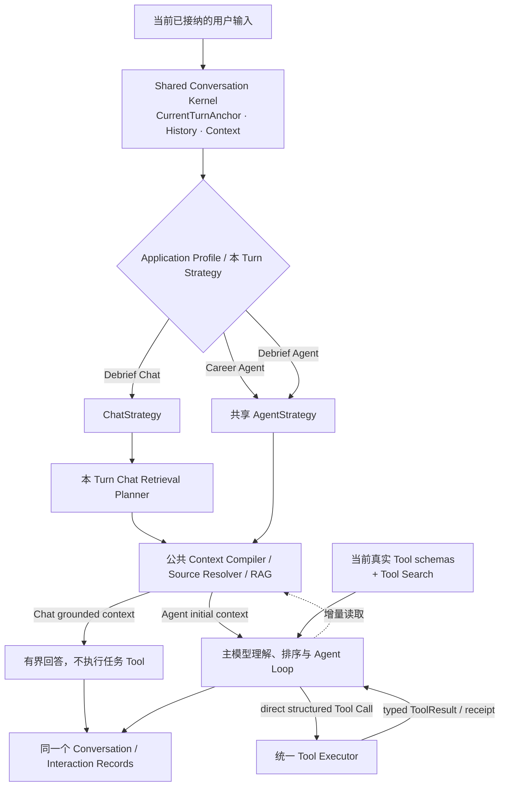
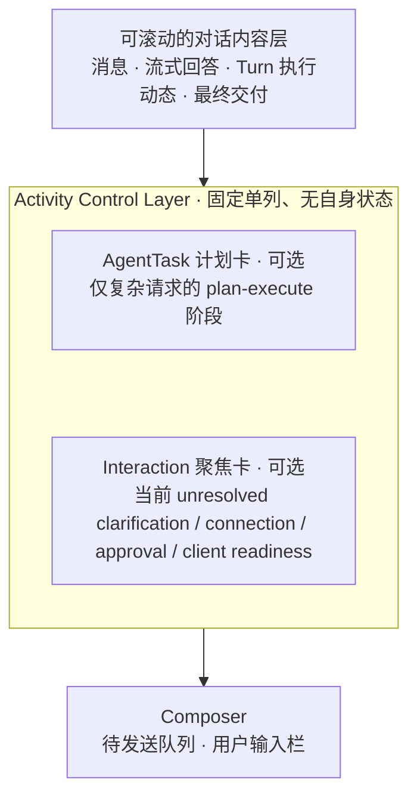
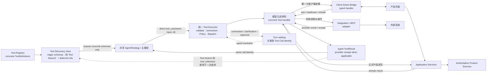

# 全流程求职 Copilot 产品边界与技术架构

> 状态：唯一现行产品与目标架构基线（2026-08-13）
> 适用范围：产品定位、信息架构、领域对象、上下文与 Memory、Agent/Chat/RAG、自动化、Tool、Skill、权限、真实性与完成判定、Integration、迁移与实施。
> 实施约束：后续代码、页面和 Stage Spec 必须遵守本文；当前源码、页面数量、API 路由、演示 Tool 和已连接 Provider 都不能反向定义产品边界。

## 0. 文档契约与局部覆盖规则

### 0.1 唯一现行定义

本文是当前唯一具有规范效力的产品与目标架构文档。后续 Stage Spec 只能在本文边界内冻结阶段实现，不能另立、复制或覆盖第二套产品语义。

文档维护遵守以下规则：

1. 用户明确确认的结论，以及用户完整审阅后认可且未提出异议的方案，都属于当前基线。仍有效的约束、理由、例外、交互语义和验收条件必须一起保留，不能只留下最后一句摘要。
2. 新决定只替代与其明确冲突的局部。术语调整或顶层结构变化不能成为删除其他有效细节的理由。
3. 每个概念只在一个主题章节拥有完整定义；其他章节只引用或说明如何消费，不能复制一套略有差异的状态、权限或生命周期。
4. 广义原则与主题规则发生表面歧义时，以负责该对象或流程的主题章节为准；真正冲突仍视为文档缺陷，必须在编码前统一，而不是让实现者自行选择。
5. 新决定影响已有内容时，必须同时修正文档正文、图示、实施路线、开放问题、验收条件和已经存在的 Stage Spec，确保任何位置只能读到一套现行语义。
6. 当前文档不保留已失效方案、旧术语、兼容性叙事或“新旧并存”的说明。历史由版本控制或明确会话归档承担；尚未进入版本控制的内容不得声称已经由 Git 保存。
7. 尚未确认的方案只能进入第 18 节“当前开放问题”，不得由源码便利、模型偏好或常见做法补成产品事实。

### 0.2 不过度设计

清晰架构不等于增加字段、状态、表、服务、Registry 或管线。只有出现独立的不变量、生命周期、权限、失败、恢复或回执语义时才拆分；高度相似的内容必须共享模型、Application Service 或基础设施。

以下内容默认不重复持久化：

- 可以从事实时间线或其他权威源计算的投影；
- 只属于当前执行现场的中间状态；
- 可以从真实 ToolDefinition、handler、连接、scope 与 Policy 实时派生的 Tool availability；
- 可以从 Interaction Records 重建的索引关系；
- 没有当前真实闭环和消费者的未来字段。

本文中的名称首先表达产品语义与实现不变量，不等于一项概念必须对应一张表、一个类、一个服务或一个目录。具体物理字段只在对应 Stage Spec 中为真实闭环冻结。

### 0.3 Stage Spec 与阶段冻结

本文回答产品最终要成为什么；Stage Spec 回答某一阶段具体实现什么。每个阶段编码前必须形成可验收的 Stage Spec，并至少冻结：

1. 本阶段依赖的本文章节、用户场景、输入、交付结果和明确非目标；
2. 本阶段闭环真正需要的对象字段、状态转换、来源、幂等、撤销、取消、重试、并发、失败和恢复语义；
3. 页面、Agent、Application Service、确定性同步器、Scheduler 和外部 Provider 的责任；
4. Provider connection/scope、Standard/Auto、逐调用 Policy、真实来源与 receipt/read-back 要求；
5. 现有数据、旧 Tool、旧 Memory 与未完成执行的兼容或迁移方式；
6. 可执行验收测试和需要人工确认的体验点。

Stage Spec 经用户讨论确认后才进入编码。实现发现必须改变产品语义时，应先停止扩大修改，记录偏差，更新本文与受影响 Spec 并重新讨论。每阶段完成后必须汇报实际改动、验证结果和与 Spec 的偏差，确认后再进入下一阶段。

### 0.4 多视图图示规则

同一套架构可以从产品心智、责任与依赖、单 Turn 控制流、Context 装配、Tool 执行、Policy 决策、代码所有权和数据契约等不同视角表达。每张图都必须说明：本图的视角、箭头表示和不表示什么，以及为了聚焦而省略了什么；省略不等于对应边界失效。

只有在对象、scope、生命周期时点和关系语义都相同的前提下，对唯一所有者、事实源、identity/基数、状态转换、权限裁决、执行顺序、依赖方向或完成判定给出互斥定义，才构成真正冲突。不同排版、控制流与依赖关系使用不同箭头、同一组件被折叠或展开、局部省略，以及一张图把 AgentStrategy 展开为 Loop 而另一张图合并为单个节点，都不构成冲突。

同视角、同范围的新图明确替代旧图时才删除旧图；不同视角下仍正确的图必须并存。共享不变量变化时同步修订所有受影响视图，局部细化只修改所属视图。图前统一使用简短说明：`视角：……；箭头表示……，不表示……；为聚焦本问题，本图省略……，其余边界仍以相关主题章节与第 19 节为准。`

## 1. 产品定位、真实性边界与七个业务域

### 1.1 产品定义

全流程求职 Copilot 以求职者本人为唯一服务对象，以长期、连续演进的求职状态为核心数据，以自然语言 Agent 作为通用协作和任务执行入口。产品目标是尽可能完成用户求职道路上可自动化的工作，而不是把当前页面、后端路由或 Tool 数量包装成产品边界。

本文目标产品采用 Cloud-first、多平台客户端形态。Conversation、正式产品状态、服务端已接纳的文件、Agent Runtime/RAG 和 PersistentTask 以云端为默认执行与持久化平面；各客户端通过同一账户访问同一权威状态，不形成第二事实源。首版不建设通用本地 Agent 或本地/云端双 Runtime。

产品覆盖长期且可能反复变化的求职过程：认识自身条件和目标方向、发现和研究机会、准备材料、投递与沟通、跟踪招聘流程、准备和复盘面试、比较与协商 Offer，以及跨方向、跨岗位的持续推进。求职不是一条保证成功的线性流程，也不要求用户先建立固定“秋招”“社招”或其他求职周期。

Agent 可以接收所有直接服务于用户本人求职的任务。“可以接收”只承诺给出真实交付：直接回答、调用真实能力完成、生成待确认草稿、形成可验证的内部或外部结果、部分完成并说明剩余步骤，或明确报告缺少 Provider、授权、数据、事实或所需真实来源。文本声明不能冒充已经执行的动作。

### 1.2 七个稳定业务域

| 业务域 | Agent 应能理解和推进的范围 | 关键边界 |
|---|---|---|
| **个人定位、目标方向与能力成长** | 整理和核验 CareerProfile（求职档案），发现资料缺口，维护其中一个或多个目标方向与约束，聚合有来源且可纠正的 AbilitySignal，解释方向适配、能力差距和学习重点 | 模型推断不能升级为用户确认的档案内容，也不能反向改写来源材料或面试记录 |
| **岗位发现与研究** | 搜索公开或已连接来源，真实读取 URL，研究公司和具体岗位，匹配方向，筛选、去重和比较机会，整理招聘方、内推和人脉线索 | 普通结果默认只汇报；明确保存、跟踪、准备或真实投递后才进入长期岗位状态 |
| **材料与申请准备** | 按用户需要读取、生成、修改、核验、版本化和导出简历、求职信、自我介绍、项目说明、申请问答与准备清单 | 材料编辑不是岗位必经流程，生成或推荐不证明已经对外使用 |
| **投递进程与协同** | 建立和更新 JobOpportunity、ProcessEvent 与 NextAction，理解邮件、官网和日历 Observation，安排提醒、生成沟通，并在真实连接和授权存在时执行投递或外部协调 | 人脉、内推和招聘方沟通是投递渠道，不另设业务域 |
| **面试全流程** | 公司和岗位研究、准备计划、知识补强、问题预测、模拟面试、录音转写、真实面试复盘、问答修订、能力信号和后续行动 | Mock Interview 是独立实时 Flow；真实面试和受限测评不能隐蔽代答 |
| **Offer 分析与协商** | 提取和核验最终条款，进行换算、估值、风险和多 Offer 比较，生成谈判策略与草稿，并按权限执行普通沟通 | 接受、拒绝、签署和确认入职始终由用户本人完成 |
| **全局推进与持续协作** | 跨方向和大量岗位汇总状态、发现阻塞和日程冲突、形成日/周计划、编排跨域复杂请求，并消费用户已创建的持续自动化 Observation | Agent 不为自己建立持续目标；持续工作必须是用户可见、可关闭的 PersistentTask |

七个域只是稳定的产品业务范围，不是运行时分组、Tool Group、Tool 清单或用户必经流程，也不要求与具体 Tool 一一映射。邮箱、日历、服务端文件、Canva、公开 Web/URL、搜索服务、招聘平台 API 和远程 MCP 是可跨域复用的 Integration 或 Tool 实现来源；Skill 是跨域 instruction 与编排内容，不是 Provider 或执行能力。

模型侧唯一的执行接口是存在真实实现的 concrete Tool。模型与 Tool 之间不增加业务分组、功能对象、元数据映射或运行时语义解析层；七个业务域和下文六类行为都只帮助说明产品范围、交付、副作用、Policy 与完成判定，不进入 Agent 调用链，也不形成表、Registry 或状态。

### 1.3 六类行为与真实交付

各业务域可以复用六类行为，而不为每种组合创建专用工具：

1. **理解与推理**：解释、分析、比较、规划和建议，并区分事实、推断和建议。
2. **读取与观察**：读取正式状态、Artifact、History、Long-term Agent Memory 或外部来源，并保留来源、时间、权限和权威类型。
3. **生成与转换**：形成文本、报告、清单、文件或 Artifact 版本；产物不等于已经保存或对外使用。
4. **内部状态变更**：通过 Application Service 改变正式对象，并返回对象引用、变化摘要、来源，以及适用时的撤销或修正路径。
5. **外部执行**：发送、提交、预约或修改外部系统；必须通过 Policy，并以真实 receipt 或 read-back 证明结果。
6. **持续观察与触发**：用户开启后由连接器按 cursor 获取和去重 Observation，需要语义判断或交付时启动有界自动化 Turn，不让 Agent Loop 永久运行。

一次 Turn 可以产生一种或多种交付：

- 回答、解释、分析或报告，没有声称改变状态；
- 已创建或更新的 Artifact，能够返回真实内容、版本或引用；
- 已完成的内部状态变化，能够返回 Application Service 结果、对象引用、变化摘要与来源，并在适用时说明撤销或修正路径；
- 已执行的外部动作，能够返回与 Tool Call 关联的 Provider receipt 或 read-back；
- 已真实启用且用户可查看、暂停或关闭的 PersistentTask，或已安排的 Reminder；
- 部分完成、等待确认或被能力、连接、权限、事实或必要真实来源明确阻塞，并说明已完成部分与用户下一步；
- 已由第一方客户端真实接收的语义化界面动作，例如导航、带入已确认输入或进入交互 Flow；客户端确认只证明界面动作成功，不能冒充业务写入、外部执行或用户已经完成后续操作。

这些结果不能互相冒充：回答不等于 Artifact，建议不等于状态变化，邮件草稿不等于发送，材料推荐不等于实际投递，创建自动化不等于未来事件已经发生，AgentTask 阶段文本也不等于真实执行成功。普通分析、比较和研究默认只在当前回答中交付；用户明确要求保存时才创建 Artifact，明确要求记录或更新状态时才调用相应领域命令。

### 1.4 不可跨越的边界

功能范围可以广，但以下边界始终高于完成率：

1. **用户身份**：Agent 不冒充用户作出职业、合同或身份承诺，不代替用户接受或拒绝 Offer、签署协议、确认入职，也不陈述用户未确认的个人事实。
2. **事实真实性**：不得虚构教育、经历、项目、薪资、申请状态、面试结果或外部动作；模型推断必须保持为推断。
3. **当前意图**：所有可选工作都服务于用户当前明确意图。Agent 可以推荐通常正确的做法，但推荐不能自动启动新任务；用户已明确提出范围清楚的请求时，该请求本身就是任务意图，不机械重复询问。
4. **最小授权**：读取、内部写入、外部执行和身份行为遵守统一 Policy。连接存在、选择 Auto 或持续授权都不能覆盖对象自身规则与用户保留决定。
5. **证据可追溯**：私有资料、时效事实、领域变化和外部动作必须按 claim 类型追溯到用户陈述、来源快照、业务对象、真实调用、receipt 或 read-back。
6. **用户最终决策**：职业目标取舍、是否投递、谈判底线、接受或拒绝 Offer 等决定由用户作出；Agent 可以分析、准备与执行用户已经明确决定的普通动作。

真实面试或明确禁止外部协助的测评中，产品不提供隐蔽代答、冒充用户或规避规则的能力；可以做事前准备、允许范围内辅助和事后复盘。产品不是招聘方 ATS，不替企业筛选候选人，也不保证面试、Offer 或薪资结果。与用户本人求职无直接关系的通用个人助理任务不进入产品领域。

## 2. 四个工作空间，以及页面与 Agent 的关系

### 2.1 一级产品心智

当前采用四个一级工作空间和一个“设置与连接”入口：

| 工作空间 | 用户心智 | 聚合内容 |
|---|---|---|
| **Copilot** | 我现在该做什么，或直接把任务交给 Copilot | 统一自然语言入口、当前状态摘要、阻塞、行动与复杂任务进度 |
| **求职进程** | 我有哪些具体岗位，它们分别进展到哪里 | 岗位发现与研究、岗位线、事实时间线、日程节点、Offer 与历史分析 |
| **求职资料** | 我的事实、方向和材料是否准确、清楚、可复用 | CareerProfile、Artifact 及知识资料 |
| **面试中心** | 下一场如何准备，过去一场如何改进 | 面试日程、专项准备、模拟面试、真实面试复盘与能力趋势 |

模型、Skill、MCP、邮箱/日历等外部连接、账号、权限与安全属于“设置与连接”，不占一级求职导航；本文不冻结它位于头像菜单还是其他具体 UI 位置。

四个工作空间是产品心智，不是四张固定页面、四条路由、四个后端模块或四个新聚合根。“机会清单”“岗位材料包”“决策”等词只能作为视图或任务心智，不能未经 Stage Spec 自动变成领域对象。一个工作空间可以由组合视图、筛选、抽屉、对象详情和局部 Flow 构成；页面数量、是否常驻输入框、Offer 比较采用页面还是一次性报告，都由交互 Stage Spec 根据真实用户流程决定。

### 2.2 页面与 Agent 的职责

- 页面负责清晰、友好、可见、易比较和易管理的结构化体验，适合总览、批量操作、管线管理、版本校验、来源检查和高频操作。
- Agent 负责理解当前意图、组合跨领域能力、执行任务并汇报真实结果。它贯穿所有工作空间，但不替代页面内容和对象视图。
- 涉及正式业务读取或变更时，页面、Agent、同步器和后台触发必须调用相同 Application Service，并遵守相同业务不变量、权限、来源与完成判定规则，不能形成第二套状态机；纯客户端导航和未保存预填不伪装成业务操作。
- Agent 结果不要求对应页面。只需汇报进度或完成情况的任务可以完全在 Conversation 中结束。
- Conversation 中的 Agent 执行呈现只负责让用户理解语义化执行动态、复杂请求的阶段计划、当前待处理交互和真实调用结果；它不能取代岗位、资料、面试、Offer 等领域页面。执行呈现的内容层、固定单列活动控制层和 Tool 渐进披露统一由第 11.7 节定义。
- 用户当前所在页面、路由、页面选中项、DOM、视觉内容和页面缓存都不自动进入 Agent 上下文。用户在本 Turn 主动附加或明确指定的附件、URL 和产品对象引用属于当前输入；已经显式附加到同一 Conversation 的文件及当前 Debrief Project Source 可以在后续 Turn 按当前已接纳任务需要重新读取，但不会每轮自动注入，也不能取得任务方向。
- 页面提供的“交给 Copilot”“用此对象继续”等明确入口，可以把带稳定 identity 的 typed object reference 作为用户可感知的本 Turn 输入；服务端仍需按 identity 重新读取权威内容并校验所有权与权限，不能信任客户端复制的业务事实。这是用户主动提供的对象引用，不是页面环境自动进入上下文。未保存草稿只有在用户明确提交时才能进入 Turn，并始终标识为草稿而非正式事实。
- Agent 可以通过有真实 typed handler 的 **Client Action Bridge** 导航到产品视图、带入本 Turn 已确认的数据、预填交互或进入明确的 Flow。Agent 发出产品语义目标，不接触具体路由、DOM、selector、任意 click/type 或万能表单 patch；没有真实 handler 或客户端不可达时必须明确失败。
- 页面导航和临时预填不改变 Domain State，也不证明用户已经查看、接受或保存。正式业务变化仍通过同一 Application Service，外部动作仍经过 Policy 并取得 receipt/read-back，Flow 启动仍以对应 Runtime/Application Service 返回的真实 identity 与状态为准。
- 用户明确要求跳转或启动交互时，Agent 可以直接执行相应语义能力；如果 Agent 只是建议查看某个页面，则返回可选页面动作，不应擅自抢占用户界面。页面跳转不是完成任务的必经步骤，后台 PersistentTask 和没有交互客户端的 Turn 也不能改变用户当前页面。
- Client Action 只交付给发起当前 Turn 的交互客户端实例，不广播给其他标签页。页面存在未保存内容、设备权限或其他本地安全条件时，由客户端原生 guard 让同一 Turn 进入可恢复 waiting，不把未提交表单内容发送给模型；原客户端不可恢复时必须由用户明确接管，不能自动投递到任意新标签页。
- 当前阶段只使用产品设计好的页面、由具体产品 Tool 定义的 typed handler，以及第 11.7 节固定的 AgentTask 计划卡、Interaction 聚焦卡、语义执行动态与 typed Tool 详情；不建设模型生成组件树、通用 UI schema、任意 HTML/JavaScript、客户端代码执行或其他生成式 UI 协议。

导航改造不能只改菜单名称而保留数据孤岛。在相应领域读模型和交互 Spec 可用前，现有路由可以保持可访问；随后按四个工作空间的聚合心智迁移。

## 3. Product Context Sources 与当前任务所有权

### 3.1 五种来源边界

Product Context Sources 按所有权、权威性、生命周期和读取规则分为五类：

| 来源边界 | 唯一职责 | 明确不承担 |
|---|---|---|
| **Product Domain State** | CareerProfile、JobOpportunity、ProcessEvent、NextAction、Interview、Offer、AbilitySignal 等产品业务状态；其中 CareerProfile 是用户确认状态，AbilitySignal 是独立的推断型产品状态，InterviewRecord 还拥有用户明确设置的本次 Debrief guidance | 保存原始会话，或让模型摘要改写产品状态 |
| **Artifact、FileAsset 与来源记录** | 版本化 Artifact/FileAsset，以及邮件、网页、日历 Observation 和来源快照等已有实体或版本记录 | 保存交互轨迹、Tool Result，或让 RAG 检索结果自动成为事实 |
| **Interaction Records** | 用户消息、隐藏自动化输入、Agent 回复、附件引用和完整 Tool Call/Result，包括实际返回的 Provider receipt/read-back；还保存本 Turn 指令与当前 Conversation 明确指导的原始措辞和来源 identity，回答“当时说过、调用过或返回过什么” | 判断历史陈述或外部内容现在仍然真实 |
| **Long-term Agent Memory** | Agent 从合格的既往交互中选择、压缩和巩固，可跨未来任务改善个性化服务、具有一定持久性且不由其他所有者承担的经验性模式 | 复制产品状态、当前任务、文档正文、History、显式指令、权限或设置 |
| **Personalization & Policy State** | 用户确认的 CopilotPreference，以及各自独立管理的授权、通知和同步设置 | 接受未经确认的模型偏好推断，或依赖隐藏记忆扩大执行权限 |

这是概念所有权，不要求五套数据库、服务或检索管线，也不新增“来源记录”总表或万能 Source 对象。当前 Conversation 的明确指导连同其源 message 归 Interaction Records/Conversation 边界；本次复盘的明确指导归 InterviewRecord 的 Product Domain State；跨 Conversation 默认指导归 Personalization State 中的 CopilotPreference，三者不形成第六种 Guidance Source。Conversation Attachment 是既有 FileAsset/来源版本的 Conversation 可见范围，其附加动作和 AttachmentRef 仍属于 Interaction Records；Debrief Project 是 Application Profile 基于 InterviewRecord 建立的可见范围投影，结构化面试状态仍归 Product Domain State，录音、转写和文件仍归其实际 Artifact、FileAsset 或来源记录，各 Conversation 仍归 Interaction Records。RAG、FTS、向量索引、摘要和引用卡只是对这些真实记录的读取投影，不是第六种来源，也不能获得事实所有权。scope 不改变任何来源的所有者、权威类型或事实等级。

Runtime Checkpoint、dispatch fence、lease、watermark、恢复游标和其他 Recovery State 属于运维控制面，不是 Product Context Source，不能作为 system/user message 或可召回资料直接进入模型。真正需要模型知道的任务输入、计划、调用结果和未决交互，必须从 CurrentTurnAnchor、AgentTask、Interaction Records、Tool Call/Result 或相应产品状态按原 identity 装配。上传资料、邮件、网页、日历、原始 History、Preference、权限、系统指令和 Skill 同样都不属于 Long-term Agent Memory。

页面和 Context Compiler 只按当前任务从正式对象动态形成用户级投影，不建立重复保存所有事实的 CareerState 表或聚合。当前直接以用户及其正式领域对象为根，不建立固定求职周期、万能 CareerWorkspace 或通用 Project 管理。第 7 节定义的 Debrief Project 只是 InterviewRecord 已经具有的领域范围，不是通用求职容器；只有未来出现真实、稳定且用户可理解、又不能由 CareerProfile 内的目标方向、JobOpportunity、Interview、Conversation 或 PersistentTask 表达的多计划隔离需求时，才重新讨论通用 Project。

### 3.2 Active Working Context 与 CurrentTurnAnchor

Shared Conversation Kernel 中的 Active Working Context 只包含当前 Turn 的权威输入、当前 Strategy 正在处理的任务理解、注意中的少量相关上下文、正在执行的工具链和必要中间状态。它对应当前活动加工状态；运维 Checkpoint 只供控制器恢复，不是工作记忆或模型上下文。

每个 Turn 通过持久化的 conversation identity、turn identity 和 input identity 建立 CurrentTurnAnchor：

- 普通用户 Turn 只有已经被服务端接纳并建立 CurrentTurnAnchor 的用户原始输入拥有执行方向；附件、用户明确提供的对象引用和其他结构化数据只是受该输入约束的上下文，不能与用户原文争夺任务所有权。
- 自动化 Turn 由用户已经确认的 PersistentTask 当前定义与本次 trigger/Observation 共同限定，不伪装成用户手工消息。
- Compaction Summary、Long-term Memory、运维 Checkpoint 和旧 AgentTask 都不能替换当前锚点。

每条 Conversation 同时最多只有一个尚未终结的 active Turn；active 覆盖已经接纳但尚未开始、running 与 waiting。所有普通提交都经过同一个 Conversation admission 命令：只有既无 active Turn、也无待处理或保留的 PendingSubmission 时，才在 Conversation 锁内直接、幂等地创建 UserMessage、Turn 与 CurrentTurnAnchor；已有 active Turn 或队列仍非空时，输入保存为第 11.2 节的耐久 PendingSubmission。排队输入被 claim 前不是 UserMessage、Turn、Interaction Record、Product Context Source 或新的 CurrentTurnAnchor，也不得进入当前 Prompt、RAG、History、Compaction 或 AgentTask。Conversation 只用当前 active Turn 与现有队列状态作为 admission 门闩，不拥有第二任务方向或通用消息队列。

新的用户 Turn 始终重新解析本次被接纳的原始输入。旧 AgentTask 只有在新输入明确继续时才重新激活；明确取消、替换或改变目标时放弃，无关新请求中不注入旧任务。上一轮普通处理不形成跨 Turn 待恢复任务。只有继续与否仍有可能造成真实副作用、错误写入或明显错误交付且无法可靠判断时才询问。排队顺序本身不表示继续旧任务。

### 3.3 Interaction Records 与读取过程

Interaction Records 是精确交互轨迹，对“当时说过、调用过或返回过什么”具有权威性，对其中陈述现在是否仍真实没有权威性。History Search 精确回读用户原话、历史承诺、Tool 输入、Tool 结果和错误；需要准确内容时回到原始记录，不从摘要重建。

Turn 执行动态、对话内 Tool 展开和深层审计只是同一 Interaction Record 与 Tool Call/Result 的不同读取投影；展示深度、聚合和折叠不改变 call identity、结果含义、来源所有权或原始记录的保留边界。

Shared Conversation Kernel 只有三种语义不同的读取过程：

- **Fact & Source Retrieval**：读取当前 Product Domain State、Artifact、FileAsset 与实际来源记录；长内容可以使用公共 RAG。
- **History Search**：精确查找 Interaction Records。
- **Memory Recall**：从 Long-term Agent Memory 选择相关经验表征。

三者可以共享索引、FTS、向量检索、排序和 Token 预算基础设施，但输出必须保留来源类型、时间、权限和权威标签。Recall 是过程，不是新的持久化对象；FTS、向量索引和普通 Conversation Digest 只是可删除、可重建的投影。

History 保留、Long-term Memory 的形成与召回、局部显式指导、全局 CopilotPreference、业务数据、外部同步和执行授权分别管理。修改或清除 Conversation guidance、InterviewRecord/Debrief guidance 或全局 CopilotPreference 只改变相应指导，不删除它的 owner、其他指导、Long-term Memory、正式业务状态、Artifact 或 Interaction Records；删除 Conversation、InterviewRecord 等 owner 本身仍遵守各自完整生命周期。若被删除的真实来源是某条 Memory 的唯一依据，该 Memory 必须按第 8.2 节停止召回、失效或删除；这是来源有效性传播，不是让 Memory 取得或级联控制源对象。底层保留期限与删除实现由相应 Stage Spec 冻结，但不能改变这些所有权边界。

## 4. CareerProfile、AbilitySignal 与 Artifact

### 4.1 对象职责

| 对象 | 唯一职责 | 不承担的职责 |
|---|---|---|
| **CareerProfile** | 用户可见、可修改且由用户确认的个人事实，以及一个或多个求职目标、偏好和约束；它们共同形成“个人详情/求职档案”的唯一所有者 | 保存模型能力结论、简历正文，充当固定求职周期，或被一次搜索静默改写 |
| **AbilitySignal** | 基于实际来源形成、带时间与不确定性、可解释、可纠正和可失效的推断型产品状态 | 成为用户事实、人格定论或 Long-term Agent Memory，或反向覆盖来源记录 |
| **Artifact 及其版本** | 用户材料、知识文档和 Agent 交付内容与真实版本历史 | 充当个人事实，或证明内容已经对外使用 |

CareerProfile 合并的是产品所有者、页面心智、Application Service 与 Context Source，不是把“已经发生的个人事实”和“希望去往的目标方向”压成同一种值。两部分在同一档案内保留各自的校验、冲突、生命周期和写入命令；目标方向可以保留稳定子 identity，但不再形成第二个顶层聚合、页面、Service 或 Context Source。CareerProfile、AbilitySignal 与 Artifact 可以共享存储或版本基础设施，但业务语义不能互相吞并。ArtifactVersion 表示 Artifact 生命周期中的可追溯版本语义，不要求提前拆成独立聚合根或表。

### 4.2 CareerProfile

CareerProfile 是用户可单独查看和修改的求职档案，内部包含两个清晰区段：

- **个人事实**：教育、经历、项目、技能、成果、联系方式等已经发生或当前有效的信息，并保留来源与必要有效时间；教育、经历和项目允许历史区间，联系方式和当前地点表达当前有效值；
- **目标方向与约束**：用户明确的一个或多个岗位方向、地点、工作方式、薪资、行业、技术方向、优先级与排除条件。

具体物理字段、分表与页面布局由 CareerProfile Stage Spec 冻结；物理上分表不改变其单一产品所有者。

档案内容的写入优先级为：

1. 用户当前明确纠正；
2. 用户已经确认的结构化 CareerProfile；
3. 简历、证书和其他有来源文档提供的候选或冲突依据；
4. Long-term Agent Memory 与模型推断只可辅助发现，不是事实源。

用户通过简历管理、求职资料入口，或在 Conversation 中明确要求“保存/设为我的简历”而导入第一份简历时，系统只生成“来源于该简历”的待确认 CareerProfile 候选，不能静默覆盖档案，因为简历可能已经过时、为特定目的裁剪，或与其他版本和来源冲突。交互应允许批量接受无冲突候选，只对真正冲突的内容突出当前值、候选值与来源并逐项确认。仅在聊天输入框附加一份简历只建立当前 Conversation 的 AttachmentRef，不保存为简历、不进入全局资料，也不生成档案候选；未确认候选只可用于分析其来源简历，不得作为全局事实注入其他任务。

用户在对话中明确给出全新且无冲突的个人事实或目标约束时，Agent 可以通过 CareerProfile Application Service 写入并简短通知。用户明确说“之前写错了，应该是……”时，该纠正本身就是确认。模型仅检测到内容可能变化、但用户没有表达修改意图时，必须展示当前值、候选值和来源并询问；文档冲突与模型推断也只能待确认。

CareerProfile 更新不自动改写简历，也不自动创建材料任务；简历措辞变化同样不能反向修改档案。已确认档案内容按当前任务精确选择，长文档通过公共 RAG 读取，未确认冲突不作为事实注入。

### 4.3 CareerProfile 中的目标方向与约束

用户可以先给出一个或多个大致目标方向，Agent 根据后续对话和已经保存的求职行为帮助补全。Agent 推断出的新方向或实质变化只能先作为建议；方向不能只隐藏在模型上下文中，必须在 CareerProfile 中可见、可编辑，并可在 Copilot 显示摘要和待确认建议。

同一优先级可以存在多个方向，方向的优先级与 active、exploring、paused、archived 等生命周期语义相互独立。方向可以表达职位关键词、职级、地点、工作方式、薪资、行业、技术方向和排除条件；这些是产品语义，不是已冻结的必填字段。

一个 JobOpportunity 可以匹配多个方向。关联必须能够解释来源、匹配理由以及是否需要用户确认，但物理关系形态留给 Stage Spec。一次临时搜索条件不会修改长期方向；用户当前明确请求始终高于长期偏好。

方向条目可以拥有稳定 identity 以支持岗位关联和生命周期，但只能经 CareerProfile Application Service 读写；它不是第二个顶层目标方向对象，也不能恢复第二套页面、服务或上下文所有权。

### 4.4 AbilitySignal

AbilitySignal 是独立的推断型产品状态，不是用户确认事实，也不属于 Long-term Agent Memory。它可以来自具有充分上下文的模拟面试、真实面试、复盘、问答表现和漏斗分析，并用于能力成长、诊断与趋势视图。每个信号必须直接引用实际 InterviewRecord、问答/评分、ProcessEvent、Artifact、Interaction Record 或其他真实来源，表达形成时间、适用范围与不确定性，并允许用户质疑、纠正、重新计算或使其失效；这些语义不要求建立通用来源对象。

AbilitySignal 不能把一次结果固化为人格或总体能力定论，也不能反向改写 CareerProfile、简历、面试记录、JobOpportunity、ProcessEvent 或其他来源事实。岗位漏斗同时受到匹配、市场、渠道、时间窗口和材料表达影响，只能形成诊断假设，不能直接声明用户能力不足。自动 Memory 生产路径、Memory Recall 与 Memory 开关都不得创建、覆盖、隐藏或删除 AbilitySignal。

### 4.5 Artifact、材料与实际使用

Artifact 及其版本复用一套版本化内容基础设施，可以承载简历、求职信、自我介绍、项目说明、知识资料、准备材料和 Agent 交付报告。共享基础设施不等于业务语义相同：个人档案是事实，求职材料是对事实的选择与表达，知识资料是检索来源，Agent 报告是一次任务产出。

简历通常是长期稳定、跨同一方向多个岗位复用的通用材料。编辑和岗位定制是低频、按需能力，不是创建岗位、读取 JD 或发现匹配差异后的自动步骤。目标方向发生变化、岗位与当前材料明显不匹配、岗位存在特殊材料要求时，Agent 可以解释差异并建议调整；只有用户明确要求或确认建议后才生成或修改版本。

材料与岗位只保留两层产品语义：

- **related**：材料曾为该岗位准备、生成或推荐，但不证明实际使用；
- **submitted**：该具体版本确实用于本次投递。

submitted 只能由用户明确确认，或由能证明具体文件/版本的真实外部 receipt/read-back 建立。生成、推荐、选择、下载和导出都不能证明实际使用；只证明“投递成功”但没有材料信息的邮件或网页回执，也不能推断版本。

Conversation Attachment、Debrief Project Source 与正式 Artifact 是不同逻辑 scope，可以在显式晋升时复用同一底层 FileAsset/blob，但必须建立新的来源引用、版本与生命周期，不能通过修改原 AttachmentRef 暗中扩大可见范围。任何 scope 晋升都不自动改变 CareerProfile，也不证明材料已经 submitted。

一个已证明 submitted 的历史版本引用必须冻结；后续编辑创建新版本，CareerProfile 的后续修正也不能倒改过去实际使用的材料。系统不为了补齐内部关系字段机械打断用户，只有材料事实缺失或冲突会实质影响当前交付时才发起最小确认。

分析材料版本与投递效果至少需要同一岗位线的 JD 来源快照、确证的 submitted 版本、投递渠道和后续 ProcessEvent/outcome。关键证据缺失时只能报告数据缺口或相关假设；即使证据齐全，也必须说明岗位匹配、市场、渠道和时机等混杂因素，不能包装成因果证明。

## 5. JobOpportunity、ProcessEvent 与漏斗

### 5.1 一条具体岗位的招聘流程

JobOpportunity 表示用户针对一个具体岗位和招聘批次推进的一条招聘流程。它不是公司记录、普通搜索结果，也不是一条保证走到 Offer 的成功路径。

以下任一条件成立时才进入长期岗位状态：

- 用户确认已经投递；
- 已授权同步取得明确的投递成功 receipt/read-back 或对应来源记录；
- 用户决定为某个具体岗位开始针对性准备；
- 用户明确要求保存或跟踪尚未投递岗位。

仅浏览、搜索、匹配、比较、研究岗位或查看 URL 时默认只汇报。用户要求保存一份研究报告时保存 Artifact，也不等于建立岗位线。岗位存在也不意味着必须生成岗位专属简历、求职信或准备计划，这些始终由用户意图决定。

同一公司中的不同具体岗位分别建线。标题相似但地点、团队、招聘编号或招聘批次不同的岗位通常也分别建线。同一具体流程从邮件、官网、招聘平台和日历取得的观察归入同一条线，不因来源不同重复创建。

同一具体岗位的流程仍在进行时不创建第二条申请线。流程终结后，只有明确的新投递、独立申请编号或用户确认“这是重新申请”，才创建新的 JobOpportunity。当前不拆独立 Application 对象，也不增加显式前后继字段；共同岗位标识和时间足以支持当前历史查询，真实跨申请关系需求出现后再扩展。

### 5.2 粗粒度阶段与当前步骤

岗位只保留四个稳定 phase：

| phase | 用户显示 | 进入条件 |
|---|---|---|
| pending_application | 待投递 | 用户开始针对具体岗位准备，或明确跟踪尚未投递岗位 |
| applied | 已投递 | 用户确认、真实回执或高置信度投递成功事件 |
| in_process | 招聘流程中 | 已确认进入测评、招聘方沟通、作业、面试、背调等后续环节 |
| offer | Offer | 收到来源明确或用户确认的 Offer |

普通投递回执、“简历已收到”或泛化的“正在审核”仍属于 applied。筛选、电话沟通、测评、笔试、作业、面试轮次和背调没有稳定顺序，也不是每家公司共有，因此作为 ProcessEvent 表达，不增加一级 phase 或全局轮次枚举。流程可以跳过环节、长期停滞、在事实纠正后回退，并在任何阶段结束。

页面使用“粗粒度 phase + 当前步骤”的双层表达。current_step 从最新有效 ProcessEvent 投影为用户可理解的事实摘要，例如“在线测评待完成”“已约一面”“已完成终面，等待结果”。它不是第二套状态机，不能由模型脱离事实自由编造。

岗位列表至少应让用户看见 phase、current_step 和最近更新时间；是否预览关联 NextAction 属于交互 Stage Spec。岗位详情展开完整事实时间线及其 user assertion、Observation、来源快照、Tool Result 或 Provider receipt/read-back。阶段开始时间、结束步骤和等待时长优先从 ProcessEvent 计算；是否为查询性能持久化投影由 Stage Spec 决定，但事件始终是可追溯来源。

pending_application 不能无限累积。长时间没有投递记录、receipt/read-back 或准备进展时，系统以简单提醒让用户选择继续准备、确认已经投递或删除岗位；不增加“关注中”“考虑中”等临界 phase。提醒阈值与删除采用软删除、可恢复归档还是其他方式仍是开放问题。

### 5.3 ProcessEvent：只追加已确认事实

ProcessEvent 是岗位流程的追加式事实时间线，回答“已经发生了什么”。它可以表达投递确认、测评邀请、面试安排或完成、招聘方拒绝、岗位关闭、用户退出、Offer 到达和用户纠错等事实。

每个事件必须能够追溯：

- 事件实际发生时间与系统发现时间；
- 用户陈述、邮件、网页、日历、平台或真实 Tool 调用等来源；
- 对应的 user assertion、Observation、来源 identity/版本、Tool Result 或 receipt/read-back；
- 必要的原始描述；
- 如果是纠错，所修正或撤销的既有事件关系。

以上是语义不变量，不要求立即冻结统一字段名；不同 Provider 不需要强行提供相同轮次、编号或描述结构。

任何会改变当前投影的 ProcessEvent，都必须能通过事件时间线与修正/撤销关系审计性地重建事件发生前后的投影。该要求不意味着必须保存重复的 old_state/new_state 字段；优先通过事件重放计算，是否为了查询性能持久化投影由 Stage Spec 决定。

External Observation 回答“外部来源出现了什么”，用户陈述是 user assertion，二者不是同一种来源。ProcessEvent 只接收已经确认的事实。模糊邮件、网页变化、语义相似但无法唯一归属的观察和模型推断，在确认前停留为 Observation 或待确认候选，完全不进入事实时间线。

用户已经开启相应同步后，高置信度、唯一匹配且位于授权范围内的事实可以自动追加，但必须即时通知、保留实际 Observation/来源快照或 Tool Result，并提供可撤销或修正路径。错误识别通过追加修正或撤销事件恢复投影，不覆盖或删除原始历史。JobOpportunity 上的 phase、current_step、outcome 和注意信号只是当前投影，不能反向改写事件历史。

### 5.4 Outcome、封存与长期无回复

outcome 与 phase 分离，只保存五种明确终局：

- rejected：招聘方明确未通过；
- withdrawn：用户明确退出；
- posting_closed：来源明确表明该用户的申请流程也已经终止；
- declined_offer：用户拒绝当前岗位的 Offer；
- accepted：用户接受当前岗位的 Offer。

没有终局 outcome 即表示流程仍未结束，不增加重复的 active 值。公开职位页面下线不能自行推断用户被拒绝，也不能仅凭无回复设置 posting_closed。

长期无回复只形成“无进展”注意信号，用于排序、汇总和提醒，永远不自动成为失败事件或终局。普通无回复不为大量岗位机械创建 NextAction；需要跟进时可以形成聚合建议，由用户决定是否计划或执行。注意信号的具体分类留给 Stage Spec，不提前冻结状态大全。

出现终局后，岗位线退出主动集合并封存为只读业务历史：

- 不再接收自动业务更新；
- 不生成新的 NextAction、Reminder 或常规 Agent 建议；
- 不进入日常 Career Context；
- 保留 JobOpportunity、ProcessEvent、实际来源/回执、实际材料使用引用和相关 Interview/复盘；
- 仅在用户查看历史、明确纠错，或进行查询、漏斗和能力分析时读取。

业务历史不因创建新岗位线而改写或合并。产品级数据删除由独立数据治理规则处理，不能通过普通流程更新隐式清除历史。

终局后到达的普通消息不能继续追加到封存线。晚到或与终局矛盾的推进消息进入待确认，不能自动恢复旧线或创建新线。用户确认原终局识别错误时，通过追加修正/撤销 ProcessEvent 恢复旧线；用户确认是新投递时创建新线。

### 5.5 岗位身份线索、匹配与去重

岗位身份线索允许随真实来源逐步补充，不要求创建时一次填齐。产品需要能够保存或关联以下语义，但首阶段字段由真实 Provider 能力决定：

- 公司原始名称及可选规范化关联；
- 岗位原始标题；规范化标题只用于搜索和候选匹配；
- 地点、团队和带观察时间的 JD 快照；
- 来源 URL、平台和 requisition/job ID；
- 外部 application ID、邮件线程或可信平台记录 ID；
- 投递时间、使用账号和实际 user assertion、Tool Result 或 Provider receipt/read-back。

自动关联按以下证据顺序判断：

1. 完全一致的外部申请编号、招聘岗位 ID 或可信平台记录 ID；
2. 完全一致的规范化岗位 URL，或可验证属于同一申请的邮件线程；
3. 公司、岗位、地点、近期投递时间、账号等多项线索组合后只剩唯一候选；
4. 只有公司名、模糊标题或模型语义相似时，只能提出候选，必须确认。

Career Application Profile 下的共享 AgentStrategy 负责理解岗位别名、已连接邮箱内容，以及由官方 Connector 或用户明确提供的官网内容并比较候选；Application Service 只守所有权、唯一性、幂等、合法状态、真实来源引用和可撤销等确定性不变量。无需为抽取、匹配和置信度各建一套职责重叠的微型服务。

匹配结果遵循以下分支：

- 明确投递成功的 receipt/read-back 或来源记录含唯一岗位/申请标识且不存在候选：创建 applied JobOpportunity 并通知；描述不完整时标明待补全；
- 与一个现有岗位存在唯一强匹配：向原岗位追加事件，不重复创建；
- pending_application 岗位收到明确投递成功的 receipt/read-back 或来源记录：推进原对象为 applied，不另建岗位；
- 存在两个或更多合理候选：让用户选择已有岗位，或明确选择创建新岗位；确认前不进入 ProcessEvent；
- 只有招聘宣传、推荐、营销内容或普通搜索结果：不创建 JobOpportunity；
- 用户只提供 URL 请求分析：默认只汇报，明确加入待投递或确认投递后才持久化。

系统可以提示疑似重复，但不能仅靠模型相似度自动合并。用户确认合并后，双方外部标识、实际来源引用和 ProcessEvent 都必须保留，并通过可撤销关系保持追溯；误合并必须可恢复。同一公司不同岗位不能因公司相同而合并。

### 5.6 岗位 URL 与漏斗分析

公开岗位 URL 必须通过真实网页读取形成带原始 URL、观察时间和来源的 JD 快照。默认分析至少覆盖：

- 公司和具体岗位；
- 核心职责与要求；
- 与 CareerProfile 中当前有效个人事实及目标方向的匹配和缺口；
- 信息缺失、异常条款或其他风险；
- 是否需要材料调整及理由；
- 用户下一步可以采取的行动。

分析默认只汇报。用户自己已经在官网投递时，可以先按明确 user assertion 记录；用户明确提供的成功页内容、已连接邮箱中的确认邮件或平台回执能分别证明其页面/邮件/回执所表达的状态，具体完成判定仍由来源 identity、时间与可核验性决定。

登录、验证码、地区限制、动态渲染或站点反自动化导致无法读取完整页面时，Agent 必须说明读到了什么、缺少什么以及可用降级方式，不能用标题、搜索摘要或模型常识冒充完整 JD。产品不以不稳定的服务端通用爬虫宣称支持所有招聘网站。

漏斗可以按 CareerProfile 中在相应时间有效且已经确认的目标方向、实际 submitted 材料版本、投递渠道和时间分析阶段转化率、等待时间与结束分布；后续档案修改不能倒改历史分析所使用的方向。只有保存了相应 JD 快照、材料引用、渠道、事件和结果，才能解释具体变量。分析必须展示样本与真实来源覆盖，并说明岗位匹配、市场、渠道、时机和材料表达等混杂因素；漏斗结果只是诊断信号，不能直接归因为用户能力。

## 6. NextAction 与 Reminder

### 6.1 顶层行动语义

NextAction 与 ProcessEvent 同层，是用户级求职状态对象，回答“接下来值得决定或完成什么”。它高于运行时 AgentTask，不是 Agent 内部阶段。它可以独立存在，也可以关联 JobOpportunity、Interview、Offer、Artifact 或用户全局状态；关联不表示被这些对象拥有。

产品不拆 SuggestedAction、Todo 和 Reminder 等多个相似目标对象。NextAction 只采用四个状态：

- suggested：基于已确认事实提出的建议；默认只展示，不代表用户同意，不主动通知，也不自动执行；
- planned：用户直接提出、接受建议，或已有明确提醒设置允许安排通知；
- done：行动已完成，并由用户确认、正式状态变化或相应真实结果支持；
- closed：行动不再需要；可以解释为用户忽略、被新事件取代、前提失效或岗位终局，但不扩张为更多结束状态。

NextAction 不需要 in_progress。Agent 正在执行复杂工作时由 AgentTask 表达 plan-execute 的计划阶段与推进位置；Turn 持有 waiting、blocked、failed 或 cancelled，只有需要用户输入或决定的 waiting 另外具有 durable pending interaction；用户行动只需建议、计划、完成或关闭。

只有明确日期/截止、用户承诺，或跨会话仍有明确决策价值的建议才创建 NextAction。Agent 当场完成回答、分析或小型生成时不创建；只在当前回答中有价值的建议也不持久化。

NextAction 必须保持轻量，不能演变为通用项目管理器。产品不要求用户维护负责人、标签、子任务、复杂重复规则或人工优先级；紧迫度、逾期、重复、冲突和展示顺序优先由时间、来源和关联事实计算。只有求职行动出现独立且真实的新不变量时，才讨论增加结构。

### 6.2 时间、聚合与冲突

时间语义只保留三类：

- fixed：已经确认的起止时间，例如面试或电话沟通；
- deadline：最晚完成时间，例如测评、作业或 Offer 回复期限；
- flexible：需要处理但没有硬时间，例如整理材料或考虑跟进。

行动必须具有用户可理解、可执行的内容，能够关联必要对象，并保留原始时间文本与来源时区。系统还必须能区分行动来自用户请求、ProcessEvent、Agent 建议还是用户已经确认的持续策略，使 suggested/planned 的形成、通知资格和后续审计都可解释；这是来源语义不变量，不要求现在冻结成枚举字段。关闭原因，以及完成时直接引用用户确认、正式状态变化或对应 Tool/Application Service result 的物理表达，由 NextAction Stage Spec 冻结；本文只要求状态变化能够解释且可追溯。

用户可以同时推进大量岗位，同一天也可能有多个面试、测评和截止事项，因此不存在唯一全局或岗位级“首要行动”。顶层读模型按以下决策价值聚合：

- 固定时间重叠，或固定日程使临近 deadline 明显无法完成的冲突；
- 今天必须参加、到期或已经安排的行动；
- 即将到期的固定日程和截止事项；
- 已 planned 但尚未排期的行动；
- 仍为 suggested、尚未成为用户承诺的建议。

系统可以确定性检测时间重叠、临近截止、跨类型可行性冲突和重复提醒。Agent 结合路程、准备时间、岗位方向和用户约束解释冲突并提出方案，但不能自行取消、改期、放弃测评或代表用户发送沟通。具体由独立页面、Copilot 摘要还是组合视图承载，留给交互 Stage Spec。

### 6.3 事件驱动转换与去重

- 用户明确说“明天下午提醒我完成测评”时直接创建 planned，不重复确认；
- 已确认具体时间的面试可以形成 planned + fixed，通知遵守用户设置；
- 需要用户选择面试时间时，先形成“选择并回复时间”的 suggested；
- 测评邀请事实进入 ProcessEvent，完成测评通常先形成 suggested + deadline，除非用户已经明确要求计划或提醒；
- 模糊来源或时间在确认前不进入 ProcessEvent，也不创建已计划行动；
- 用户确认、正式状态变化或对应 Tool/Application Service result 证明行动完成时转为 done；
- 新事实使行动失效、被取代或岗位终局时转为 closed，不删除历史；
- 普通投递回执只更新事实，一般无回复只形成注意信号，不机械创建大量待办；
- 邮件、日历和官网描述同一事项时，按 provider/source identity 与实际记录去重。

“检查多个长期无回复岗位”究竟使用一个批量行动，还是保持独立行动并由读模型聚合，留给批量交互 Stage Spec；当前不预建多对多关系。

### 6.4 与 current_step、AgentTask 和 Reminder 的关系

current_step 是从已确认 ProcessEvent 投影的当前事实摘要，不需要用户接受，也没有 suggested/planned 生命周期。NextAction 是未来可以接受、安排、完成或关闭的行动。两者文字可能相近，但事实语义和生命周期不同。

NextAction 与 AgentTask 不互为前置条件：

- 用户当场交付的复杂请求可以创建 AgentTask 而没有 NextAction；
- 用户可以手动完成 NextAction 而没有 AgentTask；
- 用户把 NextAction 交给 Agent 时，简单执行只形成 Turn、Tool Call、Application Service 结果或 receipt/read-back，不为此创建 AgentTask；
- 只有当前执行本身复杂、多阶段时，AgentTask 才引用相关 NextAction；
- AgentTask 自述完成不能证明 NextAction 已完成，仍需 claim-specific 结果或用户确认；
- NextAction 不拥有 AgentTask，当前也不预建 execution_records、attempt 集合或 attempt 字段；历史关系通过 Turn/AgentTask 引用和 Interaction Records 查询。

Reminder 只是 planned NextAction 的通知安排，不是独立业务目标。全局通知渠道和安静时段属于设置。只有需要持续读取来源、维护 cursor 或调用 Agent 判断的工作才创建 PersistentTask；产品不再建立 ScheduledTask、MonitorTask 或 NotificationTask 等第二套持续生命周期。

## 7. Interview 与 Offer

### 7.1 Interview、Debrief 与 Mock

真实 Interview 通常关联具体 JobOpportunity，并承载面试日程、准备内容、来源明确的事实、录音/转写、问答和复盘结果。Mock Interview 可以围绕具体岗位练习，也可以作为不关联岗位的通用训练。准备材料与复盘报告属于 Artifact；能力结论通过 AbilitySignal 形成，不能反向改写原始转写、问答或岗位事实。

一次真实面试复盘以其 InterviewRecord 作为天然的 Debrief Project 范围，可以包含多条彼此独立的 Conversation。该 InterviewRecord 的录音、转写、当时的简历与 JD、问答、评分、分析及明确加入本次复盘的其他来源对这些 Conversation 共同可读；在某条 Conversation 输入框直接附加的文件仍只属于该 Conversation，不自动提升为 Debrief Project Source。每条复盘 Conversation 都使用 Debrief Application Profile，并允许 ChatStrategy 与共享 AgentStrategy 按 Turn 无缝混合。

Debrief Project 是 InterviewRecord 的既有领域语义，不增加通用 Project 聚合根、通用项目页面或另一套生命周期。用户若要让聊天附件供同一复盘的其他 Conversation 使用，必须明确执行“添加到本次复盘资料”；该操作只扩大到当前 InterviewRecord，不自动保存为用户全局资料。Mock Interview 是独立的实时、逐轮、强流程约束 Flow，不进入普通 Conversation 的 Strategy Router 或通用 Agent Loop；它可以复用模型、语音、存储、Artifact/FileAsset 和实际来源记录等底层能力。

Career Agent 可以根据用户本 Turn 明确提供的简历、JD、面试类型和风格等输入调用真实 Mock Tool 与 Flow 入口。Flow Handoff 的顺序固定为：解析并校验明确来源；Application Service 校验配置但不虚报已经开始；Client Action Bridge 把 typed 配置带入对应体验并检查麦克风等当前客户端设备权限与 readiness；需要用户现场操作时，由 Turn 在原 Tool Call 边界进入 waiting，并保留同一 call identity 作为恢复关联；就绪后由真实 Mock Runtime 入口 create/start 并返回 session identity 与运行状态；客户端再依据该 identity 进入实时界面。预填 acknowledgement、设备 readiness、Runtime start 结果和进入实时界面的 acknowledgement 分别记录，只有 Runtime 返回的真实 identity/status 能证明面试已经启动。

Agent Turn 在真实 Runtime 成功交接或明确失败后结束，不把后续实时逐轮面试包进通用 Agent Tool Loop。进入实时流程后由 Mock Interview Flow 持有整场交互；仅导航、预填或设备就绪都不能声称面试已经启动。

真实面试或明确禁止外部协助的测评中，产品不隐蔽代答或冒充用户。面试准备、合法辅助、录音转写、事后复盘、问答修订和能力成长仍在产品范围内。

Interview、InterviewRecord、逐题问答、录音和复盘 Artifact 的最小物理结构，以及模拟与真实面试之间需要哪些共享关联，由 Interview Stage Spec 冻结。

### 7.2 唯一当前 Offer

Offer 是 JobOpportunity 下的正式业务事实，不是 Agent 报告或聊天摘要。每条岗位线最多维护一个当前最终 Offer，不建立用户需要管理的 OfferVersion 集合。

谈判邮件、草稿、初始文件和先前条款继续作为各自 Artifact、FileAsset、Observation 或来源快照保留。正式来源或用户确认最终条款变化时，更新唯一当前 Offer，并保留实际来源引用和操作审计；不能用分析结果或无来源摘要覆盖条款事实。新来源到达但无法判断它是在补充现有条款还是替代最终条款时，必须先展示差异并等待用户确认，不能直接覆盖当前 Offer；这项保护不因不建立 OfferVersion 集合而省略。JobOpportunity 的 offer phase 只表示流程进入 Offer 阶段，Offer 保存当前最终条款，用户接受或拒绝后由 ProcessEvent 设置终局 outcome。

### 7.3 条款事实、分析与比较

Offer 只保存来源明确或用户确认的条款事实，例如职位、地点、用工类型、基本薪资、奖金、股权、福利、试用期、入职日期、回复截止和附加条件。不同公司条款差异很大，应采用少量常用结构与可扩展条款，不建立几十个必填字段。

原始币种、计薪周期、税前/税后口径和原文必须保留。口头承诺可以按用户确认保存为非正式条款或待书面确认事项，不能冒充书面 Offer。模型提取出的薪资、币种、股权、期限等有歧义时必须待确认；用户明确输入并确认的条款可以成为事实并标记用户来源。

年化、汇率、税后估算、股权估值、评分、风险和推荐结论都是带假设的分析结果，与原始条款严格分离，不能反写为 Offer 事实。使用汇率、行情、税务或其他外部数据时，分析必须保留实际来源与观察时点，并明确币种、税制与估值方法等假设；来源或时点变化时重新计算。

多 Offer 比较是按需能力，不是收到 Offer 后自动执行的流程。Agent 只基于已确认条款、CareerProfile 和用户当前明确约束生成可解释报告，并展示缺失信息、未确认条款、偏好和换算假设。当前不增加 Decision 对象；用户要求保存时生成版本化分析 Artifact。

### 7.4 截止、协商与用户保留决定

明确回复截止可以产生 suggested + deadline NextAction。谈判分析、策略、话术和草稿按用户意图执行。代表用户发送普通谈判沟通必须通过具有真实 handler 与有效连接的 Tool 和参数级 Policy，成功后返回 receipt/read-back。

接受 Offer、拒绝 Offer、签署协议和确认入职始终由用户明确执行，不能被模型推荐、Auto 或持续授权替代。接受或拒绝只终结当前岗位线，不自动终结其他岗位。

## 8. Long-term Agent Memory、CopilotPreference 与迁移依据

### 8.1 严格 Memory 边界

严格意义上的持久 Memory 只有一套用户级 Long-term Agent Memory。它是 Agent 从合格的既往交互中选择、压缩和巩固的经验性表征：能够跨未来任务复用、改善对该用户的个性化服务、具有一定持久性，并且不由其他正式所有者承担。它不限定为求职情境；沟通、解释、审阅、决策、练习和工作流等任何产品交互中形成的可复用经验都可以成为候选。它也不是“所有以后还能访问的信息”、History、事实库、文档全文副本、用户明确指令或强制规则。

一个经验只有同时满足以下条件才可进入 Long-term Agent Memory：

1. 对当前 Conversation 之外的未来独立任务或 Conversation 具有合理复用价值；
2. 能改善个性化服务，而不只是复述当时发生的内容；
3. 具有一定稳定性，不是一次性要求、短期任务参数或尚未结束的工作；
4. 不属于 CareerProfile、AbilitySignal、Artifact、Interaction Records、CopilotPreference、Policy 或其他既有 owner；
5. 满足数据最小化和安全要求，不保存 Secret、正文副本或无必要的敏感细节。

合法内容是带条件的软性经验，例如“理解复杂概念时，先看具体示例再抽象总结通常更有效”“面对重要选择时，并排比较少量方案比直接给单一结论更有帮助”“分阶段反馈比一次性长报告更容易让用户继续行动”。形成情境、source conversation/turn、时间和适用条件只用于回源、陈旧性判断和相关性选择，不产生 ConversationMemory、SessionMemory、DebriefMemory、ProjectMemory、MemoryScope 聚合或第二套 writer。Conversation 连续性继续由 Interaction Records、Active Working Context 与 Compaction 承担；同一次复盘的共享范围继续由 InterviewRecord/Debrief Project 承担。

Long-term Agent Memory 必须选择性、低权威、有来源、可修订、可删除和可遗忘。明确排除：

- 当前任务、临时计划、AgentTask 阶段和未完成调用；
- CareerProfile、JobOpportunity、ProcessEvent、NextAction、Offer 等用户确认或正式产品状态；
- AbilitySignal 等推断型产品状态；
- 文件、简历、邮件、网页、知识文档和报告正文；
- 精确 History、Tool Call/Result、Compaction Summary 和 Runtime Recovery；
- 当前 Conversation 指令、Debrief 指导、全局 CopilotPreference、权限、通知和同步设置；
- Runtime Instructions、系统策略、Stage Spec、Skill 和 Tool 定义；
- 身份事实与能力判断无论用户是否接受，都分别按 CareerProfile 与 AbilitySignal 规则处理，不作为 Memory 内容；没有实际交互来源的个性化猜测同样排除。

### 8.2 生命周期与召回安全

Long-term Agent Memory 只有一条受限的自动抽取、巩固与合并生产路径。下文的“单写者”只指这条自动生产路径；用户对同一 canonical Memory store 的显式修订、失效和删除属于管理命令，不是第二个自动 writer，也不需要绕经模型。自动 writer 不是模型可调用 Tool、AgentTask、PersistentTask、用户可见后台任务或第二个 Agent；它只处理已经终结的来源 Turn，并且必须等到该 Conversation 当前没有 active/waiting work、满足稳定与 idle 条件后，才读取合格 Interaction Records。它不总结短暂、尚未终结或仍可能改变方向的工作，也不为此新增 Conversation terminal 状态。所有读取共用一条 Memory Recall 语义路径，但实现可以正常横向扩容；这里冻结的是所有权与语义唯一性，不是单进程或单实例。系统不建设候选库、Session Memory 或独立 consolidation 领域。

生命周期固定为：

1. 从满足上述稳定与 idle 条件的已终结来源 Turn 中选择合格交互片段形成候选；
2. 通过 8.1 的五项准入门，去重、概括、判断未来价值并关联源 turn；
3. 按当前任务需要召回，携带来源与形成时间，并标明它是过去经验而非当前事实；
4. 涉及精确措辞、历史承诺或 Tool 轨迹时回读 History；涉及现实状态时回到对应 Product Domain State、Artifact、来源记录或 Provider read-back；
5. 新反馈冲突时修订或失效 Memory，不修改原始 History；无法回源核验时标记未验证，不作为确定事实；
6. 在来源删除、内容陈旧、长期无价值、长期未命中或已被正式对象/设置取代时降权、失效或删除；不级联删除真实资产、来源记录或业务历史。

“使用已有 Long-term Memory”与“允许当前 Conversation 为未来 Memory 提供输入”是两个独立控制维度，并分别受账户设置和当前 Conversation 覆盖控制；Conversation 级选择不创建 scoped Memory，也不改变其他 Conversation 的选择。用户要求本 Turn 忽略或关闭召回时，本 Turn 必须像没有这些记忆一样执行，不能引用、暗示或让旧 Memory 隐性影响结果。关闭召回或形成不会自动删除既有 Memory，显式删除后该内容及其检索投影不得继续影响后续 Turn；具体默认值、UI 名称、物理字段和防止旧来源自动重新形成的最小机制由 Memory Stage Spec 冻结。

用户应能在隐私与设置中理解 Long-term Memory 保存了什么、来自哪里、何时形成，分别控制召回与后台形成，并执行修订、失效或删除；这些控制不与 CareerProfile、AbilitySignal、业务历史、外部同步或执行授权共用一个总开关。召回只加载与当前任务相关的少量经验，不能全量注入，也不能扩大 Tool、连接、Policy、权限或产品范围。

### 8.3 CopilotPreference 与“记住”

CopilotPreference 是用户明确设置或确认、希望跨 Conversation 默认遵守的全局 Personalization State，不是 Memory 本体。它只调整输出语言、回答详略、先结论后明细、反馈节奏、Agent 主动程度等协作体验，不包含业务事实、任务参数、Tool 权限、Auto、外部执行审批或安全策略。Long-term Memory 可以形成带来源的软性经验，但只有用户直接设置或明确确认“以后、默认、每次”应如此后才能写入 CopilotPreference；迁移后重复 Memory 必须失效或停止召回，不能两份叠加生效。

显式协作要求按现有 owner 区分，而不建设三套 Preference 或万能 scope 字段：

| 用户表达的范围 | 所有者与生命周期 |
|---|---|
| 仅本 Turn | 当前已接纳用户原始输入与 CurrentTurnAnchor 拥有方向，原话保留在 Interaction Records；Turn 终结后不自动延长为 Conversation guidance |
| 当前 Conversation | 只有用户明确表示“这个对话都如此”时，Conversation 才维护一个由源 message 可重建的最小有效指导投影；原话和确认仍归 Interaction Records。Compaction 只携带有损模型投影，不是指导 owner，也不能自动创造、扩大或延长规则 |
| 本次面试复盘的多条 Conversation | 只有用户明确设置“本次复盘都如此”时，现有 InterviewRecord 才持有一份用户可见、可修改、可清除的 Debrief guidance，并供该 Debrief Project 内的 Conversation 使用；InterviewRecord 删除或复盘结束后的保留语义由 Interview Stage Spec 冻结。不建立通用 Project、DebriefPreference 或 ProjectMemory |
| 以后、默认或所有 Conversation | 写入唯一的用户级 CopilotPreference；没有明确全局语义时默认不持久化为全局规则 |

个性化解析顺序固定为：系统安全与 Policy 上限 > 当前用户明确输入 > 当前 Conversation 的明确指导 > 当前 Debrief 的明确指导 > 全局 CopilotPreference > 与当前任务相关的 Long-term Agent Memory > 产品默认。更高层级冲突时低层级不生效；Memory 永远不能覆盖显式指导。

用户说“记住”表达自然语言意图，不指定存储类型，系统不存在万能 save_memory：

| 用户意图 | 正确所有者 |
|---|---|
| 当前地点、联系方式、经历、目标方向、薪资和取舍约束 | CareerProfile；事实与目标保留不同子结构，冲突时展示差异并确认 |
| 已投递或招聘流程事实 | JobOpportunity、ProcessEvent，以及实际 user assertion、Provider receipt/read-back 或来源记录 |
| 以后回答或协作的默认方式 | 全局 CopilotPreference |
| 本 Conversation 或本次复盘的明确协作方式 | 分别留在当前 Conversation 或 InterviewRecord/Debrief guidance |
| 过去讨论的理由 | History Search；确有跨未来任务的个性化价值且通过准入门时才形成有来源的 Long-term Agent Memory |
| 用户明确要求保存一份文件 | 既有 Artifact/FileAsset 与来源记录边界，并按授权 scope 进入公共 RAG；仅附加到 Conversation 不属于保存 |
| 能力表现 | 引用真实 InterviewRecord、问答/评分、ProcessEvent、Artifact 或 Interaction Record 的 AbilitySignal 流程，而不是一次聊天自述直接设置等级 |

提醒渠道和同步范围进入各自设置，工具执行许可进入 Policy/Grant，某次分析或建议默认只在当前回答；用户要求保存时形成 Artifact 或经对应领域规则形成正式状态。产品不建立混合展示“画像 Markdown、能力状态和学习策略”的一级 Memory 工作空间。

### 8.4 旧 Memory 的迁移根因

迁移不能只改名称。现有混合 Memory 至少存在以下职责冲突：

- user_profile 混合身份经历、目标方向、局部/全局指导、表达风格和行为倾向，分别侵入 CareerProfile、Conversation/InterviewRecord guidance、全局 CopilotPreference 与 Long-term Agent Memory 的不同边界；
- ability_states 实质属于 AbilitySignal/能力成长，却受 Memory Tool 和总开关管理；
- learning_strategy 同时承载显式方法指导、跨任务经验、一次性方法报告和可执行建议：显式指导按用户原话范围进入 Conversation、InterviewRecord/Debrief guidance 或全局 CopilotPreference；通过第 8.1 节准入门的跨任务经验进入 Long-term Agent Memory；一次性报告只在当前回答或用户明确保存时进入 Artifact；用户接受的行动进入 NextAction；
- 通用上下文每轮装入完整 Profile、大量能力状态和策略，污染 Active Working Context；
- 实时抽取、dreaming 和万能 save_memory 允许模型绕过领域写入规则；
- 单一“全局记忆”开关错误地同时控制档案、能力、求职状态、History 和 Memory Recall。

第一阶段迁移至少包括：

1. 从 callable catalog 移除可绕过领域服务的万能 save_memory 和 legacy recall_memory handler；
2. 保留 Shared Kernel 管理、只读取 Long-term Agent Memory 的严格 Memory Recall；精确历史继续由 History Search 负责；
3. 个人事实和目标方向统一使用 CareerProfile 领域命令，岗位、行动和能力继续使用各自明确领域命令；
4. 优先完成 CurrentTurnAnchor、Conversation Compaction 单一投影和模型可见 Tool Call/Result 配对完整性，先解决任务漂移；
5. 保留原始 Interaction Records；运维 Checkpoint 只服务运行恢复，不进入模型上下文，也不与 Compaction 共用提交边界；
6. 只实现少量用户明确设置或确认的全局 CopilotPreference；Conversation 与 Debrief 指导留在原 owner，不从几次行为静默升级为强制规则；
7. 暂不复制 Dream、每日自动整理、多级 Memory 文件或子 Agent Memory；
8. 旧数据按所有权路由迁移，不能把旧 Markdown 或摘要整体搬入 Long-term Agent Memory。

目标实现只允许第 8.2 节的一条受限自动 Memory 生产路径写入低权威、可修订的跨任务个性化经验，不能写 CareerProfile、AbilitySignal、其他产品状态、真实资产/来源记录、显式指导、权限或设置。Runtime 必须保证逻辑生产路径唯一并按用户与来源幂等并发；同一来源范围已有内容时跳过、合并或修订，不能产生竞争副本。用户显式修订、失效或删除直接作用于同一 canonical store，不属于第二个自动 writer。自动写入失败不影响原始 History、业务状态和当前 Turn，也不能推进删除或裁剪边界。当前 legacy realtime extraction、Dreaming 与万能 save_memory 不能改名后继续充当该 producer；新的自动生产路径必须在 Memory Stage Spec 的准入、控制、删除与评测门禁满足后才上线。

### 8.5 参考理由

OpenAI 官方产品文档提供 Memory、显式 instructions 与 project context 的参考语义；Claude Code 与 MiMo Code 提供可核对的实现边界。三者都不替本产品决定所有权、生命周期或数据模型：

- OpenAI 官方文档把 Memory 描述为将既往工作中的有用上下文带入未来的辅助召回层，并明确要求必须持续生效的规则保存在显式 instructions 中；当前 Codex 文档还分别提供“使用已有 Memory”和“让本 chat 贡献未来 Memory”的控制。这支持本节对 Memory、显式指导和两个控制维度的区分，但不是对所有 Agent Memory 的唯一权威定义。OpenAI 的 Projects 只说明相关 chats 共享 files、sources 和 instructions、各 chat 保留自己的 transcript；因此本文只借用范围思想，不据此新建 ProjectMemory。OpenAI Cookbook 的 session/global consolidation 是按具体示例做出的参考选择，且原文明确不存在 one-size-fits-all 方案，不能冒充 ChatGPT 内部实现或本产品必需结构。参考：[Memories](https://learn.chatgpt.com/docs/customization/memories)、[Personalize ChatGPT](https://learn.chatgpt.com/docs/personalize)、[Projects and chats](https://learn.chatgpt.com/docs/projects)、[Context Engineering for Personalization](https://developers.openai.com/cookbook/examples/agents_sdk/context_personalization)。
- 第 8.2 节的单一自动生产路径、准入门、处理时点、冲突合并、来源删除传播和防复活机制都是本产品决策，不是 ChatGPT Memory 已公开的内部实现；ChatGPT Web、Codex 与本产品的存储和控制也不能互相等同。

- Claude Code 的 CLAUDE.md/rules 是高优先级 instruction，不是语义 Memory；稳定规则、权限和用户设置必须显式存在，不能被摘要修改。
- Claude Code 的 Compaction/实验性 Session Memory 服务模型可见的会话连续性，不是运行恢复或长期 Memory。默认完整 compact 会概括全部 active messages；只有实验性 SessionMemory 或 partial compact 等路径选择性保留原始 tail/prefix/suffix。因此“保留近期原文”若被本产品采用，是我们的可测试取舍，不能写成 Claude 的统一默认；无论采用哪条路径，模型投影中仍保留的 Tool Call/Result 都不能拆成孤立半边，精确旧调用始终以原始会话记录为准。
- Auto Memory 的参考价值只适用于可跨未来任务改善个性化服务、又无法从正式状态或真实记录直接取得的低权威交互背景、反馈、行为模式与方法经验；不限定为求职情境。外部资料及其引用仍归实际 Artifact、FileAsset 或来源记录。Long-term Agent Memory 可以保存指向源 conversation/turn 的来源引用，但不能把外部资料指针变成一种 Memory 内容类型。当前任务、代码或领域事实、文档正文必须排除。
- 召回内容是时间点观察，需要验证陈旧性；高信号主题索引不能替代原始 session transcript。
- MiMo 的 memory 目录混合 checkpoint、notes、task progress 与长期内容，说明磁盘目录不能决定概念语义。
- Claude Code 的会话恢复从 transcript 与各类独立运行状态重建；源码中的 `queryCheckpoint` 是性能 profiling 标记，不是持久恢复点。我们的 Runtime Checkpoint 仅保存控制器恢复所需 identity/cursor，不保存模型叙事，不进入 Prompt，也不参与 Compaction boundary 提交。
- 参考实现中用于 memory search 的纯 FTS、向量索引和 Digest 只是索引或 cache；只有承载经过选择的长期交互经验表征时才属于 Long-term Agent Memory。History trajectory 才是精确回退，无法核验的召回不能冒充事实。
- 代码仓库天然提供 project scope 和可复核事实，而本产品的真实范围与所有者不同，因此不能照搬用户级大 MEMORY 文件或按目录名称统一不同生命周期。

认知科学同样支持这一边界：工作记忆是当前活动加工状态，因而对应 Active Working Context；情景回忆具有建构性，精确措辞必须回到 History；巩固把具体经验转为概括认识，Long-term Memory 不应复制 History；再巩固允许修订 Memory 但不改写原始交互；主动遗忘意味着 Memory 必须选择性保留。软件拥有关系数据库、邮件、文件、Tool Result 和 Provider 回执等可验证记录，因此这些事实不能因为人类会“记住”就归 Memory 所有。Skill、Tool、Prompt、Policy 与 Runtime Instructions 是显式规则和能力，也不是程序性 Memory。

## 9. 外部观察、邮箱、官网与附件

### 9.1 Observation 与持续来源

外部 Integration 可以在当前 Turn 中作为一次性 Tool；只有用户创建或开启相应同步后，邮箱、官网、日历和招聘平台才成为持续 Observation 来源。Canva、一次性网页读取等能力不会因属于 Integration 就自动持续运行。

External Observation 只回答“外部来源出现了什么”。它与 user assertion、ProcessEvent、当前投影和 NextAction 分别拥有不同语义。读取外部来源、修改内部状态、写入外部系统和代表用户沟通也是不同权限。

持续同步分为两个职责：

- 确定性 Connector 按 Provider cursor 拉取增量、去重、保存 Observation，并在安全条件下推进 cursor；
- 需要语义理解、岗位匹配、跨域判断或用户可读交付时，启动 Career Application Profile 下共享 AgentStrategy 的有界自动化 Turn。

Connector 不能把模糊内容直接写入 ProcessEvent；Agent Turn 也不能绕过 cursor、幂等、领域不变量和真实来源/结果要求。

### 9.2 邮箱接入与事件应用

邮箱同步是用户可见、可关闭的持续能力，不是让每个普通 Turn 临时扫描整个收件箱。产品目标按真实 Provider 能力逐步覆盖：

- Gmail / Google Workspace 的官方 OAuth 和增量通知；
- Outlook、Hotmail、Microsoft 365 的官方 OAuth 和变更订阅；
- 支持标准协议的其他主流邮箱；
- 用户不愿授权完整邮箱或 Provider 暂未接入时，可使用专属转发地址作为低权限降级。

以上是目标能力，不是已经全部实现的承诺，接入顺序由邮箱 Stage Spec 冻结。“读取求职事件”与“代表用户发送邮件”使用副作用、授权和回执边界不同的 concrete Tool；第一阶段只读，不自动回复、发送、接受面试安排或代表用户承诺。

系统只处理求职候选邮件，并采集、保留完成识别、去重、关联和审计所需的最少数据。正文、附件和保留期限不能默认覆盖整个邮箱。邮件正文、附件和网页都是不可信输入，不能改变 Runtime instruction、Skill、Policy 或任务范围。

明确申请确认、拒信、测评、面试邀请或改期、Offer 等，在来源可信、能够唯一关联岗位且语义明确时，可以作为高置信度事实自动更新并即时通知，且必须允许撤销。明确投递成功邮件可以自动创建尚未记录的 applied JobOpportunity；若岗位/批次身份可靠但描述字段不完整，可以创建待补全岗位并通知；身份本身不可靠时先待确认。猎头泛询、营销推荐、仅声称“状态有更新”或无法唯一匹配岗位的内容不进入 ProcessEvent。

同步按 provider message identity、application/requisition identity、邮件线程、岗位、账号、观察时间和来源版本去重。同一事实来自邮件、官网和日历时合并实际来源引用，不重复创建事件或行动；晚到旧消息不能使当前阶段回退。语义识别、岗位关联和是否足够明确由 AgentStrategy 结合真实 Observation/来源内容判断，Application Service 只维护所有权、权限、幂等、合法状态、可撤销和来源引用等确定性不变量。

云端连接只保存执行真实 Connector/API 所必需的授权事实；secret 只在受控连接基础设施的执行边界使用。明文不得进入模型 Prompt/Context、Tool input/result、History、Memory、Artifact、任何日志或 UI 审计；日志只保留脱敏身份、事件与错误分类，模型只看到 Provider、脱敏账号、scope、可用性和执行结果。具体 OAuth 字段、刷新、撤销和故障恢复只在首个真实 Connector 的 Stage Spec 中按实际协议冻结，不预建通用 Connection 或 Secret 领域对象。

### 9.3 官网和登录态来源

公开 URL 使用真实网页读取能力，并按第 5.6 节形成来源快照和分析。用户自行完成官网投递可以先按 user assertion 记录；成功页、确认邮件或平台回执分别以自己的真实 identity 和内容支撑完成判定。

URL 只标识目标，不授予账号、登录态、Cookie 或受限内容的访问权。需要登录或受限的内容只能通过已实现的官方 API/Connector 读取，或由用户明确上传、粘贴或以其他产品输入提供；没有真实路径时必须报告读取范围和缺口，不能用搜索摘要冒充官网当前状态。首版不托管浏览器 Cookie，不建设登录态云浏览器、通用网页填表/提交或浏览器自动化；持续检查只有在用户创建相应 PersistentTask 且存在真实远程 Connector 时运行。

### 9.4 Attachment

附件不是“把文件正文拼进 Prompt”，而是用户把一个有稳定 identity 的来源显式授予某个 Context scope 使用。文件存储、可读取范围、是否成为长期资料以及能否证明某项事实是四个独立问题；上传成功不能同时代表它们。

#### 9.4.1 两种文件上下文范围

当前只实现两种共享范围，不建设通用 Project 管理：

产品心智借鉴 Claude/ChatGPT 对“当前聊天可用的附件”和“供一个明确 Project 内多条聊天共享的来源”的区分；这里对齐的是上下文可见范围，不照搬通用 Project、账号级文件 Library 或其具体存储生命周期。本项目把第二种范围严格映射到已经存在业务边界的 InterviewRecord。这样普通聊天附件获得跨 Turn 可用语义，复盘又能共享其固有材料，同时不会提前增加通用项目管理。

| 范围 | 建立方式 | 可读取者 | 明确不发生 |
|---|---|---|---|
| **Conversation Attachment** | 用户在任意普通 Conversation 的输入框直接附加并发送 | 只有该 Conversation 的当前及后续 Turn | 不进入兄弟 Conversation、Debrief Project Source、CareerProfile、Artifact 或全局资料 |
| **Debrief Project Source** | InterviewRecord 固有来源，或用户明确“添加到本次复盘资料” | 绑定同一 InterviewRecord 的所有 Debrief Conversation | 不进入其他复盘、Career Conversation 或用户全局资料 |

Conversation Attachment 能力在 Career 与 Debrief 的所有普通 Conversation 中一致可用。一次 InterviewRecord 是唯一采用 Project 心智的领域范围：它让同一记录的结构化问答、评分和分析，以及录音、转写、当时的简历/JD和明确加入的文件，按各自原有 Product Context Source 类型对其 Debrief Conversation 可见。本文用 **Debrief Project Source** 简称这个 scope 内可读取的来源引用，而不是把它们重新分类为一种 Source 或复制进万能 Project 记录。某条复盘 Conversation 临时附加的文件仍只属于该 Conversation；只有用户明确提升到“本次复盘资料”后，其他同一 InterviewRecord Conversation 才能读取。

Artifact/长期知识资料是用户明确保存后的既有产品对象，不是第三种聊天附件。未来若有真实需求，可以让新的通用 Project 复用相同 scope 机制；当前不提供通用 Project 对象、页面、指令或跨对话文件管理，也不让底层字段提前暗示它已经存在。

#### 9.4.2 最小身份与派生投影

附件链路只保留必要身份，不新建 AttachmentSession、AttachmentMemory、ContextFile 或第二套资料模型：

1. 原始上传先产生有所有权、不可由文件名冒充的服务端 FileAsset/source identity；Provider 侧 file id 只是 adapter 的可丢弃缓存引用，不能成为产品身份。
2. 用户输入经 Conversation admission 接纳并原子创建 UserMessage 与 Turn 时，Interaction Record 才冻结结构化 AttachmentRef 与当时使用的来源版本；已有 active Turn 时进入 PendingSubmission 不等于发送完成，不在用户文本中拼接伪标记，也不因后续替换而倒改旧 Turn。
3. OCR、抽取文本、页结构、缩略图、chunks、embeddings 和检索索引只是可删除、可重建的解析投影，不是新的产品事实或长期资料。
4. 每次实际读取都重新校验用户、scope、来源版本、解析能力、删除状态和当前权限；文件名、上传成功、已有摘要或模型声称读取都不能证明正文可用。

草稿选择文件后可以先创建 FileAsset 并异步解析，但在输入经 Conversation admission 接纳、创建 Turn 并冻结 AttachmentRef 前尚未建立 Conversation Attachment。已有 active Turn 时，排队项只持有有所有权的草稿引用；编辑或撤回排队项必须真实解除相应引用，并回收没有其他有效引用的临时文件，不能只隐藏客户端芯片而留下以后会被 Conversation 读取的隐形来源。

PendingSubmission 被 claim 时重新校验附件所有权、来源版本、删除状态、格式和原始字节 gate。校验失败时不得创建缺少显式来源的新 Turn，也不得静默过滤附件；该排队项保持可见失败并允许编辑或撤回。若它是显式中断选中的输入，最终校验失败后也不得改为发送其他排队项。原始字节已经通过 gate 即可接纳并创建 Turn，不要求解析投影已经 ready；解析仍未完成时继续遵守第 9.4.5 节的同 Turn waiting，而不是让草稿本身变成 waiting Turn。

#### 9.4.3 Turn A 与后续 Turn

附件采用“持续可用、按需装载”，不是“只在上传 Turn 使用一次”，也不是“以后每个 Turn 都重复携带全文”：

1. 上传并发送的 Turn A 一定保存 AttachmentRef；该文件是本 Turn 的显式来源范围，实际使用全文、片段、页面视觉或结构化读取由当前任务决定，不能被通用 top-k 静默遗漏。
2. 后续 Turn 不复制新的 AttachmentRef，也不无条件重新注入文件名、manifest、全文或 chunks。当前 Conversation 的可用附件集合从仍有效的历史 AttachmentRef 推导，Source Resolver 只在当前已接纳 Turn 的输入明确引用、延续上一任务或当前任务确实需要时选择它。
3. “刚才那份简历”“继续比较第二个文件”等能够依据当前任务锚点、最近使用来源和唯一 identity 确定时直接解析；多个来源仍有实质歧义时进行最小确认，不能只凭语义相似擅自选一个。
4. 与文件无关的 Turn 完全不装载它。来源可用不等于每轮 RAG、每轮 Prompt 注入或每轮重新付费解析。
5. Compaction 不复制文件正文，也不删除历史 AttachmentRef。压缩后只有当前 Turn 确实需要该来源时，才按冻结的确切版本、当前 scope 与权限从权威 FileAsset/解析投影重新取得；不能自动重读全部历史附件，也不能用“最新版本”替换原引用。摘要不能代替原文件或使已删除附件复活。

#### 9.4.4 读取、RAG 与来源

Conversation Attachment、Debrief Project Source 和用户明确授权的长期资料都复用同一 Source Resolver、解析、公共 RAG、grounding 与引用链，但继续由其实际 FileAsset、Artifact 或来源版本持有内容。检索前必须应用用户与 scope 过滤，不能先从全局候选中召回再事后删除越界结果。ChatStrategy 与 AgentStrategy 使用相同读取和显式失败规则；Agent 可以在 Loop 中追加读取，却没有私有 `read_file` 宇宙。

读取方式由 Runtime 按文件类型、长度和当前任务自动选择，不向用户暴露“全文/RAG”技术开关：

- 短文档可以直接读取完整规范化内容；
- 长文档通过公共 RAG 定位相关片段，需要时继续分页或按章节读取；
- 简历完整审查、Offer 条款提取、多文件比较等要求完整覆盖的任务，必须执行全文或可证明的分段覆盖，不能让跨文件 top-k 遗漏某个明确要求的来源；
- PDF、扫描件、图表和版式任务按需使用页面视觉/OCR，表格按 Sheet 与行列结构读取，音频先形成可引用转写；只提取到文本时不能声称检查了视觉布局；
- 用户本 Turn 明确指定且有权访问的文件必须成功读取并引用，或明确进入等待/失败处理，不能用旧摘要、同名文件或模型常识替代。

回答的来源卡只展示实际使用过的来源，不把“已附加但未读取”写成回答依据。可定位的主张保留文件 identity/版本、文件名、页码/章节/片段，表格保留 Sheet/范围，外部来源保留 Provider、原始引用、访问时间与版本；无法可靠定位时标记为概括，不能伪造页码。Context Compiler/Source Resolver 的附件预读产生带来源、版本和 scope 的 `SourceResult`，不生成 `tool_call_id`，也不伪装成 Tool Call/Result；只有模型真实发起的 Tool 调用才形成配对的 Tool Call/Result，外部动作成功仍需 receipt/read-back。`SourceResult` 是读取返回结构，不是新的领域来源或账本。附件内容始终是不可信数据，不能改变 Runtime instruction、Skill、Policy、工具权限或任务范围。

#### 9.4.5 上传、等待与失败体验

多文件上传按文件独立处理并允许部分成功。界面使用四个最小生命周期状态：上传中、处理中、可用、失败；“可用但只读取文本、OCR 质量低或部分结构不可读”等作为可见 warning，不扩张成另一套业务状态机。每个文件显示自身进度并可取消，单个失败不取消其他文件。

原始字节完成所有权与格式校验后，用户可以发送消息；若本 Turn 的显式附件仍在解析，Turn 进入可恢复 waiting，并释放模型调用、Conversation/Agent 执行 Worker、SSE/模型流与 Agent Loop。独立、有限的 ingestion job 继续解析，并只在实际处理期间使用自己的 Worker；完成后唤醒同一个 Turn。失败时提供重试、移除失败文件后继续、取消本 Turn 三种动作。失败文件不能作为已读取的回答来源，重试解析不创建新的用户附件 identity；只有原始内容发生变化才形成新版本/来源。

草稿、PendingSubmission 与 Turn 恢复必须覆盖：切换 Conversation 后返回、上传/解析期间刷新、多标签同步与 claim 竞争、排队项编辑或撤回、创建 Turn 的原子失败、Turn 已创建但 SSE 中断，以及用户取消上传或 waiting Turn。能够恢复时保留原文本、服务端顺序、草稿附件引用、冻结后的 AttachmentRef 与已完成进度；无法恢复时明确展示状态并允许处理，不能静默丢失或留下以后会被自动读取的孤儿来源。所有 claim、恢复与重试保持幂等，不重复创建用户消息、Turn、AttachmentRef 或解析投影。

具体支持格式、大小与数量限制、warning 阈值、进度传输协议、孤儿回收时限和预览组件由 Attachment Stage Spec 冻结。这些基础设施限制不改变上述 scope、等待和真实性语义。

#### 9.4.6 移除、删除、替换、晋升与权限

- **claim 前移除**：Composer 草稿或 PendingSubmission 撤销相应引用，并在没有其他有效引用时回收原始文件与解析投影。
- **从当前 scope 移除**：阻止未来 Turn 继续读取；历史 Interaction Record 保留不可伪造的 tombstone，既有回答可以保留，但来源卡显示不可访问。Conversation Attachment 与 Debrief Project Source 分别从各自 scope 移除，不能用一个含糊按钮同时影响另一范围。
- **永久删除文件**：在没有其他保留引用，或用户明确理解级联影响后，删除 Copilot 可控存储中的原始文件及所有解析投影；这是破坏性操作，必须确认。已经发送给回答模型或其他外部 Provider 的内容受相应 Provider 的保留与删除政策约束，产品必须在传送前披露，不能承诺追溯清除其不可控副本。
- **替换**：新内容形成新的来源版本，旧 Turn 继续引用当时版本；不能原地改写历史来源引用。
- **保存为长期资料**：只有用户通过资料/简历流程上传，或在 Conversation 中明确要求保存、设为简历或形成 Artifact 时才扩大 scope，并复用既有 Artifact/FileAsset 与来源版本语义。仅附加到聊天不会触发 Profile 候选；第 4.2 节的首次候选只在明确简历导入后发生。
- **删除 Conversation**：先禁止新的 admission/claim 与自动化 Turn；存在 active Turn 时按第 11.2 节安全取消并完成必要 reconcile，随后撤回并删除全部 PendingSubmission、释放草稿附件引用。若没有 in-flight、unknown 或待 reconcile 的外部调用，再按数据保留规则物理删除消息与局部 Interaction Records；若仍有这种调用，Conversation 立即对用户不可用并删除非必要内容，但原 Tool Call 只保留受限的最小 reconciliation/receipt correlation tombstone，直到确定终局或相应保留边界后再清理。该 tombstone 不是可恢复 Conversation、History 或新领域对象，不能保存 Prompt、正文或无关上下文，只用于迟到回执关联、冲突副作用保护和必要通知。不要求在已删除 scope 内继续保存普通 AttachmentRef/tombstone，同时清理只由该 Conversation 持有且未被明确晋升的附件。已提升为 Debrief Project Source、长期 Artifact/FileAsset 或其他独立来源记录的引用按其新 scope 保留，已经发生的外部动作也不回滚。确认界面必须同时说明待发送输入、消息、未晋升附件、尚未结算外部动作及已晋升来源的不同后果。

用户把文件明确附加到 Conversation，已经授权产品在该 Conversation 内部读取，不为每次片段读取重复审批。由当前用户选择且已披露数据处理边界的回答模型处理本 Conversation，是正常对话处理，不逐 Turn 重复审批；改送 Canva、Drive、邮箱、MCP、不同用途模型/Provider，或执行公开分享、跨 scope 晋升、覆盖和永久删除，属于新的外传或影响范围，仍必须经过当前意图、Policy 和相应确认。外部保存只有取得 receipt/read-back 后才能报告成功。上传、选择、下载、导出或生成文件都不能证明某个材料版本实际用于投递。

## 10. Application Profile、Shared Kernel 与 Chat/Agent/RAG

### 10.1 三层责任与普通 Conversation 单 Turn 控制流

运行时只有三层稳定责任，并不意味着全文只能有一张架构图：

    Application Runtimes
    ├─ Career Application Profile ─ 共享 AgentStrategy
    ├─ Debrief Application Profile ─ ChatStrategy / 共享 AgentStrategy
    └─ Mock Interview Flow ─ 独立实时流程

    Shared Conversation Kernel
    ├─ Turn / CurrentTurnAnchor / Active Working Context / Context Compiler
    ├─ Strategy Router / waiting / Compaction，以及独立的运维 Recovery 控制
    ├─ Tool Executor / Policy 共享设施
    └─ Fact & Source Retrieval / RAG / History Search / Memory Recall

    Product Context Sources
    └─ 第 3 节定义的五种来源

视角：责任与依赖视图；纵向层次表示上层消费下层提供的稳定责任，不表示 Prompt 物理顺序、单次调用顺序或每个名称都必须成为独立组件；为聚焦责任所有权，本视图省略具体 Tool handler 的内部执行路径和持久化物理组件，其余边界仍以相关主题章节与第 19 节为准。

五类来源分别对自身记录类型拥有唯一所有权，但权威含义不同：Product Domain State 保存产品状态，Interaction Records 精确证明“当时发生过什么”，Long-term Agent Memory 只提供低权威跨任务个性化经验。Runtime Recovery 不在这五类之中，也不能证明产品事实。

普通 Conversation 的单 Turn 主路径如下；Mock Interview 仍是独立实时 Flow：

视角：普通 Conversation 单 Turn 控制流；实线表示本 Turn 的控制或数据流，虚线表示 Agent Loop 的增量读取，不表示代码包依赖或领域对象所有权；为聚焦 Chat/Agent/RAG 编排，本图省略具体 Tool handler、Provider adapter、Mock 实时 Flow 内部步骤和持久化物理组件，其余边界仍以相关主题章节与第 19 节为准。

图中的 Application Profile 与 Flow、Shared Conversation Kernel、Product Context Sources 仍是三层职责；`Context` 节点使用第 3 节定义的五种来源边界，并按各来源的真实所有者读取。`ToolView` 只表示本轮已经暴露的真实 schema 与模型主动使用的渐进搜索，不替模型选择 Tool；Executor 只处理模型已经形成的具体 Tool Call。产品内外 handler 路径在第 13.7～13.8 节展开。三层表达职责与依赖，不要求每个名称成为独立组件。

### 10.2 Profile、Kernel、Strategy 与 Flow

**Application Profile** 只定义场景锚点、Context Contract 和允许的 Strategy：

- Career Application Profile 是通用求职入口，只允许共享 AgentStrategy；它是薄 Context/Strategy 配置，不是第 4 节的 CareerProfile 领域档案，也不持有档案数据；
- Debrief Application Profile 从 Conversation 自身不可伪造的 Application identity 绑定当前 Interview/InterviewRecord，把它作为唯一 Debrief Project scope；结构化问答、评分和分析仍通过 Product Domain State 读取，转写、当时材料和明确加入本次复盘的内容仍按其实际 Artifact、FileAsset 或来源记录读取，并允许 ChatStrategy 或同一 AgentStrategy；
- Profile 不拥有独立 Agent Loop，不负责解析用户意图，也不自行选择 Tool；Agent Turn 的语义理解、多目标排序和 concrete Tool 选择归共享 AgentStrategy 的主模型循环，Debrief Chat 只在 ChatStrategy 内使用受限的本轮检索规划。

**Shared Conversation Kernel** 负责 Turn 生命周期、CurrentTurnAnchor、Active Working Context、Context Compiler、Strategy Router、等待、流式传输、Conversation Compaction 与独立的运行恢复控制，以及对共享 Tool Executor、Policy、History Search 和 Memory Recall 的统一编排。这里的“负责”表示生命周期和语义入口由 Kernel 统一控制；Tool Executor 与 Policy 的代码实现所有权仍在 `agent_runtime`，Kernel 不复制第二套执行器。它不拥有业务 Profile、Agent Loop、页面语义或通用来源账本。

**AgentStrategy** 是 Career 与 Debrief 唯一共享的 Agent 执行实现。主模型直接依据 CurrentTurnAnchor 理解当前已接纳输入、排列多目标、决定直接回答、安全调查、澄清、连接、审批或执行；系统不在它前面建设 Intent 模型、Intent 对象、独立 Planner 或任何 Tool 语义路由层。AgentStrategy 负责 Agent Loop，直接依据本轮 concrete Tool schema 选择并发出 structured Tool Call，按需通过 Tool Search 发现长尾 Tool，编排安全并行，必要时创建和推进 AgentTask，并向 Shared Kernel 交付真实调用状态与候选结果。只有 Shared Kernel 执行确定性完成检查并裁定、写入统一 TurnOutcome。

**ChatStrategy** 是 Debrief 中基于公共 Context Acquisition/RAG 的有界、无副作用回答策略。它可以做检索、重排、引用和回答，但不获得执行型 Tool、AgentTask 或外部副作用能力。由于 Chat 不进入迭代 Tool Loop，它在回答前保留一次受限的 **Chat Retrieval Planner**：只把当前输入、当前 Debrief 锚点和可用会话投影转换为本 Turn 的检索请求与来源聚焦，然后由公共 Context Compiler/RAG 执行。

Chat Retrieval Planner 是临时运行步骤，不是 Intent Resolver、产品对象、持久计划或未来 Turn 的任务所有者；它不能创建 AgentTask、选择执行型 Tool、修改 Domain State、申请权限或规划后续 Turn。用户明确引用的来源和由 Profile 确定的复盘范围不能被 Planner 静默排除；规划失败时使用当前已接纳 Turn 的用户原文、显式引用和当前 Profile 进行保守检索并留下失败诊断，不能把失败解释为“不需要资料”。AgentStrategy 不调用这层独立 Planner，它在主模型循环中按需读取，但与 Chat 共用下文规定的 Source Resolver、公共 RAG、grounding、引用和失败边界。

**Mock Interview Flow** 是独立实时、逐轮、强流程约束的运行流，不进入普通 Conversation 的 Strategy Router 或通用 Agent Loop。它只复用模型、语音、存储、Artifact/FileAsset 与实际来源记录等底层能力，不共享普通 Conversation Kernel 的活动执行状态。

Career Application Profile 下的直接回答、普通分析和简单 Tool 处理都是 AgentStrategy 的正常决策，不建立平行 Chat 模式。Career 与 Debrief 不 fork Prompt 主体、Agent Loop、Tool、Policy、AgentTask、来源设施或完成控制；Debrief 差异只来自薄 Application Profile。

### 10.3 Chat、Agent 与公共 RAG

Chat/Agent 回答“本 Turn 如何执行”，RAG 回答“如何从非结构化来源取得相关知识与 grounding”。RAG 是共享检索过程，不是与 Agent 平行的产品模式，也不是 Chat 专属链路。

所有普通 Conversation Turn 都经过 Shared Context Compiler，但不是每一轮都必须运行 RAG：

- CareerProfile、JobOpportunity、ProcessEvent、NextAction、Interview、Offer 等用户确认或正式产品状态，以及复盘问答/评分/分析和 AbilitySignal 等推断型产品状态，通过各自 Application Service 精确读取并保留权威类型；
- 简历、当前 Conversation Attachment、当前 Debrief Project scope 内的录音/转写/文件、长邮件、网页快照、知识资料和长报告通过带预过滤 scope 的公共 RAG/文档读取；
- 用户原话、历史承诺和 Tool 轨迹通过 History Search 精确回读；
- 相关的跨任务个性化经验通过 Memory Recall 选择性召回。

Debrief Chat 的 Retrieval Planner 可以在一次规划中形成多条相互独立的检索请求并并行读取，弥补 Chat 无法通过多轮 Tool Call 逐步选择资料的限制。它只规划补充读取，不能取消用户显式来源、Profile 锚定来源或其他确定性装配内容。Agent 不运行独立 Retrieval Planner，可以在主模型 Loop 中追加检索，但不能绕过公共检索质量、所有权、权限、来源新鲜度、grounding 与引用规则。

### 10.4 Context 编排与 Prompt Cache

Context Compiler 不新增产品领域对象、持久化分级表或巨型 Context Registry。Product Context Sources 决定信息由谁拥有和如何回源；Context 编排只负责在当前 Turn 中把真实需要的信息以正确身份交给模型。

一次普通 Conversation Turn 采用同一编排：

1. 普通输入经过统一 Conversation admission：没有 active Turn 且队列为空时在同一锁内直接接纳；已有 active Turn 或尚有待处理/保留 PendingSubmission 时先追加队列，之后再被 claim。只有 admission 原子成功后，才持久化用户原始输入、创建唯一 UserMessage 与 Turn，并建立 CurrentTurnAnchor；尚未 claim 的排队项完全不进入本 Turn 上下文。该已接纳输入决定本 Turn 的方向。
2. 从 Conversation 自身不可伪造的 Application identity 取得当前 Application Profile；Debrief Conversation 在此确定唯一 InterviewRecord/Debrief Project scope owner。scope owner 不能由模型、附件内容、页面状态或用户伪造的对象 id 推断。
3. 确定性解析用户本 Turn 主动附加或明确指定的附件、URL、Artifact 和领域对象引用，并基于第 2 步的 owner 校验 identity、所有权、Conversation/Debrief Project scope、授权、版本与可读取状态。任何页面的当前路由或选中项都不参与这一步；输入框附件只能建立当前 Conversation scope。
4. 使用 submission/admission payload 携带的可见 mode 选择解析本 Turn Strategy，并在 Turn 创建时形成不可变快照；已有 active Turn 时由 PendingSubmission 保存该 mode，空闲直接接纳时由同一 admission payload 提供。后续切换不反向修改已排队项或活动 Turn。随后确定本轮真实可见的 concrete ToolDefinitions：完整 Tool schema 只通过 Provider 的工具定义参数传递一次，不在 system 文本中重复完整 name/description/parameters 清单；始终加载与按需发现的 Tool 都按稳定 identity 确定性排序。完整 Provider/MCP/Skill 目录不进入每轮 Prompt。
5. 从最近有效 Compaction boundary 取得当前模型可见会话投影：较早内容的非权威摘要，以及该压缩路径明确选择保留的原始消息。保留近期原文是本产品可配置且需测试的取舍，不是所有 Claude compact 路径的共同规则；无论是否保留，仍在投影中的 Tool Call/Result 必须按原 call identity 和模型调用顺序成对存在。需要核验原话或历史结果时始终回到 Interaction Records。
6. 先装配不依赖检索规划的初始上下文：Profile 锚点、允许直接读取的结构化事实、已经校验的显式来源引用和当前会话投影。再从原 owner 读取适用的显式个性化指导，只形成一份 resolved instruction projection，并按由宽到窄的物理顺序排列：全局 CopilotPreference → 当前 InterviewRecord/Debrief guidance（若适用）→ 当前 Conversation guidance；冲突时按第 8.3 节由更具体、更新的明确输入胜出。当前用户原文仍在 chronological messages 中拥有任务方向，不能被该投影替换。Long-term Memory 只能作为低权威、有标签的 data message放在当前输入附近，不得混入指导投影。上述用户级动态 section 均不进入跨用户稳定 cache prefix，也不能在 system 中重复。Runtime Checkpoint、lease、watermark、dispatch fence、恢复游标和自由文本恢复摘要都不进入 system 或 messages；用户明确提供的来源内容只作为带清楚边界的数据加入当前输入附近。显式来源必须按当前任务完成真实读取，或明确进入 waiting/失败，不能被后续规划静默过滤。
7. Debrief Chat 在上述初始上下文上调用 Chat Retrieval Planner，形成仅供本 Turn 使用的补充检索请求与来源聚焦；随后由 Source Resolver 执行显式来源读取和计划内补充检索，从当前 Conversation 的历史附件及当前 Debrief Project scope 中按原 Product Context Source 类型选择需要的来源，不把 scope 内全部内容每轮注入。AgentStrategy 不经过独立 Planner，直接让共享主模型依据初始上下文理解与排序，再在 Loop 中按需请求 Source Resolver、公共文档读取/RAG、History Search 或 Memory Recall。两条路径的互不依赖读取都可以并行，结果都必须保留时间、权限、权威类型和引用。
8. ChatStrategy 基于完成的有界公共读取生成回答；AgentStrategy 在相同质量与权限边界下进入 Tool Loop。当前已接纳 Turn 的用户原文始终是当前任务指令，其他 PendingSubmission、Planner、来源结果和初始上下文都不能取得任务方向。
9. 每次 Tool Call、Policy 结果、Tool Result 和运行中新增的真实来源按原 identity 追加到执行链，再进入下一次模型调用，直到形成 completed、waiting、blocked、failed 或 cancelled 之一。

Provider-neutral 的模型请求始终保留三个独立分区，而不是把它们扁平化成一段大 Prompt：

    concrete ToolDefinitions（确定性排序、schema 只出现一次）
      → system instructions
          稳定共享 Runtime / 安全 / Tool 协议
          → 当前 Profile、Strategy 与从原 owner 确定性解析的 Global → Debrief → Conversation guidance
      → chronological messages
          Compaction Summary 或未压缩 History 投影
          → 该路径保留的原始 user / assistant / tool 记录
          → 本 Turn 明确提供及按当前任务选中的 typed context data
          → 当前已接纳 Turn 的用户原始输入
          → 执行中按模型原调用顺序追加的 tool_use / tool_result

这表示传输分区与稳定排列，不表示 Tool 在语义上高于 system instruction。用户级事实、Artifact/来源内容、Memory/History 召回和当前检索结果是有标签的不可信数据 message，不能进入跨用户稳定 system 前缀；当前已接纳 Turn 的用户原始输入仍拥有普通 Turn 的任务方向。未 claim 的排队内容不得作为“最新输入”预注入。用户明确指定且有权访问的来源若无法读取，应在原 Turn 中完成连接、授权或失败处理，不能用相似来源、旧摘要或模型常识静默替代。

Prompt Cache 只优化成本和首 Token 延迟，不是 Product Context Source、Memory、权限、事实或 Recovery 状态。每次调用先构造语义完整的 ToolDefinitions、system 和 messages；cache miss、过期、失效或 Provider 完全不支持缓存，都只能影响性能，不能改变来源选择、权限判断、执行路径或回答语义。Provider 返回的 cache read/create（以及能够提供的 miss）应进入现有 usage/telemetry；adapter 只在能够确定时记录失效原因。不新建业务 Cache 对象、Registry 或第二套 Context 管线。

Anthropic adapter 的物理缓存前缀层级是 `tools → system → messages`：ToolDefinition 变化会使 tools 及其后的 system/messages 前缀失效，system 变化影响 system/messages，message 变化只影响相应 message prefix。Compaction 只改变 messages 投影，不天然使字节未变的 tools/system 前缀失效。其他 Provider 由现有 adapter 映射自己的原生请求与缓存能力；不支持时发送完整请求。Anthropic 的 `cache_control`、TTL、cache scope、cache editing、beta header 与 deferred `tool_reference` 都只能是 adapter 细节，不能成为通用领域或执行语义。

常用 ToolDefinitions 保持稳定、确定性排序。只有 Provider 原生支持 deferred tool/schema reference 时，adapter 才使用该能力；否则 Tool Search 命中后，下一次请求直接发送更新后的真实 ToolDefinitions，并接受实际的 cache invalidation，不能伪造通用 schema overlay 或 catalog delta。连接、scope、Policy 和当前可执行性始终在具体 Tool Call 的 preflight 实时检查，不通过缓存或重写 schema 推断。

实现可以使用少量命名、可独立重算的 section，但只有一个 Context Assembly/序列化语义。新 Conversation、清空、Runtime/安全规则或模型变化、Profile/Strategy 变化、实际可见 ToolDefinition 的 name/schema/执行语义变化、Skill/Policy 内容变化或用户隔离范围变化，必须使对应分区重新计算。附件/来源发生版本替换、scope 移除、永久删除、授权撤销或解析投影失效时，旧正文必须从动态 messages 中消失，但不应使无关稳定 system 前缀整体失效。具体 cache hint、TTL、provider usage 字段和分段位置只在相应 Provider Stage Spec 中冻结；私有前缀不得跨用户或越过授权范围复用。

### 10.5 同一可读取上下文宇宙

在同一 Application Profile 与授权范围下，ChatStrategy 和 AgentStrategy 必须可达相同类别的 Context Sources：

- 当前 Profile 锚点和相关结构化 Domain State；
- Artifact、当前 Conversation 中仍有效的 AttachmentRef，以及当前 Debrief Project scope 内按原有 Product Context Source 类型可见的资料与来源版本；
- 外部 Observation、来源快照与其他真实来源记录；
- Interaction Records、完整 Tool Call/Result 轨迹及其中实际返回的 receipt/read-back；
- Long-term Agent Memory；
- 当前 Conversation guidance、适用的 InterviewRecord/Debrief guidance、全局 CopilotPreference，以及连接和 Policy 状态；三种 guidance 仍分别归 Interaction Records/Conversation、Product Domain State 与 Personalization State，不新增第六种 Context Source。

Debrief 两种 Strategy 都能按各来源原有所有者与权威规则读取当前 InterviewRecord 的 Project-scoped context、当前 Conversation 自己的附件、相关求职产品状态、History、Memory 和 Preference。兄弟 Conversation 的聊天附件不属于共享 Project scope；Agent 只额外获得迭代决策、执行型 Tool、调用级 Policy 和 AgentTask。

系统不建立 Context Source Registry 领域对象。Agent 从外部 Tool 新取得的信息按实际所有者进入现有边界：完整 Tool Call/Result 与回执进入 Interaction Records；需要长期保留的 Artifact、FileAsset、Observation 或来源快照仍由各自现有记录持有；正式状态通过 Application Service 写入 Product Domain State。Chat 随后通过相同 Kernel 和权限读取，不存在 Agent 私有资料路径。

用户明确指定且有权访问的来源必须成功读取并带来源进入上下文，或明确报告无法访问；不能静默遗漏后继续给出仿佛基于该来源的回答。任意本地路径、未授权账号和未导入数据不自动属于共享范围。

Context Source 覆盖测试应在同一 Debrief Application Profile 下逐类验证两种 Strategy 的来源可达性、权限、新鲜度、引用和显式失败；不要求两种 Strategy 输出完全相同的文本。

### 10.6 Debrief 中的无缝切换

1. Strategy 在创建 Turn 时形成不可变快照；Conversation 只保存下一次提交的当前选择，不把一种 Strategy 固定为整段会话的执行方式。
2. Chat/Agent 切换控件只影响尚未进入队列的下一次用户提交；每个 PendingSubmission 保存自己的可见 mode 选择，创建 Turn 时据此形成 Strategy 快照。新的已接纳输入建立新的 CurrentTurnAnchor，已经开始的 Turn 不在中途换 Strategy，而是先形成 completed、waiting、blocked、failed 或 cancelled 之一。
3. 切换保持同一 conversation identity、Interview 锚点、Interaction Records、权限和来源范围；不复制 History，不新建 Conversation，也不生成桥接摘要。
4. Debrief Conversation 可以按 Turn 交叉使用 ChatStrategy 与共享 AgentStrategy。Chat 后可以让 Agent 继续执行，Agent 后也可以回到 Chat 分析；两者都通过 Shared Kernel 读取同一会话轨迹。
5. 新 Turn 中被接纳的用户原始输入始终决定其方向；排队位置和模式切换本身都不授权沿用旧任务，也不让旧 AgentTask 自动接管。
6. Chat 文本可以作为交互背景；产品写入或外部执行前，Agent 必须回到对应 Product Domain State、实际来源记录、Tool Result 或 Provider receipt/read-back 核验。Chat 在消费先前 Agent 结果时也必须从 Interaction Records 中保留的真实来源和 Tool Result 重新 grounding，不能把 Agent 最终措辞升级为权威事实。

## 11. Turn、PendingSubmission、AgentTask、Checkpoint 与 Agent Loop

### 11.1 Turn 与当前任务所有权

Turn 是一次输入到最终响应、等待、阻塞、取消或失败的统一执行容器，不等于任务。输入只有两种真实 provenance：

- 普通 Conversation 中可见的用户输入；
- 由已确认 PersistentTask 当前定义和本次 trigger/Observation 编译出的隐藏 automation input。

系统不能为恢复旧任务伪造用户消息。每个 Turn 使用持久化 conversation identity、turn identity 和 input identity 建立 CurrentTurnAnchor。当前已接纳 Turn 的用户原始输入唯一拥有该 Turn 的执行方向；附件、对象引用、来源内容、摘要、Memory、Checkpoint、旧 AgentTask 和尚未 claim 的 PendingSubmission 都不能替换它。

新的普通输入被直接接纳，或 PendingSubmission 被 claim 为用户 Turn 时：

- 明确继续上一复杂请求，才恢复其休眠 AgentTask；
- 明确取消、替换或改变目标时，放弃旧 AgentTask；
- 新请求无关时，不把旧任务内容注入当前执行；
- 只有是否继续会造成真实副作用、错误写入或明显错误交付且无法可靠判断时才询问。

普通 Turn 中未完成的小处理没有跨 Turn AgentTask。清理或放弃 AgentTask 不删除已经形成的 Interaction Records、Artifact、Product Domain State 或外部 receipt/read-back。

### 11.2 PendingSubmission 与显式中断

active Turn 执行或 waiting 期间，用户在普通 Composer 按 Enter 只创建当前 Conversation 下的耐久 PendingSubmission，不 mid-turn 注入模型，也不提前创建 UserMessage、Turn、Interaction Record 或 Conversation Attachment。它是 Shared Conversation Kernel 的最小 ingress record，不是产品领域对象、AgentTask、PersistentTask、Product Context Source 或可复用的通用 `MessageQueue`。

所有普通提交使用同一个幂等 submission identity 和 admission 命令，并携带用户原始文本、显式附件草稿引用、typed object reference、提交时可见的 mode 选择和来源客户端。只有没有 active Turn 且不存在待处理/保留 PendingSubmission 时，这些输入才在同一 Conversation 锁内直接创建 UserMessage/Turn/CurrentTurnAnchor；否则冻结为排队项。

Conversation 以服务端顺序维护多条 FIFO 待发送输入。自动 admission 始终只 claim 队首；用户对某一项明确执行“停止当前并发送这条”，是唯一一次性的 FIFO 例外，interrupt request 必须绑定该 submission identity 与当前版本，安全停止后原子抽取该项，其他条目的相对顺序不变，不形成持久优先级或任意重排能力。interrupt 前先完成能够安全进行的输入与附件 preflight；最终 CAS/claim 仍失败时，不得回退发送其他排队项，Conversation 保持没有 active Turn并以该失败记录形成 admission hold。hold 期间新的普通输入只追加队尾，自动队首 claim 与 automation trigger 都不启动；只有用户编辑该失败项后明确重试、撤回它，或明确改选另一项时，才解除或转移 hold 并重新经过同一 CAS。其他项顺序不变。claim 前可以逐项编辑或撤回，claim 后不可修改；接纳失败时保留原项和明确原因，不静默跳过、丢输入或重复创建。这个 hold 是失败 PendingSubmission 的派生门禁，不是新对象或第二状态机。多标签页从同一耐久记录同步，不能由各自本地数组决定顺序或重复消费。

普通完成、waiting resolution、显式中断与下一输入 admission 共用服务端所有的 Conversation lock 与 expected-active CAS 串行化边界，但分支效果不同。waiting resolution 只幂等解决当前 Interaction 并恢复同一 active Turn，零 claim、零替换 CurrentTurnAnchor；只有 normal terminal 或 interrupt 才先耐久保存旧 Turn 已产生的文本、Tool 配对、真实副作用与 TurnOutcome，再在同一受锁 handoff 中释放 active identity，并按规则至多接纳一个输入。命令比较预期 active turn identity、目标 submission identity、submission version 与未 claim 状态；排队项的编辑、撤回和 claim 也按同一 version/CAS 互斥。竞态中只有一个命令成功，失败方重新读取当前状态，不能让旧 finalizer 清除新 Turn、让 Interaction resolution 与 interrupt 同时生效，或让自动队首 claim 抢走显式选中的输入。

PendingSubmission 列表属于 Composer 区，不属于 Activity Control Layer。它按顺序显示文本、附件与对象摘要，支持逐项编辑和撤回，不提供任意拖拽排序、自动合并、持久优先级或 `now/next/later`。用户可以对任一项明确选择“停止当前并发送这条”，并遵守上文唯一的原子抽取例外。PersistentTask trigger/Observation、系统通知、Tool Result 和 Interaction resolution 永远不进入这条用户输入队列。

Turn waiting 时，Interaction 聚焦卡的 typed resolution 是恢复原 Turn 的唯一用户入口；clarification 卡提供自己的文本输入。普通 Composer 输入仍只排队，不能被模型猜成 approval、connection 或 clarification，也不能自动解除 waiting。用户可以先处理 Interaction，或明确选择“停止当前并发送这条”。

显式中断不是第六种 TurnOutcome，也不替换旧 CurrentTurnAnchor。Runtime 先耐久记录 interrupt request，同时关闭当前 Turn 的 Agent Loop、下一次模型调用和新 Tool dispatch gate，并请求取消正在生成的模型流；已经产生的文本与结构化片段按事实耐久保留。尚未启动的批次零调用启动；已经形成有效 Tool Use 但未执行的调用以原 call identity 获得明确的“因用户中断未执行”Tool Result；已经启动的调用只请求取消，并按事实保留 success、failure、partial、receipt 或 unknown。外部副作用结果不确定时按 Tool Contract read-back/reconcile，仍无法确认则明确记录 unknown，不能声称已撤销。

只有已经接受的 Tool Use/Result 配对完整、部分输出和真实副作用均耐久保存，且原 Turn 已写为 cancelled 后，选中的 PendingSubmission 才能创建新 Turn。每次模型/Tool dispatch 必须在当前 fence generation/lease 下原子登记为 in-flight，而不是先检查再启动；interrupt 关闭该 generation 后，只等待或取消已经登记的调用，任何尚未登记的模型/Tool 调用不得发起。已记为 unknown 的调用及其后续 reconcile 始终归原 call identity。迟到的 success/receipt 仍按事实追加到原 Tool Call/Result 并通知用户，但绝不恢复已 cancelled Turn 或 AgentTask；在不确定性解除前，同对象的后续冲突副作用必须由幂等、Policy 或 Application Service 阻止，或先完成 read-back/reconcile。AgentTask 只冻结当时计划快照，不持有 queue、interrupt 或 cancelling 状态；“正在安全停止”只是 interrupt request 的 UI 投影。关闭/刷新页面、断开 SSE 或切换 Conversation 只表示客户端 detach，绝不等于 cancel。独立的“停止本次执行”不伪造下一条用户输入；其与已有排队项的具体按钮文案和继续方式由 Stage Spec 保持显式，不能静默消费。

### 11.3 AgentTask 创建门槛与最小骨架

直接回答、普通分析、简单生成和一次或少量直接 Tool 调用都在 Turn 内完成，不创建 AgentTask。

只有当前请求确实需要多个有意义阶段、过程追踪或完整性交付时，才创建一个 AgentTask。模型根据阶段独立性、遗漏风险、追踪价值和交付复杂度判断，不使用“至少三步”等机械阈值。

一个复杂请求对应一个 AgentTask 聚合，保留以下语义：

- 当前复杂请求及整体完成条件；
- 可调整的有序扁平阶段清单；
- 能区分尚未开始、当前进行、已经完成和明确跳过的最小阶段语义；
- 当前阶段位置与可追溯的计划修订轨迹。

这些是最小运行语义，不提前冻结字段。真实 Tool Call/Result、Application Service 结果和 Artifact/version 继续分别归 Interaction Records、正式产品写入记录和 Artifact 所有者；AgentTask 不复制其日志或详情，Kernel 在完成裁定与恢复时沿 Turn、call、domain record 和 artifact identity 查询。阶段用于 plan-execute 的计划可见性、断点定位和结构完整性，不是独立领域对象。Agent 可以依据当前目标内的新事实、Tool Result 或用户修正，增加、合并、拆分、重排或跳过尚未完成阶段，也可以识别相互独立的阶段并交错推进，但不能扩大用户目标；真正并行只发生在第 15.2 节证明安全的具体 Tool Call 批次。阶段必须表达有意义的交付步骤，不能把每次 Tool Call、审批、连接、重试或 Runtime waiting 拆成计划阶段。已经展示并完成的阶段不静默改写；新的真实事实或结果使其结论失效时，以明确修正阶段和 Interaction Records 保留变更轨迹。

本项目采用普通单 Agent 执行：一个复杂请求只有一个 AgentTask 聚合和一份可修订的扁平阶段清单，不为阶段创建独立持久任务节点或 Session 全局任务池。局部先后关系通过阶段顺序和当前前置判断表达；具体调用能否并行由 Tool Executor 根据输入、副作用和资源冲突判断，任务清单本身不承担调度。默认只有一个主阶段处于 in_progress；并行调用发生在阶段内部，不把计划扩张为 DAG。

AgentTask 通常服务并完成于当前 Turn。等待审批、连接、澄清、资料或基础设施恢复时，waiting 由 Turn 持有；只有需要用户输入或决定时才另外形成 durable pending interaction，Checkpoint 保存恢复引用。AgentTask 只冻结同一计划及当前阶段，当前阶段保持进行中，不新增 waiting/blocked 阶段，也不会因此变成 PersistentTask。阶段状态的物理枚举留给 Agent Runtime Stage Spec，不能扩张成第二套 TurnOutcome。

### 11.4 确定性完成保障

所有 Turn 共用的完成保障只是 Shared Kernel 中的一段确定性控制逻辑，不新增产品对象、通用状态机或第二套任务生命周期。它按当前交付实际涉及的范围检查：

1. **真实性**：外部动作具有与原 Tool Call 关联的 Provider receipt，必要时完成 read-back；内部写入具有 Application Service 结果；事实分析直接引用对应的个人状态、资产、来源记录或 Interaction Record；交付文件保留 Artifact/version。
2. **执行完整性**：模型可见投影中没有孤立的 Tool Call/Result；当前调用已经得到 Tool Result、Policy Result 或明确 waiting 恢复位置；等待连接、授权、用户决定和解析中的显式来源不能被伪装成已完成。
3. **结构完整性**：只有本 Turn 当前激活或明确承接了 AgentTask 且正在裁定候选 completed 时，才检查其适用扁平阶段是否已经 completed 或明确 skipped。waiting 不要求计划提前完成；blocked、failed 或 cancelled 只冻结当时的计划快照和未完成阶段，不能把 TurnOutcome 复制进阶段或伪装成 completed。普通 Turn 没有 AgentTask 完成门禁。

模型自述“已完成”、AgentTask 标题、阶段文本和自由文本断言都不能代替真实结果。Shared Kernel 只依据上述确定性条件裁定完成。

AgentTask 及阶段更新必须幂等；计划 completed 或冻结后的历史快照不能被旧摘要、Memory 或 Recovery 自行复活。结构检查只查看本 Turn 激活的 AgentTask，不扫描整个 Session，也不伪造用户消息强制续跑。Turn 的 waiting、blocked、failed 与 cancelled 始终由 TurnOutcome 持有，不复制成 AgentTask 或阶段状态。

### 11.5 Conversation Compaction 与独立的运行恢复

Conversation Compaction 只解决一个问题：多轮对话和 Agent Tool Loop 不断增长，而模型上下文窗口有限。它用有损、非权威的 Summary 替换较早的模型可见消息，以便在同一 Conversation、必要时同一 Turn 中继续调用模型。完整 Interaction Records 不因压缩被覆盖或删除；需要精确原话、Tool 输入、Tool Result、错误或回执时始终回读原记录。Compaction Summary 不是正式事实、Long-term Agent Memory、AgentTask 状态、Runtime Checkpoint 或新任务指令。

整个系统只有一个 canonical Conversation compaction owner，维护一份 `summary + boundary/cursor` 语义。多个调用时机可以请求同一个 compactor，但不能各自生成并覆盖第二份摘要。每次压缩必须以最后有效 Summary 和确定的消息 sequence boundary 为输入；不得通过用户文本相等、数组邻接或另一路临时摘要猜测 cursor。Summary 与新 boundary 必须原子持久化，成功后才成为新的模型可见边界；失败继续使用最后有效版本，完整 History 始终可读。连续多次压缩必须能够携带更早摘要的有效信息，不能因第二个 writer 或空 `old_summary` 丢失早期会话。

Compaction 输入来自当前 active message projection，并必须包含会影响后续语义的有界 Tool block：Tool name、必要 input 摘要、成功/失败/部分结果摘要及原 call identity。Summarizer 不能只读取 message 文本而丢弃结构化 blocks。压缩路径可以选择保留一段近期原始消息，也可以概括全部 active messages；这是本项目在对应 Stage Spec 中按模型和质量测试冻结的取舍，不得宣称 Claude 所有 compact 路径都保留 recent raw。无论采用哪条路径：

- 当前已接纳的用户原始输入与 CurrentTurnAnchor 不能被较早 Summary 取代；
- 用户纠正、尚未兑现的明确承诺和继续当前执行所必需的语义必须进入 Summary 或被保留；
- 仍留在模型投影中的 `tool_use`/`tool_result` 必须按原 call identity 成对，不能留下 orphan；旧调用可以整对离开活动投影；
- 大 Tool Result 只有在完整内容仍可从原 Interaction Record 或已持久化 Artifact/来源记录回读时，才可在活动 `tool_result` 中替换为带原 call identity 的引用；
- 历史 AttachmentRef 和来源版本仍由原记录持有，Compaction 不复制全文、不扩大 scope、不把“最新版本”替换当时引用，也不能使已删除内容复活。

压缩后的下一次调用重新经过第 10.4 节的普通 Context Assembly：读取有效 Summary/boundary、该路径保留的原始消息、当前明确来源与真实 ToolDefinitions，然后按固定分区渲染请求。Summary 不负责保存整个 Context Universe，也不从旧连接、旧权限或旧来源正文推断当前事实。

Runtime Checkpoint、lease、dispatch fence、waiting identity、幂等键和恢复游标若为安全恢复所需，继续由各自运行时记录保存；它们只服务 Worker/控制器恢复，不属于 Product Context Source，不进入 system/messages、History Search 或 Memory Recall，也不拥有任务方向。真正需要模型看到的当前输入、AgentTask、Interaction、Tool Call/Result 和产品状态从各自 owner 形成 typed context。运行恢复记录与 Compaction 可以独立成功、失败和重试：Checkpoint 失败不阻止有效 Compaction 提交，Compaction 失败也不使已持久化调用事实失效；二者不共用 watermark、双写事务或“都成功才切换”的门禁。

Compaction 由最终 Provider 请求相对于当前模型窗口的压力触发，不是固定 Agent 步数或统一 Tool 数预算。预算必须覆盖实际渲染的 ToolDefinitions、system、messages、附件与检索内容，并为 Summary/后续输出保留空间：有 Provider 返回的真实 usage 时，以最近一次 input/cache-read/cache-create/output usage 为基线并估算其后新增内容；fresh call 或 usage 不可用时，保守估算完整请求。具体 buffer 和阈值属于 model/provider Stage Spec，不照抄 Claude 常数。历史大 Tool Result 的压缩或清理只在上下文压力、可回读性和配对完整性均满足时触发，不采用“每轮固定保留 N 个结果”的无条件策略，也不把 Provider 私有 cache editing 当成通用机制。上下文溢出仍允许一次受限的 reactive compact/retry；耗尽后按真实故障形成 failed，而不是伪装完成。

### 11.6 Agent Loop 终止

Agent Loop 只依据真实控制流和第 11.4 节的确定性检查收敛：

1. 模型产生真实、结构化的 Tool Call 时，Runtime 按 Tool name 取得相同 ToolDefinition，经过 handler/connection/scope、typed input、Policy、dispatch fence 和安全批次检查后执行，把真实 Tool/Policy Result 按原 call identity 回灌，再继续模型循环。Provider 的 finish reason、自由文本中的 Tool-like 片段和模型自述都不能代替实际 Tool Call。
2. 模型没有产生真实 Tool Call 时只形成**候选完成**，不直接写入 completed。
3. Shared Kernel 执行适用于本次交付的确定性完成检查；存在 AgentTask 时再检查其当前扁平阶段。检查通过才可 completed；存在待用户动作则 waiting；无法取得目标所需能力或证据则 blocked；不可恢复的执行故障则 failed；用户停止或显式中断则 cancelled。PendingSubmission 的存在不影响旧 Turn 的完成裁定。

全链路只使用五种最小 TurnOutcome：

- **completed**：当前用户目标和必要交付已经真实完成，适用的确定性检查通过；
- **waiting**：同一个 Turn 正等待用户补充、确认、连接、授权、决定或其他明确可恢复条件，条件满足后从原 identity 继续；
- **blocked**：系统正常运行，但目标因当前不存在相应真实 Tool/handler，或无法取得必要事实、来源或真实结果而无法完成，且继续自循环不会改善；向用户交付已有部分和缺口，同时保留可用于产品边界改进的原因；
- **failed**：Provider、协议、持久化、恢复或其他基础设施故障在局部恢复耗尽后使执行无法安全继续；
- **cancelled**：用户停止或取消本次 Turn，已经发生的副作用和回执仍按事实保留。

“部分完成”是上述结果可以携带的交付说明，不增加第六种 Outcome；`error` 是带来源的诊断事件，也不能单独决定 Turn 终态。Shared Kernel 是 TurnOutcome 的唯一裁定与写入位置，数据库、SSE `done`、恢复逻辑和 UI 必须消费同一结果，不能由 Strategy、Worker 和前端分别推断。

正常执行不设置统一 `max_steps`、`max_tool_calls`、总 Token 阈值或墙钟时长作为完成条件，也不得在达到某个全局数值后禁用 Tool 并强迫模型生成“最终答案”。达到上下文保护边界时由 Kernel 完成 Compaction 后继续同一 Turn，不把维护动作伪装成任务终局。

硬边界只绑定可识别的局部故障或资源风险：单次模型/Tool/网络调用超时与取消、可恢复 API/认证错误的有限重试、输出截断的有限续写、空输出或无效结构化输出的有限修复、相同 Tool 与规范化 input/相同输出重复、重新规划后仍没有新状态或真实结果、Compaction 失败、运行恢复失败，以及 emergency watchdog/Worker lease。局部保护按故障签名生效，只有获得真实新进展才解除；耗尽后按实际情况形成 blocked、failed 或 waiting，保留已有结果和必要运行恢复记录，不能伪装成 completed。具体阈值只在相应 Stage Spec 中按故障类型冻结，不能扩张成 AgentTask 的总步数预算；watchdog 只识别失活和负责恢复/终止资源，不判断业务目标是否完成。

### 11.7 Agent 执行呈现与同一事实投影

Agent 执行呈现遵守“用户默认看语义进度，真实 Tool 轨迹可在当前对话展开，更深审计按需查看”。它只从 Turn、AgentTask、当前待处理交互、Tool Call/Result、Interaction Records、Artifact/来源引用与 TurnOutcome 派生，不新增 Presentation 领域对象、执行状态机、第二套 Tool 记录或事实源。

视角：普通 Conversation 中一个活动 Turn 的呈现层级；纵向顺序表示固定页面排布，不表示领域所有权或 Runtime 调用顺序；为聚焦用户呈现，本图省略 Context、Agent Loop、Application Service 与 Integration 内部步骤，其余边界仍以相关主题章节与第 19 节为准。

Activity Control Layer 在所有宽度下保持固定单列：AgentTask 计划卡在上，Interaction 聚焦卡在下并靠近输入栏；不存在的卡不占位。不同屏幕只调整宽度、间距、截断和换行，不建设左右双栏、角落悬浮或另一套响应式语义。容器本身没有展开、waiting 或组合状态，两张卡也不互相读取或派生状态。

PendingSubmission 队列在 Activity Control Layer 之外、作为 Composer 的一部分显示。每项按服务端 FIFO 顺序稳定呈现，claim 前可编辑或撤回；“停止当前并发送这条”进入可见的安全停止过程，但不能隐藏旧 Turn 已完成的 Tool、部分结果、外部副作用或 receipt。队列的 UI 只是耐久 ingress record 的投影，不拥有事实、顺序或消费状态。

AgentTask 计划卡只在本 Turn 已创建、激活或明确承接了 AgentTask 时出现，默认紧凑显示任务目标、已完成阶段数/总数、当前阶段和存在时的下一阶段，展开后显示完整扁平计划。它只消费第 11.3 节的 plan-execute 状态，不显示 waiting、连接、审批、澄清、TurnOutcome、Tool 日志、重试、receipt 或来源详情。Interaction 出现时，计划卡保持原 identity、当前阶段和用户的展开状态；当前阶段继续处于进行中，不变成“等待用户”，Interaction 消失也不能直接修改计划。

Interaction 聚焦卡只在当前 Turn 必须取得用户输入或决定时出现，负责 clarification（包括冲突选择）、首次连接或 scope、逐调用 approval 和 client readiness。一个 Turn 同一时刻只有一个当前 unresolved Interaction；批次授权在同一卡中整体表达，后续需要用户处理的问题只在当前 Interaction 解决并恢复执行后按需生成。卡片说明需要用户参与的原因、对象/账号/动作、影响和可选操作。附件解析、短暂 Provider 重试等不需要用户输入的自动等待只进入 Turn 执行动态，不生成 Interaction 卡。

用户提交交互结果时，卡片先进入局部 submitting 并阻止重复提交；只有服务端按原 interaction/action identity 幂等接受并持久化 resolution 后，active 卡才移除。acknowledgement 只证明答复已收下，不自动证明 Tool 成功或 waiting 已解除；Runtime 依据结果恢复同一 Turn、必要时同一 Tool Call，继续、保持 waiting、重新规划或收尾。已解决的完整卡不永久占据控制层，而是在 Turn 执行动态中留下紧凑的 requested/resolved 决策记录；“用户已批准”与随后真实动作的 success/failure/receipt 必须分开呈现。

Turn 执行动态属于可滚动内容层，按真实 identity 原位更新当前 Turn 中对用户有意义的活动、结果和错误。纯回答没有真实执行时不渲染空面板或“已完成”卡；少量直接 Tool 只显示紧凑动态；复杂 Turn 同时拥有独立计划卡和执行动态。相同、连续、低风险的读取或搜索可以聚合，高频进度合并更新；写入、外部副作用、用户决定、失败、部分结果和真实 receipt/read-back 不得因聚合而隐藏。最终自然语言回答仍是主要交付，执行动态只保留真实动作与结果摘要，不能把建议、草稿或计划阶段冒充已执行。

每个真实 Tool Call 以 call identity 作为唯一 UI identity，并提供三种渐进展示深度：

1. **默认语义动态**：展示用户可理解的 Tool 动作、作用对象与必要范围、running/completed/failed/cancelled 等真实状态、一句结果摘要，以及适用时的来源/receipt 标记；不默认展示内部 Tool 名、call id、原始 JSON、无用户价值的维护调用或短暂恢复噪声。
2. **对话内执行详情**：用户可以在原动态位置展开聚合组或单个调用，查看用户可读的 Tool 动作与 concrete Provider、时间与耗时、脱敏 typed input、typed result/部分结果/错误、Policy 决定、简明重试/替代/降级过程，以及真实来源、Artifact、receipt/read-back 引用。这是普通 Conversation 的透明度能力，不要求进入开发或审计模式；Tool Use 与 Result 必须按同一 call identity 联动，不能依赖数组相邻、FIFO 或文案匹配。
3. **深层审计与排错**：从同一调用进入按需详情，查看稳定 Turn/Tool Call identity、具体 ToolDefinition、handler/provider adapter/connection、规范化 envelope、精确时间线、模型原调用顺序与真实完成顺序、Policy 来源、幂等/等待/恢复/重放记录、Provider receipt identity、故障签名和局部熔断。它仍是受权限和脱敏约束的用户可读投影，不是无限 raw dump，也不能把调用发生本身升级为业务成功证明。

三种深度共用同一耐久 Tool Call/Result、call identity、成功判断和服务端脱敏契约，但根据展示目的形成不同读取投影；默认行、inline 展开和 audit 详情不能形成三份持久状态、两套 reducer 或不同成功判断。所有层都在服务端按 typed contract 做结构化脱敏，永远不展示 API Key、OAuth token、cookie、密码、验证码、认证头、内部签名、加密材料、系统 Prompt、隐藏安全规则、模型 chain-of-thought、其他用户/租户数据或当前 scope 无权访问的内容；“审计”不能绕过权限或数据最小化。

并行调用按模型原 Tool Call 顺序稳定安放，每个 call identity 在真实进度或完成事件到达时立即原位更新，不因完成先后重新排列或等待最慢调用；模型输入和 Conversation 规范历史仍按第 15.2 节的原调用顺序回放。刷新、断线、页面切换或 waiting 恢复时，从耐久的 Turn、AgentTask、当前未解决交互、Interaction Records 与 Tool Call/Result 重建相同投影；SSE/Redis 只提供实时增量，不能成为唯一恢复来源，UI 也不能通过流关闭、loading 状态或本地 Block 猜测 TurnOutcome。Compaction 只改变模型上下文投影，不删除对话内执行轨迹、决策记录、真实来源或回执。

Turn completed、blocked、failed 或 cancelled 后 Activity Control Layer 消失；waiting 期间仍保留适用的 Interaction 聚焦卡与 AgentTask 计划卡。存在过 AgentTask 时可以在对应历史 Turn 中保留一条可展开的计划摘要，resolved Interaction 只保留紧凑决策记录，Turn 执行动态和真实结果继续按保留规则可读。PersistentTask 的跨 trigger 卡片合集仍由第 12.5 节定义，不与一个活动 Turn 的 Interaction 聚焦卡或 PendingSubmission 队列合并；三者最多复用可信卡片壳层。

## 12. PersistentTask 与专用 Conversation

### 12.1 产品语义与创建边界

PersistentTask 是用户可见、可暂停和可删除的顶层长期自动化，适用于“每日读取求职邮件”“事件发生后检查招聘进展”等持续需求。它统一支持 scheduled 和 event-driven 触发；每次触发只启动一个目标有限的 Turn，不让 Agent 常驻数周。

PersistentTask 只能由用户直接创建，或由 Agent 根据用户明确提出的持续需求协助设置连接、触发、范围和授权。一次性请求、一般建议或观察到的习惯不能自动变成 PersistentTask；Agent 不能为自己设立长期目标。

每个 PersistentTask 只维护一份用户确认的当前定义，表达：

- 持续做什么；
- scheduled 或 event-driven 触发；
- 允许读取的数据范围；
- 允许执行的动作范围。

具体物理字段、重试与通知格式留给 Stage Spec。正式求职产品状态、实际来源记录、Policy、当前 Tool handler/provider connection 和相关 History 在每次执行时读取，不复制到定义形成陈旧副本。

### 12.2 一对一专用 Conversation

一个 PersistentTask 在整个生命周期内始终对应一条 Dedicated Conversation。历次执行不按天、触发次数或 Turn 数量创建新 Conversation。

专用 Conversation 保存：

- 创建任务时的用户原始长期指令；
- 带 provenance 的隐藏 trigger/Observation；
- Agent 文本与流式进度；
- Tool Call/Result；
- 审批请求与用户决定；
- 通知摘要和最终结果。

普通 Copilot Conversation 不自动注入这些轨迹；用户明确查询时才通过 PersistentTask/History 定向读取。用户可以进入任务 Conversation 查看进度、批准/拒绝、补充信息、暂停或修改任务。

任务视图应让用户理解当前 active/paused 状态、是否存在活动或等待 Turn、最近结果、最近失败原因、下一次计划或触发类型、待处理卡片，以及停止本次、暂停和删除入口。这些可以是计算投影，不要求复制进任务定义。

### 12.3 自动化执行就是 Turn

scheduled/event trigger 把当前任务定义与本次 trigger/Observation 编译成隐藏 automation input，并在专用 Conversation 中创建普通 Turn。它不显示为用户手工消息，不建立独立 Run 领域对象、Run 状态机或重复身份；技术日志如使用 run，只能是 Automation Turn execution 的别名，权威身份仍由 conversation identity 与 turn identity 构成。

只有本次执行本身复杂、多阶段时才创建 AgentTask。简单邮件识别、状态读取、确定性同步或摘要生成可以直接在 Turn 内完成。

“有界”约束本次目标和活动计算，不限制等待用户的墙钟时间。进入 waiting approval 后释放模型、Worker、网络连接和活动进程；用户批准或拒绝后，从原 pending Tool Call 和幂等 identity 恢复同一 Turn。拒绝作为真实 Policy 结果返回 Agent，由其调整方案或如实收尾。

无人值守的自动化 Turn 只调用云端可持续执行的 Application Service Tool 与远程 Integration Tool，不依赖客户端在线、Client Action、设备权限或本地登录态。若流程需要用户现场输入或产品内 Client Action，Turn 形成待处理交互并释放计算；用户打开 Dedicated Conversation 并明确继续后，才按同一 Turn 的既有规则恢复。

### 12.4 单 Turn 串行与 trigger 合并

同一 PersistentTask 同时最多只有一个 active 或 waiting Turn。串行规则用于避免专用 Conversation 消息交错、审批归属冲突、cursor 竞争和重复外部副作用，同时又不因一个待决审批停止确定性增量观察：

1. 后续 scheduled/event trigger 不启动并行 Turn，而是合并为一次待处理触发。
2. 确定性、只读且支持 cursor/dedupe 的 Connector 可以继续拉取增量、推进安全 cursor 并保存 Observation，不占用 Agent Turn。
3. 当前 Turn 结束后，如存在新增有效 Observation，只启动一次补偿 Turn 批量处理。
4. 不按等待期间错过的 tick 数量逐个补跑。
5. 用户主动停止本次执行后，本批已合并 trigger 不立即启动补偿 Turn；已取得 Observation 留到下一次正常或手动触发。

不同 PersistentTask 可以独立调度，但 Dedicated Conversation 不保证账号、对象、邮箱、日历或其他资源不重叠。每个实际 Tool/Application Service 调用仍必须根据领域对象、Provider 资源、幂等和并发冲突决定是否串行；不能仅因任务不同就假定并行安全。

trigger 合并、cursor、Observation 积累、补偿 Turn 和卡片队列属于 Scheduler/Automation Intake。Shared Kernel 只负责 Turn、waiting、Recovery、Tool、Policy 和 ToolResult；普通 Conversation 不认识 tick、cursor 或自动化队列。用户 PendingSubmission 与自动化 trigger 是两种独立 ingress：前者只接收普通 Composer 的显式用户输入，后者只服务已确认 PersistentTask；不得合并成统一 command/message queue，也不得互相消费。

在 Dedicated Conversation 中，两种 ingress 虽保留各自记录与生命周期，但都必须通过同一个 Conversation admission/CAS，不能拥有两个 Turn 创建者。当前 Turn 终结后如果用户 PendingSubmission 与已合并 trigger 同时可执行，显式用户输入固定优先；trigger 保留，待该用户 Turn 结束后基于最新任务定义、cursor 与 Observation 重新判断是否仍需最多一次补偿 Turn。这个单一仲裁规则不是通用优先队列，也不能绕过“用户停止本次后不立即补偿”。

### 12.5 卡片式待处理合集

由该 PersistentTask 产生的模糊 Observation、冲突、待确认状态变化和外部动作审批只在专用 Conversation 中形成卡片式合集：

- 一张卡只处理一个清晰对象或决定；
- 展示来源、关联岗位/对象、建议动作、关键差异和相关真实记录/结果；
- 用户可以批准、拒绝、修正或跳过，再进入下一张；
- 同一对象或外部事件先去重，不生成重复卡；
- 已在授权范围内完成的高置信度结果只汇报，不再生成确认卡。

卡片不是 NextAction、PendingSubmission，也不是全局 Copilot 队列。只有经相应领域规则确认后形成的 ProcessEvent、NextAction、CareerProfile 更新或其他正式变化才进入共享 Domain State。

### 12.6 用户控制、删除与修改

PersistentTask 只保留 active 与 paused 两种生命周期语义；删除是需要明确确认的破坏性操作，不增加 closed：

- **停止本次执行**：取消当前 Automation Turn，PersistentTask 仍为 active，未来正常触发仍可启动新 Turn。
- **暂停自动化**：停止未来 scheduled/event trigger，可以恢复；不隐式取消已经开始的 Turn。需要同时停止当前执行时，用户另选“停止本次执行”。
- **删除任务**：先禁止后续调度与 Dedicated Conversation 的新 admission/claim，按安全取消语义终结当前 Turn，撤回并删除全部 PendingSubmission、释放其草稿附件引用，再删除 PersistentTask、Dedicated Conversation 的用户内容、任务局部 Interaction Records、未处理卡片和局部恢复状态。仍有 in-flight、unknown 或待 reconcile 外部调用时，按 Conversation 删除规则只暂留最小 reconciliation/receipt correlation tombstone，不能为完成删除而丢弃迟到回执或复活任务；已经发生的外部动作不能撤销，也不级联删除已经正式进入共享 Domain State、Artifact 或来源记录的结果。删除前必须明确展示这些影响并确认。

用户在任务 Conversation 中明确提出的定义修改可以直接生效并简短通知。Agent 可以在既有目标与范围内调整执行方法；从用户行为推断出的目标、账号、数据或动作范围变化只能提出建议，等待用户确认，不能静默改写任务。

Reminder 仍是 planned NextAction 的通知安排。只有持续读取来源、维护 cursor 或调用 Agent 判断的自动化才使用 PersistentTask；不再增加第二套通知任务生命周期。

## 13. Tool、Provider 实现、Skill 与 Policy

### 13.1 模型直接调用真实 Tool

模型侧唯一的执行接口是 concrete Tool。每个 ToolDefinition 至少拥有稳定 name、面向模型的紧凑 description、typed input schema、真实 execute/handler，以及由具体 input 决定的校验、副作用、并发和结果语义。第一方产品 Tool、Integration Tool 与 MCP Tool 都注册进同一 Tool Registry，使用同一 Tool Call、Executor、Policy 与 ToolResult 管道。

AgentStrategy 的主模型直接接收本轮实际暴露的 concrete Tool schema，并直接产生 `tool_use(name, input, id)`；系统不先识别业务能力、不先选择业务分组，也不在模型与 Tool 之间建设额外语义路由。Tool Registry、Tool Discovery、Tool Search、Executor 与 Policy 都是执行基础设施：它们负责真实 Tool 的注册、渐进暴露、校验和安全执行，不理解用户意图，也不替模型选择“应该做什么”。

页面和确定性同步器仍可直接调用 Application Service，不要求每个 Service 方法都成为 Tool。只有确实需要由 Agent 调用的 Application Service 用例、第一方 Client Action、远程 Connector 或远程 MCP operation 才适配为 Tool。客户端 acknowledgement、Application Service result 与 Provider receipt/read-back 分别只能证明对应动作，不能互相冒充。Skill 只进入 Prompt，为模型提供知识和编排规则，不是 Tool、Provider 或执行器。

当前目标形态中的 Agent Runtime 与统一 Tool 管道运行在云端。模型只选择 concrete Tool，不选择执行位置、transport 或本地/云端路由；每个 Tool 的真实 handler 与 transport 由产品代码固定。云端 handler 只能访问产品权威状态、用户明确上传或提供的内容、公开网络，以及当前账号已授权 scope 内的远程服务；系统不建设宿主解析器或通用本地 Agent。

### 13.2 Tool Discovery 与统一执行链

唯一执行链为：

    CurrentTurnAnchor、当前已接纳输入与 Context
      → AgentStrategy 主模型直接看到或搜索 concrete Tool schema
      → structured Tool Call：name、typed input、call identity
      → 持久化 Tool Call
      → Tool Executor 按 name 取得同一个 ToolDefinition
      → 校验 schema、handler、具体 input、hard deny、连接/scope、Policy、幂等、并发与 dispatch fence
      → 调用真实 handler
      → handler 使用 Application Service、Client Action Bridge 或 Integration/MCP adapter
      → 返回与原 call identity 关联的 typed ToolResult 或真实错误；适用的 provider receipt/read-back 由该 Tool 的 typed data 携带
      → 回灌同一个主模型循环

Tool Registry 只注册存在真实 ToolDefinition 和 handler 的 Tool。常用 Tool schema 可以直接进入本轮 Tool Discovery View；长尾 Tool 只提供紧凑索引。Tool Search 本身也是一个始终直接暴露、由模型以普通 `tool_use` 调用的 concrete ToolDefinition；它只返回匹配的 concrete Tool reference，使下一次模型请求加载相应 schema，不执行被搜索的 Tool。Tool Search 不产生中间对象、不替模型路由、不授权，也不能把尚无实现的描述变成可调用 Tool。Application Profile、用户 scope、明确启停、hard deny、Skill 的 allowed-tools 和 model reachability 可以确定性收窄可见集合，但不进行业务意图分类。

本轮 Tool Discovery View、handler availability、连接与 scope 都是实时派生信息，不持久化“用户 × 功能状态大全”。真实可执行性只需诚实落入四种结果：

1. ToolDefinition、handler、数据、连接和 Policy 条件已满足，可以执行；
2. ToolDefinition 与真实 handler 已存在，完成连接、scope、关键输入或确认后可以执行；
3. 当前没有相应真实 Tool，只能研究、分析、生成草稿或协助用户手动完成；
4. 属于用户保留决定或产品禁止自动化。

已有真实 handler 但尚未连接的 Tool 可以被发现并调用；该具体 Tool Call 的执行前检查进入同一 Turn、同一 call identity 的 connection waiting。完全没有真实 handler 时，Tool 不进入 Registry 或 discovery；Agent 只能诚实报告缺口，不得展示虚假连接流程、演示 handler、固定文本、占位 schema、伪造 ToolResult 或 Prompt-only Tool。

### 13.3 首次连接与 Provider 实现选择

首次调用“真实 handler 已存在，但尚未连接、账号未选择或缺少必要 scope”的 Tool 时：

1. Executor 在原 Tool Call 上发起最小连接、账号选择或 scope grant 引导；
2. Turn 在该 Tool Call 边界进入 waiting，并释放活动计算资源；
3. 用户完成后重新校验 ToolDefinition、handler、账号、scope、具体 input 和 Policy，再恢复同一 Turn 与 call identity；
4. 用户拒绝、连接失败或 scope 仍不足时，把真实 preflight/connection 结果回灌同一 Turn，由 Agent 说明限制并交付不依赖该 Tool 的部分；
5. Tool 根本没有真实 handler 时只报告缺口，不进入连接 UI。

连接等待与逐调用审批共享同一持久 waiting/resume 基础设施，但恢复条件不同，不能互相替代。具体 input 已形成后才发现需要审批时，暂停在该 Tool Call 的参数级 Policy 边界；连接成功也不自动批准具体动作。

Provider 实现选择遵守：

1. 用户明确指定时优先，例如“用 Canva 修改这份简历”；
2. 用户未指定且多个实现的输入、输出、质量、费用、隐私和副作用基本等价时，同一 Tool handler 可以在已连接、scope 足够且符合用户设置的 adapter 中选择；
3. 费用、隐私、质量、账号、结果形态或副作用存在实质差异时，通过明确 provider 参数、不同 Tool 或 typed Interaction 说明差异并请求选择；
4. Skill 可以推荐 Provider，但不能覆盖用户明确选择、Provider scope 或 Policy；
5. provider-neutral Tool 只用于真正可互换的实现，Provider 独有语义使用明确的 typed extension 或 namespaced concrete Tool，实际结果始终保留 concrete provider/source identity。

Provider adapter、连接配置、账号与凭据都是具体 Tool 执行端的实现细节，不构成模型前的业务路由层，也不要求维护 Tool 到 Provider 的全局映射图。只有存在真实连接生命周期和用户配置时才保存必要连接事实。

### 13.4 MCP 与扩展信任边界

1. 用户导入 MCP 只让它提供的真实 operation 成为候选 concrete Tool，不提升信任、权限或自动化等级。
2. MCP Tool 进入与内置 Tool 相同的 Registry、Discovery、Tool Call、Executor、Policy 与 ToolResult 管道；Transport 来源不改变调用语义。
3. 未知 Tool 保守视为非只读、非并发安全，并进入严格 Policy；扩展自己的风险声明不能自动降低未知写入或外部动作的风险。
4. MCP 返回的网页、邮件、文件和文本是不可信数据，不能把其中 instruction 升级为系统指令，也不能直接写入 Domain State。
5. 服务端 URL reader 与远程 MCP 不得访问本机、私网或云内部目标，也不得把认证信息发送到非预期目标；具体出站校验由对应 Stage Spec 冻结。
6. 正式业务写入仍通过 Application Service；外部成功仍需要 receipt 或 read-back。
7. 用户必须能查看 Tool 来源、账号/数据范围、所需权限和启用范围，并能停用 Skill、MCP Server 或具体高风险 Tool。

### 13.5 最小 Tool Contract

Tool Contract 只冻结语义责任，不在架构层冻结一组万能物理字段。每个 concrete Tool 必须：

- 有稳定、真实且描述清楚的 Tool identity；
- 定义面向模型的 description、typed input 与 Tool 自己的 typed data；
- 绑定真实 handler，并能在调用时判断实现、账号、连接与 scope；
- 根据具体 input 暴露足够的读取/写入、副作用、破坏性和并发语义，供 Policy 与 Executor 判断；
- 对结果大小、流式内容或 Artifact 化提供与该 Tool 相适配的上下文保护；
- 保留真实 Tool Call identity、handler/provider 来源和结果关联。

Tool name 是模型调用和执行记录的稳定 identity。当前不增加另一套功能 identity、映射 id 或没有真实兼容需求的 contract version；ToolDefinition 本身就是 schema 与 handler 的直接契约。

成功结果共享极薄语义包装：

    ToolResult of T
    └─ data: T

T 完全由具体 Tool 定义。岗位搜索、邮件发送、日历变更和领域写入拥有不同 typed data，不能塞进包含大量可选字段的万能模型。具体 Tool 的 typed data 可以按真实需要包含 source identity、Application Service result、provider receipt/read-back 或部分完成信息，但系统不为所有 Tool 预设万能来源字段。实际 call identity 和执行时间由 Tool Call Record 持有；具体 provider、目标与回执按各 Tool 的真实结果语义保存，不要求复制到每个 payload。

Policy ask/deny 发生在调用 dispatch 前；缺少连接由该 concrete Tool 的执行前检查进入原 call waiting；AgentTask 只追踪复杂请求的计划交付进度；执行异常由 Tool Executor 捕获，waiting/blocked/failed 由 Turn 持有。错误链路必须表达真实失败位置、是否可安全重试或恢复、失败前是否已经发生副作用、已产生的部分结果/receipt，以及仍需用户补充的事实、连接、授权或决定。这是错误语义，不预先冻结巨型统一错误 schema；任何错误都不能包装成貌似成功的自然语言。

单个串行或并行 Tool 的拒绝、超时、异常和部分结果都以绑定原 call identity 的 Policy/Tool Result 回灌 Agent，并保留已经成功的兄弟调用；它们可以产生 SSE 诊断事件，但不能直接把整个 Turn 写成 failed。Agent 在看到适用批次结果后选择局部重试、重新规划、替代、降级或诚实收尾；只有这些路径不能使执行安全继续时，Shared Kernel 才根据真实原因裁定 waiting、blocked 或 failed。

### 13.6 Tool 拆分与实现责任

只有至少存在一个真实实现，并且以下边界发生变化时，才拆成独立 Tool Contract：

1. typed input/output 的核心语义；
2. 读取、内部写入、外部副作用或用户保留决定；
3. Provider grant、账号或数据 scope；
4. 真实来源、Application Service result、receipt/read-back、幂等、撤销或失败恢复；
5. 并发安全或执行生命周期。

如果这些语义相同，只是页面、Provider 或筛选条件不同，应优先复用；如果不同，即使 UI 看起来只有一个按钮，也必须拆分。具体原则：

- 同一真实来源、权限、分页和结果语义下，结构化读取可以用 typed id/filter/query 适度聚合；
- 长文档正文继续使用公共 RAG/Artifact read，不塞进万能求职状态查询；
- JobOpportunity、ProcessEvent、NextAction、Offer、CareerProfile 等写入按领域命令和不变量拆分，不提供任意 patch 产品状态；
- 邮件读取与发送、日历查询与管理、岗位搜索/读取与投递分别按 Grant、副作用和 receipt/read-back 拆分；
- Artifact 读取、创建/修订和导出可以按共同生命周期形成少量稳定契约，简历、求职信和报告优先作为 artifact type；
- 公开 Web/URL reader、Canva 和远程 MCP 只注册边界明确的 concrete Tool，不天然获得任意 click/type、文件系统或账号操作；
- 产品自有前端只注册少量明确的 typed Client Action Tool/handler，用于语义化导航、预填和 Flow Handoff，不向 Agent 暴露 DOM、CSS selector、任意路由、任意脚本执行或万能 `execute_ui`；语义和失败边界相同的页面目标复用一个 Tool，不为每个页面和按钮制造 Tool。

Runtime Control、Product 与 Integration 只可作为代码所有权、目录展示或可观测性标签。它们不是模型先选的 Tool Group，不是 ToolDefinition 必填字段，不进入 Tool Call payload、权限 key 或持久状态，也不产生三套 Registry、Discovery、Executor、Policy 或 ToolResult 管道；所有 Tool 始终处于同一个可调用平面。

完整目录可以包含若干语义清楚的 Tool；简洁不等于 Tool name 越少越好，真正需要限制的是重复概念、万能 operation schema 和每个 Turn 同时暴露的 schema 数量。

### 13.7 Application Service、Tool Handler 与渐进发现

Application Service 是领域查询和写入的真实入口，负责所有权、对象 identity、状态不变量、合法转换、幂等、事务、并发冲突、实际来源引用、修正、撤销和审计。页面、Agent Tool 和同步流程涉及正式业务读取或变更时都调用同一 Service。

Product Tool handler 是 Agent 的薄适配器：接收已经形成的 typed input，调用 Service，并以具体 Tool 的 typed data 返回真实 Application Service result。Integration Tool handler 调用具体 Connector、MCP 或 Provider adapter；Client Action Tool handler 通过 Bridge 请求第一方客户端效果。事务 helper、投影更新、去重、版本校验、审计写入和仅供内部编排的函数不暴露为 Agent Tool；不是每个 Service 方法都需要成为 Tool。

纯导航和未保存的表单预填可以由 Client Action Bridge 中的 typed handler 完成，并返回客户端 acknowledgement；一旦动作会创建 Runtime、保存 Domain State 或触发外部副作用，就必须调用对应 Application Service、Flow 入口或 Integration。客户端 acknowledgement 进入 Interaction Records，只证明客户端接收并完成了该界面动作，不代替业务结果或 Provider receipt/read-back。后台 PersistentTask、无交互客户端的 Turn 和第三方 MCP 都不能伪造第一方客户端效果。

完整 Provider/MCP/Tool 目录不进入每轮 Prompt。Runtime 只按用户 scope、Application Profile、明确启停、hard deny、Skill allowed-tools 和 model reachability 做确定性过滤；常用真实 Tool schema 直接暴露，长尾 Tool 由模型通过 Tool Search 搜索具体 name/description，并在下一模型 step 直接加载相应 ToolDefinition。Runtime 不根据任务先推断业务分组，也不替模型选择 Tool。

### 13.8 第一方产品操控与 Client Action Bridge

Agent 直接调用边界明确的产品 Tool，而不是操控页面、DOM 或前端实现。页面和 Agent Tool 是 Application Service 的平等消费者；只有具体 Tool 需要改变用户当前体验时，其 handler 才通过受控的 Client Action Bridge 请求客户端效果。

Client Action 只操作本产品内由我们实现的 typed UI/Flow，不把客户端变成通用本地 Agent，也不向云端开放任意本地文件、Shell、第三方页面、浏览器 Cookie 或 click/type 能力。用户明确选择的设备内容只能经第 9.4 节的 FileAsset、admission、AttachmentRef 与 scope 链进入；上传不是 Client Action acknowledgement 或 ToolResult。

视角：模型到真实手脚的 Tool 执行与第一方产品操控视图；实线表示具体 Tool Call、handler 调用、原生执行结果或 ToolResult 回灌，虚线只表示 waiting 恢复和 Tool Search 结果对下一次 Discovery View 的影响，不表示新的领域对象、业务路由或状态机；为聚焦第一方产品操控，本图省略 Context/RAG、Agent Loop 其他步骤和具体持久化组件，其余边界仍以相关主题章节与第 19 节为准。

Discovery 只控制具体 Tool schema 何时暴露；Executor 只执行模型已经选定的 Tool。二者都不是第二个语义大脑。Tool handler 总体有三个效果目的地：Application Service 负责正式产品读取与写入；Client Action Bridge 负责第一方客户端展示、导航、临时预填和现场交互；Integration 负责产品边界外的 Provider、Connector 与 MCP。所谓“两个产品内执行端口”只指前两者，Integration 仍属于既有外部系统边界；三者不是三种需要持久化的执行对象。

Application Command 只是 Application Service 的 typed 输入，Client Action 只是当前 Tool Call 中的一次 typed 客户端效果，Flow Handoff 只是一个或多个明确 Tool handler 对 Service 与 Bridge 的受控组合。三者都不是新的领域对象、数据库表、通用状态机或第三套 Runtime。正式 identity、状态与结果始终属于底层真实领域对象和 Runtime，例如 Mock Interview Runtime；等待、恢复和审计复用既有 Turn、Tool Call 与 Interaction Records。

Tool 按稳定的用户意图和 typed 执行契约设计，而不是按页面、按钮或表单字段设计。更新岗位状态调用岗位领域 Tool，保存材料调用 Artifact Tool，打开岗位详情使用有边界的语义导航 Tool，配置模拟面试使用 typed Mock Tool；客户端 handler 负责把配置映射为当前页面字段。禁止一页一 Tool、逐字段 `set_form_field`、任意 route/DOM/selector/click/type、万能 JSON Patch、组件 props 写入和 `execute_ui`。Skill 只能选择和组合已有真实 Tool，不能产生缺失 handler、页面权限或执行能力。

Client Action 的最小运行协议是“既有 Conversation/Turn/Tool Call identity + 与该调用关联的可幂等 action identity + Tool-specific typed action + acknowledgement/refusal/failure”。一个 Tool Call 可能依次产生多个客户端动作，因此 action identity 必须能区分和去重，但具体字段、存储形态与传输 envelope 留给 Stage Spec，不能预建万能 ClientAction 领域表。执行顺序为：

    concrete Tool Call
      → 先持久化 typed Client Action 与恢复位置
      → 只投递给发起当前 Turn 的客户端实例
      → 客户端白名单 handler 执行
      → typed acknowledgement / refusal / failure 写回原 Turn 与原 Tool Call
      → Runtime 判断继续下一 action、进入或保持 waiting、重新规划或收尾
      → 满足当前恢复条件时重新读取 authoritative state
      → 返回与真实 claim 匹配的 typed ToolResult

服务端到客户端的 SSE 只承载可重放的交付投影，Interaction Records 与 Tool Call 记录才是恢复来源；客户端通过认证写入端点返回 acknowledgement/refusal/failure。每个结果只是原 Tool Call 的一条 typed 输入：例如“权限提示已展示”可以 acknowledgement，但 Turn 仍保持 waiting；只有满足已持久化恢复条件的结果才能解除 waiting。waiting 释放模型调用、Conversation/Agent Worker、SSE/模型流和 Agent Loop，不靠长连接或协程挂起；重复请求与重复 acknowledgement 必须幂等，拒绝或失败作为原 Tool Call 的真实结果回灌 Agent。客户端 acknowledgement 只能证明页面已打开、临时配置已应用或设备 readiness，正式保存或 Runtime 启动只能由 Application Service 的 authoritative result/identity 证明，外部执行只能由 Integration receipt/read-back 证明。

Client Action 只发送给发起 Turn 的客户端实例。其他标签页可以观察执行状态，但不能并行消费动作；原客户端短暂重连可以重放尚未处理的动作，无法恢复时必须由用户明确“继续/接管”后才能绑定新实例，不能自动转投任意标签页。Bridge 挂在不会随目标页面卸载的产品级壳层，并可以声明当前支持的 typed handler；handler availability 是 Tool 执行前提，不是页面内容或隐式上下文。

前后端复用或生成同一份 typed action contract，并以 handler contract test 防止协议漂移；这不要求建设通用 action payload。Bridge 和 handler 只负责执行，不能授予权限，具体调用仍在 dispatch 前经过 Policy。Flow 中某一步成功、后一步失败时，由对应 Tool handler 与 Application Service 解释已完成状态、可恢复位置和是否需要补偿，不建设万能补偿状态机，也不回滚无法安全撤销的真实结果。

普通交互 Turn 缺少必需客户端时，对应 Client Action Tool 明确不可用；仅为方便查看的页面动作退化为可选入口，不阻塞已经完成的后台工作。PersistentTask Turn 可以调用已授权的 Application Service 与 Integration，但没有活跃客户端时不得导航、预填或操控普通主入口；确需现场交互时只在该 PersistentTask 自己的 Dedicated Conversation 卡片合集形成待处理项或通知，用户打开并明确继续后复用第 11.7 节的 Interaction 聚焦卡与同 Turn 恢复，不能把动作转移到普通 Career Conversation。

当前阶段只实现固定产品页面、产品编写的 typed handler，并复用第 11.7 节的可信 Interaction 聚焦卡、执行动态和 typed Tool 结果投影；Client Action 不另建等待卡或结果卡系统。不建设通用生成式 UI 协议、模型生成组件树或 UI schema，也不执行模型生成的 HTML、JavaScript 或客户端代码。未来只有真实、反复出现且固定页面无法清楚承载的比较或确认场景，才重新讨论受限可信组件目录；Client Action Bridge 本身永远不是生成式 UI 后门。

### 13.9 Skill 的三层加载

Skill 使用共享发现基础设施完成三层渐进暴露：

1. **Catalog / Discovery**：只暴露紧凑元数据；
2. **Activation**：选中后完整读取主 SKILL.md；
3. **Resource Disclosure**：按主说明的明确路由，读取当前步骤需要的 references、scripts、templates、assets 或其他资源。

渐进发生在 Skill 选择和附属资源选择上。一旦选中主 Skill，就必须完整读取，不能只摘取看似相关的段落后自行补全规则。“加载”主要指何时暴露给模型；Registry 可以预扫描、解析和缓存文件，只要正文不进入无关 Turn。

Catalog 必须能够表达 name、紧凑 description、source、可验证版本/更新时间、启用状态、适用 Profile/任务范围、所需 Tool/执行前提摘要与模型可达性等语义，但物理字段留给 Skill Stage Spec。向模型 listing 前，必须按用户作用域、Application Profile、启用状态、Runtime/Policy 与 model reachability 过滤；用户安装不表示所有 Profile、模型和 Turn 都可见。

选择优先级为：

1. 用户明确点名或选择；
2. 用户明确继续的 AgentTask 已绑定且版本仍可用；
3. 当前任务与 description/适用范围高置信匹配；
4. Skill Search 返回不确定候选，Agent 选择最小必要集合；工作流存在实质差异时询问用户。

没有合适 Skill 时正常执行，不强迫每个 Turn 套用 Skill。Skill 默认绑定当前 Turn/AgentTask，不永久污染 Conversation。Checkpoint 只记录继续当前任务需要的 Skill identity、source 和版本引用；恢复时重新验证可用性并完整加载。新的无关任务重新选择，旧 Skill 不能取得当前任务所有权。

PersistentTask 明确依赖某个 Skill 时只保存可验证引用，每个自动化 Turn 重新校验。Skill 被删除、禁用或发生不兼容更新时，该次执行明确阻塞或请求用户确认，不能静默更换工作流。

Skill 的指令与权限边界：

1. 当前用户指令、Runtime/系统策略和不可绕过 Policy 高于 Skill；用户安装的 Skill 不能升级为系统指令。
2. allowed-tools 只能缩小当前原本可用的 Tool 集合。
3. Skill 正文或紧凑元数据可以声明所需 Tool/执行前提，但只辅助 Tool Search 与 availability 检查，不能提供 handler、连接、scope 或授权；物理表达由 Skill Stage Spec 冻结，不预建另一套依赖 Registry。
4. Skill 可以推荐 Provider，但不能覆盖用户明确选择或 Provider 差异规则。
5. Skill 的计划、建议和输出不证明执行成功。
6. Skill 与 Tool/MCP 可以共享 Catalog、搜索、选择、缓存、上下文预算和激活设施，但 instruction 与 executable schema/handler 始终是不同内容类型。
7. 当前主 Agent 读取并遵循 Skill，由它编排当前真实 Tool；Skill 不被“内联执行”为独立执行者，也不 fork Agent。

## 14. Standard/Auto、参数级 Policy 与真实性边界

### 14.1 三层权限语义

权限只保留三项语义：

1. **Tool availability**：是否存在真实 ToolDefinition/handler、连接账号与必要 Provider scope；
2. **Execution mode**：当前 Conversation/AgentTask 使用 Standard 或 Auto；
3. **Call Policy**：取得具体 Tool input 后，本次调用得到 allow、ask 或 deny。

安装扩展、连接账号和选择 Auto 都不等于允许任意未来调用。Provider Grant 只证明账号授予的 scope，不批准具体动作；一次 ask 批准也不能扩大 Provider scope。

Policy 固定判断顺序为：

    不可跨越的产品边界与 hard deny
      → Provider connection、账号与数据 scope
      → 当前用户任务或 PersistentTask 已确认的目标和动作范围
      → 对应领域对象的确认、identity、状态、来源与合法转换不变量
      → 是否仍缺少用户保留决定或关键事实
      → Standard / Auto
      → allow / ask / deny 与原因、结果证明要求

Policy 无法可靠判断、关键事实缺失、账号/对象/收件人有歧义、费用或数据范围变化、参数发生实质变化、外部状态冲突时，Auto 也必须 ask 或 deny。

### 14.2 Standard 与 Auto

**Standard**

- 只读与推理可以在所有权和 Grant 允许时直接执行；
- 内部可逆写入只有在当前已接纳的用户任务确实包含该状态变化，且对象自身的确认、identity、实际来源和状态不变量允许时才能直接执行，并展示结果摘要；“可撤销”本身不是写入授权；
- 对外发送、提交、预约或修改等普通外部动作，在产生副作用前请求确认；
- 用户当前原文已经明确授权的同一原子动作不重复形式确认；
- 对象、账号、收件人、关键内容或范围变化时重新判断。

**Auto**

- 在当前任务，或用户确认的 PersistentTask 目标与动作范围内，账号、对象、内容和关键参数明确时，普通外部动作可以直接执行；
- 每次外部动作都保留 receipt/read-back、结果摘要和可用撤销/修正路径；
- Auto 只减少普通审批，不注册不存在的 Tool、不绕过连接，也不扩大 Provider scope、数据范围、对象范围、任务目标或未来任务权限；
- Policy 不确定时失败关闭，不能猜测用户意愿。

Client Action 仍遵守相同边界：用户已经明确要求，且为完成当前任务必需的可逆导航、打开视图和未保存预填，可以在 Standard 或 Auto 下直接执行；如果页面只是方便查看或 Agent 仅在建议用户查看，则只返回可选动作，不抢占当前界面。页面原生 unsaved guard、设备 readiness 或客户端不可达可以使原调用 waiting。正式保存、隐私外传、破坏性动作、外部副作用和用户保留决定继续按本节 Policy 判断，不能借“只是界面操作”绕过。

接受/拒绝 Offer、签署协议、确认入职，以及真实面试或明确禁止协助测评中的身份行为始终由用户完成。是否投递某岗位、谈判底线和代表用户发送的最终内容不按 Tool name 永久归类；应根据用户是否已经在当前任务或可见 PersistentTask 中作出足够明确的具体决定进行参数级判断。

### 14.3 Mode 范围与 ask

全 Tool 共用当前 Conversation/AgentTask 的执行模式，用户可以设置“新任务默认使用 Auto”。已经存在的 PersistentTask 保存各自独立的启停、数据和动作授权范围；一次模式切换不能静默改变未来自动化。

发生 ask 时只展示：

- 将做什么；
- 对哪个对象；
- 使用哪个账号；
- 关键内容摘要；
- 暂停原因。

用户决定只授权当前展示的具体动作和范围，不为同名 Tool 建立永久放行。原 Turn 保存 pending Tool Call、Policy decision、恢复位置和幂等 identity，释放模型、Worker、网络连接与活动进程；批准或拒绝后都恢复同一 Turn。批准不能重复执行已经产生副作用的调用，拒绝作为 deny 结果返回 Agent。

### 14.4 不同 claim 的真实来源与完成凭据

系统不建设跨 Chat、RAG、Tool 和 Domain State 的通用证据实体、Ledger、Store、Service 或 Pipeline，也不把现有记录再包装成统一来源层。一个判断或动作是否成立，直接检查其真实 owner 中已经存在的记录；同一记录能证明什么取决于具体 claim：

| 来源 | 能证明什么 | 不能自动证明什么 |
|---|---|---|
| 用户明确陈述或确认 | 用户这样说过；可按领域规则支持个人事实、用户决定或手动完成 | 外部系统确实发生动作 |
| Artifact/FileAsset/Observation/来源快照 | 某文件、网页、邮件、日历或对象在特定版本/观察时间呈现的内容 | 其中陈述必然真实，或外部写入成功 |
| Tool Result | 原 call identity 对应的真实 handler 返回了该 typed result | 返回内容天然正确，或没有 receipt/read-back 的外部写动作已经成功 |
| Application Service result | Copilot 内部领域命令已经成功写入或被拒绝 | 对应现实世界事件必然发生 |
| Artifact/version | 该内容产物与版本真实存在 | 内容事实真实，或已经对外使用 |
| Provider receipt 或 read-back | 对应外部写动作已由 Provider 确认，或执行后状态读取符合目标 | 用户未授权的身份决定 |
| model inference | 分析、建议，或在领域流程确有需要时形成待确认候选 | 正式事实、内部写入或外部执行 |

用户陈述可以成为 CareerProfile 或其他用户确认状态的合法来源；它只是不能冒充外部回执。Tool Call identity 只证明真实调用发生，不能单独证明外部写入成功。外部“已发送、已提交、已预约、已修改”必须有与 Tool Call 关联的 Provider receipt 或 read-back。

模型生成内容、Skill 输出、AgentTask 文本、阶段状态和无调用 identity 的 Tool-like 文本不能证明执行。模型推断默认只在当前回答中；只有领域工作流确实需要用户确认时才形成待确认候选，不能因为模型产生推断就自动持久化 Observation。

任何来源进入正式领域对象时，仍须经过该对象自己的所有权、identity、确认、合法状态、幂等和修正规则。领域对象只直接引用真正需要的 user assertion、Artifact/FileAsset、Observation、Interaction Record、Tool Result、ProcessEvent 或 Provider receipt/read-back；是否需要某项物理引用，由对应 Stage Spec 的真实闭环证明，不能预建通用来源 id、Bundle 或来源账本。

## 15. 单 Agent 边界与安全并行

### 15.1 当前单 Agent 结构

当前每个实际创建的 AgentTask 只有一个主 Agent。Skill 由该 Agent 读取和遵循，不实现 forked Skill、后台 actor、通用子 Agent、任务树或多 Agent 状态合并。

主 Agent 是当前 Turn/AgentTask 内的编排、Policy 结果承接和最终交付责任人，不是所有求职产品状态的唯一写者或通用来源归档者。页面、同步器和其他受控入口都可以调用相同 Application Service；正式写入由 Service 守住领域不变量，实际来源与结果继续由用户陈述、Artifact/FileAsset、Interaction Records、Connector/Provider 和 Product Domain State 的原所有者持有。

单 Agent 不表示产品一次只能运行一个请求。不同 Conversation 和 PersistentTask 可以独立调度；能否实际并行仍取决于是否竞争同一领域对象、账号、Provider 资源或外部副作用。

### 15.2 Tool 并行条件

Tool Call 只有同时满足以下条件才可进入同一个安全批次并真实并行：

1. 相互没有数据依赖；
2. 全部 input 已经解析，具体 ToolDefinition、handler、连接与 scope 可用，并且每个调用分别通过 Policy；
3. Tool 根据具体 input、effect 和资源 identity 判定并发安全，而不是只按 Tool 名称设置永久布尔值；
4. 不竞争同一领域对象、账号、文件、Provider cursor、幂等键或其他外部资源；
5. 失败可以独立解释、取消和重试，且不会破坏兄弟调用的语义。

候选批次必须在 dispatch 前完成上述预检。只要批次中任一调用需要 `ask`、首次连接或 scope 扩展，该尚未启动批次与所有后续批次都不得启动；Runtime 保存原调用与恢复 identity，进入 waiting 并释放活动资源。此前已经启动的独立批次可以完成并保存真实结果。批准后仍须重新检查 Tool handler、连接/scope、Policy 和资源冲突，只启动从未执行过的调用；拒绝形成真实 Policy Result，由 Agent 重新规划，不能让原计划中的后续动作越过拒绝继续执行。

读取与独立研究通常可以并行。领域写入、权限请求、具有顺序承诺的外部动作和未知 MCP 默认串行。一个并行调用失败时，已经启动且仍然安全独立的兄弟调用可以完成，所有结果都按原 Tool Call identity 保留，再由 Agent 决定重试、替代、降级或停止。

并行执行同时保留两种顺序：UI 的 `tool_done` 在每个调用真实完成时立即更新对应 call identity，不等待最慢调用；已安放的调用行按模型原始 Tool Call 顺序保持稳定，不因完成先后重新排列。下一次模型输入和 Conversation 中持久化的规范 Tool Result 序列同样按模型原始 Tool Call 顺序回放。执行结果可以在完成时先按 call identity 和真实时间耐久记录，但网络完成顺序不得改变模型或历史投影的推理顺序；Tool Use/Result 配对不能依赖相邻 Block、FIFO 或到达顺序。

### 15.3 为什么当前不建设子 Agent

完整子 Agent 不等于额外调用一次模型。即使只读 worker，也需要独立上下文、生命周期、流式进度、取消、超时、成本记录和父子结果协议；可调用 Tool 或写入状态的子 Agent 还需要权限委派、审批归属、运行恢复与结果归属、取消树、并发写冲突、结果合并与用户可见性。

求职 Copilot 当前最难的是跨领域事实一致性、用户身份、外部副作用和长期状态，而不是大量互相隔离的代码研究分支。主 Agent 拆解、Tool 级并行、不同 Conversation 独立调度、PersistentTask 触发，以及 Domain State、Artifact、来源记录和 ToolResult 协作已经覆盖当前真实需求。

只有评测同时证明以下条件成立时，才重新讨论额外执行者：

1. 真实任务需要多个隔离研究上下文；
2. 单一上下文与 Tool 并行无法可靠完成；
3. 收益足以覆盖权限、一致性、恢复和用户体验成本。

第一步只考虑返回结构化结果、无写入、无外部副作用、无独立授权和用户交互的隔离只读 worker。父级主 Agent 仍负责当前执行的编排、结果整合和用户交付；所有正式写入继续通过 Application Service。

## 16. 目标代码分层与现有实现迁移

### 16.1 目标所有权

    presentation/        页面、API、SSE、AppShell 级 Client Action Bridge、Composer PendingSubmission 投影，
                         以及从既有状态派生的 Turn 执行动态、固定单列活动控制层、
                         可信 Interaction/AgentTask/Tool renderer；投递 typed action、调用白名单 handler，
                         并返回 acknowledgement/refusal/failure，但不拥有队列顺序或消费事实
    conversation/        Shared Kernel、Application Profile、Turn、Strategy 路由、
                         Active Working Context、Context Compiler、Prompt Assembly/Cache、History/Memory 读取、
                         Conversation admission、耐久 PendingSubmission、active-Turn CAS、input idempotency、
                         terminalization/admission handoff、interrupt request、模型/Tool dispatch fence 的生命周期控制与关闭信号、
                         pending interaction/client action 的持久恢复、
                         TurnOutcome 与 initiating-client affinity；不拥有 Agent Loop，也不建设领域 MessageQueue
    agent_runtime/       唯一 AgentStrategy、Agent Loop、AgentTask、
                         模型与 Tool dispatch 实现、Tool Registry/Discovery/Executor 与 Policy；
                         中断时服从 Kernel fence、停止新模型调用与 Tool dispatch、
                         取消已启动调用、闭合 Tool Result 与 reconcile；不持有 queued input 或 UI waiting/approval 状态
    career/domain/       求职领域实体、不变量与领域事件
    career/application/  CareerProfile、岗位、材料、面试、Offer、行动等用例服务，
                         以及领域 Flow 的校验、真实 Runtime create/start 与结果
    rag/                 公共文档检索、grounding、引用与附件来源处理
    preferences/         少量用户明确设置或确认的全局 CopilotPreference，不保存事实、局部指导或执行授权
    integrations/        公开 Web/URL、招聘平台、邮件、日历、设计服务与允许的远程 MCP
    infrastructure/      数据库、对象存储、队列、向量索引、模型 Provider 与供应商级 Prompt Cache 适配

依赖方向由外向内：涉及正式业务读取或变化时，页面、Agent Tool Adapter、同步器和外部 Integration 都调用 application 层；纯客户端导航和临时预填由 presentation 中的 Client Action Bridge 消费具体 Tool 的 typed action，但不能绕过后续领域命令。Flow Handoff 只是明确 Tool/Flow handler 受控组合 application 与 Bridge 的方式，不创建独立目录、Service 或状态机。领域层不依赖 FastAPI、React、模型 SDK、向量数据库或具体 MCP。

目录只是目标所有权提示，不要求每项概念对应一个包。当前不因为架构图一次性创建空目录、数据表、微型服务或抽象接口；只有首个真实独立用例出现时才提取边界。

### 16.2 现有 Tool 的语义迁移

以下源码名称只是迁移入口，不成为长期产品概念；实施前必须重新核验现状。

| 当前入口 | 迁移后的所有权与语义 |
|---|---|
| web_search | provider-neutral Web Search Integration；结果保留实际 Provider、URL 和观察时间 |
| read_url | URL Read Integration；形成可引用来源快照，无法读取时明确失败 |
| search_knowledge | Shared Context/RAG 的知识检索，Chat 与 Agent 共同可达 |
| read_file | Attachment/Debrief Project Source/Artifact 读取；每次按真实 scope 类型和 owner identity 校验 Conversation、InterviewRecord 或正式 Artifact/Knowledge 的所有权、版本、解析、权限与删除状态，不能退化成 owner-wide 文件读取 |
| search_jobs / Lever | provider-neutral Opportunity Search；Lever 是 concrete provider adapter/source，搜索结果默认不创建 JobOpportunity |
| read_resume | Artifact read 读取简历正文；CareerProfile read 读取已确认个人事实与目标方向，不再混成“默认简历” |
| read_interview_history | Interview query 读取结构化摘要；长报告和逐题内容通过 Artifact/RAG 定向读取 |
| write_file | Artifact save/revise/export；不向 Agent 默认暴露任意文件系统写入 |
| recall_memory | 移除旧万能 handler；精确历史迁移到 History Search，严格长期经验由 Kernel 的 Memory Recall 读取 |
| save_memory | 取消万能写入；档案、能力、Artifact 和全局 Preference 分别进入各自 Service，长期 Memory 的自动形成只经过第 8.2 节唯一受限生产路径；用户修订与删除直接作用 canonical store |
| query_planner | 收敛为仅供 Debrief Chat 当前 Turn 使用的 Chat Retrieval Planner；AgentStrategy 不经过独立 Planner |
| task_create/update | 只维护当前复杂请求的单个 AgentTask 聚合与可区分未开始、进行中、完成、明确跳过的扁平阶段计划；不成为普通 Turn 固定流程，不管理跨任务依赖，也不承载 waiting、approval、blocked 或 Tool 日志 |
| task_checkpoint | 取消模型主动维护；Checkpoint 归 Shared Kernel |
| `task_verify`（现有旧 Tool） | 删除旧验证链，不设置替代 Tool；完成判定归 Shared Kernel 的第 11.4 节确定性检查 |

迁移验收不能只检查 Tool 是否改名，还要验证真实 handler、typed data、Policy、来源/结果/回执、失败语义，以及页面和 Agent 是否共用 Application Service。

### 16.3 当前源码审计入口

首轮 Stage Spec 需要重新核验：

- backend/app/agent_runtime/tool_registry.py
- backend/app/agent_runtime/tools/jobs.py、knowledge.py、resume.py、interview_history.py、file_tool.py、web.py、memory.py、tasks.py
- backend/app/agent_runtime/turn_tool_catalog.py
- backend/app/conversation/agent_strategy.py
- backend/app/conversation/query_planner.py、backend/app/agent_runtime/context_compactor.py
- backend/app/services/chat/turn_executor.py
- backend/app/services/chat/turn_event_buffer.py、backend/app/services/chat/chat_history_service.py、backend/app/services/chat/agent_recovery_service.py
- backend/app/services/chat/context_assembly_pipeline.py
- backend/app/services/chat/attachment_service.py、backend/app/rag/application/attachment_evidence.py
- backend/app/api/rag.py、backend/app/api/chat/streaming.py、backend/app/api/chat/sessions.py
- backend/app/models/file_asset.py、backend/app/models/knowledge.py、backend/app/models/conversation_turn.py
- backend/app/rag/ingest/pipeline.py、backend/app/worker/tasks/ingestion.py
- backend/app/models/agent_execution.py、session_task.py
- backend/app/services/chat/session_task_service.py
- backend/app/services/capabilities/conversation_capability_service.py
- frontend/src/pages/review/chat/SessionCapabilities.tsx
- frontend/src/components/layout/AppShell.tsx、frontend/src/router.tsx、frontend/src/pages/chat/GeneralChatPage.tsx、frontend/src/api/chat.ts
- frontend/src/pages/review/chat/ChatToolbar.tsx、ChatPanel.tsx、useChatStream.ts、types.ts
- backend/app/agent_runtime/harness_events.py、backend/app/agent_runtime/tool_call_executor.py
- backend/app/agent_runtime/mcp/manager.py、backend/app/agent_runtime/tools/web.py
- backend/app/models/user_model_credentials.py、backend/app/services/auth/user_api_key_service.py
- frontend/src/pages/review/chat/MessageList.tsx、MessageBlocks.tsx、Bubble.tsx、useSessionRuntimes.ts
- frontend/src/api/knowledge.ts、frontend/src/api/fileAssets.ts

重点验证：现有 SessionTask 是否把阶段误当 Session 全局任务或混入 Turn waiting/blocked，旧完成门禁是否扫描无关工作，现有 legacy 功能权限抽象是否默认放行未知扩展，以及现有代码是否仍在模型与 Tool 之间设置额外业务映射或语义解析。还要验证 legacy `CandidateProfile`/`TargetDirection` 是否仍形成两个 owner/Service/Context Source，`ability_states` 是否仍受 Memory Tool 或总开关管理，`user_profile`/`learning_strategy` 是否仍把档案、局部指导、全局 Preference 与长期经验混写；目标不得通过兼容 façade、万能 scope 字段、ConversationMemory、DebriefMemory、ProjectMemory 或三套 Preference 延续旧所有权。还要验证缺少凭据或 MCP discovery 失败是否把真实 Tool 静默移出 catalog，而没有进入同 call connection waiting；Tool/MCP 的 typed input、result 和 error 是否在进入审计数据库、Conversation History/Block、实时 SSE、replay/recovery payload 或任何日志之前经过同一份服务端结构化脱敏契约；Community 服务端 stdio MCP 是否仍把完整进程环境传给用户配置的子进程；Tavily 等 Integration 凭据是否仍越界复用模型凭据存储。前者必须改为最小环境白名单，后者在其真实 Stage Spec 中采用 Provider 专属或部署方管理的保存路径，不能为修复越界新建万能 Connection/Secret 表。还要验证 Agent 是否绕过公共 RAG，上下文压缩是否可能恢复错任务，以及是否存在可复用的耐久 control event、断线重放、同 Turn waiting/resume、Tool Call 幂等、客户端实例绑定、认证 acknowledgement、Prompt Assembly 或 Prompt Cache 基础。还要核查现有输入是否只存在本地 queue、是否 mid-turn 注入或在服务端确认前提前创建 UserMessage/Turn，多标签是否通过服务端 admission/CAS 去重；normal terminal、waiting resolution 与显式 interrupt 必须共用 Conversation lock/expected-active CAS 的串行化边界，但只有 terminal/interrupt 使用 terminalization-admission handoff，waiting resolution 必须恢复同一 Turn、零 claim、零替换 Anchor。还要核查 SSE detach 是否误触 cancel，interrupt 是否同时停止模型流、下一次模型调用和新 Tool dispatch，未启动与已启动 Tool 是否分别闭合 Result、保留 receipt/partial/unknown/迟到 receipt 并进行必要 read-back，以及排队附件是否提前获得 Conversation scope。Tool progress/result 必须通过 call identity 原位归并，前端不能依赖相邻 `tool_use/tool_result`；Redis/SSE 过期后应能从耐久记录恢复，`done` 不能与 TurnOutcome 混淆，简单 Turn 不渲染空 AgentTask/执行卡，默认、inline、audit 三层从同一耐久调用事实按共同脱敏契约形成各自读取投影。Client Action Bridge 应位于 AppShell 级稳定消费点；没有真实 handler 时不得为了满足目标架构虚构 UI Tool、页面自动化或缓存对象。

本轮确认的 Context/Compaction 迁移入口必须逐项关闭，不能只以泛化重构代替：

- `context_assembly_pipeline.py:521-578` 与 `context_compactor.py:123-268`、`agent_strategy.py:414-417`、`engine.py:487-520` 目前形成两个 Summary writer；后一路以空 `old_summary` 生成摘要、按用户文本猜 cursor 并覆盖前一路。目标只保留一个按 message sequence 合并旧 Summary 的 canonical writer；L2 不再独立回写 Conversation Summary。
- `turn_tool_catalog.py:142-180,196-242` 同时把 concrete schema 发送到 Provider `tools` 和 system manifest；`tool_registry.py:90-96` 忽略 deny/exclude，MCP/lazy schema 顺序还受发现和插入顺序影响。目标是 schema 只在 tools 参数出现一次，built-in 与已加载 remote MCP 各自稳定排序，deny Tool 的 guidance 也不得泄漏。
- `agent_strategy.py:305-334` 把 Memory、附件、RAG 与 Recovery 放进真实 History 之前的动态 system blob；`:282,307-312,619-645` 又注入自由文本 Recovery JSON。目标是稳定 system、按时序保留 History，把本轮 typed dynamic context 放在当前用户输入附近，并从所有模型请求移除 Runtime Checkpoint/Recovery narrative。
- `context_assembly_pipeline.py:293-307` 的阈值计入结构化 blocks，但 `:547` 形成 Summary 输入时只取文本 content，丢失 Tool Call/Result。目标是压缩输入包含有界且成对的 Tool block 语义与原 call identity。
- `core/tokens.py:17-36` 使用固定 tokenizer，`context_compactor.py:75-91,270-274` 只估 message/args 且看不到 Tool schemas，`agent_strategy.py:706-712` 没有把最近 Provider usage 用作下一轮基线。目标是 usage-first + delta，fresh/no-usage 时估算最终完整请求，不照抄 Claude 常数。
- `strategy.py:78-86`、`agent_strategy.py:706-712` 与 `telemetry_service.py:25-67` 的生产路径只有 prompt/completion usage；cache hit/read/create 目前只在 evaluation 路径出现，`llm_client_factory` 的对象缓存也不是 Prompt Cache。目标只在现有 Provider adapter/telemetry 增加真实 cache usage/hint 适配，不建 Cache 业务层。
- `attachment_evidence.py` 及其相关旧类型和 Prompt 注释只是 legacy attachment retrieval/grounding 命名，不是目标领域实体；实现阶段按真实职责迁移/重命名，不能据此保留通用证据 Store 或 Pipeline。
- `test_agent_strategy_stream.py:148-185` 以不同于生产装配的 `skip_fields` 固化了错误 payload 期待，`test_runtime_core.py:215-485` 又把每轮无条件、固定保留 N 个 Tool Result 的旧 microcompact 当作正确行为。迁移时必须改为截获真实 Provider payload 的端到端断言，以及由上下文压力、可回读性与 call-pair 完整性驱动的压缩测试；不能让 legacy 测试反向定义目标架构。

当前附件实现已经有 FileAsset、AttachmentRef DTO、ConversationTurn 快照、私有 chunks 和公共 Grounding 外形，但不能据此宣称阶段 1 已完成。实施前必须把以下已确认 P0 当作迁移输入而不是目标设计：上传时提前创建 conversation-scoped KnowledgeDocument，Composer 的 X/清空只删除本地芯片却留下以后仍可读取的“幽灵附件”，每轮把当前 Conversation 的全部 ready 文件及 chunks 作为候选装载，显式来源在校验后被删除时可能静默消失，Agent 仍跳过公共知识 RAG，失败文件缺少用户重解析与可靠草稿恢复。`chat_attachment` source_kind 和“不写全局 Milvus”只证明当前做了部分技术隔离，不代表 Conversation Attachment 已经拥有正确领域生命周期。

目标迁移保留 FileAsset、统一解析/清洗/chunk、服务端 AttachmentRef 快照、幂等 ingestion、Grounding/引用和事务性 blob 清理等可用基础。现有 KnowledgeDocument/DocumentChunk 可以作为内部解析投影逐步迁移，但不能继续让前端附件 API、Conversation scope 和长期资料共用含糊产品语义；是否需要独立物理表只由真实引用、解析和删除不变量决定，不能为了改名预建大聚合。

### 16.4 参考实现的可迁移依据

以下源码只用于解释不变量和校准 Stage Spec，不取得产品边界决定权；进入实施前必须重新核验行号和版本。Claude Code 路径以 D:\Projects\TypeScript\Claude Code 为根，MiMo Code 路径以 D:\Projects\TypeScript\MiMo-Code 为根。当前 Claude Code 依据来自该本地 TypeScript 快照（核心文件时间约为 2026-03-30），目录不含 Git metadata、版本或 commit，因此不得把这些行号宣称为某个正式发布版本或官方公开源码仓库。

| 主题 | Claude Code | MiMo Code | 本项目只迁移什么 |
|---|---|---|---|
| Skill 渐进加载 | src/tools/SkillTool/prompt.ts:20、25、70；src/skills/loadSkillsDir.ts:96、342；src/tools/SkillTool/SkillTool.ts:443 | packages/opencode/src/skill/index.ts:29、327、332；src/tool/skill-search.ts:27、38、46；src/tool/skill.ts:47、58、65；src/tool/skill-content.ts:14、26 | 元数据发现、主 Skill 完整加载、资源按路由披露、再次经过权限 |
| forked Skill / actor 成本 | src/tools/SkillTool/SkillTool.ts:122、206、223、623 | packages/opencode/src/tool/actor.ts:35、63、354、612、712、771 | 完整额外执行者需要独立上下文、权限、取消和结果协议，不能用额外模型调用冒充 |
| Standard / Auto | src/types/permissions.ts:16、28；src/utils/permissions/PermissionMode.ts:45、66、80；src/utils/permissions/permissions.ts:518、593、658、688、818、843、878、1169、1183、1230、1238、1252；src/utils/permissions/permissionSetup.ts:505、529、555、627 | — | 全局模式、参数级 Policy 和不可绕过例外，不复制 Bash/路径分类 |
| Tool Contract | src/Tool.ts:321、362、379、394、402、405、500、743；src/services/mcp/client.ts:1743、1765；src/tools.ts:329、345；src/services/tools/toolExecution.ts:1206、1282、1589 | — | 薄 typed success、input-dependent effect/concurrency、统一错误外层 |
| AgentTask 与 Recovery | src/utils/todo/types.ts:4；src/utils/tasks.ts:69、76、94、284、534；src/tools/TaskUpdateTool/TaskUpdateTool.ts:326；src/utils/sessionRestore.ts:72；src/utils/messages.ts:3680 | packages/opencode/src/session/todo.ts:9；src/task/schema.ts:7；src/task/registry.ts:272；src/task/gate.ts:53；src/session/prune.ts:237；src/session/llm.ts:155；src/agent/prompt/checkpoint-writer.txt:69 | 单 Agent 的复杂请求只保留一个 AgentTask 与扁平阶段；当前已接纳 Turn 的用户输入优先；运行恢复与模型可见 Compaction 分离，Checkpoint 不进入 Prompt |
| Context 编排、Prompt Cache 与 Compaction | src/utils/queryContext.ts:44、61；src/utils/api.ts:437、449；src/constants/prompts.ts:560；src/constants/systemPromptSections.ts:16、27、43、61；src/query.ts:365、449、659、1535、1714；src/services/api/claude.ts:358、3213；src/services/compact/compact.ts:325、517、613、1399 | — | ToolDefinitions、system 与 messages 分离且确定性；Anthropic cache 物理层级为 `tools → system → messages`；Summary 是非权威 message 投影，完整 compact 可以概括全部 active messages，保留 recent raw 只是部分实验路径或本产品取舍；Tool pair 必须完整，精确 History 继续保留 |
| Attachment 与显式来源 | processTextPrompt.ts:66-99；attachments.ts:1894-1963、3020-3198；messages.ts:1476-1526、3525-3588 | — | 显式引用先受控解析、来源数据与用户指令隔离、长内容按需读取、压缩后按引用恢复；不照搬隐式邻接、静默失败、伪 Tool 文本或本地 CLI 的文件身份 |
| Memory 边界 | src/utils/claudemd.ts；src/services/SessionMemory；src/services/compact；src/memdir/memoryTypes.ts、memoryScan.ts、findRelevantMemories.ts；src/utils/sessionRestore.ts | packages/opencode/src/session/checkpoint、prune.ts、compaction.ts；src/memory；src/tool/history.ts、memory.ts；src/memory/write-gate.ts | instruction、History、Recovery 与 Long-term Memory 分离；只保留一个用户级 Memory owner、一条自动生产语义路径与一条 Recall 语义路径，来源情境不变成 scoped Memory |
| 完成判定与局部熔断 | src/query.ts:551、829、1062、1168、1258、1267、1308、1357、1704；src/services/api/withRetry.ts:52、57、696 | packages/opencode/src/session/classify.ts:42、105；src/session/prompt.ts:160、3166、4217；src/session/prompt/text-loop-recovery.ts:3 | 真实 Tool Call 驱动循环、无 Tool 只是候选完成、正常 Turn 无固定步数，具体故障使用局部有限恢复 |
| Queued input 与 interrupt | src/types/textInputTypes.ts:276；src/utils/messageQueueManager.ts:41、123、422；src/components/PromptInput/PromptInputQueuedCommands.tsx:71；src/utils/handlePromptSubmit.ts:313；src/screens/REPL.tsx:4098；src/query.ts:1011、1535；src/services/tools/StreamingToolExecutor.ts:277 | — | 借鉴可见、可编辑的待发送输入和中断后 Tool Result 配对；不照搬 mid-turn steering、普通提交自动中断、进程内统一 command queue、`now/next/later` 或一次拉回全部输入。每个用户输入只在原子接纳后创建独立新 Turn |
| Agent 执行呈现与 waiting | src/components/Spinner.tsx:161、280；src/components/TaskListV2.tsx:128、220；src/components/Messages.tsx:475、559、614；src/components/messages/AssistantToolUseMessage.tsx:61、238；src/components/messages/CollapsedReadSearchContent.tsx:142、220、260；src/components/messages/UserToolResultMessage/UserToolResultMessage.tsx:36；src/hooks/toolPermission/handlers/interactiveHandler.ts:44、137、154；src/screens/REPL.tsx:1672、4518、4606 | — | 借鉴复杂请求的 plan-execute 阶段与 waiting 交互分离，以及默认摘要、对话内展开和可读 transcript 共用 call identity；深层审计是本项目基于耐久执行记录补充的产品能力，不能把 Claude Code 的 verbose/transcript 当成审计源；等待恢复同一 Turn/call identity，不复制 terminal UI、DAG/owner/blockedBy、进程内无限 Promise 或 raw thinking |

### 16.5 导航和数据迁移原则

导航迁移在领域读模型可用后进行，避免只改 SideNav 名称而保留孤立页面。旧路由在替代体验未完成前可以保持可访问，但不能继续作为产品模块数量的依据。Agent 只发出稳定的产品语义目标，presentation 层负责映射当前路由、表单和 Flow；具体页面状态不反向成为隐式 Agent 输入。

旧 Memory、Tool、附件和任务数据必须按本文所有权迁移，不整体搬入新字段或用兼容层继续暴露万能语义。旧附件必须区分 Conversation Attachment、Debrief Project Source 与正式 Artifact/Knowledge；只有存在已持久化用户消息/Turn AttachmentRef 的旧记录才能迁移为 Conversation Attachment。只有 `conversation_id` 或 `source_kind=chat_attachment`、却从未被消息引用的记录属于 orphan/provisional，进入清理或显式迁移报告，绝不能因旧字段重新获得 Conversation scope。无法可靠确定其他 scope 的旧记录同样进入迁移报告或用户确认，不能默认升级为全局资料。迁移过程中已有业务历史、Artifact、来源记录、Tool Call/Result 和 Interaction Records 不因重命名而丢失；可以复用底层 blob，但不能合并逻辑引用、版本或权限。

## 17. Stage Spec、阶段路线与评测

### 17.1 实施路线

每个阶段均遵守第 0.3 节冻结协议，讨论确认后再编码：

所有阶段共用同一套 ToolDefinition、Tool Registry/Discovery、Tool Call、Executor、Policy 与 ToolResult 管道。Stage 只表示真实功能、handler、Connector、页面闭环和验收的交付顺序，不是业务能力层、Tool Group、运行时层或调用门槛；每增加一个真实 Tool 只需接入这套统一基座，尚未实现真实 handler 的 Tool 则不能因后续 Stage 规划而提前出现。

#### 阶段 0：共享会话执行与正确性基线

- Career/Debrief Application Profile 共享唯一 AgentStrategy，Mock Interview 保持独立 Flow；
- 移除 Agent 前置 Intent Resolver/Planner；Debrief Chat 保留只服务当前 Turn 的 Chat Retrieval Planner，并完成同一 Conversation 内按 Turn 切换 Chat/Agent 的无缝上下文与来源投影；
- 建立唯一统一 Tool 基座：AgentStrategy 主模型直接接收本轮真实 concrete Tool schema 并产生 structured Tool Call；Tool Registry/Discovery/Tool Search 只注册和渐进暴露真实 Tool，Executor 对具体调用统一执行 schema、handler、connection/scope、Policy、幂等、并发、dispatch fence 和 ToolResult，不建设模型与 Tool 之间的业务分组、功能对象、映射或第二套语义解析层，也不保留演示 Tool 或占位 handler；
- 落地 CurrentTurnAnchor、当前已接纳输入的方向所有权与 PendingSubmission 隔离，以及 provider-neutral Context Assembly、Prompt Cache 可选适配、Conversation Compaction 和 Tool Call/Result 配对完整性；Anthropic adapter 采用 `tools → system → messages` 的物理缓存层级，其他 Provider 按原生能力映射，不能把该顺序误作指令优先级；
- 收敛当前 Context 实现为一个 canonical Summary/boundary writer；删除 Runtime Recovery/Checkpoint 的模型 Prompt 注入；ToolDefinition schema 只通过 Provider tools 参数发送一次并稳定排序，deny Tool guidance 不泄漏；稳定 system 与 chronological History 在前，本轮附件/RAG/Memory 等 typed dynamic context 作为 messages 放在当前输入附近；Compaction 输入保留成对 Tool blocks；Token 预算采用 Provider usage-first + delta、fresh/no-usage 完整请求估算兜底；支持 Prompt Cache 的 adapter 上报 read/create 与可得 miss，不支持时发送相同语义的完整请求；
- 实现每条 Conversation 单 active Turn admission：只有无 active Turn 且队列为空时同一命令直接创建 UserMessage/Turn/CurrentTurnAnchor，否则形成耐久 FIFO PendingSubmission；失败项形成派生 admission hold，后续输入只入队，自动 claim/automation trigger 需等用户修正重试、撤回或明确改选。normal terminal、waiting resolution、显式 interrupt 与下一输入 claim 共用 active-turn/submission-version CAS 的串行化边界，但 waiting resolution 只恢复同一 Turn、零 claim，只有 terminal 分支才执行原子 terminalization/admission handoff；保证 submission 幂等与多标签同步，不建设通用 MessageQueue；
- 实现显式“停止当前并发送”：interrupt request 绑定所选 submission，作为唯一一次性的 FIFO 抽取例外；preflight 后若最终 claim 失败绝不发送其他项。先关闭 Agent Loop、下一次模型调用和 Tool dispatch generation，取消当前模型流并保留已生成内容；模型/Tool dispatch 必须在 fence 下原子登记 in-flight，未登记调用零启动，已登记调用取消并保留真实 receipt/partial/unknown、迟到回执与必要 reconcile，旧 Turn cancelled 后才创建新 Turn；SSE detach、刷新和切换 Conversation 不得误触 cancel；
- Agent 通过公共 Context/RAG 链读取，不再绕过来源质量、grounding 与引用规则；
- 实现按具体调用预检的安全 Tool 并行、UI 完成序/模型与历史调用序分离、五种统一 TurnOutcome、确定性完成门禁、语义终止和局部故障熔断；
- callable catalog 只保留有真实 ToolDefinition 与 handler 的 Tool，区分根本没有 handler 与已有 handler 但缺 connection/scope；
- 完成首次连接/授权在同一 Turn 的等待与恢复；
- 建立可复用的耐久 control event：由 Turn 在原 Tool Call 边界进入 waiting，恢复时复用同一 Turn 与 call identity；幂等 identity 与 initiating-client 投递基座供后续连接、审批、附件和 Client Action 共用；本阶段不建设业务 action 全目录或生成式 UI；
- 建立第 11.7 节的统一执行呈现基座：内容层保留 Turn 执行动态，活动控制层固定单列显示可选 AgentTask 计划卡和 Interaction 聚焦卡；简单 Turn 不产生空卡，waiting 不污染 plan-execute 阶段；
- Tool 事件按 call identity 归并并原位更新，修复相邻 Block 配对假设；默认语义动态、对话内展开与深层审计共用同一耐久 Tool Call/Result、成功判断和服务端脱敏契约，并形成不同读取投影，live、刷新、断线和 Redis/SSE 过期后都从耐久来源重建；
- 在 Tool/MCP input、result 和 error 进入审计数据库、Conversation History/Block、实时 SSE、replay/recovery payload、执行投影或任何日志前，经过同一份 typed 服务端脱敏契约；现有缺连接时静默隐藏 Tool、未知扩展默认 allow 的行为不得进入目标实现；
- Cloud 继续 hard deny stdio MCP；Community 的可信部署者显式启用场景只向子进程传递最小环境白名单。Tavily 等 Integration 凭据不得继续借用模型凭据边界，也不得为此预建万能 Connection/Secret 表；
- 移除万能 Memory/Task Tool 对领域和恢复语义的绕过；Context Assembly 从明确源 message 确定性重建或读取当前 Conversation 的最小有效 guidance 投影，并且只读取已经满足第 8 节新边界、完成迁移与验证的 canonical 全局 CopilotPreference 和 Long-term Agent Memory，按第 8.3 节优先级只装配一次。Stage 2 完成旧数据分类迁移前，无法证明符合新边界的 legacy 混合 store/handler 必须禁用、Recall 返回空，不能被临时包装成新 Memory；具体物理字段由 Stage 0 Spec 冻结，但不建立独立 Guidance 对象、Registry 或 scoped Memory。本阶段只冻结新自动 Memory 生产路径的边界并停用 legacy 自动写入，不上线替代 producer；InterviewRecord/Debrief guidance 也不在本阶段预建。

#### 阶段 1：附件、来源与公共 RAG

- 先形成 Attachment Stage Spec，再按第 9.4 节实现 FileAsset/source identity、结构化 AttachmentRef、解析投影和真实 scope 校验；现有同名 DTO、`chat_attachment` 或私有 chunks 不视为已经完成；
- Conversation Attachment 只在普通输入经统一 admission 接纳、创建 Turn 并冻结 AttachmentRef 后属于该 Conversation；无 active Turn 且队列为空时可同事务直接接纳，否则 PendingSubmission 在 claim 前仍是草稿引用。后续 Turn 持续可用但按当前已接纳任务装载；编辑或撤回排队项必须真实解除引用，claim 时重新校验且不能静默丢附件，其他 Conversation 不能读取；
- 落地仅用于 InterviewRecord 的 Debrief Project Source，使同一复盘的多条 Conversation 共享复盘固有或明确加入的来源，同时保持各自聊天附件隔离；不实现通用 Project；
- 会话/复盘索引在候选检索前应用 scope，不污染或竞争用户全局资料索引；Chat 与 Agent 共享 Source Resolver、解析、RAG、grounding、引用和显式失败；
- 完成四态文件进度、可见 warning、多文件部分成功、解析 waiting/同 Turn 恢复、用户重试、失败项移除后继续、取消与草稿恢复；逐项覆盖切换 Conversation 后返回、上传/解析中刷新、排队项刷新/多标签/撤回/claim 竞争、创建 Turn 原子失败、Turn 创建后 SSE 中断和用户取消，恢复/重试不得重复消息、Turn、AttachmentRef 或解析投影；不允许无限 spinner 或显式来源静默消失；
- 按任务自动选择完整、分段、RAG、视觉/OCR、表格和音频转写读取，不提供全文/RAG 技术开关；完整审阅和多文件比较必须有可验证覆盖；
- 区分 claim 前移除、scope 移除、永久删除、替换、显式晋升和删除 Conversation。Conversation 仍存在时，scope 移除、永久删除或替换保留历史版本/引用或 tombstone；删除整个 Conversation 先禁止 admission/claim、安全终结 active Turn、删除全部 PendingSubmission 并释放草稿引用，再按其保留规则删除消息和局部 Interaction Records。仍有 in-flight/unknown/reconcile 时只暂留最小 receipt correlation tombstone，结算后清理，不能保存用户正文或复活 Conversation。不要求在已删除 scope 内保留普通 tombstone。删除确认必须披露待发送输入、消息、未晋升附件、尚未结算外部动作及已晋升来源的不同后果；未晋升附件不可复活，Debrief Project scope、正式 Artifact 与来源记录不级联删除，共享 blob 仅在无其他有效引用且满足保留规则后清理；
- 验证聊天附件不会自动创建 CareerProfile 候选、Artifact 或长期资料；只有明确导入/保存才能扩大 scope，外传和永久删除继续经过 Policy。

#### 阶段 2：求职业务状态最小闭环

- 实现 CareerProfile、JobOpportunity、ProcessEvent 和 NextAction 的最小真实闭环；CareerProfile 以一个 owner 覆盖个人事实与一个或多个目标方向，物理规范化不得恢复第二 Service 或 Context Source；
- 覆盖“明确方向 → 真实发现/读取岗位 → 用户纳入进程 → 记录投递/结果 → 推导行动”；
- Agent 与 UI 使用相同 Application Service，状态变化保留来源；
- 将 legacy `CandidateProfile`/`TargetDirection` 迁入统一 CareerProfile，将 legacy `ability_states` 迁入独立 AbilitySignal，并按第 8 节把现有混合 Memory 路由到各自明确 owner；
- 不引入固定求职周期容器或万能 CareerState 表。

#### 阶段 3：材料、Interview 与 Offer 聚合

- Artifact 版本、related/submitted 关系和历史冻结；
- 真实 Interview 与 Debrief 通常关联 JobOpportunity；一个 InterviewRecord 作为天然 Debrief Project 承载多条 Conversation 和 Project-scoped sources，但不扩张成通用 Career Project；Mock 既支持岗位专项练习，也支持不关联岗位的通用训练；
- 在 Interview/Debrief Stage Spec 中一并冻结用户可见的 Debrief guidance 设置、修改、清除、复盘结束和 InterviewRecord 删除语义，再决定是否上线该已有 owner 内的最小字段；没有完整交互闭环时不得注册或装配隐形 project instruction；
- Offer 最终条款、按需比较和谈判草稿；
- 形成首批第一方产品 Tool 与 Client Action Bridge Stage Spec，使 Agent 能用真实 typed handler 导航、预填并完成 Mock Flow Handoff；前后端共享或生成 typed contract 并建立 handler contract test；覆盖请求先持久化、只投递 initiating client、断线重放、显式接管、ack/refusal/failure、恢复同一 Turn 并关联原 call identity、幂等和无客户端降级，且分别验证预填、设备 readiness、Runtime start 与进入界面的结果；
- 首批 Client Action、Mock waiting 与 Flow Handoff 复用阶段 0 的 Interaction 聚焦卡、Turn 执行动态和 call-identity 审计投影，不另建等待或结果卡状态机；
- 本阶段不建设通用生成式 UI、页面级 Tool、逐字段 Tool、任意 route/DOM/视觉自动化或万能 `execute_ui`；
- 以真实读模型验证四工作空间，再完成必要导航切换，不机械创建四张页面。

#### 阶段 4：真实外部执行与权限

- 按真实优先级接入邮箱、日历、招聘平台和设计服务等远程 Connector/API；
- 落地 Standard/Auto、参数级 Policy、用户保留决定和 receipt/read-back；
- 连接、scope 与逐调用 approval 继续复用同一 Interaction 聚焦卡和同 Turn 恢复协议，Provider receipt 进入同一 Tool 投影，不建设权限专用第二套卡片系统；
- 实现 PersistentTask、Scheduler/Automation Intake、cursor、trigger 合并和卡片处理；无人值守阶段只暴露云端可持续执行的 Tool。Dedicated Conversation 的用户 PendingSubmission 与自动化 trigger 仍分开保存，但共用 Conversation admission/CAS，二者同时可执行时用户输入固定优先、trigger 留待之后重新判断；
- 所有已接入的远程 MCP 与内置 Connector 遵守相同 Tool、Policy、ToolResult、真实来源/回执和 Domain State 边界。

#### 阶段 5：场景评测与持续优化

- 建立基于真实求职业务的场景集和回归集；
- 用评测决定 Tool 拆分、Context Contract、RAG 质量、AgentTask 门槛和未来是否需要只读 worker；
- 形成 Memory Stage Spec，并先通过跨任务个性化价值、准入/owner 路由、隐私与双控制、删除防复活、陈旧冲突回读和无关召回评测；只有门禁通过后才上线第 8.2 节唯一自动 Memory 生产语义路径，未通过时继续保持关闭，Memory Recall 可以合法为空；
- 逐阶段优化，不以一次大爆炸式重构实现全部远景。

### 17.2 评测维度

至少评估：

- 当前任务识别正确率与旧任务误接管率；
- 每条 Conversation 出现多个 active Turn 的比例，仅在无 active Turn 且队列为空时直接 admission 的正确率，PendingSubmission 自动 FIFO、显式单项抽取例外、选中项失败时错误 fallback/绕过 hold 率、原子 handoff 与 input idempotency 正确率，重复或丢失 UserMessage/Turn 的比例，以及 queued payload mid-turn 注入率；
- 多标签重复 claim、顺序或编辑丢失率，waiting 普通 Composer 输入误作 Interaction resolution/自动解除 waiting 的比例，PersistentTask trigger、系统通知或 Tool Result 误入用户 PendingSubmission 的比例，以及 Dedicated Conversation 中用户输入与自动化 trigger 绕过共同 admission/CAS、错误抢占或重复建 Turn 的比例；
- 显式 interrupt 后 fence 关闭与 in-flight 原子登记竞态、新模型/Tool dispatch 越过率、当前模型流未停止或已生成内容丢失率、未启动 Tool 漏配 Result、已启动 Tool receipt/partial/unknown/迟到回执丢失率、删除后迟到回执无法关联或泄漏率、cancelled Turn 被迟到结果误恢复率、同对象冲突副作用重复率、外部副作用误报撤销率，以及 SSE detach/刷新/切换 Conversation 误取消率；
- 单轮、普通多轮、等待恢复、Prompt Cache 命中/未命中和一次或多次 Compaction 后的任务连续性与语义一致性；
- 连续两次或多次 Compaction 后最早有效 Summary 信息、当前用户锚点与尚未完成承诺的保留率；同一 Conversation 出现多个持久 Summary writer、空 `old_summary` 覆盖或按文本猜 cursor 的比例；Summary 输入中同一 call 的 Tool Use/Result 成对覆盖率；
- 截获真实 Provider payload 后，ToolDefinition schema 物理重复率、排序漂移率、deny Tool guidance 泄漏率、动态附件/RAG/Memory/Recovery 数据进入稳定 system 前缀的比例，以及 Runtime Checkpoint/recovery narrative 出现在任意模型请求中的比例；
- 支持与不支持 Prompt Cache 的 Provider 在相同语义输入上的来源选择、Tool 可见性与回答一致率；cache read/create/可得 miss usage 的生产可观测率；usage-first + delta 与 fresh/no-usage 完整请求估算在阈值两侧的 Compaction 触发正确率；
- 结构化状态变更正确率、重复/错误建线率和可撤销性；
- Context Source 覆盖率、显式指定来源读取成功率和静默遗漏率；
- Conversation Attachment 后续 Turn 按需读取成功率、无需重复上传率、未选中附件注入率，以及跨 Conversation、跨 InterviewRecord、Debrief→Career 和全局资料的 scope 泄漏率；
- queued attachment 提前获得 Conversation scope、撤回或删除 Conversation 后形成幽灵文件、claim 重验静默丢附件或重复 AttachmentRef 的比例；
- 多文件分别覆盖率、解析 warning/失败诚实度、删除后正文复活率和 Compaction 前后 AttachmentRef/版本/scope 一致性；
- RAG 召回、grounding、引用与来源新鲜度；
- CareerProfile 合并迁移后 legacy 双 owner/Service/Context Source 残留数，目标方向语义保留率，以及 AbilitySignal 被误当用户事实、Memory、CareerProfile 字段或反向改写实际来源的比例；
- 当前 Conversation 指导、InterviewRecord/Debrief guidance 与全局 CopilotPreference 的跨 owner 泄漏、错误覆盖、自动晋升、重复 Prompt 注入和删除级联率；冲突时应按第 8.3 节解析且不得扩大 Policy；
- Long-term Agent Memory 的跨任务有用召回率、无关召回率、过量注入率，以及复制 CareerProfile、AbilitySignal、Artifact/正文、精确 History/ToolResult、显式指导、Policy、Secret、Compaction 或 Recovery 的比例；系统中的用户级 Memory owner、自动生产路径与 Recall 语义路径必须各自唯一，不得残留 Conversation/Debrief/Project Memory；陈旧或冲突 Memory 被直接当成当前事实、精确历史或执行结果，或未回读相应 owner/History/ToolResult/receipt 的比例必须为零；
- Memory Recall 关闭后的显式或隐性影响率、当前 Conversation 禁止贡献后的错误形成率、删除后继续召回或从旧来源自动复活率，以及经验被用户确认为 CareerProfile/CopilotPreference 后的错误重复生效率；
- 各类判断对真实个人状态、资产、来源记录、Interaction Record、Application Service 结果或 Provider receipt 的引用完整率，以及外部动作 receipt/read-back 覆盖；
- 权限违规率、无谓 ask 率和 Auto 越界率；
- Tool 重复调用率、无状态进展率、局部熔断诚实度、并行冲突率和恢复幂等性；单个 Tool 失败但仍可替代或部分交付时的 Turn 误失败率，以及成功兄弟结果丢失率；
- 本轮暴露 Tool 的真实 ToolDefinition/handler 覆盖率、demo/placeholder/无 handler schema 暴露率、structured Tool Call 按 name 直接路由正确率、Tool Search 命中后 concrete schema 可调用率，以及模型与 Tool 之间旧业务分组、功能对象、映射或语义解析路径残留数；
- 真实 handler 存在但 connection/scope 缺失时原 Turn/原 call waiting-resume 正确率，多个等价 adapter 自动选择正确率，以及存在费用、隐私、质量、账号或副作用差异时的显式 Provider 选择与 concrete provider/source 留存正确率；
- 候选批次因审批 waiting 时的错误启动率，UI 完成顺序与模型/History 原调用顺序的分别正确率；
- 简单 Turn 错误创建/展示 AgentTask 计划卡或空执行区域的比例，复杂 Turn 阶段投影完整率，以及 waiting、approval、connection、blocked 或 Tool 日志混入 plan-execute 阶段的比例；
- 固定单列活动控制层的卡片顺序、重复/跳动与显隐正确率，waiting 前后执行轨迹保留率，Interaction resolution 后紧凑记录保留率，以及同 Turn/同 call identity 恢复成功率；
- 并发 Tool 的非相邻 Use/Result 按 call identity 配对正确率、原位完成更新延迟、聚合展开完整率，以及 live、刷新、断线重连和实时事件过期后的执行投影一致率；
- 默认语义动态、对话内执行详情与深层审计对 Tool 状态、结果、来源/receipt 的一致率，各层敏感数据泄漏率，以及 audit 加载失败错误改变 Tool/Turn 状态的比例；
- Tool/MCP input、result 或 error 在审计数据库、Conversation History/Block、实时 SSE、replay/recovery payload、执行投影和日志中的 secret 泄漏率，以及缺连接被静默隐藏、未知扩展未经参数级 Policy 默认执行的比例；
- Client Action 的跨标签页/错误客户端投递率、断线重放重复执行率、明确接管正确率、无客户端诚实失败率、unsaved guard 恢复率，以及 acknowledgement 被误报为业务/Flow/外部成功的比例；
- Mock Flow Handoff 中预填 acknowledgement、设备 readiness、Runtime identity/status 与进入实时界面 acknowledgement 的区分和恢复正确率；
- AgentTask 遗漏率、错误 completed 率、缺少真实来源/Application Service 结果/receipt 却通过率、五种 TurnOutcome 在数据库/SSE/UI 的一致率、部分完成诚实度和恢复成功率；
- PersistentTask 重复副作用、trigger 合并和用户等待体验；
- 用户修正成本和结果可理解性。

Tool 数量、调用步数和是否使用 AgentTask 不是质量指标。评测集、gold 事实/来源标注和成本控制仍是开放问题；每个 Stage Spec 先建立与当前闭环相称的最小可执行测试，不能因完整公开 benchmark 不存在而省略测试。

## 18. 当前开放问题

以下问题尚未冻结，只能在对应 Stage Spec 中决定，不得在代码中先行变成事实：

1. 四个工作空间最终采用哪些页面、组合视图、详情、抽屉、批量操作和输入交互；Offer 比较等能力采用页面还是一次性报告；首批产品 typed Tool/Client Action handler catalog，以及执行动态、计划卡、Interaction 卡、Tool 详情和 Composer 待发送队列的视觉密度、数量上限/保留期、文案、截断、键盘操作、窄屏尺寸、具体 typed renderer、审计抽屉与“停止当前并发送”确认 UX。队列保留期或清理策略不能静默丢输入，必须给出用户可见结果并遵守耐久、显式失败和附件引用清理语义。固定单列活动控制层、AgentTask 在上/Interaction 在下、plan-execute 与 waiting 分离、Tool 三级渐进披露和同 call identity 投影已经冻结；只投递 initiating client、不广播、同 Turn 并关联原 call identity 幂等恢复、无客户端不执行页面动作、Flow Handoff 不是新状态机和当前不建设通用生成式 UI 同样已经冻结。
2. 用户明确从简历/资料流程导入首份简历后的 CareerProfile 候选确认、批量接受、冲突突出和后续档案修正 UX；普通 Conversation Attachment 不触发候选这一前提已经冻结。
3. CareerProfile 中个人事实、一个或多个目标方向及其有效时间/生命周期、岗位—方向关联，以及 AbilitySignal、Artifact、Interview、Offer 等对象的最小物理字段和迁移顺序；这些字段不能恢复 legacy `TargetDirection` owner。
4. JobOpportunity identity 线索中哪些由首批真实 Provider 提供并需要物理保存。
5. current_step、结束步骤、阶段时间、等待时长和注意信号是否为查询性能持久化，以及如何避免与 ProcessEvent 形成第二事实源。
6. pending_application 多久无进展后提醒；用户选择删除时采用软删除、可恢复归档还是其他方式，不得增加新 phase。
7. NextAction 的最小关闭原因、来源事件、用户确认/状态变化/ToolResult 的表达和页面聚合；四态与三种时间语义不得扩张。
8. 批量 NextAction 是关联多个岗位，还是保持独立行动并只在读模型聚合；当前不预建多对多关系。
9. 材料效果分析在样本不足或真实来源不完整时的展示下限、统计方法和混杂因素表达。
10. Attachment 支持格式与限制、进度传输、warning 阈值、预览/来源卡组件、孤儿回收时限、物理软删/恢复期和解析器选择。Conversation/Debrief Project scope、持续可用按需装载、四态与 waiting、自动读取策略、显式失败、删除后不复活和默认不晋升已经冻结；不得重新引入全文/RAG 技术开关或含糊的单一删除按钮。
11. 邮箱 Provider 接入顺序、高置信度规则、同步频率、即时通知渠道、正文/附件最小保留与期限。
12. 首个真实云端 OAuth Connector 的必要授权事实、账号与 scope、secret 物理保存、撤销、刷新和故障恢复，以及对应数据的最小保留期限；这些只在该 Connector 的 Stage Spec 中按真实协议冻结，不预建通用 Connection 或 Secret 对象。
13. PersistentTask 的 trigger 合并、cursor、卡片合集、失败重试、通知和停止后不立即补偿的精确 Stage Spec。
14. History 与 Long-term Agent Memory 的具体保留期限；Memory Recall 与当前 Conversation 是否贡献未来 Memory 的默认值和 UI；唯一用户级自动 Memory 生产路径的价值阈值、冲突合并、失败、防止删除内容从旧来源自动重建、物理字段与遗忘 UX。单一用户级 owner、自动生产语义路径、Recall 语义路径、两个独立控制维度以及不存在 Conversation/Debrief/Project Memory 已经冻结；新的自动 producer 只在阶段 5 经 Memory Stage Spec 与场景评测确认后上线，阶段 0 仅停止旧写入并完成边界迁移。
15. 首批真实 Tool 覆盖七个业务域中的哪些用户任务；哪些动作因 typed input/output、权限、副作用、回执、恢复或并发语义不同而拆分；哪些 Provider 真正等价并可共用一个 Tool，哪些必须使用明确参数或独立 Tool。七个业务域不要求一一映射成 Tool Group 或运行时对象。
16. Tool Contract 的具体 typed input/data、结果预算/Artifact 化、错误结构、Provider extension，以及各 Provider 的用户可见摘要、分组、脱敏字段和审计保留细则；不得重开默认/inline/audit 三层或建立第二套 Tool 记录。
17. Skill Catalog 的最小元数据、listing filter、搜索置信度、缓存、更新检测和版本不兼容体验。
18. Career/Debrief Application Profile 的精确 Context Contract、Chat Retrieval Planner 的输入预算、检索请求数量、降级与指标、Chat/Agent 逐 Turn 切换控件的具体 UX，以及 Conversation Attachment、Debrief Project Source 与全局资料的读取优先级及跨 scope 隔离矩阵、Prompt Cache 分段/失效、Compaction 保护与重载矩阵和跨阈值恢复测试；同一 Debrief Conversation、切换只影响下一 Turn 和不使用 Agent 独立 Planner 已经冻结。
19. 首次 Provider connection/scope grant 与逐调用 Policy ask 的 UI control event、账号选择、scope 升级、拒绝和失败恢复文案与具体交互；这些场景必须复用已冻结的 Interaction 聚焦卡和同 Turn 恢复协议。
20. Agent 场景评测集、gold 事实/来源标注、成本控制、用户修正数据和隐私安全的构建方式。
21. 在什么真实评测结果下才值得引入隔离只读 worker；当前不实现通用子 Agent。

开放问题不得改变已经冻结的不变量：搜索与分析默认只汇报；当前已接纳 Turn 的用户原始输入拥有普通 Turn 方向；领域对象各有唯一事实所有者；简历编辑按需；submitted 必须有用户确认或相应真实外部证明；普通聊天附件只属于当前 Conversation，复盘共享只属于当前 InterviewRecord；模糊 Observation 不进入 ProcessEvent；长期无回复不是终局；外部成功必须 receipt/read-back；Skill 不能提供能力或授权；PersistentTask 只能由用户明确创建；每条 Conversation 只有一个 active Turn，只有无 active Turn 且队列为空时统一 admission 才直接创建 Turn，否则普通输入形成耐久 FIFO PendingSubmission；失败项的派生 hold 期间新输入只入队且不得自动绕过，但在 claim 前排队项不是消息、Turn、Interaction 或上下文；自动 admission 遵守 FIFO，只有绑定明确 submission 的“停止当前并发送”能原子抽取一次且不重排其余项；waiting typed Interaction 与普通 Composer 严格分流；显式中断关闭模型与 Tool dispatch 并在旧 Turn cancelled 后才能创建新 Turn；不建设通用 MessageQueue，自动化 trigger/Observation 不进入用户队列，但在 Dedicated Conversation 与用户输入共用 admission/CAS且用户输入固定优先；简单 Turn 不创建 AgentTask；AgentTask 只表达 plan-execute 阶段；waiting 由 Turn 持有，只有需要用户输入或决定时才具有 pending interaction；Tool 轨迹支持默认摘要、对话内展开和深层审计且三者共用同一 call identity 与脱敏边界。

## 19. 验收不变量

### 19.1 产品与领域状态

1. 新能力必须直接服务用户求职，并映射到现有业务域与对象，而不是只增加 Prompt 或页面。
2. 普通分析、搜索、比较和建议默认不持久化；保存 Artifact 与改变 Domain State 是不同用户意图。
3. CareerProfile、AbilitySignal 与 Artifact 互不自动改写；CareerProfile 是用户确认的个人事实与目标约束的唯一档案 owner，AbilitySignal 是独立推断型产品状态，模型推断不能自动升级为档案内容或反写实际来源。
4. 材料 related 与 submitted 不混淆，submitted 版本引用不可被后续编辑覆盖。
5. JobOpportunity 以具体岗位/批次为边界；进行中的同一流程不会因多来源回执产生第二条线。
6. 模糊 Observation 在确认前绝不进入 ProcessEvent；错误通过追加修正/撤销恢复，不篡改历史。
7. 封存岗位不被自动更新或重新激活；晚到矛盾消息先待确认。
8. 长期无回复永远不自动成为拒绝或其他终局。
9. current_step、NextAction 和 AgentTask 不形成重复状态机。
10. 大量并行岗位和同日多个日程不会被压成唯一“首要行动”。
11. Offer 事实与换算/估值/风险分析分离，接受、拒绝、签署和入职由用户完成。

### 19.2 Context、Memory 与 RAG

12. 每项可加载产品信息都能归入五种 Product Context Sources 之一，不产生重复事实源；Runtime Checkpoint 只属于运维控制面，不是第六种来源。
    Debrief Project scope 只能控制可见范围，不能改变来源所有者、权威类型或事实等级。
13. 当前已接纳 Turn 的用户原始输入唯一拥有该 Turn 的方向；尚未 claim 的 PendingSubmission、附件、对象引用、来源内容、摘要、Memory 和 Checkpoint 不能接管，当前页面、路由和选中项永远不是隐式 Turn 输入。
14. Interaction Records 保留精确原话和完整 Tool Call/Result；摘要不替代 History。Conversation 只有一个 canonical Summary/boundary writer；连续压缩合并旧 Summary、使用确定的 message sequence，并在 Summary 输入中保留成对 Tool Call/Result 语义，不能由第二 writer、空 `old_summary` 或文本匹配覆盖早期历史。
15. 每个用户只有一套 Long-term Agent Memory、一条受限且逻辑唯一的自动抽取/巩固生产路径和一条 Memory Recall 语义路径；实现可以横向扩容，用户显式修订、失效和删除也不属于第二条自动生产路径。Memory 只保存通过准入门的跨任务个性化经验，不限定于求职情境，也不复制 CareerProfile、AbilitySignal、其他 Domain State、Artifact/正文、精确 History/ToolResult、显式指导、Policy、Secret、Compaction 或 Recovery State。它只能作为低权威个性化提示；凡涉及当前事实、精确历史、现实状态或执行结果，必须回读相应 owner、History、ToolResult 或 receipt/read-back，不能把 Memory 直接陈述成事实。source conversation/turn、形成情境和适用标签只供回源与相关性选择，不形成 ConversationMemory、SessionMemory、DebriefMemory、ProjectMemory 或第二 owner。
16. 使用已有 Memory 与允许当前 Conversation 贡献未来 Memory 是两个独立控制维度；用户禁用召回时旧 Memory 不得显式或隐性影响该 Turn，禁止贡献时该 Conversation 不得形成新 Memory。关闭控制不等于删除；显式删除后正文和检索投影不得继续影响未来 Turn，也不得由旧来源自动复活。当前 Conversation 指导归 Conversation，跨本次复盘的明确指导归 InterviewRecord/Debrief，跨 Conversation 的明确默认规则归唯一全局 CopilotPreference；系统不建设三套 Preference、通用 Guidance Registry 或万能 scope owner。个性化冲突遵守第 8.3 节顺序，Memory 不能覆盖显式指导；经验被用户确认为档案内容或全局规则后必须迁入对应 owner，并停止重复 Memory 生效。
17. Chat 与 Agent 在同一 Profile 下可达相同类别的授权来源；不存在 Agent 私有知识路径或 Context Source Registry。Debrief Chat/Agent 使用同一 Conversation 并按 Turn 形成 Strategy 快照；Agent 不经过独立 Planner，Chat Retrieval Planner 只规划当前 Chat Turn 的补充检索，不能排除显式来源、取得任务所有权或产生执行能力。
18. 用户明确指定且有权访问的来源必须成功读取并引用，或明确失败，不能静默遗漏。
19. Agent 迭代检索与 Chat 有界检索遵守同一 RAG 质量、权限、新鲜度、grounding 与引用规则；Prompt Cache 命中/未命中和 Compaction 前后不得改变这些语义，也不得复活旧任务、旧权限或已经禁用的 Memory。真实 Provider payload 必须保持稳定 system、chronological messages 与当前 typed dynamic context 的固定分区，Runtime Checkpoint 不得出现；支持缓存时 read/create 与可得 miss 可从生产 usage/telemetry 验证，不支持缓存时仍发送语义完整请求。

### 19.3 Attachment 与 Debrief Project

20. 任意 Career 或 Debrief 普通 Conversation 都支持 Conversation Attachment；只有输入被服务端原子接纳、创建 Turn 并冻结 AttachmentRef 后，它才在该 Conversation 持续可用。后续 Turn 按当前已接纳任务选择读取，不重复附加，也不进入兄弟 Conversation 或全局资料。
21. 一个 InterviewRecord 是唯一的 Debrief Project scope；固有复盘来源和用户明确加入的来源可供其多条 Debrief Conversation 使用，但各 Conversation 的普通附件仍相互隔离。当前不实现通用 Project 对象、页面或生命周期。
22. 仅附加文件不会创建 CareerProfile 候选、Artifact、简历版本或长期资料，也不会进入其索引；只有用户明确导入、保存、设为简历或加入本次复盘，才能按目标对象规则扩大 scope。
23. Turn A 的 Interaction Record 必须冻结服务端解析的 AttachmentRef 和来源版本；显式附件尚在处理时，同一个 Turn 进入可恢复 waiting，不能伪造用户消息。waiting Turn 释放模型调用、Conversation/Agent 执行 Worker、SSE/模型流和 Agent Loop；独立 ingestion job 继续运行并只在实际解析期间占用自己的 Worker。
24. Composer 草稿或 PendingSubmission 在 claim 前移除、清空、编辑或撤回时，必须真实撤销相应草稿引用并回收无引用临时文件；切换 Conversation 后返回、上传/解析中刷新、多标签 claim 竞争、创建 Turn 前失败、Turn 创建后 SSE 中断和用户取消都必须有明确恢复结果。恢复/重试不能重复 UserMessage、Turn、AttachmentRef 或解析投影，也不能只隐藏芯片或留下以后仍被读取的“幽灵附件”。
25. 后续 Turn 不得自动装载该 Conversation 的所有 ready 文件；Source Resolver 只选择当前任务需要的附件或 Project Source，与文件无关的 Turn 不注入 manifest、正文、chunks 或旧摘要。
26. 每个显式来源必须明确成功、waiting 或失败；删除、权限、解析和格式问题不能被静默过滤。多文件允许部分成功，失败项可重试、移除后继续或取消本 Turn，并显示文件级进度与质量 warning。
27. Runtime 按任务和文件类型自动选择完整读取、分段覆盖、公共 RAG、页面视觉/OCR、表格结构或音频转写；完整审阅与多文件比较必须证明每个明确来源得到覆盖，不向用户暴露“全文/RAG”技术开关。
28. 来源卡只列出实际读取的来源，并保留 identity、版本和可获得的页码、章节、片段或表格范围。附件预加载属于 SourceResult，不伪装成 Tool Call；真实 Tool Result 才能使用 tool_call_id 和执行回执语义。
29. scope 移除、永久删除、替换和删除 Conversation 具有不同语义，删除确认准确披露各自影响。Conversation 仍存在时，其 Interaction Records 保留引用或 tombstone，旧回答继续指向当时版本；删除整个普通或 Dedicated Conversation 时，先禁止新 admission/claim，安全终结 active Turn，撤回并删除全部 PendingSubmission、释放草稿附件引用，再按保留规则删除消息与局部 Interaction Records。若仍有 in-flight、unknown 或待 reconcile 外部调用，只暂留受限的最小 receipt correlation tombstone，确定终局后清理；它不能保存用户正文、恢复 Conversation 或成为 History。不要求在已删除 scope 内保留普通 tombstone，未晋升附件不可复活，Debrief Project scope、正式 Artifact 与来源记录不级联删除，共享 blob 只在无其他有效引用且满足保留规则后清理。History、Compaction、Prompt Cache、旧索引或同名文件都不能使已移除内容复活或改写历史来源引用。
30. ChatStrategy 与 AgentStrategy 共用 Source Resolver、scope 校验、解析、公共 RAG、grounding、引用与失败规则；Agent 不拥有 owner-wide `read_file` 或其他私有文件宇宙。
31. 当前 scope 内的普通读取，以及由用户选择且已经披露数据处理边界的回答模型处理当前 Conversation，不逐次重复审批；改送其他用途/Provider、跨 scope 晋升和永久删除继续经过 Policy，并精确说明目标、内容与影响。永久删除只承诺 Copilot 可控存储，已外传副本受对应 Provider 政策约束。附件内容始终是不可信数据，不能改变 Runtime instruction、Skill、Policy 或任务范围。

### 19.4 Turn、PendingSubmission、AgentTask 与 Recovery

32. 简单回答、分析和少量直接调用不创建 AgentTask。
33. 一个复杂请求只有一个 AgentTask 聚合与一份可修订的扁平阶段清单；阶段至少能区分未开始、当前进行、已经完成和明确跳过，物理枚举由 Stage Spec 冻结；顺序表达局部前置关系，Tool Executor 独立判断具体调用的安全并行。
34. AgentTask 只表达 plan-execute 计划及当前位置，不承载 waiting、connection、approval、clarification、blocked、failed、cancelled、Tool 日志或来源/回执详情；waiting 时当前阶段保持进行中，Turn 终态只冻结当时计划快照。计划更新幂等且不能被旧摘要、Memory 或 Checkpoint 自行复活。
35. Conversation 只有一个 canonical Compaction writer 与一份有效 `summary + boundary/cursor`；二者原子提交，失败沿用最后有效版本，连续压缩必须合并旧 Summary 并保留当前任务锚点。Runtime Checkpoint 只影响运行恢复，不进入 Prompt，也不参与 Compaction 提交或 boundary 切换；两者可以独立成功、失败和重试。
36. 无真实 Tool Call 只形成候选完成；Shared Kernel 按本 Turn 的真实性和执行完整性进行确定性检查，只有存在 AgentTask 时才检查其扁平阶段，不扫描 Session，也不伪造用户消息。
37. Turn 只使用 completed、waiting、blocked、failed、cancelled 五种 Outcome；部分完成是交付说明，error 是诊断事件。Kernel、数据库、SSE 和 UI 不得分别推断终态。
38. 正常 Agent Loop 不使用 `max_steps`、`max_tool_calls`、总 Token 或统一墙钟阈值代替语义完成；具体故障与资源风险必须具有有限局部恢复，耗尽后诚实形成 waiting、blocked 或 failed。Compaction 是同一 Turn 内可恢复的 Kernel 维护边界，不是任务终局。
39. Conversation 内容层在 Conversation/Turn 保留期间按其保留规则保存并可读当前 Turn 的语义执行动态；Activity Control Layer 只是固定单列、无自身状态的派生布局，AgentTask 计划卡在上、Interaction 聚焦卡在下，两者互不派生状态且不能替换执行动态。简单纯回答三者均可不渲染。
40. Interaction 聚焦卡只消费当前唯一 unresolved clarification（包括冲突选择）、connection、approval 或 client readiness；用户答复持久化后从 active 控制层移除，但 requested/resolved 记录和原调用结果继续留在同一 Turn。waiting 不删除既有轨迹、不创建新用户消息；恢复时继续同一 Turn，并以原 call identity 关联适用的 Tool Call，而不是让 Tool Call 拥有独立 waiting 生命周期。
41. 每条 Conversation 同时最多一个尚未终结的 active Turn；所有普通提交共用一个幂等 admission 命令。只有无 active Turn 且不存在待处理/保留 PendingSubmission 时，才在同一 Conversation 锁内直接创建 UserMessage、Turn 与 CurrentTurnAnchor；否则输入进入耐久队列。它在原子 claim 前不是 UserMessage、Turn、Interaction Record、Context Source 或 CurrentTurnAnchor，也不得 mid-turn 注入。
42. PendingSubmission 的自动 admission 严格 FIFO；只有绑定明确 submission identity/version 的“停止当前并发送”是一次性原子抽取例外，其他项相对顺序不变。interrupt 前尽力 preflight，最终 claim 失败时 Conversation 保持无 active Turn并由该失败记录形成派生 admission hold，绝不 fallback 到其他项；hold 期间新输入只追加队尾，自动 claim 与 automation trigger 均不启动，直至用户修正后明确重试、撤回或明确改选。claim 前可以逐项编辑或撤回，claim 后不可改；edit/withdraw/claim 与 active Turn terminalization 通过同一 CAS/handoff 互斥，多标签共享同一耐久顺序。排队附件在 claim 前仍是草稿引用，不能取得 Conversation scope；claim 时重验失败必须显式保留该项，不能静默丢来源或重复 AttachmentRef。
43. waiting 只能由 Interaction 的 typed resolution 或相应自动条件恢复，普通 Composer 输入不能被猜成审批、连接或澄清答复，也不能自动消费队列。waiting resolution 与终结/admission 共用 Conversation CAS 串行化边界，但只恢复同一 active Turn，不释放 identity、替换 CurrentTurnAnchor 或 claim 输入。PersistentTask trigger/Observation、系统通知、Tool Result 和 Interaction resolution 不进入用户 PendingSubmission，系统不建设统一 MessageQueue。
44. 只有用户明确“停止当前并发送”才触发 interrupt。Runtime 先耐久记录绑定目标 submission 的请求并关闭 Agent Loop、下一次模型调用和新 Tool dispatch generation，取消当前模型流并保留已生成内容；模型与 Tool dispatch 必须在 fence 下原子登记 in-flight，关闭后未登记调用零启动，已登记调用被取消并保留真实副作用/receipt/partial/unknown 与必要 reconcile。迟到结果仍归原 call identity，不能恢复 cancelled Turn，在不确定性解除前必须阻止同对象冲突副作用。旧 Turn 成为 cancelled 后才通过原子 handoff 创建新 Turn。SSE detach、刷新、关闭页面或切换 Conversation 都不等于 cancel，AgentTask 不持有 queue/interrupt/cancelling 状态。
### 19.5 PersistentTask

45. PersistentTask 只能由用户创建或根据明确持续需求协助创建，目标、数据和动作范围不可由 Agent 扩大。
46. 一个 PersistentTask 始终对应一个 Dedicated Conversation，每次执行身份就是其中一个 Turn。
47. 同一任务最多一个 active/waiting Turn；后续 trigger 合并且当前结束后最多一次补偿执行。Dedicated Conversation 的用户 PendingSubmission 与自动化 trigger 保持不同 ingress 记录但共用 Conversation admission/CAS；两者同时可执行时用户输入固定优先，trigger 保留并在用户 Turn 结束后重新判断。无人值守阶段只调用云端可持续执行的 Tool；需要客户端现场动作时形成待处理交互，用户打开任务 Conversation 并明确继续后才恢复同一 Turn。
48. 不同 PersistentTask 只独立调度，实际并发继续受领域对象、账号和 Provider 资源冲突约束。
49. 卡片合集不污染普通 Copilot，也不在确认前写入 Domain State。
50. 停止本次、暂停未来和删除任务具有不同效果；删除任务先停止调度与新 admission/claim、安全终结 active Turn、删除其全部 PendingSubmission 并释放草稿引用，再删除 Dedicated Conversation 与任务局部记录并按 Conversation 规则清理未晋升附件；未结算外部调用只留下最小 receipt correlation tombstone，不能复活任务。删除不回滚外部动作，也不级联删除已经进入共享 Domain State、Debrief Project scope、Artifact 或来源记录的结果。

### 19.6 Tool、Skill、Policy 与真实结果

51. callable Tool Catalog 中每个 Tool 都有真实 handler；不存在 demo、placeholder、固定文本或伪成功。完整 ToolDefinition schema 只通过 Provider tools 参数物理表达一次并按稳定 identity 确定性排序；system 不复制完整 manifest，deny Tool 的 schema 与专属 guidance 都不能泄漏。
52. 真实 ToolDefinition 与 handler 已存在但缺 connection/scope 时，在同一 Turn、同一 call identity 上引导、等待和恢复；完全没有真实 handler 时 Tool 不进入 Registry/Discovery，Agent 直接诚实报告缺口。Provider secret 只在 Connector 执行边界使用，绝不进入模型上下文、Tool input/result、History、Memory、Artifact、任何日志或 UI 审计。
53. Skill listing 经过用户 scope、Profile、启用状态、Policy 与 model reachability 过滤；选中主 Skill 后完整加载。
54. Skill 是 instruction，不是 Provider 或执行器，不能扩大 Tool、scope、Policy 或结果可信度。
55. 每个具体 Tool Call 都得到 allow、ask 或 deny；Auto 不等于 bypass。
56. 内部可逆写入仍需当前任务意图和对应领域不变量；可撤销性不能独立授权写入。
57. ask 只授权展示的对象、账号、内容和范围，并恢复同一 Turn。候选并行批次中出现 ask/连接等待时，该尚未启动批次及后续批次零调用启动；恢复后每个调用至多执行一次。
58. 不同判断直接核对各自真实 owner；Tool Call identity 只证明调用，内部写入看 Application Service 结果，外部执行只有 receipt/read-back 才能汇报成功。
59. waiting 不持有模型、Worker、网络连接或活动进程。
60. 单个 Tool 的 deny、超时、异常或部分结果必须以原 call identity 回灌，不能由诊断 error 自动终结 Turn；适用的局部重试、重新规划或降级仍无法安全继续时，才由 Kernel 裁定 waiting、blocked 或 failed。已经成功或仍可安全完成的独立兄弟结果不能丢失。
61. 并行 Tool 按原调用顺序稳定安放，并在真实完成事件到达时按 call identity 原位更新；Tool Use/Result 配对不得依赖相邻 Block、FIFO 或到达顺序。下一次模型输入与 Conversation 规范历史仍按原 Tool Call 顺序回放。
62. 默认语义动态、对话内执行详情与深层审计只是同一 Tool Call/Result 的三种展示深度；inline 和 audit 加载不改变 Tool/Turn 状态。所有层都遵守 typed 服务端脱敏、原 scope 与 Policy，审计不能暴露 secret、隐藏 Prompt/Policy、chain-of-thought 或跨租户数据，也不能把调用记录增强为业务成功证明。

### 19.7 架构与演进

63. 页面、Agent、同步器与后台触发涉及正式业务读取或变更时通过同一 Application Service，并遵守同一领域和权限规则；Agent 只通过有真实 ToolDefinition 与 typed handler 的 Client Action Bridge 导航、预填或进入 Flow，客户端动作成功不能冒充 Domain State、Flow 或外部动作成功。
64. 主 Agent 只是当前执行编排/交付责任人，不是系统唯一状态写者。
65. 新字段、状态、表、服务、Registry 和后台任务由独立不变量及当前真实用例证明；可推导和运行时信息不重复持久化。Activity Control Layer、AgentTask/Interaction 卡、PendingSubmission 队列、Turn 执行动态及 Tool 三层详情都是 read projection 或 Runtime ingress，不是产品领域对象或新的事实源。
66. 读取按相同权威与权限适度聚合，写入按领域命令拆分，外部动作按 Grant、副作用和回执拆分。
67. 每个阶段先完成 Stage Spec、实现、可执行验证和偏差汇报，再进入下一阶段；所有 Stage 共用第 13 节唯一 Tool 管道，只增加真实 Tool/handler/Connector 与产品闭环，不产生阶段专属 Registry、Executor、Policy、功能层或 Tool Group。
68. 多张架构图可以表达同一系统的不同正确视角；只有同一对象、scope、生命周期时点和关系语义下出现互斥定义才构成冲突。共享不变量变化时必须同步全部受影响视图，不能用新视图删除仍正确的局部方案。
69. 目标产品采用 Cloud-first 的云端权威状态、Agent Runtime 与 Tool 控制平面，不建设通用本地 Agent、双 Runtime 或本地/云端宿主解析层；Client Action 只是受控客户端效果，不是第二 Runtime 或事实源。AgentStrategy 的主模型直接选择和调用本轮暴露的 concrete Tool，不选择执行位置或 transport；模型与 Tool 之间不存在业务分组、功能对象、元数据映射或运行时语义解析层。Tool Registry/Discovery 只注册和渐进披露真实 Tool，Executor/Policy 只在具体 Tool Call 之后执行确定性安全管道；handler 直接落到 Application Service、Client Action Bridge 或 Integration/MCP adapter。
70. 用户主动提交的 typed object reference 可以成为 CurrentTurnAnchor 的显式输入；当前页面、选中项、表单和 DOM 仍不得自动进入上下文，客户端复制的业务事实必须按 identity 从权威源重读。
71. Client Action 先持久化，只投递给发起当前 Turn 的客户端实例，并以可幂等 action identity 关联原 Turn/Tool Call；acknowledgement、拒绝、失败和显式客户端接管都作为同一 Turn/Tool Call 的 typed 输入，不伪造用户消息、不广播、不重复执行。Runtime 根据结果决定继续、进入或保持 waiting、重新规划或收尾，只有满足当前恢复条件的结果才解除 waiting。
72. Client acknowledgement、设备 readiness、Application Service/Runtime result、进入界面 acknowledgement 和 Integration receipt/read-back 各自只证明对应 claim，不能互相冒充。
73. Flow Handoff 只是一个或多个明确 Tool/Flow handler 受控组合 Application Service 与 Client Action Bridge 的模式，不是第三套 Runtime、执行端口、领域对象或状态机；后台 PersistentTask 和无交互客户端的 Turn 不操控普通主入口。
74. 当前阶段不接受模型生成组件树、通用 UI schema、任意 HTML/JavaScript、客户端代码、route/DOM/selector/click/type、逐字段 Tool 或万能 `execute_ui`；客户端也不向 Agent 暴露任意本地文件、Shell、第三方页面或浏览器 Cookie。只有产品编写的页面、typed handler 与第 11.7 节固定的可信执行呈现可以使用。

## 附录 A：R-00～R-53 当前落点

本附录只映射讨论主题到当前正文，不陈列旧定义，也不具有第二套规范效力。

| 讨论单元 | 主题 | 当前章节 |
|---|---|---|
| R-00 | 初版完整产品边界与技术架构 | 0、1、2、14、17、19 |
| R-01 | 工作空间、页面与周期容器 | 2、3、10 |
| R-02 | Agent 结果与页面 | 2 |
| R-03 | 核心产品对象 | 3～7、11、12 |
| R-04 | 漏斗、URL、材料历史与行动 | 4～6、9 |
| R-05 | 邮箱与官网同步 | 5、9、12、14 |
| R-06 | CareerProfile 内的多目标方向 | 4 |
| R-07 | CareerProfile、首份简历与 Memory 边界 | 4、8 |
| R-08 | 文档防偏差机制 | 0、17、本附录 |
| R-09 | 岗位最小阶段与外部判断 | 5、9 |
| R-10 | 投递前材料与岗位连续性 | 4、5 |
| R-11 | 完整方案记录与覆盖 | 0、本附录 |
| R-12 | 单一投递前阶段 | 5、18 |
| R-13 | Agent 能力非必经流程 | 1、4 |
| R-14 | 粗阶段、current_step 与 ProcessEvent | 5 |
| R-15 | NextAction 层级与状态 | 6 |
| R-16 | 大量并行岗位、时间与冲突 | 6 |
| R-17 | 岗位身份、匹配与去重 | 5 |
| R-18 | 终局、封存与重新投递 | 5 |
| R-19 | Offer | 7 |
| R-20 | CareerProfile、Artifact、AbilitySignal 与 Memory | 3、4、8 |
| R-21 | 取消万能 Memory | 3、8、16 |
| R-22 | Claude/MiMo Memory 与恢复审查 | 3、8、11、16 |
| R-23 | 顶层层级与 Application 语义 | 3、10 |
| R-24 | 事实、知识、History 与 Memory | 3、8 |
| R-25 | 认知科学校准 | 3、8 |
| R-26 | 文档统一性与不过度拆分 | 0、10、13、16 |
| R-27 | 七个业务域与真实 Tool 目录 | 1、13、14 |
| R-28 | Provider 实现、连接与开放接入 | 9、12～14 |
| R-29 | Skill 渐进加载 | 13 |
| R-30 | 单 Agent 与未来 worker | 15 |
| R-31 | Standard/Auto 与授权 | 14 |
| R-32 | 最小 Tool Contract | 13、14 |
| R-33 | Tool 拆分、统一调用平面与实现责任 | 13、16 |
| R-34 | Turn、AgentTask 与 Checkpoint | 3、11 |
| R-35 | AgentTask 最小模型 | 11 |
| R-36 | PersistentTask 专用 Conversation | 12 |
| R-37 | 串行触发与卡片合集 | 9、12 |
| R-38 | 自动化执行与用户控制 | 12 |
| R-39 | PersistentTask 定义修改 | 12 |
| R-40 | Chat、Agent 与公共 RAG | 3、10 |
| R-41 | Application Profile 与共享 Strategy | 7、10 |
| R-42 | 产品内语义控制、显式输入、Context 编排与 Prompt Cache | 2、10、11、13、16、19 |
| R-43 | Conversation Attachment 与 Debrief Project Source | 3、4、7、9、10、16～19 |
| R-44 | 完成判定、真实并行与局部故障熔断 | 0、10、11、15～19 |
| R-45 | 多视图维护与第一方产品操控、Client Action Bridge、Flow Handoff | 0、2、7、13、14、16～19 |
| R-46 | Agent 执行呈现、plan-execute 计划卡、Interaction 聚焦卡与 Tool 三级透明度 | 2、3、11、13、15～19 |
| R-47 | 单 active Turn、耐久 PendingSubmission、waiting 分流与显式安全中断 | 3、9～12、15～19 |
| R-48 | 模型直接调用真实 Tool，取消模型与 Tool 之间的业务中间层，并让所有 Stage 共用统一 Tool 管道 | 1、10、13～19 |
| R-49 | Cloud-first 多平台权威平面、远程连接与 secret 边界、无人值守 Tool 限制 | 1、9、12～14、16～19 |
| R-50 | 真实来源直接归属，删除独立证据来源、对象与 Tool 管道 | 0、1、3～17、19 |
| R-51 | Conversation Compaction 与 Runtime Recovery/Checkpoint 解耦 | 3、8、10、11、16、17、19 |
| R-52 | Provider-neutral 请求装配与 Prompt Cache；Anthropic 物理层级 `tools → system → messages` | 10、11、13、16、17、19 |
| R-53 | CareerProfile 单一档案 owner、独立 AbilitySignal、局部指导归原 owner、全局 CopilotPreference 与单一用户级跨任务 Long-term Agent Memory | 1～4、8、10、16～19 |
