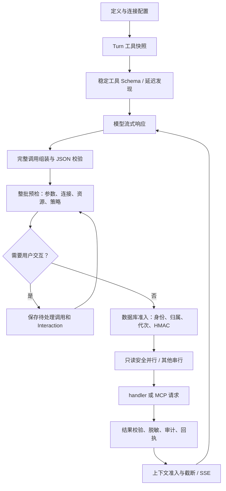

# 工具系统源码对照与迁移（2026-09-16）

## 范围和基线

固定源码版本：[`openai/codex@83dc7d11e873f43533dc898d50fae71cf4d55dc5`](https://github.com/openai/codex/tree/83dc7d11e873f43533dc898d50fae71cf4d55dc5)。

本次迁移的是产品 Agent 的工具执行链路：定义、按 Turn 冻结、发现和加载、模型调用组装、预检、准入、调度、执行、输出、审计和恢复。实现语言为 Python；业务工具仍操作本产品的对象。没有启动 Rust Codex，也没有把 Codex 的全部宿主工具移植进 Web 后端。

## 源码对照

下列路径均相对固定版本的 `codex-rs/core/src/`，不是随主分支变化的参考：

| 上游文件 | 关键契约 | 产品落点与状态 |
| --- | --- | --- |
| `tools/registry.rs` | 定义和执行 handler 配对；冲突不能静默覆盖；暴露与可调用性一致 | `tool_registry.py`：新增注册冲突、命名、类型检查；沿用冻结的 `ToolRegistryView` |
| `tools/spec_plan.rs` | 根据当前环境和配置构造工具面 | `TurnToolCatalog`：沿用内置白名单、延迟加载；新增跨来源名称冲突和持久化归属检查 |
| `tools/router.rs` | 完整调用项才路由；类型和调用身份明确 | `ToolCallAssembler`：新增完成标记、完整身份、重复 ID、参数体积和终止后 delta 检查 |
| `tools/context.rs` | 调用身份、上下文、来源与输出契约 | `AgentToolContext`、`ToolDispatchPlan`、`ToolExecutionPlan`：绑定 Turn、代次、effect、handler、连接和资源；严格 JSON 结果 |
| `tools/parallel.rs` | 等待准备完成后调度；显式并行能力；非并行调用独占；取消贯穿调用 | 沿用整批预检和只读并行调度；同资源串行；新增 MCP 排队取消隔离、活动请求保活和事件循环隔离 |
| `tools/orchestrator.rs`、`tools/approvals.rs` | 集中准入、具体操作审批、执行及失败处理 | 沿用 `tool_policy` 和持久化 Interaction；新增重放再次准入、计划代次约束、参数 HMAC；未复制 OS 沙箱提权重试 |
| `tools/lifecycle.rs` | 开始、完成和中止均有对应生命周期 | 沿用 `AgentToolCall` 的 started/finished/replay 时间线、真实完成顺序和 SSE；加强取消及非法结果的测试 |
| `mcp.rs`、`mcp_tool_call.rs` | 服务配置、发现、工具身份、审批和结构化 MCP 结果 | `mcp/manager.py`：真实 SDK 类型、分页、冲突检测、输入校验、会话隔离、错误回传；保留现有 SSRF 与凭证边界 |

这是源码契约迁移与产品适配清单，不代表每个 Rust 模块已逐行翻译，也不代表 OpenAI 私有服务端已迁移。

## 确认的根因和修复

1. **MCP 实际 SDK 契约错误**：原代码读取 `Tool.input_schema`，SDK 使用 `inputSchema`。旧测试的 `SimpleNamespace` 恰好伪造了错误字段，掩盖真实接入失败。改用实际字段，测试采用 `mcp.types.Tool/ListToolsResult`；另起真实 stdio MCP 子进程验证完整往返。
2. **发现不完整、名字可别名冲突**：原发现只处理一页；清洗后的名称可能相同。新增游标遍历、重复游标/页数/数量上限；发生清洗或截断时按原始身份追加摘要；重复名字直接拒绝。有效短名字保持不变。
3. **流式输出和执行之间没有完成屏障**：原来累积到的工具调用可能来自被截断的响应。现在只有正常结束、完成标记允许且身份完整的一批调用能够进入执行。流中异常、长度截断、身份变更均不会发布这批调用。
4. **参数契约会丢信息或悄悄接受多余参数**：保留参数说明和根约束；拒绝额外字段、重复 JSON 键和非有限 JSON 数值。错误细节不包含原始参数值。MCP Schema 校验器使用不带网络获取功能的 Registry，外部 `$ref` 不会触发服务器访问。
5. **旧计划与重放绕过最终准入**：计划原来没有绑定 Turn/代次/effect；已有结果可提前返回。现在重放仍经过持久化准入，检查归属、代次和实际调用身份。
6. **脱敏后参数不能证明原始参数一致**：新增 `AgentToolCall.arguments_digest`，以部署密钥计算带域分隔的 HMAC-SHA256。相同调用 ID 更换敏感参数会被拒绝，审计只保存脱敏内容及摘要。迁移 `0046` 不回填无法恢复的原始参数。
7. **MCP 连接生命周期相互干扰**：取消排队请求原本会关闭正在为另一调用服务的连接；空闲回收也未排除活动请求。现按请求是否开始决定是否关闭，pending 请求不被当作空闲；连接被关闭返回连接错误，不冒充另一 Turn 的主动取消。全局入口按事件循环隔离队列和任务，避免 API/worker 线程互用 asyncio 对象。
8. **恢复时只按工具名重新加载**：现在比较此前保存的完整 MCP Schema，变更的工具不会在同一 Turn 自动换成新契约；快照写入检查用户、会话和代次，并锁定 Turn 行。
9. **非结果被当作成功**：工具 handler 必须返回 JSON 对象；`None`、非有限浮点和任意 Python 对象返回 `tool_result_invalid`。内部取消的无返回值审计与 handler 成功结果明确区分。

## 运行链路

原始脱敏结果继续保存在唯一 Tool Call 上；给模型的截断投影由上一阶段的上下文模块处理。真实完成顺序与模型原始调用顺序分开记录，最终模型消息按原始顺序重建。

## 回归证据

- `test_tool_protocol.py`：不完整响应、身份变更、超限、重复 JSON 字段、注册冲突、参数说明、远端 Schema、分页与游标环、排队取消、跨事件循环隔离。
- `test_mcp_stdio_contract.py`：真实 SDK 与真实本地服务进程的初始化、发现、调用、非法参数和 MCP `isError` 回传、连接关闭。
- `test_tool_call_executor.py`：执行前/执行中取消、旧计划拒绝、重放重新验证、敏感参数变化拒绝、非法结果失败，以及既有审批、结果脱敏和审计测试。
- `test_turn_tool_catalog.py`：延迟加载、真实 SDK 对象、服务生命周期、Schema 漂移和旧代次禁止覆盖。
- `test_agent_strategy_stream.py`：真实完成顺序、模型消息顺序、整批审批屏障、同资源串行和 reasoning 回传。
- `test_tool_runtime_postgres.py`：有旧数据的 `0045 → head` 升级；真实数据库并发准入、重放与参数身份冲突。
- 回归同时覆盖模型适配器、Turn 执行、Interaction、上下文装配与数据库迁移。

最终联动回归 **375 passed，0 failed，0 skipped**（110.85 秒），记录为 `data/logs/tool-system-final.xml`。Ruff 检查通过，本次变更文件的 `git diff --check` 通过。整个工作区的 diff 检查另有先前前端文件的 EOF 空行提示，未借此修改前端。

实际开发库已经从 `0045` 升到 `0046`；后端、Turns worker、Jobs worker 和调度器重新启动。`GET /api/v1/health/ready` 返回 `ready`，数据库和 Redis 均为 `ok`。启动日志：`data/logs/backend-20260916-170314.log`。开发环境测试不代表所有外部 MCP 服务均已联调。

## 迁移和兼容边界

- 启动前运行 `alembic upgrade head`（`scripts/start.ps1` 已包含该步骤），当前 head 为 `0046`。此次新增列可空，不删除旧调用或会话。
- 无摘要的旧行：未脱敏参数仍可按完整已有值比对；包含 `[REDACTED]` 的旧行无法证明秘密相同，拒绝复用，需重新发起操作。部署密钥轮换后旧摘要也不能复用；不能因为摘要失配自动重试外部写入。
- 规范化名称发生变化的 MCP 工具必须重新发现，旧调用不能映射到可能不同的远端工具。
- MCP 参数外部引用不会被自动下载；连接方应提供自包含 Schema 或本地 `$defs`。
- 真实 stdio 联调已覆盖；任意远端 Streamable HTTP、OAuth 账号和第三方业务副作用没有在本次测试中逐一验证。
- Codex 的 OS sandbox、终端 PTY、`exec`/Code Mode JS 环境、任意宿主动态工具、扩展插件 hooks、MCP resources/elicitation UI 和多代理宿主工具**没有在本次变成产品能力**。它们需要相应宿主/前端及权限模型，不能把当前 JSON function 工具链宣称为这些能力的实现。
- MCP 工具缓存随连接/配置失效及 `tools/list_changed` 通知更新，执行前再比对当前描述符；发现过程中收到变更通知会拒绝发布不一致快照。未发送通知的远端服务仍可能自行改变行为，客户端不能保证它永不变化。
- 外部副作用超时后仍可能已经发生。沿用 `unknown/reconcile_required` 和资源封锁；不做无条件自动重试，测试通过也不等于外部系统提供 exactly-once 保证。

## 本次不做的仓库操作

没有清理 CareerOS 或其他工作区，没有覆盖先前未提交修改，没有自动提交或推送 Git。源码基线用于可复核对照；后续更新应重新核对源码契约和本页回归证据。
