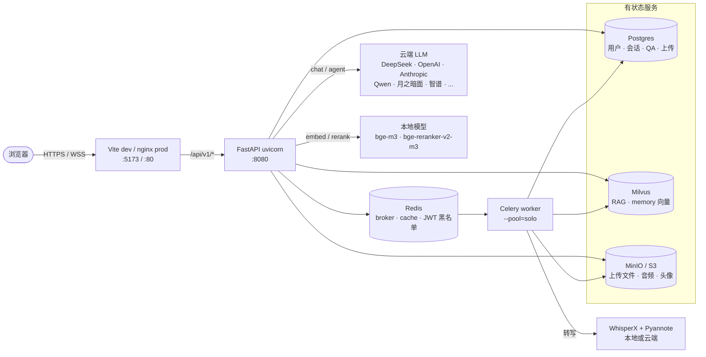

# Interview Copilot

<p align="center">
  <a href="../../README.md"></a>
  <a href="./README.md"></a>
</p>

> AI 面试练习与分析平台。实时语音模拟面试、录音深度分析（WhisperX +
> Pyannote 说话人分离）、基于简历和 JD 的 RAG 检索，以及工具调用 Agent
> 运行时 —— 全部通过用户级模型注册表打通，可用任意 OpenAI 兼容厂商
> （DeepSeek、OpenAI、Anthropic、阿里 Qwen、月之暗面、智谱、小米 MiMo、
> NVIDIA Catalog ……）。

📖 [新手上路](getting-started.md) · 🛠 [Provider 目录](providers.md) · 🩹 [排错](troubleshooting.md)

## 截图

<table>
  <tr>
    <td colspan="2" align="center"><sub><b>① 进入应用 —— 登录或注册</b></sub></td>
  </tr>
  <tr>
    <td width="50%"></td>
    <td width="50%"></td>
  </tr>
  <tr>
    <td align="center"><sub>登录 —— JWT access + refresh，jti 撤销名单在 Redis</sub></td>
    <td align="center"><sub>注册 —— 邮箱验证码流程（没配 SMTP 时验证码直接打在后端 stdout）</sub></td>
  </tr>
  <tr>
    <td colspan="2" align="center"><sub><b>② 配置 —— 挑模型、上传资料</b></sub></td>
  </tr>
  <tr>
    <td width="50%"></td>
    <td width="50%"></td>
  </tr>
  <tr>
    <td align="center"><sub>模型 —— 9 家厂商的用户级路由（主对话 / Agent / 模拟面试）</sub></td>
    <td align="center"><sub>资料库 —— 简历 / 面试题库 / 官方文档</sub></td>
  </tr>
  <tr>
    <td colspan="2" align="center"><sub><b>③ 使用 —— 模拟面试 或 复盘真实录音</b></sub></td>
  </tr>
  <tr>
    <td width="50%"></td>
    <td width="50%"></td>
  </tr>
  <tr>
    <td align="center"><sub>模拟面试 —— 上传简历 + JD，四种面试官风格</sub></td>
    <td align="center"><sub>复盘对话 —— 每条记录下多会话切换，对话中可换模型</sub></td>
  </tr>
</table>

---

## 核心模块

| 模块 | 用途 |
|---|---|
| **模拟面试** | 实时语音 LLM 面试官 + TTS 语音回答；可选风格（友善 / 专业 / 严谨 / 高压）。 |
| **录音分析** | 上传真实面试录音 → WhisperX 转写 → Pyannote 说话人分离 → 三阶段 MapReduce LLM 分析（逐题打分 + 阶段摘要 + 能力雷达）。 |
| **复盘对话** | 围绕你的简历 / JD / 文档的 dense + BM25 混合检索，交叉编码器重排。 |
| **Agent** | 工具调用运行时：网页搜索（Tavily）、文件读写、memory、结构化事件流。 |
| **每用户模型路由** | 每个用户在「模型」页给三个角色（primary / fast / agent）各选一个 LLM。开箱 9 家厂商、30+ 个 profile，加新厂商一行配置就够。 |

---

## 架构



LLM / embedding / reranker / ASR 走小型 **provider 注册表**。在 `.env` 里
配 `*_PROVIDER` + 任意 `*_MODEL` 字符串。加新厂商 = `MODEL_PROFILES` 加
一条；加新模型 = 零代码。

---

## 二选一

### 🌐 路线 A —— API 轻量版 *（云端全包，本机零下载）*

适合：端到端体验、没 GPU、不想吃磁盘。

需要**两个** key：

1. **一家 LLM 厂商**（推荐 DeepSeek —— 最便宜上手）。
2. **一家 embedding + reranker + ASR 联合厂商**（推荐硅基流动 ——
   一把 key 覆盖三个角色）。

```bash
git clone https://github.com/<your-org>/Interview_Copilot.git
cd Interview_Copilot
conda create -n interview-copilot python=3.11 -y    # 或 3.10 / 3.12，不要 3.13
conda activate interview-copilot

.\scripts\setup.ps1                                  # Windows（Linux / macOS：./scripts/setup.sh）
# setup 提示时输入 "1"：[1] API-light  [2] Local-models

# 打开 .env，粘两把 key：
#   DEEPSEEK_API_KEY=sk-...
#   SILICONFLOW_API_KEY=sk-...

.\scripts\start.ps1 -SkipFrontend                    # tab 1
.\scripts\start.ps1 -SkipBackend                     # tab 2

# 浏览器开 http://localhost:5173 → 注册 → 验证码在后端终端能看到
# （不需要配 SMTP）→ 登录 → 聊天。
```

### 💻 路线 B —— 本地版 *（embedding / reranker / ASR 都跑在本机）*

适合：隐私、离线、已经有 GPU 的人。

只要**一把** key（LLM 仍走云）：

```bash
# 1-2 跟路线 A 一样，但 setup 提示时输入 "2"。

# 打开 .env，只粘一把 LLM key：
#   DEEPSEEK_API_KEY=sk-...

python scripts/init_models.py --dry-run              # 实时从 HuggingFace 查大小
python scripts/init_models.py                        # 总共约 5GB，支持字节级断点续传

.\scripts\start.ps1 -SkipFrontend                    # tab 1
.\scripts\start.ps1 -SkipBackend                     # tab 2

# 注册 / 登录 跟路线 A 一样。可以试录音分析流程 —— WhisperX + Pyannote
# 全部本地跑。
```

→ **逐步说明 + 预期输出 + 坑点全在：
[docs/zh/getting-started.md](getting-started.md)**

第三种 **Hybrid** 模式（云端 ASR + 本地说话人分离）任何一条路上改 2
行 env 就能切，详见 `docs/zh/providers.md`。

---

## 仓库结构

```
backend/
  app/
    api/              FastAPI 路由（auth, chat, interview, rag, model_runtime）
    core/             config, security, rate_limit, model_registry, llm_tracing
    rag/              embedding/reranker 注册表、retriever、ingestion
    services/         业务逻辑（chat, voice, knowledge, memory, agent, …）
    worker/           Celery app + tasks
    scripts/          一次性维护脚本，可用 `python -m app.scripts.X` 调用
  tests/              ~390 个测试（api / services / rag / models / core / db）
frontend/
  src/                React SPA（Vite + TS + Tailwind + zustand）
  public/             nginx 配置 / _headers / _redirects
alembic/versions/     数据库迁移（0001 → 0019）
nginx/conf.d/         反向代理配置（dev + production）
scripts/              setup / start / stop · init_models / refresh_models · wipe_non_admin / migrate_avatars
docs/                 ← 你在这里
  zh/                 每个文档的中文版
.github/workflows/    CI（后端测试、ruff、前端构建）
```

---

## 文档

| 主题 | English | 中文 |
|---|---|---|
| 完整上手 | [getting-started.md](../getting-started.md) | [getting-started.md](getting-started.md) |
| Provider 目录（LLM / embed / rerank / ASR） | [providers.md](../providers.md) | [providers.md](providers.md) |
| Postgres 性能调优 | [postgres-tuning.md](../postgres-tuning.md) | [postgres-tuning.md](postgres-tuning.md) |
| 排错 | [troubleshooting.md](../troubleshooting.md) | [troubleshooting.md](troubleshooting.md) |
| Cloudflare Pages 部署 *（进阶 / 可选）* | [deploy-cloudflare-pages.md](../deploy-cloudflare-pages.md) | [deploy-cloudflare-pages.md](deploy-cloudflare-pages.md) |

Cloudflare 那一篇是 **可选** 的。本地开发完全不需要 ——
`docker compose up` + `npm run dev` 足够。只有想要"公网域名 + 免费 SSL +
CDN"的时候才用得到。

---

## 技术栈

- **API**：FastAPI 0.135、SQLAlchemy 2、Pydantic v2、slowapi（限流）、Sentry SDK
- **后台任务**：Celery 5 + Redis（队列 / 缓存 / 黑名单）
- **存储**：PostgreSQL 15、Milvus 2.5（向量）、MinIO（S3 兼容）
- **AI**：LlamaIndex、BGE-M3 + BGE-Reranker-v2-m3、WhisperX、Pyannote
- **LLM**：任意 OpenAI 兼容 API（默认 DeepSeek）
- **前端**：React 18、Vite 5、Tailwind、zustand、react-virtual
- **基础设施**：Docker Compose、nginx
- **观测**：Sentry（错误）、LangSmith（LLM trace，按需启用）

---

## License

MIT.
