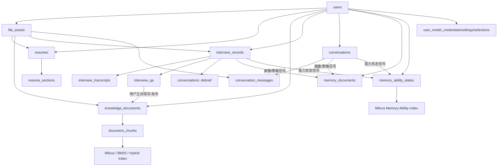

# 数据架构重构 RFC

> 状态: 草稿
> 目的: 记录 Interview Copilot 数据库、上传、知识库、简历、面试、对话、记忆、模型配置的目标架构讨论。本文先沉淀共识和设计边界，后续再拆成实施任务。

## 1. 背景与目标

当前项目的数据表已经覆盖了认证、上传、知识库、简历、面试、对话、长期记忆和模型配置等功能，但一些表的职责边界还不够清楚:

- `username` 在多处被当作业务外键使用，长期会限制用户名修改、账号迁移和跨系统集成。
- 上传文件、业务文档、检索 chunk、简历、面试复盘产物之间的生命周期边界不够清晰。
- 简历既像知识库文档，又有独立的结构化解析结果，未来应该成为个人资料域的一等实体。
- 面试转录、逐题改进答案、复盘对话、知识库文档、长期记忆之间存在职责重叠。
- Memory v3 应只承担长期稳定沉淀，不应混入文件、转录、逐题答案等业务事实。
- 模型配置目前分散在用户 JSON 字段和若干表中，也应纳入稳定 `user_id` 外键体系。

本次重构目标:

- 重构为结构清晰、功能边界明确的数据模型。
- 全系统统一使用稳定 `users.id` 作为业务外键，不再使用 `username` 作为事实外键。
- 明确原始文件、业务文档、检索索引、面试事实、对话过程、长期记忆之间的事实来源。
- 为上传路径统一、知识库重构、Milvus 2.6.x hybrid 检索、简历一等实体化打基础。

## 2. 已确认原则

1. 简历是一等实体，之后不再进入知识库。简历属于个人信息/个人资料域。
2. 面试复盘产物中，转录和逐题改进答案先属于面试记录。
3. 只有用户主动保存或发布时，面试改进答案才变成知识库文档。
4. Memory v3 只存长期用户画像、学习策略和能力状态，不承担存文件、存改进答案全文、存转录的职责。
5. `users.id` 是全系统唯一稳定业务外键。`username` 只用于登录名或展示名，不再作为业务数据外键。
6. 对话应该成为独立一等实体，统一承载 general、debrief、mock_interview 三类消息流；agent 是 general/debrief 下的运行模式，不是 conversation type。
7. 模型配置域应一起纳入重构，避免一部分表使用稳定 `user_id`、另一部分仍使用 `username`。
8. `document_chunks` 存 chunk 全文。Postgres 保存 chunk 事实；Milvus 2.6.x 承担 dense vector + BM25/full-text hybrid 检索索引。
9. `conversations` 第一阶段接受 `subject_type` / `subject_id` 弱外键，但应用层必须严格校验 subject 存在和归属。
10. 通用、复盘、模拟面试三种对话链路统一到 `conversations` / `conversation_messages` 消息流底座；模拟面试运行态单独进入 `mock_interview_runtime`，仍复用对话消息底座。
11. 第一阶段不强制将完整模型目录落库，优先结构化用户侧模型配置。模型 catalog 仍可继续使用现有代码/Redis/seed 流程。
12. 每个用户最多保留两份简历，其中一份为默认简历；不引入简历版本表。
13. JD 不作为一等实体，只作为面试启动/复盘时的文本快照或文件快照存在。
14. 面试转录拆为独立 `interview_transcripts` 表。
15. 知识库 `source_kind` 表示系统来源类型，不表示用户分类。用户可见整理方式主要由 `category` 承载。
16. 删除默认简历时，如果用户还有另一份简历，另一份应自动成为默认简历。
17. 目标架构不保留 LlamaIndex `PostgresDocumentStore` 作为长期存储，也不保留旧 RAG 路径兼容；LlamaIndex 可继续用于读取、切块、embedding 等处理能力。删除 docstore 时必须区分知识库路径和简历向量路径，不能先删除仍被简历检索依赖的存储。
18. 持久业务文件统一进入 `file_assets`；`file_assets` 只表示原始文件资产，不作为业务实体。
19. 大文件和持久业务文件只走预签名上传，不保留 direct upload 业务路径。
20. mock 面试语音片段需要持久保存，作为 `file_assets(purpose='mock_audio_clip')` 关联到对话消息和面试 QA。
21. 上传、解析、索引、转录等后台任务状态使用轮询；SSE 只用于 chat/agent/debrief/mock 对话流式输出和对话事件。
22. 所有使用简历的业务都必须保存当时的简历快照。历史面试、复盘、模拟面试不能依赖会被用户持续修改或替换的个人简历正文。
23. 每份个人简历记录都有唯一稳定 ID，和文件名无关；同名文件再次上传也不能复用旧 ID。
24. 业务记录删除时，属于该业务记录的专属关联数据应同步软删除或进入清理队列；共享的个人简历、知识库文档不因业务记录删除而删除。
25. 知识库负责内容资产，Memory 负责用户状态。知识库检索与 `memory_ability_states` 检索可以并发执行，走统一 hybrid retrieval 链路，但使用不同 collection 和参数。
26. 模拟面试按目标架构重构，不再迁就旧的两步启动链路；开始模拟面试时由 start 接口原子创建 `interview_records`、`conversations` 和 `mock_interview_runtime`。
27. 注册链路为了用户体验可以明确提示账号已注册；登录、找回/重置密码等链路继续使用通用提示，避免扩大账号枚举面。
28. 改密或重置密码后，旧 access token / refresh token 必须立刻失效；目标架构使用 `users.token_version` 作为强校验基准。
29. Sentry 暂不纳入第一阶段。当前未到正式上线阶段，Sentry 增加依赖、配置和隐私脱敏复杂度；后续需要时可作为独立观测插件重新接入。
30. RAG 检索坚持宁缺毋滥。阈值过滤后没有命中就返回空结果，不再放宽分数阈值，也不再用词面覆盖 fallback 强行注入参考内容。
31. 梦境记忆批处理触发只使用新增 debrief message 数阈值，不再使用新增 debrief session 数阈值。
32. Memory 写入必须有可重试机制。实时提取和 dreaming 提取都通过持久 job 执行；瞬时 LLM、数据库、索引失败可以重试，证据不足或 patch 冲突不应无限重试。
33. RAG 兜底切分采用多语言递归符号/结构切分。结构化文档优先保留原始结构；无可靠结构时再按段落、换行、句末标点、逗号、空格递归切分。

## 3. 目标数据域

目标架构分为两层: 主业务数据域和配置/能力数据域。

### 3.1 主业务数据域

- 身份域: `users`
- 文件资产域: `file_assets`
- 简历域: `resumes`, `resume_sections`
- 知识库域: `knowledge_documents`, `document_chunks`
- 面试域: `interview_records`, `interview_transcripts`, `interview_qa`, `mock_interview_runtime`
- 对话域: `conversations`, `conversation_messages`
- 长期记忆域: `memory_documents`, `memory_ability_states`, `memory_audit_logs`
- 后台任务域: `outbox_jobs`

### 3.2 模型配置数据域

- 用户模型凭据: `user_model_credentials`
- 用户 provider 设置: `user_model_provider_settings`
- 用户模型选择: `user_model_selections`
- 系统模型目录不作为第一阶段数据库表。provider/model catalog 继续由代码配置、seed、Redis/live refresh 或运行时 catalog 承担。

## 4. 目标表职责表

### 4.1 主业务表

| 目标表 | 负责什么 | 不负责什么 | 主要关联 |
| --- | --- | --- | --- |
| `users` | 用户身份、登录名、邮箱、密码哈希、基础状态、个人资料入口 | 不再塞模型选择 JSON、不再直接存 Memory 正文 | 被所有用户数据表通过稳定 `user_id` 引用 |
| `file_assets` | 原始上传文件: 文件名、对象存储 key、content type、大小、上传状态、校验状态、用途 | 不表达业务语义，不决定自己是简历还是知识文档 | `resumes`, `knowledge_documents`, `interview_records` 可引用它 |
| `resumes` | 简历一等实体: 原文快照、解析状态、是否默认简历、来源文件 | 不进入知识库，不和普通 RAG 文档混排 | 属于 `users`，可引用 `file_assets` |
| `resume_sections` | 简历结构化分段: 项目、教育、技能、经历、摘要 | 不存原始 PDF，不承担通用知识库 chunk 职责 | 属于 `resumes` |
| `knowledge_documents` | 用户知识库文档: 题库、笔记、官方文档、主动保存的改进答案 | 不存简历，不存面试原始转录，不承担长期记忆职责 | 属于 `users`，可引用 `file_assets`，派生 `document_chunks` |
| `document_chunks` | 知识文档切块后的检索单元元数据: chunk 文本/摘要、顺序、索引状态、Milvus node id | 不作为用户手动编辑的主文档，不存简历 section | 属于 `knowledge_documents` |
| `interview_records` | 一次面试事实主表: 真实录音或模拟面试、状态、标题、关联简历/JD、转录摘要、综合分析 | 不存聊天消息流，不把改进答案直接当知识库 | 属于 `users`，可引用 `file_assets`, `resumes` |
| `interview_transcripts` | 面试转录全文和分段数据 | 不存逐题评分、不承担复盘聊天上下文 | 属于 `interview_records` |
| `interview_qa` | 面试逐题问答: 问题、回答、评分、评语、改进答案、阶段、追问关系 | 不负责知识库检索；用户保存后才生成知识文档 | 属于 `interview_records` |
| `mock_interview_runtime` | 模拟面试进行中的运行态: 当前阶段、阶段计划、状态、开始/结束时间 | 不存最终评分/改进答案，不替代对话消息和面试记录 | 属于 `interview_records`，可引用 `conversations` |
| `conversations` | 所有对话 session: general、debrief、mock_interview；保存类型、模式、摘要、上下文游标、绑定对象 | 不存业务事实本身，不替代面试记录/简历/知识库 | 属于 `users`，可通过 `subject_type` / `subject_id` 绑定业务对象 |
| `conversation_messages` | 对话消息流: user/assistant/tool、seq、content blocks、rewritten query | 不存长期记忆，不存面试 QA 的最终结构化事实 | 属于 `conversations` |
| `memory_documents` | Memory 文档: user_profile、learning_strategy 等全局长期状态 | 不存文件、转录、逐题改进答案全文、知识库正文 | 属于 `users` |
| `memory_ability_states` | 用户在具体主题/能力上的长期掌握状态 | 不存完整知识答案，不替代知识库文档 | 属于 `users`，可被 Milvus hybrid 检索 |
| `memory_audit_logs` | 记忆变更审计: patch 来源、前后内容、来源会话/面试 | 不作为当前记忆读取主路径 | 属于 `users`，可选关联 `memory_documents` 或 `memory_ability_states` |
| `outbox_jobs` | 跨系统异步任务: 删除对象、删除 Milvus 索引、解析、转录、ingest、清理失败上传 | 不作为用户业务事实，不替代业务表状态 | 属于 `users`，通过 aggregate 指向业务对象 |

### 4.2 模型配置表

| 目标表 | 负责什么 | 不负责什么 | 主要关联 |
| --- | --- | --- | --- |
| `user_model_credentials` | 用户的 provider API key 密文、masked key、验证状态 | 不存模型选择、不存 provider 全局 catalog | 属于 `users`，通过 `provider_key` 关联运行时 catalog |
| `user_model_provider_settings` | 用户级 provider 配置: enabled、api_base_override、org id、headers | 不存 API key 密文，不存 provider 全局 catalog | 属于 `users`，通过 `provider_key` 关联运行时 catalog |
| `user_model_selections` | 用户选择哪个模型承担哪个角色: primary、fast、agent、mock、embedding、reranker、transcription、tts | 不存模型能力元数据 | 属于 `users`，保存 `provider_key` / `model_key` / `profile_id` |

## 5. 目标表关键字段

本节只定义架构级关键字段，不是最终 DDL。最终字段类型、索引、约束和迁移脚本需要在实施阶段逐表细化。

### 5.1 主业务表字段

#### `users`

关键字段:

- `id`: 稳定用户主键，全系统业务外键。
- `username`: 登录名/展示名，可修改，不作为其他业务表事实外键。
- `email`: 邮箱，唯一。
- `hashed_password`: 密码哈希。
- `email_verified`, `is_active`: 账号状态。
- `nickname`, `avatar_url`, `bio`: 个人资料展示字段。
- `token_version`: token 版本号，签发 access/refresh token 时写入 JWT；改密或重置密码时递增，使旧 token 立刻失效。
- `password_changed_at`: 最近改密时间，用于审计、展示和辅助排查。
- `created_at`, `updated_at`: 时间戳。

迁移要点:

- 现有大量表的 `user_id` 实际存的是 `username`。迁移时需要先新增稳定 `user_id_int` 或等价字段，回填后再切读写。
- 稳定用户外键迁移采用逐域 expand/migrate/contract，不在认证 PR 中一次性改完所有业务表。
- `users.model_selection_json` 迁出到 `user_model_selections`。
- `users.user_profile_doc` 迁出到 `memory_documents(type='user_profile')`。

#### `file_assets`

关键字段:

- `id`: 文件资产主键。
- `user_id`: 稳定用户外键。
- `purpose`: 上传目的，如 `resume`, `knowledge_document`, `interview_audio`, `mock_audio_clip`, `avatar`, `jd`。
- `original_filename`: 用户原始文件名。
- `storage_backend`: `s3` / `local` 等。
- `bucket`, `object_key`, `storage_uri`: 对象存储定位信息。
- `content_type`, `size_bytes`, `checksum_sha256`: 文件元数据。
- `upload_status`: `pending_upload`, `uploaded`, `consumed`, `deleted`, `failed`。
- `validation_status`: `pending`, `passed`, `failed`, `skipped`。
- `validation_error`: 校验失败原因。
- `created_at`, `updated_at`, `deleted_at`: 生命周期时间戳。

设计说明:

- `file_assets` 只表示原始文件资产，不表达业务语义。
- 统一上传路径时，所有大文件都应先落到 `file_assets`，再由业务表引用。
- 业务持久文件不保留 direct upload 路径。上传统一走预签名 URL + confirm upload。

#### `resumes`

关键字段:

- `id`: 简历主键。
- `user_id`: 稳定用户外键。
- `file_asset_id`: 来源文件，可为空，支持未来纯文本/手工创建。
- `title`: 简历标题。
- `is_default`: 是否默认简历。
- `raw_text_snapshot`: 简历原文快照。
- `structured_json`: 简历结构化解析结果，可选。
- `parse_status`: `pending`, `ready`, `failed`。
- `parse_error`: 解析失败原因。
- `created_at`, `updated_at`, `archived_at`: 生命周期时间戳。

设计说明:

- 简历是一等实体，不进入 `knowledge_documents`。
- 多份简历应由 `user_id + is_default` 或应用逻辑保证每个用户最多一个默认简历。
- 产品约束: 每个用户最多两份有效个人简历，其中一份为默认简历。
- 不引入 `resume_versions`。两份简历表示两份不同简历，不表示同一简历的版本历史。
- 每份个人简历记录都有唯一稳定 ID，和文件名无关。同名文件再次上传、替换或重新解析，也不能复用旧 ID。
- 替换个人简历时应创建新的简历事实或归档旧简历后写入新记录，不能因为文件名相同而复用旧 ID。
- `archived_at is null` 的记录才计入“两份有效个人简历”限制；历史归档记录不在个人信息页展示。

#### `resume_sections`

关键字段:

- `id`: 分段主键。
- `resume_id`: 简历外键。
- `user_id`: 稳定用户外键，冗余用于查询和安全过滤。
- `section_type`: `summary`, `project`, `experience`, `education`, `skill`, `other`。
- `title`: 分段标题。
- `content`: 分段正文。
- `metadata_json`: 技术栈、时间范围、公司、学校等结构化补充。
- `order_idx`: 展示和拼接顺序。
- `embedding_status`: 简历专属检索/匹配索引状态，可选。
- `created_at`, `updated_at`: 时间戳。

设计说明:

- `resume_sections` 不再直接挂 `upload_id`。
- 如果保留简历专属向量检索，应服务于简历域，不混入知识库 RAG。
- 简历专属向量检索不能继续依赖知识库 docstore。目标事实源为 `resumes` / `resume_sections.content`，Milvus resume collection 只保存索引副本。

#### `knowledge_documents`

关键字段:

- `id`: 知识文档主键。
- `user_id`: 稳定用户外键。
- `file_asset_id`: 来源文件，可为空。
- `source_kind`: `user_upload`, `improved_qa`, `manual_text`。
- `title`: 标题。
- `category`: 用户分类。
- `status`: `processing`, `ready`, `failed`, `deleted`。
- `content_text`: 知识库文档正文，用于展示、切块和重建索引。
- `source_ref_type`, `source_ref_id`: 来源业务对象，如 `interview_qa`。
- `chunk_count`: chunk 数。
- `error_message`: 处理失败原因。
- `created_at`, `updated_at`, `deleted_at`: 生命周期时间戳。

设计说明:

- 不承载简历。
- 面试改进答案只有在用户主动保存/发布时才生成 `knowledge_documents` 记录。
- `source_kind` 表示系统来源类型，不是用户分类。
- `user_upload` 表示用户上传文件生成的知识文档。题库、官方文档、面经、笔记等都可以先归为该来源。
- `improved_qa` 表示用户从面试 QA 主动保存的改进问答对。
- `manual_text` 预留给未来用户直接粘贴/手写创建的知识文档；如果第一阶段不支持手写文档，可暂不开放。
- 用户可见分类使用 `category` 字段承载，例如 Redis、八股文、官方文档、字节面经、系统设计、我的弱项。

#### `document_chunks`

关键字段:

- `id`: chunk 主键。
- `document_id`: `knowledge_documents` 外键。
- `user_id`: 稳定用户外键，冗余用于安全过滤。
- `chunk_index`: 文档内顺序。
- `text`: chunk 正文或必要摘录。
- `text_hash`: chunk 内容 hash，用于幂等和变更检测。
- `metadata_json`: source、category、标题、页码、时间等元数据。
- `vector_node_id`: Milvus node id / 外部索引 id。
- `lexical_index_id`: BM25/full-text 索引引用，可选。
- `index_status`: `pending`, `indexed`, `failed`, `deleted`。
- `deleted_at`: chunk 软删除时间。
- `created_at`, `updated_at`: 时间戳。

设计说明:

- `document_chunks` 是知识库检索单元的本地事实表。
- Milvus 2.6.x 承担 dense vector + BM25/full-text hybrid 检索索引。
- Milvus collection 存一份 text 作为 BM25/full-text 索引用字段；Postgres `document_chunks.text` 继续作为业务事实源。
- 目标架构不使用 LlamaIndex `PostgresDocumentStore` 持久化 chunk，也不从 docstore 构建 BM25 cache。

#### `interview_records`

关键字段:

- `id`: 面试记录主键。
- `user_id`: 稳定用户外键。
- `source`: `upload`, `mock`。
- `title`: 展示标题。
- `category`: 面试主分类，用于按类别筛选和展示。
- `tag`: 自由标签或兼容旧字段。
- `audio_file_asset_id`: 录音/视频来源文件，可为空。
- `resume_id`: 面试使用的简历实体，可为空。
- `resume_file_asset_id`: 当前业务入口临时上传的简历文件，可为空。
- `resume_source`: `personal_resume`, `context_upload`, `none`。
- `resume_title_snapshot`: 面试当时使用的简历标题快照。
- `jd_file_asset_id`: JD 文件来源，可为空。
- `jd_text_snapshot`: JD 文本快照。
- `resume_text_snapshot`: 面试当时使用的简历文本快照。
- `resume_structured_snapshot_json`: 面试当时使用的简历结构化快照，可选。
- `transcript_id`: 当前转录记录引用，可选。
- `analysis_json`, `analysis_schema_version`: 复盘分析结果。
- `debrief_summary`: 复盘对话稳定摘要。
- `status`: `pending`, `transcribing`, `analyzing`, `mock_in_progress`, `processing_review`, `review_ready`, `review_failed`, `cancelled`。
- `analyzed_qa_count`, `celery_task_id`, `error_message`: 任务状态辅助字段。
- `created_at`, `updated_at`, `completed_at`, `last_dreamed_at`: 时间戳。

设计说明:

- `InterviewRecord` 是面试事实源；对话只引用它，不替代它。
- JD 只作为面试快照存在，不新增 `job_descriptions` 一等实体。
- 所有使用简历的面试记录都必须保存当时的简历快照。`resume_id` 只是指向个人简历的来源引用，历史复盘读取应优先使用 `resume_text_snapshot` / `resume_structured_snapshot_json`。
- 模拟面试开始时创建 `interview_records(status='mock_in_progress')`，但复盘列表只展示 `review_ready` 等已完成复盘产物。旧数据中的 `completed` 可在迁移时映射为 `review_ready`，旧 `failed` 可映射为 `review_failed`。

#### `interview_transcripts`

关键字段:

- `id`: 转录主键。
- `record_id`: 面试记录外键。
- `user_id`: 稳定用户外键，冗余用于查询和安全过滤。
- `provider`: 转录提供方，如 `local_whisperx`, `openai`, `dashscope`。
- `language`: 转录语言提示或识别结果。
- `text`: 转录全文。
- `segments_json`: 带时间戳、说话人、置信度的分段。
- `duration_seconds`: 音视频时长，可选。
- `status`: `pending`, `processing`, `ready`, `failed`。
- `error_message`: 转录失败原因。
- `created_at`, `updated_at`: 时间戳。

设计说明:

- 转录是面试事实的一部分，但体积和生命周期与 `interview_records` 主表不同，因此独立成表。
- `interview_records` 可保存 `transcript_id` 指向当前有效转录。

#### `interview_qa`

关键字段:

- `id`: QA 主键。
- `record_id`: 面试记录外键。
- `order_idx`: 面试内题号顺序。
- `phase_key`, `phase_label`: 面试阶段，如自我介绍、简历项目深挖、岗位相关技术考察、反问。
- `question`, `answer`, `question_summary`: 问题与回答。
- `is_follow_up`, `parent_qa_id`: 追问关系，可选；不用于实现复杂追问硬约束。
- `source_segment_start`, `source_segment_end`: 录音转录来源时间段。
- `score`, `critique`, `improved_answer`, `key_points_json`: 逐题复盘产物。
- `question_audio_file_asset_id`, `answer_audio_file_asset_id`: mock 面试中问题/回答语音片段引用，可选。
- `saved_document_id`: 用户主动保存为知识库文档后的引用，可选。
- `created_at`, `analyzed_at`: 时间戳。

设计说明:

- `improved_answer` 首先属于 `interview_qa`。
- 保存到知识库时生成 `knowledge_documents(source_kind='improved_qa')`，并回填 `saved_document_id`。
- 模拟面试结束并完成复盘解析后，从模拟面试过程消息固化生成 `interview_qa`。模拟面试过程中的消息不是最终 QA 事实。

#### `mock_interview_runtime`

关键字段:

- `id`: 模拟面试运行态主键。
- `user_id`: 稳定用户外键，冗余用于查询和安全过滤。
- `interview_record_id`: 对应的模拟面试记录。
- `conversation_id`: 对应的 mock_interview 对话。
- `status`: `in_progress`, `processing_review`, `completed`, `review_failed`, `failed`。
- `current_stage_key`: 当前面试阶段 key。
- `stage_index`: 当前阶段在 `plan_json` 中的顺序。
- `current_question_text`: 当前等待用户回答的问题文本。
- `current_question_message_id`: 当前问题对应的 `conversation_messages.id`，用于结束后稳定归并 QA。
- `plan_json`: 本次模拟面试的阶段计划。第一阶段只维护通用模板: 自我介绍、简历项目深挖、岗位相关技术考察、反问。
- `plan_template_key`: 使用的岗位模板 key，第一阶段固定为 `general`。
- `interviewer_style`, `voice_mode`: 面试官风格和交互模式快照。
- `started_at`, `ended_at`, `last_activity_at`: 模拟面试开始、结束和最近活动时间。
- `created_at`, `updated_at`: 时间戳。

设计说明:

- `mock_interview_runtime` 只表示模拟面试进行中的状态，不保存最终评分、改进答案和长期复盘结果。
- 模拟面试 start 接口负责一次性创建 `interview_records(status='mock_in_progress')`、`conversations(type='mock_interview')` 和 `mock_interview_runtime(status='in_progress')`。前端不再先创建通用 chat session 再启动 mock。
- 用户结束模拟面试后，`interview_records.status` 进入 `processing_review`，系统从模拟面试过程消息生成结构化 QA、评分、改进答案和总结；解析完成后才写入或确认 `interview_qa`。
- 当 `interview_records.status` 变为 `review_ready` 后，这次模拟面试才进入复盘界面。
- 复盘生成失败时，`interview_records.status='review_failed'`，`mock_interview_runtime.status='review_failed'`。用户可以基于保留的 `conversation_messages` 重新生成复盘，不需要重新面试。
- 用户主动放弃模拟面试时，直接删除或软删除该场未完成面试的 `interview_records`、`mock_interview_runtime`、`conversations`、`conversation_messages` 和 mock 音频 `file_assets`；主动放弃不保留可恢复记录。
- 浏览器关闭、刷新、网络断开等非主动离开不删除数据；通过 `mock_interview_runtime.status='in_progress'` 和 `last_activity_at` 恢复。
- 第一阶段不引入单独的题目表、阶段表或 Runtime Director 概念；下一轮面试官回复由 mock interview 服务根据 `plan_json`、当前阶段和消息历史生成。

#### `conversations`

关键字段:

- `id`: 对话主键。
- `user_id`: 稳定用户外键。
- `type`: `general`, `debrief`, `mock_interview`。
- `mode`: `chat`, `agent`。
- `title`: 对话标题。
- `subject_type`, `subject_id`: 绑定业务对象，如 `interview_record`。
- `summary`: 会话压缩摘要。
- `compaction_cursor`: 上下文压缩游标。
- `memory_extraction_cursor`: 记忆提取游标。
- `turn_count`: 对话轮数。
- `global_memory_enabled`: 会话级记忆开关快照/覆盖。
- `archived_at`, `created_at`, `updated_at`: 生命周期时间戳。

设计说明:

- 对话成为一等实体，统一承载 general、debrief、mock_interview。
- `agent` 是 general/debrief 的运行模式，与 `chat` 并列，不作为 conversation type。
- `mock_interview` 不使用 agent mode。
- `subject_type` / `subject_id` 第一阶段作为多态弱外键。创建和读取时由应用层校验 subject 存在、属于当前用户、类型合法。
- 删除 subject 时必须明确处理关联 conversation，例如归档、级联删除或阻止删除。

#### `conversation_messages`

关键字段:

- `id`: 消息主键。
- `conversation_id`: 对话外键。
- `seq`: 会话内递增序号。
- `role`: `user`, `assistant`, `tool`, `system`。
- `content`: 纯文本内容。
- `content_blocks_json`: 多模态/工具调用 blocks。
- `content_blocks_json` 可引用 `file_asset_id`，用于保存 mock 面试语音片段等多模态资产。
- `rewritten_query`: 查询规划后的改写问题，可选。
- `tool_call_id`, `tool_name`: 工具消息配对辅助字段，可选。
- `created_at`: 时间戳。

设计说明:

- 保留 `(conversation_id, seq)` 唯一约束，防并发追加乱序。
- 不把最终面试 QA 事实写在这里；结构化事实属于 `interview_qa`。

#### `memory_documents`

关键字段:

- `id`: 记忆文档主键。
- `user_id`: 稳定用户外键。
- `doc_type`: `user_profile`, `learning_strategy`。
- `body`: Markdown 正文。
- `one_liner`: 摘要行。
- `last_discussed_at`: 最近讨论时间。
- `created_at`, `updated_at`: 时间戳。

设计说明:

- `memory_documents` 只存全局长期状态，不存知识库正文。
- `user_profile` 表示用户背景、目标、偏好、表达特点、行为倾向。
- `learning_strategy` 表示长期训练策略、复盘策略、答题策略。
- `habit` 不再作为独立类型，相关内容合并到 `user_profile` 或 `learning_strategy`。
- `user_id + doc_type` 唯一。
- 读取方式以场景加载或摘要加载为主，不作为主题型 hybrid 检索主路径。

#### `memory_ability_states`

关键字段:

- `id`: 能力状态主键。
- `user_id`: 稳定用户外键。
- `topic`: 主题名，如 Redis 缓存穿透、MySQL 索引、项目深挖、行为面试。
- `skill_type`: `knowledge_topic`, `system_design`, `behavioral`, `communication`, `project_deep_dive` 等。
- `mastery_level`: `weak`, `improving`, `stable`, `strong`。
- `summary`: 一段短文本，描述用户当前状态和主要问题。
- `evidence_refs_json`: 状态依据来源，如 `interview_qa`, `conversation_message`, `interview_record`。
- `search_text`: 给 Milvus hybrid 检索用的规范化文本，可由 topic + summary 拼接生成。
- `last_evidence_at`: 最近一次证据时间。
- `created_at`, `updated_at`, `archived_at`: 生命周期时间戳。

设计说明:

- `memory_ability_states` 存用户能力状态，不存完整知识答案。
- 它可以从面试 QA、复盘对话、通用对话中提炼，但不保存文件、转录、改进答案全文。
- Postgres 是能力状态事实源，Milvus 只保存 `search_text` 和 metadata 的索引副本。
- `user_id + topic + skill_type` 对有效记录唯一。
- 知识库检索和 `memory_ability_states` 检索可以并发执行，走统一 hybrid retrieval 链路；两者使用不同 Milvus collection、不同 top_k/阈值/上下文预算。

#### `memory_audit_logs`

关键字段:

- `id`: 审计主键。
- `user_id`: 稳定用户外键。
- `memory_document_id`: 目标记忆文档外键，可选。
- `memory_ability_state_id`: 目标能力状态外键，可选。
- `doc_type`, `topic`: 冗余快照，方便审计查询。
- `change_type`: `patch_realtime`, `patch_dreaming`, `user_edit` 等。
- `source_conversation_id`, `source_interview_record_id`: 来源。
- `source_message_range_json`: 来源消息范围，可选。
- `idempotency_key`: 幂等键，防止同一个 memory job 重试时重复写审计或重复应用同一 patch。
- `before_body`, `after_body`: 变更前后快照。
- `summary`: 变更摘要。
- `created_at`: 时间戳。

#### `outbox_jobs`

关键字段:

- `id`: job 主键。
- `user_id`: 稳定用户外键。
- `job_type`: `delete_object`, `delete_milvus_chunks`, `cleanup_failed_upload`, `parse_resume`, `ingest_knowledge_document`, `transcribe_interview_audio`, `parse_jd_snapshot`, `extract_memory_realtime`, `extract_memory_dreaming`, `upsert_memory_ability_index`, `delete_memory_ability_index`。
- `aggregate_type`: `file_asset`, `knowledge_document`, `resume`, `interview_record`, `interview_transcript`, `conversation_message` 等。
- `aggregate_id`: 业务对象 ID。
- `payload_json`: 任务参数。
- `status`: `pending`, `running`, `succeeded`, `failed`, `dead`。
- `attempts`, `max_attempts`: 重试次数。
- `next_run_at`: 下次执行时间。
- `last_error`: 最近错误。
- `idempotency_key`: 幂等键。
- `locked_at`, `locked_by`: worker 锁。
- `created_at`, `updated_at`: 时间戳。

设计说明:

- outbox job 是跨系统副本清理和耗时处理的可靠执行层。
- job 必须幂等、可重试、可观测。
- 业务读路径不直接读取 outbox job 作为事实状态，而是读取各业务表状态。
- outbox job 失败不应让已删除/已归档的业务事实重新出现在用户可见读路径或 RAG 上下文中。

### 5.2 模型配置表字段

设计决策:

- 第一阶段不落库 `model_providers` 和 `model_catalog_entries`。
- provider/model catalog 继续由现有代码配置、seed、Redis/live refresh 或运行时 catalog 承担。
- 数据库只保存用户侧配置事实: 凭据、provider 覆盖设置、角色到模型的选择。
- 用户选择保存 `provider_key` / `model_key` / `profile_id` 字符串，不强依赖可刷新 catalog 的数据库外键。

#### `user_model_credentials`

关键字段:

- `id`: 凭据主键。
- `user_id`: 稳定用户外键。
- `provider_key`: provider 稳定 key，如 `openai`, `deepseek`, `qwen`。
- `key_ciphertext`: API key 密文。
- `key_masked`: 脱敏展示。
- `status`: `active`, `invalid`, `deleted`。
- `last_validated_at`, `last_validation_error`: 校验状态。
- `created_at`, `updated_at`, `deleted_at`: 生命周期时间戳。

#### `user_model_provider_settings`

关键字段:

- `id`: 设置主键。
- `user_id`: 稳定用户外键。
- `provider_key`: provider 稳定 key。
- `enabled`: 用户是否启用该 provider。
- `api_base_override`: 用户自定义 API base。
- `organization_id`: 组织 ID。
- `extra_headers_json`: 额外 headers。
- `created_at`, `updated_at`: 时间戳。

#### `user_model_selections`

关键字段:

- `id`: 选择主键。
- `user_id`: 稳定用户外键。
- `role`: `primary`, `fast`, `agent`, `mock_interview`, `embedding`, `reranker`, `transcription`, `tts`。
- `provider_key`: provider 稳定 key。
- `model_key`: provider 内模型名。
- `profile_id`: 兼容当前 `{provider}/{model}` 表达，可选。
- `created_at`, `updated_at`: 时间戳。

设计说明:

- `role` 应有唯一约束: 每个用户每个角色最多一个选择。
- 保存时通过运行时 catalog 做能力校验；读取时也通过运行时 catalog 解析能力和展示名。

## 6. 已确认的关键设计决策

### 6.1 Postgres、Milvus 与 LlamaIndex 的职责边界

Milvus 2.5 已引入 BM25/full-text，Milvus 2.6 对 full-text/BM25 能力继续增强。本项目目标架构以 Milvus 2.6.x 作为新检索基线。启用 Milvus BM25 时，collection 中需要保存 text 字段，Milvus 会基于该字段生成 sparse vector 并执行 BM25 检索。

但 Milvus 能存 chunk 文本，不代表它应该成为业务原文的唯一事实源。本项目目标职责划分为:

```text
MinIO / S3
  存原始文件: PDF、DOCX、音频、视频等。

Postgres document_chunks
  存 chunk 事实: text、顺序、hash、document_id、metadata。

Milvus 2.6.x
  存检索索引: dense vector、BM25 sparse vector、text/metadata 索引副本。

LlamaIndex
  可继续用于 reader、splitter、embedding、reranker 编排。
  不再使用 PostgresDocumentStore 做长期存储。
```

目标架构直接废弃 LlamaIndex `PostgresDocumentStore` 和旧 BM25 cache 路径，不做旧 RAG 路径兼容。`document_chunks` 是产品自己的知识库 chunk 事实源，Milvus 是检索索引。Milvus 中的 text 是索引用副本，不是业务事实源。

docstore 删除规则:

- 知识库 docstore 路径在 `KNOWLEDGE-CHUNKS` 中替换为 `knowledge_documents.content_text` + `document_chunks`。
- 简历向量路径如果仍依赖 `PostgresDocumentStore`，必须在 `RESUME-INTERVIEW` 中先替换为 `resumes` / `resume_sections.content` 事实源。
- 只有知识库和简历路径都完成替换后，才能在 `CLEANUP` 中删除项目内最后的 LlamaIndex `PostgresDocumentStore` 依赖。

当前 `docker-compose.yml` 使用 `milvusdb/milvus:v2.5.6`。实施本方案时应升级到 Milvus 2.6.x，并同步确认 `pymilvus` / LlamaIndex Milvus adapter 版本支持 collection schema、BM25 function、sparse vector 与 hybrid search。

### 6.2 Conversation 的 subject 弱外键

`conversations` 使用:

```text
subject_type
subject_id
```

表示该对话绑定的业务对象。例如:

```text
general chat:
  subject_type = null
  subject_id = null

debrief chat:
  subject_type = "interview_record"
  subject_id = interview_records.id

mock_interview:
  subject_type = "interview_record"
  subject_id = interview_records.id
```

这是多态弱外键。数据库层不直接保证 `subject_id` 一定存在于对应表，应用层必须在创建、读取、删除 subject 时执行校验和清理。

选择弱外键的原因:

- 对话可能绑定多种业务对象，弱外键更灵活。
- 避免 `conversations` 为每种 subject 增加一列，导致表结构膨胀。
- 当前阶段业务对象仍在演化，先保留扩展空间。

### 6.3 三种对话链路的统一边界

通用对话、复盘对话、模拟面试都统一使用:

```text
conversations
conversation_messages
```

作为消息流底座。

conversation type:

```text
general
debrief
mock_interview
```

conversation mode:

```text
chat
agent
```

模式规则:

- `general` 可使用 `chat` 或 `agent` mode。
- `debrief` 可使用 `chat` 或 `agent` mode。
- `mock_interview` 使用 `chat` mode，不使用 `agent` mode。
- `agent` 与 `chat` 并列，是运行模式，不是 conversation type。

当前源码现状:

- 现有 `chat_sessions.session_type='debrief'` 已经承载复盘会话类型。
- `POST /chat/sse/{session_id}` 已通过请求体 `mode='chat' | 'agent'` 选择 L1 chat 或 L2 agent strategy。
- `ConversationEngine` 已经作为 chat/agent 共享外壳，统一处理 session、memory、context assembly、持久化和 post-turn maintenance。
- `ContextAssemblyPipeline` 已经在 `session_type='debrief'` 且存在 `interview_id` 时自动注入 `[Record Context]`。
- L1 chat 把同一份 debrief reference 渲染进普通回答 prompt；L2 agent 把同一份 assembled context 渲染进 system block，并保留真实 user message。
- 前端 `ChatPanel` 已支持 debrief 内部 session list，并用 `mode` pill 在同一个 session 上切换 chat/agent。

因此，这部分不是第一阶段必须大改的对象。目标重构应保留这套“session type 决定业务语境，mode 决定运行策略”的设计，只在迁移到 `conversations.type` / `conversations.mode` / `subject_type` / `subject_id` 时重命名和收口。

subject 绑定规则:

- `general`: 不绑定 subject。
- `debrief`: 绑定 `interview_record`。
- `mock_interview`: 绑定 `interview_record`。

消息与业务事实边界:

- `conversation_messages` 保存与 AI 聊天的对话过程。
- `interview_qa` 保存最终面试结构化事实。
- mock interview 过程中可以先产生 messages，但最终复盘、评分、逐题结构化必须落到 `interview_qa`。

SSE 与轮询/API 边界:

- 对话流式输出使用 SSE。
- 对话历史、对话列表、复盘结果、面试状态、转录状态使用普通 API 或轮询。

删除策略:

- 删除 conversation 时，删除或软删除其 `conversation_messages`。
- 删除 `interview_record` 时，归档或删除绑定它的 debrief / mock_interview conversations，并同步处理其 messages。

### 6.4 模拟面试链路重构边界

模拟面试不是普通 chat，也不是复盘本身。它是一条有运行态的面试流程，但复用 `conversations` / `conversation_messages` 保存过程消息。

核心数据分层:

```text
interview_records       = 这场模拟面试的总事实和展示入口
mock_interview_runtime  = 当前模拟面试走到哪里
conversation_messages   = 面试过程中说了什么
interview_qa            = 结束后沉淀出的结构化问答和分析
```

生命周期:

1. 开始模拟面试时，由 mock start 接口原子创建 `interview_records(source='mock', status='mock_in_progress')`。
2. 同一事务内创建 `conversations(type='mock_interview', mode='chat', subject_type='interview_record', subject_id=record.id)`。
3. 同一事务内创建 `mock_interview_runtime(status='in_progress')`，记录当前阶段、阶段计划、当前问题和运行状态。
4. start 接口生成开场白和首题后，写入第一条 assistant `conversation_messages`，并把该消息 id 记为 `current_question_message_id`。
5. 模拟面试进行中，用户回答写入 user `conversation_messages`；系统下一轮承接和问题写入 assistant `conversation_messages`；必要时更新 `mock_interview_runtime.current_stage_key` / `stage_index` / `current_question_message_id` / `last_activity_at`。
6. 浏览器关闭、刷新、网络断开等非主动离开不删除数据，用户回来后通过 `mock_interview_runtime` 和最后一条待回答问题恢复。
7. 用户主动点击放弃时，直接删除或软删除这场未完成模拟面试的 `interview_records`、`mock_interview_runtime`、`conversations`、`conversation_messages` 和 mock 音频 `file_assets`。
8. 用户结束模拟面试后，`interview_records.status` 改为 `processing_review`。
9. 系统从模拟面试过程消息解析出结构化 QA，并生成评分、评语、改进答案和总结。
10. 解析完成后，`interview_records.status` 改为 `review_ready`，此时才进入复盘列表和复盘界面。
11. 解析失败时，`interview_records.status` 改为 `review_failed`，保留原始 `conversation_messages`，允许用户点击“重新生成复盘”重试。

模拟面试阶段使用真实面试业务阶段，而不是系统内部阶段。第一阶段先只维护一个通用岗位模板:

```json
[
  { "key": "self_intro", "title": "自我介绍" },
  { "key": "resume_project_deep_dive", "title": "简历项目深挖" },
  { "key": "role_technical_assessment", "title": "岗位相关技术考察" },
  { "key": "candidate_questions", "title": "反问" }
]
```

创建模拟面试时，用户选择通用岗位模板，上传/粘贴 JD，并选择简历。系统可根据通用模板、JD 和简历生成本场 `plan_json` 快照；模板后续变更不能影响已经开始或完成的模拟面试。

目标接口形态:

```text
POST /mock-interviews/start
  输入: resume_id 或临时 resume_file_asset_id、JD 文本或 jd_file_asset_id、plan_template_key、interviewer_style、voice_mode
  输出: interview_record_id、conversation_id、runtime_id、current_question

POST /mock-interviews/{record_id}/answer
  输入: answer_text，可选 answer_audio_file_asset_id
  输出: interviewer_message、current_stage_key、is_ready_to_finish

POST /mock-interviews/{record_id}/finish
  动作: 将记录转入 processing_review 并派发复盘生成任务

POST /mock-interviews/{record_id}/retry-review
  动作: 从保留的 conversation_messages 重新生成结构化 QA 和复盘

DELETE /mock-interviews/{record_id}
  动作: 主动放弃未完成模拟面试，清理专属数据
```

具体 URL 可在实施阶段按现有 API 前缀调整，但目标语义是由 mock start 接口拥有整场模拟面试的创建，不再由前端先创建通用 chat session。

第一阶段明确不做:

- 不保留 6 个复杂硬约束。
- 不引入 Runtime Director 概念。
- 不单独建立题目表或阶段表。
- 不用复杂追问计数器驱动流程。
- 不让未完成模拟面试出现在复盘列表。
- 不把 `conversation_messages` 直接当成最终复盘结果。

评分和改进答案生成应和上传音频复盘的后半段统一:

```text
上传音频复盘:
audio -> transcript -> interview_qa -> score/improved_answer

模拟面试:
conversation_messages -> parse structured QA -> interview_qa + score/improved_answer
```

差异只在输入源: 音频复盘需要转写，模拟面试天然已有 QA 对话过程，因此不需要转写。

目标架构不保留 `mock_interview_sessions` 作为长期核心表。现有 `mock_interview_sessions` 只作为迁移来源或临时兼容表，完成迁移后应废弃。

当前源码迁移源:

- 进行中的 mock live 运行态来源是 `chat_sessions.mock_interview_state`，不是 `mock_interview_sessions`。
- `mock_interview_sessions.qa_buffer_json` 是结束后的归档快照来源，不是 live runtime 来源。
- 迁移时必须把 `chat_sessions.mock_interview_state` 中的 live JSON 迁入 `mock_interview_runtime`。
- `mock_interview_sessions.qa_buffer_json` 只能作为结束后结构化 QA / 历史归档迁移来源，最终固化到 `interview_qa`。

### 6.5 模型目录落库决策

本次数据库重构不将完整模型目录落库。

保留现有 provider specs、seed catalog、Redis/live refresh、curated overrides 作为模型目录来源。数据库优先结构化用户侧配置:

```text
user_model_credentials
user_model_provider_settings
user_model_selections
```

`user_model_selections` 第一阶段可保存:

```text
role
provider_key
model_key
profile_id
```

运行时继续通过现有 catalog 校验模型能力。本次数据库重构不新增 `model_providers` 和 `model_catalog_entries` 目标表。

### 6.6 简历、JD、转录与知识库类型

简历:

- 简历是一等实体。
- 每个用户最多两份有效个人简历。
- 每个用户应有且最多有一份默认简历。
- 不引入 `resume_versions`。两份简历代表不同简历，不代表同一简历的版本历史。
- 每份个人简历记录都有唯一稳定 ID，和文件名无关；同名文件再次上传也不能复用旧 ID。
- 个人信息里的简历入口上传简历时，上传后立刻保存为 `resumes`。
- 个人信息里的简历入口上传时，若用户已有 0 份简历，直接保存为默认简历；若已有 1 份简历，直接新增第二份，保持原默认不变；若已有 2 份简历，必须选择替换其中一份。
- 用户可以在个人信息页面手动切换默认简历。
- 替换默认简历时，新简历继续保持默认；替换非默认简历时，默认简历不变。
- 模拟面试、面试复盘等业务入口上传简历时，默认只作为当前业务上下文；上传完成后询问用户是否保存到个人简历，或选择替换已有简历。
- 所有使用简历的业务都保存当时的简历快照，不依赖个人简历后续内容变化。

JD:

- JD 不作为一等实体。
- JD 只在需要使用 JD 的功能中作为文件输入或文本输入存在。
- JD 创建面试前走单独解析链路，支持文本框直接输入和文本文档解析。
- 面试创建时应把 JD 内容固化为 `interview_records.jd_text_snapshot`，保证历史面试不受后续文件删除或修改影响。
- JD 不进入知识库，不走知识库 ingest/chunk/index 流程。
- JD 不新增 `job_descriptions` 表，不作为可复用的一等实体维护。

面试转录:

- 转录拆为独立 `interview_transcripts` 表。
- `interview_records` 只保留当前转录引用和面试级分析结果。
- 分段数据使用 `segments_json` 保存，不拆 `interview_transcript_segments` 行表。

知识库来源类型与用户分类:

- `source_kind` 表示系统来源，不表示用户分类。
- 第一版来源类型:
  - `user_upload`: 用户上传文件生成的知识文档。
  - `improved_qa`: 用户从面试 QA 主动保存的改进问答对。
  - `manual_text`: 预留给未来用户直接创建/粘贴的知识文档。
- 用户可见分类由 `category` 字段承载，例如 Redis、八股文、官方文档、字节面经、系统设计、我的弱项。
- `category` 保留为 `knowledge_documents` 上的文本字段，不拆 `knowledge_categories` 表。
- 前端资料库主要按 `category` 展示；`source_kind` 可作为隐藏系统字段，或展示为“上传文档 / 复盘保存”等小徽标。

旧值迁移映射:

| 旧字段组合 | 目标处理 |
| --- | --- |
| `KnowledgeDocument.category = '简历'` | 迁出到 `resumes`，不保留在知识库有效集合中 |
| `KnowledgeDocument.source_type = 'interview_qa'` | `knowledge_documents.source_kind = 'improved_qa'`，保留来源 QA 引用 |
| `KnowledgeDocument.source_type = 'official_docs'` | `knowledge_documents.source_kind = 'user_upload'`，`category` 保留或规范化为用户可见分类 |
| `KnowledgeDocument.source_type = 'personal_memory'` | 不再作为知识库 source kind；正文先保全到 Postgres，最终在 `MEMORY-V3` 迁入 `memory_ability_states` |
| 无明确 `source_type` 的用户上传文档 | `knowledge_documents.source_kind = 'user_upload'` |

### 6.7 知识库与 Memory 的职责边界

知识库负责内容资产:

- 用户上传的官方文档、题库、面经、笔记、技术资料。
- 用户主动保存的 improved QA 文档。
- 用户未来手写或粘贴的 manual text 文档。
- 用户可见、可管理、可分类、可删除。
- 事实正文保存在 `knowledge_documents.content_text` 和 `document_chunks.text`。
- Milvus knowledge collection 保存 dense vector + BM25/full-text 索引副本。

Memory 负责用户状态:

- `memory_documents(doc_type='user_profile')`: 用户背景、目标、偏好、表达特点、行为倾向。
- `memory_documents(doc_type='learning_strategy')`: 长期训练策略、复盘策略、答题策略。
- `memory_ability_states`: 用户在具体主题/能力上的掌握状态。
- Memory 不存文件、转录、原始 QA、改进答案全文、知识库正文。

检索设计:

```text
Knowledge Retrieval
  Postgres: knowledge_documents + document_chunks
  Milvus: knowledge hybrid collection
  用途: 回答事实内容是什么

Ability State Retrieval
  Postgres: memory_ability_states
  Milvus: memory ability hybrid collection
  用途: 提醒这个用户在哪些相关主题上薄弱、稳定或需要注意

Memory Documents Loading
  Postgres: memory_documents(user_profile, learning_strategy)
  用途: 按场景加载用户画像和长期策略摘要
```

知识库检索与 `memory_ability_states` 检索可以并发执行，并复用同一套 hybrid retrieval 编排抽象，但必须使用不同 collection、不同参数和不同上下文注入位置。

上下文注入原则:

- Knowledge Context 提供事实资料。
- Ability State Context 提供主题相关的用户能力状态。
- Profile / Strategy Context 提供稳定个性化约束和回答策略。
- 三者不能混成一个大文本池，否则会重新造成知识库与 Memory 职责混乱。

Memory dreaming 触发规则:

- 梦境记忆只应在用户产生足够多的新增 debrief message 后触发。
- 删除“新增 debrief session 数 > 3 也可触发”的规则。
- 当前源码中的 `NEW_SESSIONS_THRESHOLD`、session count 触发分支和对应测试都应删除或改为仅观测日志。
- `select_dreamable_users` 的 Gate 3 目标规则为 `new_debrief_messages >= NEW_MESSAGES_THRESHOLD`。
- 如果 session 数仍被统计，只能用于诊断，不得决定是否触发 dreaming。

Memory 写入目标:

- 旧实时提取里 `knowledge`、`strategy`、`habit`、`user_profile` 四类 patch 需要重构。
- 目标写入主体只有三类:
  - `memory_documents(doc_type='user_profile')`
  - `memory_documents(doc_type='learning_strategy')`
  - `memory_ability_states`
- 技术主题、能力掌握、薄弱点、进步状态写入 `memory_ability_states`，不再写入旧 `knowledge_docs`。
- 答题方法、复盘方法、长期训练策略写入 `learning_strategy`。
- 用户背景、目标、偏好、表达特点、稳定行为倾向写入 `user_profile`。
- `habit` 不再作为模型输出 doc_type；需要保留的内容按语义进入 `user_profile` 或 `learning_strategy`。
- 转录、原始答案、改进答案、文件正文仍禁止写入 Memory。

Memory 写入重试:

- 实时记忆提取不应只依赖 post-turn 后台协程一次性执行。目标架构应通过 `outbox_jobs(job_type='extract_memory_realtime')` 持久化待处理范围。
- dreaming 记忆提取通过 `outbox_jobs(job_type='extract_memory_dreaming')` 或 Celery task + 持久状态执行，必须可重试、可观测。
- job payload 至少应包含来源 `conversation_id`、消息 seq 范围、可选 `interview_record_id`、提取类型和重试上下文。
- LLM/网络/数据库/索引类瞬时失败进入指数退避重试。
- 证据不足、没有强信号、patch exact-line match 失败、模型输出无法映射到目标主体，记为成功但无写入或部分丢弃，不做无限重试。
- 同一个 job 重试必须幂等。`memory_audit_logs.idempotency_key` 或等价唯一键用于避免重复审计；patch 写入应能安全跳过已经存在的相同行。
- `conversation.memory_extraction_cursor` 只在对应消息范围的 memory job 成功结束后推进；失败时保留 cursor，后续 job 可继续补处理。
- 如果一个 job 部分目标写入成功、部分失败，成功目标不能回滚成未知状态；失败目标应通过幂等 patch 或拆分后的子任务重试。

### 6.8 知识库前端第一阶段边界

知识库数据模型支持来源追溯、删除联动、分类聚合、improved QA 独立入库，并为后续编辑能力预留空间。但前端第一阶段保持简洁，不做复杂知识库产品。

第一阶段前端提供:

- 按 `category` / tag 筛选条目。
- 条目列表。
- 条目状态展示: processing、ready、failed、deleted。
- 条目类型展示: 上传文档、改进问答、手动文本。
- 条目只读详情: 标题、内容预览、来源信息。
- 删除条目。
- 从复盘页保存 improved QA 到知识库。

第一阶段不做:

- 复杂 Markdown 编辑器。
- 多条 QA 合并成专题文档。
- 文档版本历史。
- 拖拽分类、层级分类、分类图标/颜色。
- 知识图谱或关系可视化。

`improved_qa` 在前端展示为“改进问答”条目，不展示为普通文件。数据库中一条 QA 对应一个 `knowledge_documents`，但前端可以按 category、来源面试、创建时间聚合展示，避免用户感知到大量零散 Markdown 文件。

编辑规则作为数据模型能力保留:

- 未来如果编辑 improved answer，应同步 `interview_qa.improved_answer` 和对应 `knowledge_documents.content_text`。
- 第一阶段可以不开放编辑入口，只提供查看和删除。

### 6.9 improved QA 入库规则

保存时机:

- 只有用户主动保存时，`interview_qa` 才会生成知识库文档。
- 不自动把所有面试 QA 入库。
- 复盘页面展示永远读取 `interview_records` / `interview_qa`，不依赖知识库。

保存内容:

- `knowledge_documents.content_text` 只保存 `question + improved_answer`。
- 完整原始回答、评分、评语、转录来源、追问关系保留在 `interview_qa`，不写入知识库正文。

绑定方式:

- `knowledge_documents.source_kind = 'improved_qa'`。
- `knowledge_documents.source_ref_type = 'interview_qa'`。
- `knowledge_documents.source_ref_id = interview_qa.id`。
- `knowledge_documents.source_interview_record_id = interview_records.id`。
- `interview_qa.saved_document_id` 回填对应知识库文档 ID。

粒度:

- 一条 `interview_qa` 对应一个 `knowledge_documents`。
- 前端可按 category、来源面试、创建时间聚合展示，避免用户感知为大量零散 Markdown 文件。

编辑:

- 第一阶段知识库前端可以不开放编辑。
- 未来如果编辑 improved answer，应写回 `interview_qa.improved_answer`。
- 如果该 QA 已保存到知识库，应同步更新 `knowledge_documents.content_text` 并重建 `document_chunks` / Milvus 索引。
- 不通过知识库编辑改写 `interview_qa.question`, `answer`, `score`, `critique` 等历史事实字段。

删除原面试:

- 删除面试记录时，如果该面试有已保存到知识库的 improved QA，前端弹窗列出条目。
- 用户可选择保留这些知识库条目，或随面试一起删除。
- 默认保留，因为用户曾主动保存到知识库。
- 若保留，知识库文档继续存在，但来源标记失效，前端隐藏“跳回原面试”入口。
- 若一起删除，`knowledge_documents` / `document_chunks` 软删除，并通过 outbox 删除 Milvus 索引副本。

### 6.10 第一阶段约束与删除策略

#### 简历约束

产品规则:

- 每个用户最多两份有效简历。
- 只要用户存在有效简历，就必须有且最多有一份默认简历。
- 删除默认简历时，如果还有另一份有效简历，另一份自动成为默认简历。
- 两份简历表示不同简历，不表示版本历史。
- 个人信息里的简历入口上传时，0 份直接保存为默认，1 份直接新增第二份，2 份必须选择替换一份。
- 新增第二份时保持原默认不变。
- 替换默认简历时，新简历继续保持默认；替换非默认简历时，默认简历不变。
- 用户可以在个人信息页面手动切换默认简历。
- 业务入口上传的临时简历不计入最多两份个人简历，但必须保存到当前业务记录的简历快照。
- 历史业务读取简历上下文时优先读取业务快照，不回读当前 `resumes` 正文。

第一阶段实现规则:

- 数据库用部分唯一索引保证“最多一个默认简历”:

```sql
unique(user_id) where is_default = true and archived_at is null
```

- “最多两份有效简历”先由应用层事务保证。创建简历时在事务内锁定该用户的有效简历集合，计数小于 2 才允许创建。
- 删除简历优先使用软删除 `archived_at`。删除默认简历时，在同一事务内把另一份有效简历设为 `is_default = true`。
- 如果删除的是非默认简历，不改变默认简历。
- 如果删除后没有有效简历，则允许不存在默认简历。

不引入数据库 trigger 来实现“最多两份”。这个约束由服务层事务承担，避免增加迁移、测试和跨数据库兼容复杂度。

#### 知识库分类约束

- `source_kind` 是系统枚举，第一阶段固定为 `user_upload` / `improved_qa` / `manual_text`。
- `category` 是用户可见分类，第一阶段保留为 `knowledge_documents.category` 文本字段。
- 保存时做应用层规范化，例如 trim、限制长度、空值填入默认分类。
- 不拆 `knowledge_categories` 表。分类排序、图标、颜色、层级、批量重命名等功能不进入当前数据库重构范围。

#### Conversation subject 弱外键约束

- `subject_type` 第一阶段只允许白名单值 `interview_record`。
- general conversation 的 `subject_type` / `subject_id` 为空。
- debrief 和 mock_interview conversation 必须绑定 `interview_record`。
- 创建 conversation 时必须校验 subject 存在且属于当前用户。
- 读取 conversation 时也要校验 subject 归属，不能只相信 conversation 自己的 `user_id`。
- 删除 subject 时优先软删除或归档 subject，避免历史 conversation 失去上下文。
- 如果 subject 确实硬删除，对应 conversation 应进入 `archived_at` 状态，消息流保留但不再继续追加业务相关消息。

#### 统一上传流程

目标原则:

- 持久业务文件统一进入 `file_assets`。
- `file_assets` 不是业务实体，只是原始文件资产。
- 大文件和持久业务文件只走预签名上传，不走 direct upload。
- 删除 direct upload 业务模块，不保留 `/upload/audio/direct`、`/upload/resume/direct` 和 mock direct 音频上传主路径。
- 当前 `/upload/audio` 已是预签名入口，不按 direct upload 删除；它应迁移或兼容转发到统一 `file_assets` 预签名 + confirm 流程，完成后再废弃旧 URL。
- JD 不进入知识库。JD 文本输入或文档解析结果只作为 `interview_records.jd_file_asset_id` 和 `interview_records.jd_text_snapshot` 的来源。
- mock 面试语音片段需要保存，统一作为 `file_assets(purpose='mock_audio_clip')`。

统一流程:

```text
1. 创建文件资产并获取预签名 URL
   POST /file-assets/upload-url

2. 前端直传对象存储
   PUT presigned_url

3. 确认上传
   POST /file-assets/{file_asset_id}/confirm

4. 业务消费 file_asset
   简历 -> resumes
   知识库 -> knowledge_documents + document_chunks
   面试音频 -> interview_records + interview_transcripts
   JD -> interview_records.jd_file_asset_id + jd_text_snapshot
   mock 语音片段 -> conversation_messages.content_blocks_json + interview_qa audio refs
```

`POST /file-assets/upload-url` 请求应包含:

- `purpose`: `resume`, `knowledge_document`, `interview_audio`, `mock_audio_clip`, `jd`, `avatar`。
- `filename`: 原始文件名。
- `content_type`: 前端声明的 content type。
- `size_bytes`: 前端声明的文件大小。
- `checksum_sha256`: 可选。大文件可先不强制，后续再根据前端成本决定是否启用。

后端创建 `file_assets` 时应:

- 校验 `purpose` 是否允许。
- 校验文件名、扩展名、content type、size limit。
- 生成受控 `object_key`，格式类似 `uploads/{user_id}/{file_asset_id}/{safe_filename}`。
- 写入 `upload_status = pending_upload`, `validation_status = pending`。
- 返回短期有效的预签名 PUT URL。

`POST /file-assets/{file_asset_id}/confirm` 应:

- 通过对象存储 HEAD 确认对象存在。
- 校验实际大小、content type、object key、用户归属和 purpose。
- 必要时读取文件头做 magic-byte 校验。
- 校验通过后写入 `upload_status = uploaded`, `validation_status = passed`。
- 校验失败时写入 `upload_status = failed`, `validation_status = failed`, `validation_error`，并把对象加入异步删除队列。

业务消费规则:

- 只有 `validation_status = passed` 且 `upload_status = uploaded` 的 `file_assets` 才能被业务消费。
- 业务表消费成功后，可把 `file_assets.upload_status` 标记为 `consumed`。
- 同一个 `file_asset` 默认只能被一个主业务对象消费。JD 这类快照来源被消费后，历史回放依赖文本快照，不依赖文件继续存在。
- 如果业务消费失败，`file_asset` 保留为 uploaded/failed_processing 状态，由用户重试、删除或后台清理。

各业务入口:

- 简历上传:
  - 个人信息里的简历入口上传: confirm 通过后立刻创建或替换 `resumes`，并解析 `raw_text_snapshot` / `resume_sections`。
  - 个人信息里的简历入口上传时，用户已有 0 份简历则直接保存为默认；已有 1 份则直接新增第二份并保持原默认不变；已有 2 份则必须选择替换一份。
  - 模拟面试、面试复盘等业务入口上传: 先作为当前业务上下文文件使用，不计入最多两份个人简历；上传完成后询问用户是否保存到个人简历，或选择替换已有两份简历中的一份。
  - 业务入口上传的临时简历即使不保存到个人简历，也必须固化到当前业务记录的 `resume_text_snapshot` / `resume_structured_snapshot_json`，用于历史复盘。
- 知识库上传: 只在知识库界面发生。confirm 通过后立刻创建 `knowledge_documents(status='processing')`，再写入 `document_chunks` 和 Milvus 2.6.x hybrid 索引。
- 面试音频上传: `file_assets(purpose='interview_audio')` -> `interview_records.audio_file_asset_id` -> `interview_transcripts`。
- JD 输入: 创建面试前走单独 JD 解析链路，支持文本框直接输入和文本文档解析；文档输入使用 `file_assets(purpose='jd')`，解析后写入 `interview_records.jd_file_asset_id` + `jd_text_snapshot`；文本框输入直接写入 `jd_text_snapshot`。不生成知识库文档，不进入知识库 ingest/chunk/index 流程。
- mock 面试语音片段: 每轮语音和消息都作为原始记录保存。`file_assets(purpose='mock_audio_clip')` 保存音频，`conversation_messages` 保存消息事实，`conversation_messages.content_blocks_json` 引用音频 `file_asset_id`；面试结束固化时写入 `interview_qa.question_audio_file_asset_id` / `answer_audio_file_asset_id`。

直传模块删除范围:

- 删除业务持久文件 direct upload 入口。
- 删除后端接收大文件再上传对象存储的主路径。
- 删除旧 direct upload 前端 API 封装和调用。
- 保留对象存储服务层的底层能力，例如生成预签名 URL、HEAD、GET、DELETE、worker 下载；这些不是 direct upload 业务模块。
- 如果仍有非持久、非业务的小型内部接口需要接收 bytes，应单独命名，不复用上传业务模块；当前目标下 mock 语音也保存为 `file_assets`，因此不保留 mock 语音 direct upload 主路径。

#### 文件与索引生命周期约束

- `file_assets` 是原始文件事实。业务表引用它之后，文件进入 `consumed` 或等价状态。
- `knowledge_documents` 是知识文档事实，`document_chunks` 是 chunk 事实，Milvus 是检索索引副本。
- 新增知识文档时，先创建 `knowledge_documents` 和 `document_chunks`，再写入 Milvus hybrid 索引；索引成功后更新 `document_chunks.index_status = indexed`。
- 更新知识文档正文或来源文件时，生成新的 chunk 集合，旧 `document_chunks` 标记 deleted，旧 Milvus 索引副本进入删除队列，新 chunk 写入 Milvus 后成为可检索版本。
- 删除知识文档时，`knowledge_documents` 软删除，关联 `document_chunks` 标记 deleted，Milvus dense/BM25/full-text 索引副本异步删除。
- 删除或更新后的读路径必须立刻排除 `deleted_at is not null` 或 `index_status = deleted` 的事实记录；即使外部索引删除任务稍后完成，也不能再把已删除事实拼进 RAG 上下文。
- 删除 `file_assets` 前必须确认没有有效业务表引用它。
- JD 文件可以删除，但面试历史必须依赖 `interview_records.jd_text_snapshot` 回放，而不是依赖文件仍存在。
- 删除业务记录时，应删除或归档属于该业务记录的专属关联数据，例如 `interview_transcripts`, `interview_qa`, 绑定的 debrief/mock conversations, mock 音频 `file_assets`, 临时简历/JD 文件副本和相关 outbox jobs。
- 删除业务记录时，不删除共享资产或用户主动保存/沉淀的长期资产，例如个人简历 `resumes`、知识库文档 `knowledge_documents`、长期记忆 `memory_documents` / `memory_ability_states`。
- 如果 `memory_ability_states.evidence_refs_json` 指向已删除业务记录，应清理或匿名化该 evidence ref；能力状态本身是否保留由 Memory 策略决定，不作为业务记录专属数据自动删除。
- 如果专属 `file_assets` 只被该业务记录引用，业务记录删除后应进入 `delete_pending` 并由 outbox/job 清理对象存储副本。

一致性策略:

- Postgres 是事务边界和事实源。业务删除/更新先在 Postgres 内完成状态变更。
- Milvus 和对象存储不是同一个事务系统，不能假设与 Postgres 同事务提交。
- 对 Milvus 索引副本、对象存储文件副本的删除使用 outbox/job 队列异步执行，任务必须幂等、可重试、可观测。
- 如果索引删除失败，Postgres 事实状态仍然以 deleted/archived 为准；后台继续重试清理外部副本。
- 管理后台或维护脚本应提供一致性巡检: 查找已删除事实但仍存在的 Milvus node、孤立 file asset、索引失败 chunk。

#### `file_assets` 状态机与 outbox/job

`file_assets` 只管理原始文件资产生命周期，不承载业务处理状态。

`file_assets.upload_status`:

- `pending_upload`: 已创建 `file_assets`，已返回预签名 URL，等待前端上传和 confirm。
- `uploaded`: confirm 成功，对象存储中已存在该文件。
- `consumed`: 文件已被业务表消费，例如生成 resume、knowledge_document、interview_record 或 conversation message。
- `delete_pending`: Postgres 已标记删除，等待对象存储副本清理。
- `deleted`: 对象存储副本已清理。
- `failed`: 上传确认失败、校验失败或对象不符合规则。

`file_assets.validation_status`:

- `pending`: 等待 confirm 阶段校验。
- `passed`: 校验通过，可被业务消费。
- `failed`: 校验失败，不允许业务消费。
- `skipped`: 仅用于明确不需要文件内容校验的特殊小文件；大文件和业务文件默认不跳过。

业务状态归属:

- 简历解析状态属于 `resumes.parse_status`。
- 知识库处理状态属于 `knowledge_documents.status`。
- chunk 索引状态属于 `document_chunks.index_status`。
- 面试转录状态属于 `interview_transcripts.status`。
- JD 解析结果属于 `interview_records.jd_text_snapshot` 和相关 parse 状态字段。

跨系统任务使用统一 `outbox_jobs` 表承载:

- `id`: job 主键。
- `user_id`: 稳定用户外键。
- `job_type`: 任务类型。
- `aggregate_type`, `aggregate_id`: 任务所属业务对象。
- `payload_json`: 任务参数。
- `status`: `pending`, `running`, `succeeded`, `failed`, `dead`。
- `attempts`, `max_attempts`: 重试次数。
- `next_run_at`: 下次执行时间。
- `last_error`: 最近错误。
- `idempotency_key`: 幂等键。
- `locked_at`, `locked_by`: worker 锁。
- `created_at`, `updated_at`: 时间戳。

第一阶段 job 类型:

- `delete_object`: 删除对象存储文件副本。
- `delete_milvus_chunks`: 删除 Milvus chunk 索引副本。
- `cleanup_failed_upload`: 清理校验失败或超时未 confirm 的上传。
- `parse_resume`: 解析简历并写入 `resumes` / `resume_sections`。
- `ingest_knowledge_document`: 解析知识文档、写入 `document_chunks`、写入 Milvus hybrid 索引。
- `transcribe_interview_audio`: 转录面试音频并写入 `interview_transcripts`。
- `parse_jd_snapshot`: 解析 JD 文件并写入 `interview_records.jd_text_snapshot`。
- `upsert_memory_ability_index`: 将 `memory_ability_states.search_text` 写入 Milvus memory ability collection。
- `delete_memory_ability_index`: 删除 `memory_ability_states` 对应的 Milvus 索引副本。

典型流程:

```text
简历:
file_asset pending_upload
  -> confirm passed / uploaded
  -> 创建 resumes，file_asset consumed
  -> parse_resume job
  -> resumes.parse_status = ready / failed

知识库:
file_asset pending_upload
  -> confirm passed / uploaded
  -> 创建 knowledge_documents，file_asset consumed
  -> ingest_knowledge_document job
  -> document_chunks + Milvus hybrid index
  -> knowledge_documents.status = ready / failed

面试音频:
file_asset pending_upload
  -> confirm passed / uploaded
  -> 创建 interview_records，file_asset consumed
  -> transcribe_interview_audio job
  -> interview_transcripts.status = ready / failed

JD:
file_asset pending_upload
  -> confirm passed / uploaded
  -> parse_jd_snapshot job
  -> interview_records.jd_file_asset_id + jd_text_snapshot
  -> file_asset consumed

mock 语音片段:
file_asset pending_upload
  -> confirm passed / uploaded
  -> 转录
  -> conversation_messages.content_blocks_json 引用 file_asset_id
  -> 面试结束固化到 interview_qa 音频字段
```

mock 语音片段的实现顺序不强制为“先 message”或“先 asset”。最终一致的数据关系必须满足:

- 每轮用户回答消息有对应 `conversation_messages` 记录。
- 原始音频有对应 `file_assets(purpose='mock_audio_clip')` 记录。
- message 的 `content_blocks_json` 能引用音频 `file_asset_id`。
- 面试结束固化为 QA 时，`interview_qa` 能引用对应问题/回答音频资产。

#### 状态通知方式

上传、解析、索引、转录等后台任务统一使用轮询状态，不使用 SSE。

轮询适用:

- `file_assets` 上传确认和校验状态。
- `resumes.parse_status`。
- `knowledge_documents.status`。
- `document_chunks.index_status` 或文档级索引进度。
- `interview_records.status`。
- `interview_transcripts.status`。
- `outbox_jobs` 派生出的业务状态。

前端展示原则:

- 前端主要展示业务状态，不直接展示 `file_assets.upload_status` / `validation_status`。
- `file_assets` 状态只表达原始文件上传、确认、校验、删除状态。
- 用户可见状态应来自业务对象，例如 `resumes.parse_status`, `knowledge_documents.status`, `interview_records.status`, `interview_transcripts.status`。
- 从上传开始直到业务处理完成，前端展示的是聚合后的业务状态。上传组件可以短暂使用 `file_assets` 状态展示“上传中/校验中/上传失败”，但进入业务流程后应切换为业务状态。

SSE 适用:

- general/debrief 的 chat 或 agent mode、mock_interview 对话中的 assistant token 流式输出。
- 对话过程中的工具调用事件、阶段事件、临时状态事件。

不把上传和后台处理状态接入 SSE 的原因:

- 上传/解析/索引/转录是长任务状态查询，前端用轮询更简单、稳定、易恢复。
- 用户刷新页面后，轮询可以直接从业务表恢复当前状态。
- SSE 连接更适合“正在发生的对话流”，不适合作为所有后台任务的全局通知总线。

### 6.11 认证域改进

当前源码状态:

- `backend/app/api/auth.py` 的 `/send-code` 和 `/register` 明确采用防账号枚举策略。注册用途下，如果邮箱已存在，`/send-code` 仍返回 `status=sent`；`/register` 对用户名重复、邮箱重复、验证码错误统一返回 400 `"注册失败，请检查输入或重试"`。
- `/login` 使用用户名登录，错误时统一返回 `"用户名或密码错误"`，这个策略保留。
- `backend/app/core/security.py` 签发 JWT 时包含 `sub`, `exp`, `iat`, `type`, `jti`。`jti` 可通过 Redis blacklist 在 logout / refresh rotation 时撤销。
- JWT 的 `sub` 当前是 `username`，目标架构要改为稳定 `users.id`。
- 当前没有改密接口，也没有 `users.token_version` 校验；改密后旧 token 立刻失效尚未实现。

注册体验目标:

- 注册链路优先成熟大众产品体验。已注册用户再次注册时，直接提示已注册，不再让用户等一个不会真正发送的验证码，也不把重复账号伪装成验证码错误。
- `/send-code` 在 `purpose='register'` 且邮箱已存在时返回 `409 Conflict`，业务错误码为 `EMAIL_ALREADY_REGISTERED`，前端提示“该邮箱已注册，请直接登录”。
- `/register` 在用户名或邮箱已存在时返回 `409 Conflict`，业务错误码为 `USERNAME_ALREADY_REGISTERED` / `EMAIL_ALREADY_REGISTERED`。前端统一展示“该账号已注册，请直接登录”。
- `/register` 应先检查用户名/邮箱重复，再验证邮箱验证码。重复账号不应记录为验证码失败，也不应消耗验证码失败计数。
- `/login` 仍保留统一错误提示，不区分用户不存在和密码错误。
- 找回/重置密码的发码接口仍保留通用提示: 无论邮箱是否存在，都返回“如果账号存在，我们会发送验证码/邮件”。这是因为找回密码链路比注册链路更容易被用于批量确认存量账号。

token 失效目标:

JWT payload 目标字段:

```json
{
  "sub": "users.id",
  "type": "access|refresh",
  "jti": "...",
  "token_version": 3,
  "iat": 1710000000,
  "exp": 1710001800
}
```

签发规则:

- 登录成功、refresh 成功、改密后重新登录或重新签发 token 时，都把当前 `users.token_version` 写入 access token 和 refresh token。
- `sub` 使用稳定 `users.id` 字符串，不再使用 `username`。
- 可选保留 `username` claim 仅用于日志或显示，但鉴权和业务查询不能依赖它。

鉴权规则:

1. 解码 JWT，校验签名、过期时间和 `type`。
2. 校验 `jti` 不在 Redis blacklist。
3. 通过 `sub` 查询 `users.id`。
4. 比较 `payload.token_version == users.token_version`。
5. 不一致则返回 401，前端清理本地 token 并跳转登录。

refresh 规则:

- `/refresh` 必须校验 refresh token 的 `token_version`。
- 被消费的 refresh token 继续按现有逻辑 revoke `jti`，保留 refresh rotation。
- 如果 refresh token 的 `token_version` 过旧，直接 401，不再签发新 token。

改密/重置密码规则:

- 新增 `POST /auth/change-password`，需要当前登录态和旧密码。
- 未来可新增 `POST /auth/reset-password`，使用邮箱验证码设置新密码。
- 改密或重置密码成功时，在同一事务内:

```text
users.hashed_password = get_password_hash(new_password)
users.token_version = users.token_version + 1
users.password_changed_at = now()
users.updated_at = now()
```

- 事务提交后，所有旧 access token 和 refresh token 因 `token_version` 不匹配立即失效，不依赖等待自然过期，也不依赖逐个写入 Redis blacklist。
- 当前请求使用的旧 access token 在改密提交后也失效。第一阶段改密成功后强制重新登录，不在改密接口里立即返回新 token。

测试要求:

- 注册已存在邮箱/用户名返回 409 和明确错误码。
- 登录未知用户和密码错误仍返回同一错误。
- access token 缺少 `token_version` 或版本不匹配时被 `get_current_user` 拒绝。
- refresh token 版本不匹配时 `/refresh` 返回 401。
- 改密成功后，改密前签发的 access/refresh token 不能继续使用；重新登录后新 token 可用。

### 6.12 观测域: 暂时移除 Sentry

当前源码状态:

- 后端 `backend/app/main.py` 有 `_init_sentry()`，在 FastAPI app 创建前初始化 Sentry，并在全局异常处理器里手动 `capture_exception`。
- Celery `backend/app/worker/celery_app.py` 有 `_init_sentry_for_worker()`，在 worker process init 时初始化 Sentry。
- `backend/app/core/config.py` 暴露 `SENTRY_DSN`, `SENTRY_ENVIRONMENT`, `SENTRY_TRACES_SAMPLE_RATE`, `SENTRY_RELEASE`，并把 `SENTRY_ENVIRONMENT` 用作生产安全校验的环境判断。
- `requirements.txt` 依赖 `sentry-sdk[fastapi,celery]`。
- 前端 `frontend/src/main.tsx` 调用 `initSentry()`；`frontend/src/lib/sentry.ts` 动态 import `@sentry/react`；`ErrorBoundary` 在捕获错误时动态 import Sentry 上报。
- `frontend/package.json` / lockfile 依赖 `@sentry/react`。
- `frontend/vite.config.ts` 为 Sentry 单独分包。
- `.env.example` / `.env.example.lite` 暴露 Sentry 配置；Nginx CSP 允许连接 `https://*.sentry.io`。

目标决策:

- 第一阶段完全移除 Sentry 接入，不保留可配置但默认关闭的代码路径。
- 后端保留现有日志、request id、全局异常 handler；错误排查先依赖本地/服务端日志。
- 前端保留 `ErrorBoundary` 的页面降级和 `console.error`，不再动态 import Sentry。
- Celery worker 保留普通 logging，不初始化 Sentry。
- `SENTRY_ENVIRONMENT` 不再作为生产环境判断字段。生产安全校验应改用独立、语义明确的环境字段，例如 `APP_ENV` 或 `ENVIRONMENT`。

删除范围:

- 删除 `backend/app/main.py` 的 `_init_sentry()` 和异常 handler 中的 `sentry_sdk.capture_exception`。
- 删除 `backend/app/worker/celery_app.py` 的 `_init_sentry_for_worker()` 和 worker init 调用。
- 删除 `backend/app/core/config.py` 中的 Sentry 配置字段，并把 `_validate_production_safety` 的 prod 判断改为独立环境字段。
- 删除 `requirements.txt` 中的 `sentry-sdk[fastapi,celery]`。
- 删除 `frontend/src/lib/sentry.ts`。
- 删除 `frontend/src/main.tsx` 的 `initSentry` import 和调用。
- 删除 `frontend/src/components/ui/ErrorBoundary.tsx` 中的 Sentry 动态 import 和 capture 逻辑，只保留 console error 与恢复 UI。
- 删除 `frontend/package.json` 和 lockfile 中的 `@sentry/react` 依赖。
- 删除 Vite manual chunk 中的 Sentry 分包规则。
- 删除 `.env.example` / `.env.example.lite` / 部署文档里的 Sentry 环境变量说明。
- 删除 Nginx CSP 里的 `https://*.sentry.io` connect-src 例外。

保留范围:

- 保留 LangSmith / LLM tracing 的现有独立开关，不和 Sentry 绑定。
- 保留结构化日志、request id、中间件和全局异常响应。
- 保留未来重新接入 Sentry 的可能性，但必须作为独立任务评估隐私脱敏、采样、告警、release 标记和部署凭据管理。

### 6.13 RAG 阈值过滤与回退策略

当前源码状态:

- `backend/app/rag/retriever.py` 的 `_score_passes(score, min_score, used_reranker)` 在 `used_reranker=False` 时使用 `min(min_score, settings.RAG_FALLBACK_MIN_SCORE)`，也就是没有 reranker 时会放宽阈值。
- `query_knowledge_base()` 在 `valid_nodes` 为空但 `processed_nodes` 非空时，会再按 `_lexical_overlap >= settings.RAG_LEXICAL_FALLBACK_MIN_OVERLAP` 放行一批词面覆盖节点。
- `backend/app/core/config.py` 暴露 `RAG_FALLBACK_MIN_SCORE` 和 `RAG_LEXICAL_FALLBACK_MIN_OVERLAP`。
- `backend/tests/test_rag/test_retriever_scope.py` 当前有测试固定“without reranker uses relaxed fallback”的旧行为。

目标决策:

- RAG 检索需要时，如果经过统一阈值过滤后没有相关内容，就返回空结果。
- 不因为缺少 reranker 而降低分数阈值。
- 不因为词面覆盖达到某个比例而绕过分数阈值。
- 不进行第二次“放宽阈值/扩大召回/词面兜底”的自动回退。
- 系统应明确告诉上层“检索已尝试但无高相关命中”，由回答链路决定如何表达“知识库里没有找到相关资料”。

目标过滤规则:

```text
raw retrieval candidates
  -> metadata scope filter
  -> optional reranker
  -> score threshold filter
  -> top_n
  -> if empty: return retrieval_hit=false, chunks=[]
```

分数规则:

- 如果使用 reranker，使用 reranker 分数和 `RAG_MIN_SCORE`。
- 如果没有使用 reranker，不启用 fallback 阈值，直接使用同一个 `RAG_MIN_SCORE`。
- 无论采用哪一种，都不能在过滤失败后再回退放行。

删除范围:

- 删除 `_score_passes()` 中的 `settings.RAG_FALLBACK_MIN_SCORE` 分支。
- 删除 `query_knowledge_base()` 中 `lexical_nodes` fallback 逻辑。
- 删除 `RAG_FALLBACK_MIN_SCORE`。
- 删除 `RAG_LEXICAL_FALLBACK_MIN_OVERLAP`。
- 更新 `.env.example` / `.env.example.lite` 中的 RAG 配置说明。
- 更新 `backend/tests/test_rag/test_retriever_scope.py`，把旧的 relaxed fallback 测试改为“无 reranker 也不放宽阈值”。

保留范围:

- 可以继续记录 `_lexical_overlap` 作为调试字段或来源展示字段，但不能用它绕过阈值。
- 可以继续返回 `[SYSTEM_EMPTY_WARNING]` 或等价结构化空结果，但上层 prompt 不应把它当知识内容引用。
- 可以继续保留 `retrieval_attempted` / `retrieval_hit` 两个信号，区分“没检索”和“检索了但没命中”。

### 6.14 RAG 文档切分策略

目标原则:

- 结构优先。能识别文档结构时，先按结构切分，再对超长块做兜底切分。
- 兜底策略采用多语言递归符号/结构切分，不采用 LLM chunking 或 embedding semantic chunking 作为第一阶段默认策略。
- chunk 参数第一阶段使用 `chunk_size=512 tokens`、`chunk_overlap=64 tokens`，后续用真实知识库查询评估微调。
- 设置 `min_chunk_size=120 tokens`；过短片段应与相邻片段合并，避免产生大量低价值 chunk。

结构化文档定义:

- Markdown: 标题层级、列表、代码块、表格等结构清晰，使用 Markdown parser。
- JSON: 对象、数组、字段路径天然有结构，使用 JSON parser，并把路径写入 metadata。
- Code: Python、Java、C/C++ 等代码文件使用 CodeSplitter，按函数/类/代码行语义边界切分。
- HTML: 使用 HTML-aware parser，保留 h1-h6、section、p、li、table、code block、链接文本等结构，再转为结构化 chunk。
- CSV / XLSX: 使用表格-aware parser，按 workbook/sheet、表头、行组或记录块切分；列名、sheet 名、行号范围写入 metadata。
- improved QA: 一条 QA 是天然语义单元，不应被普通段落 splitter 随机切断；超长答案再递归兜底。
- 由解析器转换成 Markdown 的 PDF / DOCX / PPTX: 如果解析结果保留了标题、列表、页码、表格等结构，按 Markdown 结构处理。

第一阶段已覆盖:

- 当前源码已有 `MarkdownNodeParser`、`JSONNodeParser`、`CodeSplitter`、`SentenceSplitter`。
- Markdown / JSON / Code 覆盖了结构化文本的核心场景。
- 当前 LlamaParse 可把 PDF / DOCX / PPTX 转为 Markdown 后进入 Markdown parser；没有 LlamaParse 或结构识别失败时进入兜底切分。

需要新增适配:

- HTML parser: 第一阶段至少保留标题层级、列表、表格、代码块和链接文本；删除 script/style/nav 等噪声区域。
- CSV / XLSX parser: 不走普通递归切分；按 sheet + header + row group 生成 chunk，并在 chunk 文本中重复必要表头，保证单个 chunk 被检索出来时仍能独立理解。

保留为降级路径:

- DOCX / PPTX: 如果没有可靠转换为 Markdown，至少保留标题、段落、页码/slide 编号 metadata；否则走兜底递归切分。
- PDF: 文本型 PDF 可以转 Markdown 或 plain text；复杂表格、图表、扫描件不是普通文本切分能解决的问题，第一阶段不把它作为高质量结构化输入承诺。

兜底递归分隔符顺序:

```text
"\n\n"
"\n"
"。", "？", "！"
".", "?", "!"
"；", ";"
"，", ",", "、"
" "
""
```

执行规则:

- 先按上面的分隔符从大到小递归切分，尽量保留段落和句子完整。
- 每个 chunk 不超过 token 上限。
- 相邻 chunk 之间保留少量 overlap，默认 64 tokens。
- 切分后写入 `document_chunks.text`，并保留 `chunk_index`、`text_hash`、结构路径、页码/标题等 metadata。
- Milvus 中的 text 只是 BM25/full-text 索引用副本；Postgres `document_chunks.text` 仍是事实源。

## 7. 初始关系图



## 8. 现有表到目标表映射

| 现有表/字段 | 目标去向 | 动作 | 迁移说明 |
| --- | --- | --- | --- |
| `users` | `users` | 保留并收窄 | 保留身份字段；新增改密失效相关字段；业务外键统一迁移到稳定 `users.id` |
| `users.model_selection_json` | `user_model_selections` | 拆分 | 将 JSON 中 primary/fast/agent/mock 等角色展开为多行 |
| `users.user_profile_doc` | `memory_documents(type='user_profile')` | 迁出 | 用户画像正文不再放在 `users` |
| `user_uploads` | `file_assets` | 改名/扩展 | 上传资产域收敛，补充 storage backend、checksum、validation 状态 |
| `/upload/audio/direct`, `/upload/resume/direct`, mock direct 音频上传 | `file_assets` 预签名上传流程 | 删除 direct upload 主路径 | 业务持久文件统一改为 upload-url + object storage PUT + confirm；mock 语音片段也保存为 `file_assets(purpose='mock_audio_clip')` |
| `/upload/audio` | `file_assets` 预签名上传流程 | 迁移/兼容转发后废弃旧 URL | 当前已经是预签名端点，不按 direct upload 删除；目标是统一到 file-assets API 和 confirm 语义 |
| `/me/avatar` 头像上传 | `file_assets(purpose='avatar')` | 迁移 | 头像是持久业务文件，纳入统一资产域；头像校验规则保留独立的图片安全校验 |
| `knowledge_documents(category='简历')` | `resumes` | 迁出 | 当前简历保存在知识库表中；迁出前知识库任务只能阻止新简历继续写入知识库，不能声明旧简历行已消失 |
| `knowledge_documents` | `knowledge_documents` | 保留并收窄 | 不再承载简历；`source_kind` 表示系统来源，第一版为 `user_upload` / `improved_qa` / `manual_text`；用户自定义分类走 `category` |
| 知识库 Postgres docstore / Milvus nodes | `document_chunks` + Milvus 2.6.x hybrid 索引 | 直切新架构 | 当前知识库隐式 chunk 元数据转为 `document_chunks` 事实表；废弃知识库 LlamaIndex `PostgresDocumentStore` 和旧 BM25 cache；Milvus 承担 dense vector + BM25/full-text hybrid 检索索引 |
| 简历向量 docstore 路径 | `resume_sections.content` + Milvus resume collection | 替换事实源 | `resume_vector_service` 不能继续依赖 `PostgresDocumentStore`；简历 section 正文由 Postgres 业务表保存，Milvus 只保存索引副本 |
| `resume_sections` | `resume_sections` | 保留并改外键 | 改为挂 `resume_id`，并冗余稳定 `user_id` |
| 新增 | `resumes` | 新建 | 简历一等实体，承载 raw_text_snapshot、parse_status、默认简历等 |
| `interview_records` | `interview_records` | 保留并重整 | 改用稳定 `user_id`；增加 `category` 用于面试主分类；关联 `resume_id` / `file_asset_id` / `transcript_id` |
| `interview_records.transcript`, `interview_records.transcript_segments_json` | `interview_transcripts` | 拆分 | 转录全文和分段迁出主表，`interview_records` 仅保留当前 `transcript_id` 引用 |
| `interview_qa` | `interview_qa` | 保留并补字段 | 增加 `saved_document_id` 等和知识库发布相关的引用 |
| `chat_sessions` | `conversations` | 改名/迁移 | 统一 general、debrief、mock_interview；增加 `mode` 和 `subject_type` / `subject_id` |
| `chat_messages` | `conversation_messages` | 改名/迁移 | 保留 seq/content/content_blocks；可增加工具配对辅助字段 |
| `knowledge_docs` | `memory_ability_states` | 迁移并重命名语义 | 不再作为 Memory knowledge 文档；迁移为主题/能力状态，保留 topic、mastery/summary 类信息 |
| `strategy_docs` | `memory_documents(type='learning_strategy')` | 迁移并重命名 | 策略类长期记忆合并为 learning_strategy |
| `habit_docs` | `memory_documents(type='user_profile')` 或 `learning_strategy` | 拆分迁移 | habit 不再作为独立类型；表达特点/行为倾向归 user_profile，训练方法归 learning_strategy |
| `memory_audit_log` | `memory_audit_logs` | 保留/改名 | 关联 `memory_document_id` 或 `memory_ability_state_id`，并统一 source conversation/interview 字段 |
| `chat_sessions.mock_interview_state` | `mock_interview_runtime` | 迁移 live runtime | 当前进行中的 mock 运行态在 chat session JSON 字段中 |
| `mock_interview_sessions` | `interview_qa` / 历史归档迁移来源 | 废弃旧表 | 当前是结束后的归档快照，不是 live runtime；`qa_buffer_json` 用于历史 QA 固化或归档迁移 |
| `user_api_keys` | `user_model_credentials` | 改名/扩展 | 改用稳定 `user_id`，保留密文和 masked key，增加验证状态 |
| `user_provider_settings` | `user_model_provider_settings` | 改名/扩展 | 改用稳定 `user_id`，继续保存 api_base_override/org/headers |
| 代码内 provider specs / seed catalog | 运行时 catalog | 保留非 DB 形态 | 不新增 `model_providers` / `model_catalog_entries` 表；数据库只保存用户侧 credentials/settings/selections |

## 9. 迁移策略与实施阶段

迁移必须分阶段进行，避免一次性大爆炸:

本节描述概念性迁移策略。实际执行顺序、任务边界和并行关系以第 10 节“移交执行清单”为准；如果第 9 节与第 10 节出现顺序差异，以第 10 节为权威。

### 9.1 总体迁移原则

1. 新增稳定字段和新表，不立即删除旧表。
2. 回填 `users.id` 外键到现有业务表或新表。
3. 对上传、简历、知识库、对话、记忆、模型配置逐域双写。
4. 切换读路径到新表。
5. 验证一致性和回滚能力。
6. 删除旧字段、旧表或旧兼容路径。

### 9.2 实施阶段

#### Phase 0: Schema inventory 与兼容层准备

- 梳理当前所有表、字段、外键、索引和隐式 `username` 引用。
- 给每张旧表标记数据归属域: identity、file、resume、knowledge、interview、conversation、memory、model config。
- 增加迁移兼容 helper，统一从当前认证用户解析稳定 `users.id`。

#### Phase 1: 稳定 `user_id` 地基

- `users` 新增 `token_version` 和 `password_changed_at`。
- JWT `sub` 从 `username` 切换为稳定 `users.id`，并写入 `token_version`。
- `get_current_user` 和 `/auth/refresh` 校验 token version，不匹配则 401。
- 新增改密接口，改密成功时递增 `users.token_version`。
- 注册链路改为已注册邮箱/用户名返回 409 明确提示；登录和找回密码继续使用通用提示。
- 新增认证层稳定 id 解析 helper，用于从当前用户对象取得稳定 `users.id`。
- 不在本阶段一次性修改所有业务表用户外键。
- 各业务表的稳定 user id 字段、回填、双写和读路径切换归属各自领域任务包。
- `user_provider_settings` 当前显式外键指向 `users.username`，最终在 `MODEL-CONFIG` 中迁移为稳定 `users.id` 外键。

#### Phase 2: 上传统一到 `file_assets`

- 新增 `file_assets`。
- 新增 `outbox_jobs`。
- 所有大文件和持久业务文件统一走预签名上传路径。
- 新增 `POST /file-assets/upload-url` 和 `POST /file-assets/{file_asset_id}/confirm`。
- 新增轮询状态接口，用于查询 `file_assets` 上传/校验状态，以及各业务对象处理状态。
- 简历、知识库、面试音频、JD、mock 面试语音片段都先创建 `file_assets`，再由业务表引用。
- 删除业务持久文件 direct upload 模块，不保留旧 RAG / 旧上传兼容路径。
- 对象存储副本删除、校验失败清理、孤立文件清理由 outbox/job 队列异步执行。

#### Phase 3: 简历域独立

- 新增 `resumes` 并迁移现有简历原文、解析状态、默认简历信息。
- 将旧 `KnowledgeDocument(category='简历')` 迁出到 `resumes`。
- `resume_sections` 改为挂 `resume_id`。
- `resume_vector_service` 不再依赖 LlamaIndex `PostgresDocumentStore`；简历 section 正文事实源为 `resume_sections.content`。
- 建立“最多一个默认简历”的部分唯一索引。
- 服务层实现“最多两份简历”和“删默认后另一份自动默认”的事务规则。
- 知识库、Memory、RAG 不再把简历当普通知识文档。

#### Phase 4: 知识库与 chunk 事实表

- 收窄 `knowledge_documents` 职责，只承载用户知识库文档。
- 新增 `document_chunks`，Postgres 保存 chunk 文本事实。
- 升级 Milvus 容器到 2.6.x，并确认 Python client / LlamaIndex Milvus adapter 兼容。
- 重建 RAG collection schema: chunk id、user_id、document_id、text、metadata、dense vector、BM25 sparse vector。
- Milvus 承担 dense vector + BM25/full-text hybrid 检索索引；索引失败不应破坏 Postgres 文档事实。
- 删除知识库 LlamaIndex `PostgresDocumentStore` 持久化路径和旧 BM25 cache，不保留旧知识库 RAG 兼容路径；项目内最后的 docstore 依赖必须等简历向量路径替换后在 `CLEANUP` 中删除。
- 统一 `source_kind` 和 `category` 语义。
- `KnowledgeDocument(category='简历')` 的历史数据迁出由 Phase 3 完成；本阶段必须继续保证知识库有效读路径不把简历当知识文档。
- `KnowledgeDocument(source_type='personal_memory')` 的正文必须保全到 Postgres，不能随知识库 docstore 删除而丢失；本阶段先排除其进入知识库 RAG / 列表有效读路径。
- `diagnostics_report_service` 临时改为从 Postgres 保全正文读取 `personal_memory`，保证 `/analytics/report` 在 docstore 删除后不中断。
- 知识库 ingest 新增 HTML-aware parser 和 CSV/XLSX table-aware parser；Markdown、JSON、Code、HTML、表格文档都先走结构化切分。
- 无可靠结构或结构块超长时，统一进入多语言递归符号兜底切分。
- 删除 RAG 阈值过滤后的回退逻辑，不再使用 `RAG_FALLBACK_MIN_SCORE` 和 `RAG_LEXICAL_FALLBACK_MIN_OVERLAP` 放行低相关 chunk。
- 更新 RAG 测试: 阈值不过即无命中，`retrieval_hit=false`。

#### Phase 5: 面试记录与转录拆分

- `interview_records` 保留面试主事实、JD 快照、简历快照、分析结果。
- 新增 `interview_transcripts`，迁移转录全文和 `segments_json`。
- `interview_qa` 保留逐题改进答案；用户主动保存时才生成知识库文档。

#### Phase 6: 对话统一

- `chat_sessions` 迁移到 `conversations`。
- `chat_messages` 迁移到 `conversation_messages`。
- general、debrief、mock_interview 统一使用同一消息流底座。
- agent 作为 general/debrief 的 `mode`，不作为 conversation type。
- mock interview 运行态单独迁移到 `mock_interview_runtime`；结束后固化到 `interview_records` / `interview_qa`。

#### Phase 7: Memory v3 收敛

- `users.user_profile_doc` 迁移到 `memory_documents(type='user_profile')`。
- `strategy_docs` 迁移到 `memory_documents(type='learning_strategy')`。
- `habit_docs` 拆分迁移到 `user_profile` 或 `learning_strategy`，不保留 habit 独立类型。
- `knowledge_docs` 迁移到 `memory_ability_states`，不保留 Memory knowledge 文档类型。
- Memory 只保留用户画像、学习策略和能力状态。
- 转录、文件、原始 QA、改进答案全文不再写入 Memory。
- `memory_ability_states` 建立独立 Milvus hybrid collection，和知识库检索并发执行但使用不同参数。
- 将 Phase 4 保全的 `personal_memory` 正文迁入 `memory_ability_states`。
- `/memory/save` 不再写入知识库 docstore 或 `knowledge_documents(source_type='personal_memory')`；目标写入路径为 `memory_ability_states` 或 Memory 写入 job。
- `diagnostics_report_service` 最终改为从 `memory_ability_states` 读取能力状态，不再读取 personal-memory 知识文档或临时 content_text。
- dreaming 批处理触发只保留新增 debrief message 数阈值，删除 `NEW_SESSIONS_THRESHOLD` 和 session 数触发测试。
- 重构 realtime/dreaming extraction prompt 和 dispatcher，删除旧 `knowledge` / `habit` doc_type 输出路径。
- 新增 `extract_memory_realtime` / `extract_memory_dreaming` 持久 job；memory cursor 只在 job 成功后推进。
- 为 memory patch / audit 写入增加幂等键，保证重试不会重复污染记忆。

#### Phase 8: 模型配置结构化

- `user_api_keys` 迁移到 `user_model_credentials`。
- `user_provider_settings` 迁移到 `user_model_provider_settings`。
- `users.model_selection_json` 迁移到 `user_model_selections`。
- 继续使用现有运行时 catalog，不新增 `model_providers` / `model_catalog_entries` 表。
- 该阶段只依赖稳定 `users.id`，实际执行时可在 `AUTH-IDENTITY` 完成后与上传/知识库主链并行。

#### Phase 9: 观测域瘦身

- 删除后端 FastAPI / Celery 的 Sentry 初始化和手动 capture。
- 删除前端 Sentry 初始化、动态 import、依赖和 Vite 分包配置。
- 删除 Sentry 环境变量、部署文档说明和 Nginx CSP 例外。
- 将生产环境判断从 `SENTRY_ENVIRONMENT` 迁移到独立 `APP_ENV` / `ENVIRONMENT` 字段。
- 保留日志、request id、全局异常响应和 LangSmith 独立开关。

#### Phase 10: 清理旧路径

- 删除旧 direct upload 路径。
- 删除旧 `username` 业务外键读写。
- 删除旧兼容字段、旧表和旧 docstore 缓存路径。
- 补充迁移一致性检查和回滚说明。

## 10. 移交执行清单

本节用于交给其他 AI 窗口或工程执行者。执行时按任务包顺序推进。除非前置任务已完成并通过验收，否则不得开始依赖它的新任务。

### 10.1 执行顺序

按以下顺序实施:

1. `AUTH-IDENTITY`: 认证、稳定 `user_id`、token version。
2. `OBS-SENTRY`: 移除 Sentry。
3. `RAG-NO-FALLBACK`: 删除 RAG 阈值回退。
4. `MODEL-CONFIG`: 模型配置结构化。该任务只依赖 `AUTH-IDENTITY`，可与上传主链并行。
5. `UPLOAD-FILE-ASSETS`: 上传统一到 `file_assets` 和预签名。
6. `RESUME-INTERVIEW`: 简历一等实体、JD 快照、转录拆表、interview QA 边界。
7. `KNOWLEDGE-CHUNKS`: 知识库、`document_chunks`、Milvus 2.6 hybrid、结构化切分。
8. `CONVERSATION-MOCK`: `conversations` / `conversation_messages` / `mock_interview_runtime`。
9. `MEMORY-V3`: `memory_documents` / `memory_ability_states` / memory 写入重试。
10. `CLEANUP`: 删除旧字段、旧表、旧兼容路径和一致性巡检。

`OBS-SENTRY` 和 `RAG-NO-FALLBACK` 不依赖数据库新表，可以在 `AUTH-IDENTITY` 前后独立完成，但不得和大表迁移任务混在同一个 PR。`RAG-NO-FALLBACK` 与 `KNOWLEDGE-CHUNKS` 都会修改 `backend/app/rag/retriever.py`，因此 `RAG-NO-FALLBACK` 必须先合入；`KNOWLEDGE-CHUNKS` 后续重写检索实现时保留“无 fallback”的行为。

### 10.2 PR 边界规则

- 每个任务包单独开 PR。
- 一个 PR 只允许修改本任务包的数据库迁移、后端代码、前端调用和测试。
- 不允许在同一个 PR 同时做上传重构、知识库重构和 Memory 重构。
- 不允许在功能迁移 PR 中顺手改 UI 视觉、重命名无关变量或整理无关文件。
- 每个 PR 必须更新测试或增加最小回归测试。
- 每个涉及数据库 schema 的 PR 必须包含 Alembic migration。
- 每个涉及外部副本的 PR 必须说明对象存储、Milvus、Redis 或 outbox 的一致性策略。

### 10.3 任务包

#### `AUTH-IDENTITY`

范围:

- `users` 新增 `token_version` 和 `password_changed_at`。
- JWT `sub` 改为稳定 `users.id`。
- 提供认证层稳定 id 解析 helper。
- 注册重复账号返回明确 409。
- 改密后旧 token 立即失效。

必须完成:

- `/send-code` 注册用途遇到已注册邮箱返回 `EMAIL_ALREADY_REGISTERED`。
- `/register` 遇到重复邮箱或用户名返回 `EMAIL_ALREADY_REGISTERED` / `USERNAME_ALREADY_REGISTERED`。
- `/login` 保持通用错误，不泄露用户是否存在。
- `/refresh` 校验 refresh token 的 `token_version`。
- 新增 `POST /auth/change-password`，成功后递增 `users.token_version` 并强制重新登录。
- `get_current_user` 只通过 JWT `sub=users.id` 查询用户。
- 不在本任务包一次性给所有业务表新增、回填或切换稳定 user id 外键。
- 各领域表的稳定 user id 迁移在各自任务包完成。

验收标准:

- 重复注册能看到明确提示。
- 改密前签发的 access token 和 refresh token 在改密后全部 401。
- 登录后新 token 可正常访问接口。
- 认证层不再依赖 `username` 作为 JWT subject。
- 本任务包完成后，新业务表迁移仍由后续领域任务包继续完成。

#### `OBS-SENTRY`

范围:

- 完全移除第一阶段 Sentry 接入。

必须完成:

- 删除后端 FastAPI Sentry 初始化和手动 capture。
- 删除 Celery Sentry 初始化。
- 删除前端 Sentry 初始化、动态 import 和依赖。
- 删除 Sentry 环境变量说明和 Nginx CSP 例外。
- 将生产环境判断改用 `APP_ENV` / `ENVIRONMENT`。

验收标准:

- 后端、worker、前端启动不再导入 Sentry。
- `package.json` / requirements 不再包含 Sentry 依赖。
- 全局错误 UI 和普通 logging 仍可工作。

#### `RAG-NO-FALLBACK`

范围:

- 删除 RAG 阈值过滤后的回退逻辑。

必须完成:

- 删除 `RAG_FALLBACK_MIN_SCORE`。
- 删除 `RAG_LEXICAL_FALLBACK_MIN_OVERLAP`。
- 删除 `_score_passes()` 中的 fallback 分支。
- 删除 `query_knowledge_base()` 中 lexical fallback 放行逻辑。
- 无 reranker 时仍使用 `RAG_MIN_SCORE`。

验收标准:

- 阈值过滤后无命中时返回 `retrieval_hit=false` 和 `chunks=[]`。
- 词面重叠不能绕过分数阈值。
- 旧 relaxed fallback 测试被替换为“不放宽阈值”的测试。

#### `MODEL-CONFIG`

范围:

- 用户模型配置结构化，系统 catalog 不落库。

必须完成:

- `user_api_keys` 迁移为 `user_model_credentials`。
- `user_provider_settings` 迁移为 `user_model_provider_settings`。
- `users.model_selection_json` 迁移为 `user_model_selections`。
- 所有新表使用稳定 `users.id`。
- 继续使用现有运行时 catalog，不新增 `model_providers` / `model_catalog_entries` 表。

验收标准:

- 用户 API key、provider 覆盖设置、模型角色选择都能按稳定 `user_id` 查询。
- 模型 catalog 仍从代码/Redis/live refresh 读取。
- 用户切换模型不会影响其他用户。

#### `UPLOAD-FILE-ASSETS`

范围:

- 所有持久业务文件统一进入 `file_assets`。
- 大文件只走预签名上传。
- 删除 direct upload 业务路径。

必须完成:

- 新增 `file_assets`。
- 新增 `outbox_jobs`。
- 新增 `POST /file-assets/upload-url`。
- 新增 `POST /file-assets/{file_asset_id}/confirm`。
- confirm 阶段执行校验；校验失败禁止业务消费并进入对象存储清理队列。
- 简历、知识库、面试音频、JD、mock 语音片段、头像都通过 `file_asset_id` 进入业务表。
- 删除 `/upload/audio/direct`、`/upload/resume/direct` 和 mock direct 音频上传主路径。
- 当前 `/upload/audio` 是旧预签名端点，不按 direct upload 删除；迁移为兼容转发到 file-assets API，完成前端切换后废弃旧 URL。
- 迁移 `/me/avatar`，头像作为 `file_assets(purpose='avatar')` 进入统一资产域，保留图片安全校验。

验收标准:

- 前端上传持久文件时不再把文件直接 POST 到业务接口。
- confirm 失败的文件不会生成业务记录。
- 删除业务记录时，专属 file asset 进入清理队列。
- 共享资产不因业务记录删除而被删除。
- 头像上传不再绕过文件资产域。

#### `RESUME-INTERVIEW`

范围:

- 简历、JD、面试记录、转录、QA 的业务边界。

必须完成:

- 新增 `resumes`。
- 将旧 `KnowledgeDocument(category='简历')` 迁出到 `resumes`。
- 每个用户最多两份有效个人简历。
- 有有效简历时必须且最多一份默认简历。
- 删除默认简历后另一份自动默认。
- 简历不进入知识库。
- 所有使用简历的业务记录保存当时的简历快照。
- JD 不建独立表，不进知识库，只写入 `interview_records.jd_text_snapshot` 和可选 `jd_file_asset_id`。
- 新增 `interview_transcripts`，从 `interview_records` 拆出转录全文和 segments。
- `interview_qa` 保留原始问题、原始回答、评分、评语、改进答案。
- `interview_qa` 增加保存到知识库所需的 `saved_document_id` 和来源字段；实际生成 `knowledge_documents(source_kind='improved_qa')` 的 ingest 逻辑在 `KNOWLEDGE-CHUNKS` 中完成。
- `resume_vector_service` 不再依赖 `PostgresDocumentStore`，简历 section 正文事实源为 `resume_sections.content`。
- `agent_runtime/tools/resume.py` 的 `read_resume` 工具改为读取 `resumes.raw_text_snapshot` / `resume_sections.content`，不再通过知识库 docstore helper 读取简历。

验收标准:

- 历史面试读取简历时不依赖当前个人简历正文。
- 删除个人简历不会破坏历史面试复盘。
- 知识库有效读路径不再返回 `category='简历'` 的旧文档。
- 删除面试时，用户可选择是否同时删除由该面试 QA 保存出的知识库文档。

#### `KNOWLEDGE-CHUNKS`

范围:

- 知识库事实表、chunk 事实表和 Milvus 2.6 hybrid 检索。

必须完成:

- `knowledge_documents` 只承载知识库文档，不承载简历、转录、Memory。
- 新增 `document_chunks`，Postgres 保存 chunk 正文事实。
- Milvus 升级到 2.6.x。
- Milvus collection 保存 dense vector、BM25/full-text text 字段和 metadata。
- 删除知识库 LlamaIndex `PostgresDocumentStore` 长期存储路径。
- 删除旧 Postgres docstore BM25 cache。
- `knowledge_text_service.read_full_text_from_docstore()` 改为从 `knowledge_documents.content_text` / `document_chunks` 读取。
- `KnowledgeDocument.source_type` / `category` 按旧值迁移映射写入 `source_kind` / `category`。
- `KnowledgeDocument(source_type='personal_memory')` 的正文保全到 `knowledge_documents.content_text` 或等价 Postgres 临时事实字段，等待 `MEMORY-V3` 迁入 `memory_ability_states`。
- `personal_memory` 文档排除出知识库 RAG、知识库列表和知识库有效读路径。
- `diagnostics_report_service` 临时改为从 Postgres 保全正文读取 personal memory，保证 `/analytics/report` 在 docstore 删除后不中断。
- 用户主动保存 `interview_qa` 时生成 `knowledge_documents(source_kind='improved_qa')`，并写入 `document_chunks` 和 Milvus。
- HTML 使用 HTML-aware parser。
- CSV / XLSX 使用 table-aware parser。
- Markdown / JSON / Code / HTML / 表格文档先走结构化切分。
- 无可靠结构或结构块超长时走多语言递归符号兜底切分。

验收标准:

- `document_chunks.text` 是 chunk 事实源。
- Milvus 中的 text 只是索引副本。
- 删除或更新知识文档后，读路径立即排除旧 chunk。
- Milvus 删除失败不会让已删除 chunk 回到 RAG 上下文。
- 旧知识库 docstore 删除后，知识库全文读取、mock start、复盘 analyze 不再依赖 `PostgresDocumentStore`。
- `/analytics/report` 在知识库 docstore 删除后仍可生成，不依赖 `docstore.docs`。

#### `CONVERSATION-MOCK`

范围:

- 对话一等实体和模拟面试运行态。

必须完成:

- `chat_sessions` 迁移到 `conversations`。
- `chat_messages` 迁移到 `conversation_messages`。
- `type` 固定为 `general` / `debrief` / `mock_interview`。
- `mode` 固定为 `chat` / `agent`。
- `agent` 只允许用于 `general` 和 `debrief`。
- `debrief` 和 `mock_interview` 必须绑定 `interview_record`。
- 新增 `mock_interview_runtime`。
- live mock 运行态迁移源是 `chat_sessions.mock_interview_state`。
- `mock_interview_sessions.qa_buffer_json` 仅作为结束后历史 QA / 归档快照迁移来源。
- start mock 时原子创建 `interview_records(status='mock_in_progress')`、`conversations(type='mock_interview')`、`mock_interview_runtime(status='in_progress')`。
- 删除现有 mock Runtime Director v6 和 6 个复杂硬约束逻辑，不保留 `MAX_DIRECTOR_RETRIES` 一类的 director 重试机制。
- 主动放弃 mock 时删除或软删除未完成记录及其专属关联数据。
- 非主动退出 mock 时保留可恢复状态。
- mock 完成后生成 review 时，结构化结果写入 `interview_qa`。

验收标准:

- debrief 继续同时支持 chat 和 agent。
- mock 未完成记录不出现在复盘列表。
- mock 完成且复盘 ready 后才出现在复盘列表。
- mock review 生成失败后可重试。

#### `MEMORY-V3`

范围:

- Memory 只承担长期用户状态，不承担文件、转录、QA 全文或知识库正文。

必须完成:

- `memory_documents` 只保留 `user_profile` 和 `learning_strategy`。
- `habit_docs` 拆入 `user_profile` 或 `learning_strategy`。
- `knowledge_docs` 迁移为 `memory_ability_states`。
- `memory_ability_states` 建立独立 Milvus hybrid collection。
- 将 `KNOWLEDGE-CHUNKS` 保全的 `personal_memory` 正文迁入 `memory_ability_states`。
- 知识库检索和 ability state 检索并发执行，但使用不同 collection、参数和上下文注入位置。
- `/memory/save` 改为写入 `memory_ability_states` 或派发 Memory 写入 job，不再写入知识库文档或 docstore。
- `diagnostics_report_service` 最终从 `memory_ability_states` 读取能力状态，删除 personal-memory 临时读路径。
- realtime/dreaming extraction prompt 不再输出 `knowledge` 或 `habit` doc_type。
- 新增 `extract_memory_realtime` / `extract_memory_dreaming` 持久 job。
- memory cursor 只在对应 job 成功后推进。
- dreaming 触发只使用新增 debrief message 数阈值，删除 `NEW_SESSIONS_THRESHOLD`。

验收标准:

- Memory 中没有文件正文、转录全文、原始 QA、改进答案全文。
- Memory 写入失败可以重试。
- 重试不会重复写入相同记忆或重复污染 audit log。
- `personal_memory` 旧数据已进入 `memory_ability_states`，且不再存在知识库 personal-memory 写入路径。
- session 数不再触发 dreaming。

#### `CLEANUP`

范围:

- 删除迁移期旧路径和一致性巡检。

必须完成:

- 删除旧 direct upload 业务路径。
- 删除旧 `username` 业务外键写入。
- 删除旧 LlamaIndex docstore 缓存路径。
- 删除废弃表或保留只读归档表。
- 提供一致性巡检脚本，覆盖孤立 file asset、已删除但仍在 Milvus 的 chunk、缺失 subject 的 conversation、memory evidence 指向已删除业务记录。

验收标准:

- 新写入数据不再依赖旧表。
- 用户可见读路径不读取已废弃事实源。
- 巡检脚本能输出可修复的问题清单。

### 10.4 依赖关系

```text
OBS-SENTRY      独立任务，可随时做
RAG-NO-FALLBACK 独立任务，必须早于 KNOWLEDGE-CHUNKS 合入

AUTH-IDENTITY
  -> MODEL-CONFIG
  -> UPLOAD-FILE-ASSETS
      -> RESUME-INTERVIEW
          -> KNOWLEDGE-CHUNKS
          -> CONVERSATION-MOCK
              -> MEMORY-V3
                  -> CLEANUP
```

依赖规则:

- `MODEL-CONFIG` 只依赖 `AUTH-IDENTITY`，可以和 `UPLOAD-FILE-ASSETS` 并行。
- `UPLOAD-FILE-ASSETS` 是 `RESUME-INTERVIEW`、`KNOWLEDGE-CHUNKS`、`CONVERSATION-MOCK` 的共同前置。
- `RESUME-INTERVIEW` 必须早于 `KNOWLEDGE-CHUNKS` 完成简历迁出，否则知识库收窄无法声明不承载简历。
- `KNOWLEDGE-CHUNKS` 必须在 `RESUME-INTERVIEW` 替换简历向量 docstore 依赖之后，才能删除项目内最后的 `PostgresDocumentStore` 长期存储路径。
- `CONVERSATION-MOCK` 依赖 `RESUME-INTERVIEW` 的 `interview_records` / `interview_qa` 边界，也依赖 `UPLOAD-FILE-ASSETS` 的 mock 语音资产。
- `CONVERSATION-MOCK` 不依赖 `KNOWLEDGE-CHUNKS`，两者可以在 `RESUME-INTERVIEW` 后并行。
- `MEMORY-V3` 依赖 `CONVERSATION-MOCK` 完成对话表迁移，依赖 `KNOWLEDGE-CHUNKS` 提供 ability hybrid 检索复用基础，也依赖 `UPLOAD-FILE-ASSETS` 提供 `outbox_jobs`。
- `CLEANUP` 必须最后执行。

### 10.5 不允许改变的设计结论

- 简历不进入知识库。
- JD 不进入知识库，不建独立一等实体表。
- Memory 不存文件、转录、原始 QA、改进答案全文或知识库正文。
- LlamaIndex `PostgresDocumentStore` 不作为长期存储；删除时必须确认知识库路径和简历向量路径都已有替代事实源。
- Milvus 是检索索引副本，不是业务事实源。
- RAG 阈值过滤后无命中就是无命中，不做 fallback。
- 大文件和持久业务文件只走预签名上传。
- Sentry 第一阶段完全移除。
- debrief 同时支持 chat 和 agent，保留现有 shared engine 设计。
- mock interview 不使用 agent mode。
